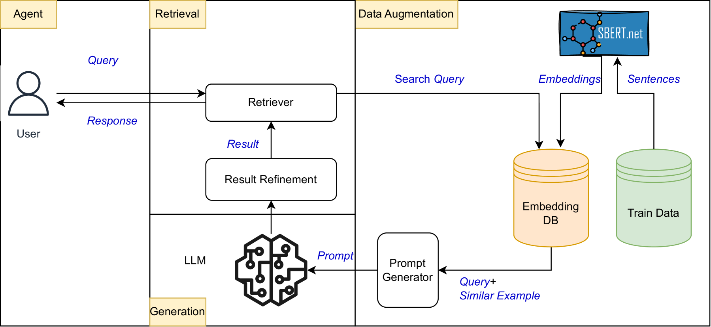
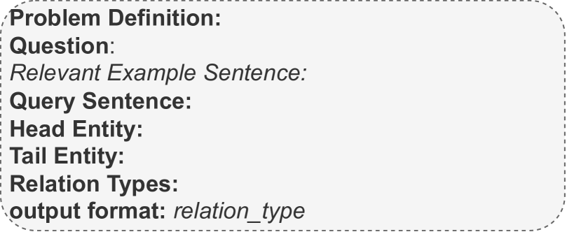
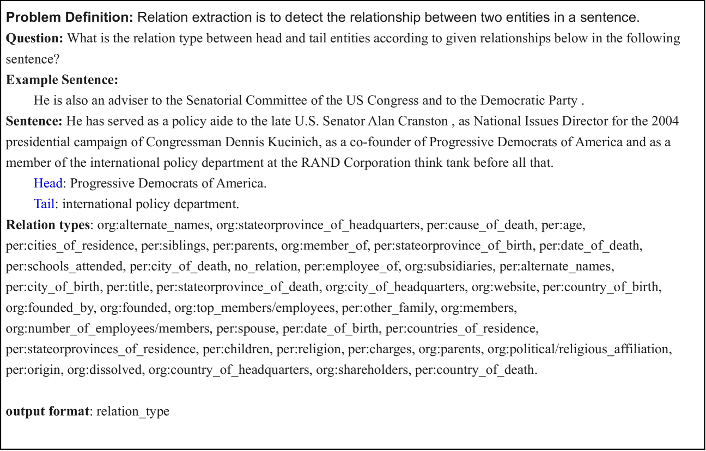
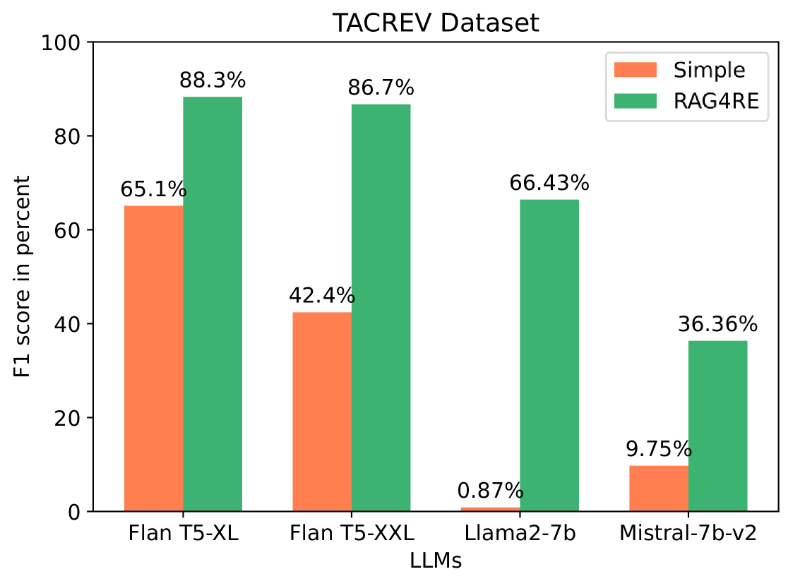
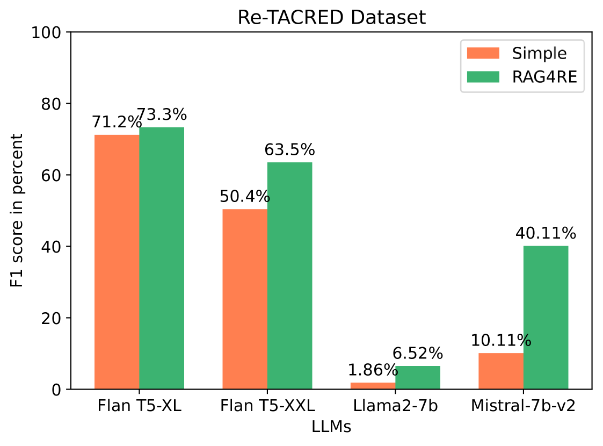
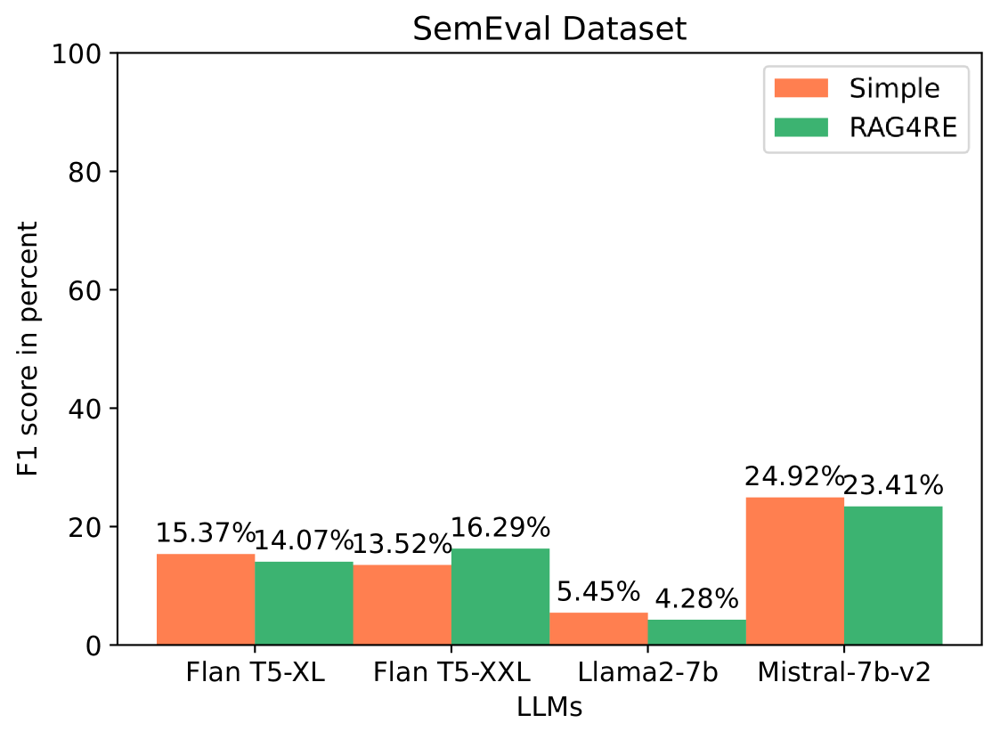
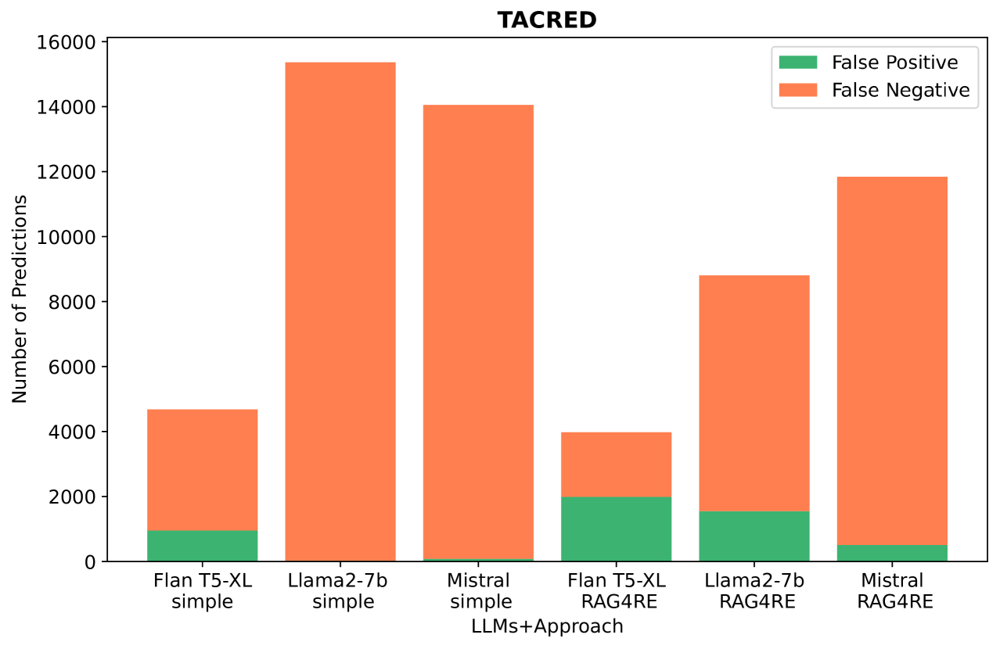
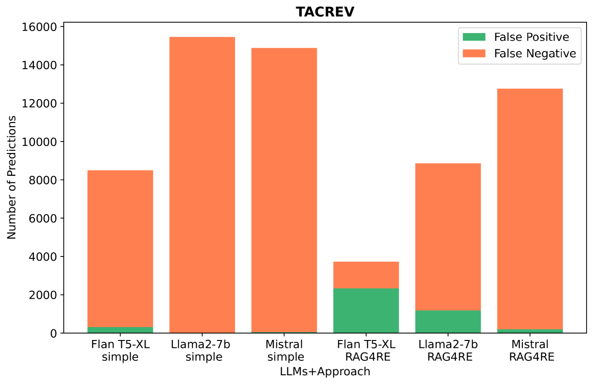
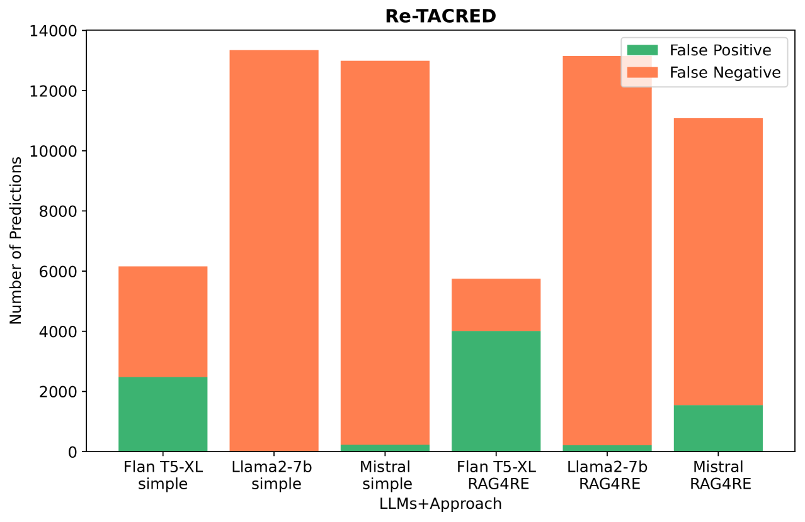
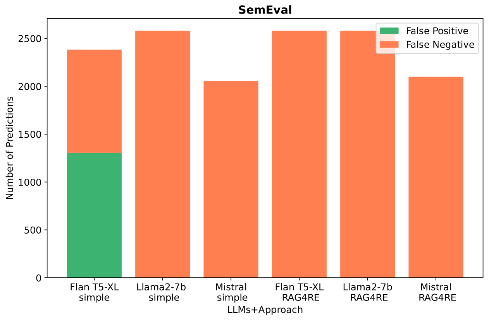

# 检索增强的生成式关系抽取

发布时间：2024年04月20日

`分类：RAG` `信息抽取`

> Retrieval-Augmented Generation-based Relation Extraction

# 摘要

> 信息抽取（IE）通过实体和关系抽取（RE）技术，将杂乱无章的文本信息转化为井然有序的数据结构，其中实体间关系的辨识尤为关键。尽管众多关系抽取技术已现世，但其成效往往受限于标注数据的可用性和计算资源的丰富度。面对这些难题，大型语言模型（LLMs）崭露头角，但有时也会因训练数据的局限而产生误导性结果。为突破这些瓶颈，本文提出了一种新颖的基于检索增强生成的关系抽取方法（RAG4RE），旨在提升关系抽取的性能。我们通过一系列知名大型语言模型（LLMs），如Flan T5、Llama2和Mistral，对RAG4RE方法进行了效果评估，并选取了TACRED、TACREV、Re-TACRED和SemEval RE等权威数据集作为测试基准。研究结果显示，RAG4RE在TACRED数据集及其衍生变体中的表现尤为突出，超越了仅依赖LLMs的传统关系抽取方法。此外，RAG4RE在TACRED和TACREV数据集上的表现也显著优于以往的关系抽取技术，彰显了其在自然语言处理领域推动关系抽取任务的潜力和效果。

> Information Extraction (IE) is a transformative process that converts unstructured text data into a structured format by employing entity and relation extraction (RE) methodologies. The identification of the relation between a pair of entities plays a crucial role within this framework. Despite the existence of various techniques for relation extraction, their efficacy heavily relies on access to labeled data and substantial computational resources. In addressing these challenges, Large Language Models (LLMs) emerge as promising solutions; however, they might return hallucinating responses due to their own training data. To overcome these limitations, Retrieved-Augmented Generation-based Relation Extraction (RAG4RE) in this work is proposed, offering a pathway to enhance the performance of relation extraction tasks.
  This work evaluated the effectiveness of our RAG4RE approach utilizing different LLMs. Through the utilization of established benchmarks, such as TACRED, TACREV, Re-TACRED, and SemEval RE datasets, our aim is to comprehensively evaluate the efficacy of our RAG4RE approach. In particularly, we leverage prominent LLMs including Flan T5, Llama2, and Mistral in our investigation. The results of our study demonstrate that our RAG4RE approach surpasses performance of traditional RE approaches based solely on LLMs, particularly evident in the TACRED dataset and its variations. Furthermore, our approach exhibits remarkable performance compared to previous RE methodologies across both TACRED and TACREV datasets, underscoring its efficacy and potential for advancing RE tasks in natural language processing.

[Arxiv](https://arxiv.org/abs/2404.13397)