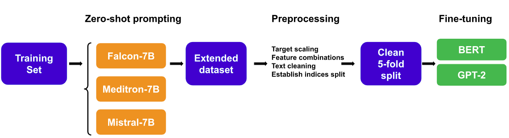
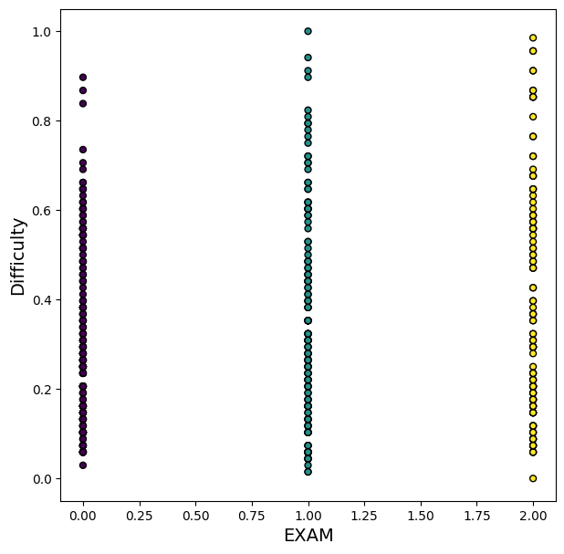
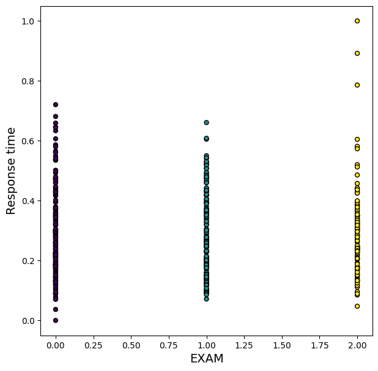
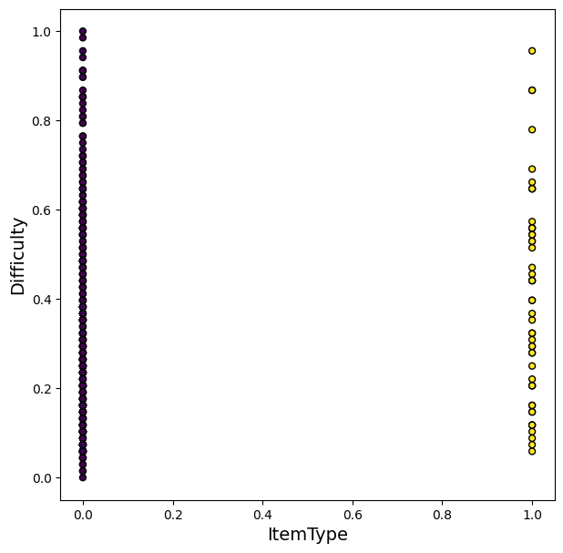
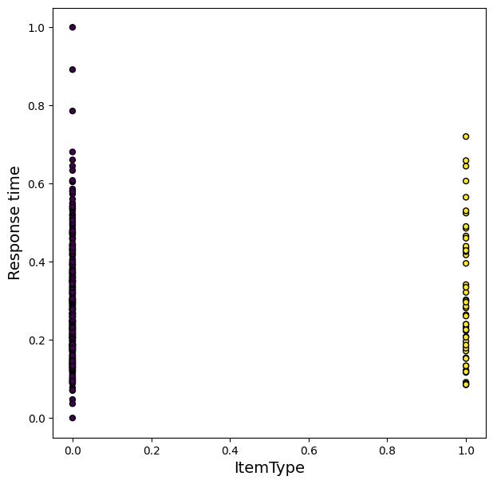
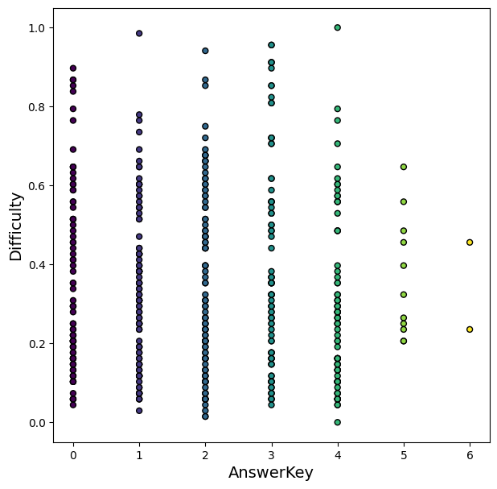
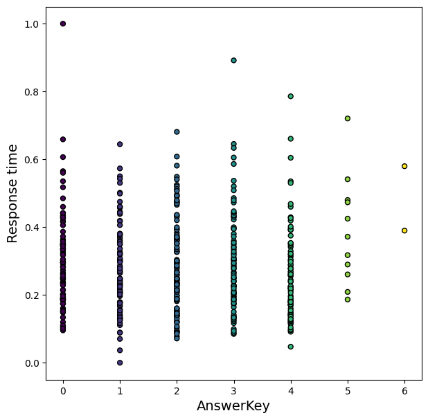

# UnibucLLM：运用大型语言模型（LLM）智能预测多选题的难度与答题时长。

发布时间：2024年04月20日

`分类：LLM应用` `医学教育` `自动化评估`

> UnibucLLM: Harnessing LLMs for Automated Prediction of Item Difficulty and Response Time for Multiple-Choice Questions

# 摘要

> 本项工作提出了一种创新的数据增强技术，依托大型语言模型（LLMs），旨在预测BEA 2024共享任务中不再使用的美国医学执照考试多项选择题（MCQs）的难度与答题时间。该技术通过引入零次射击LLMs（包括Falcon、Meditron、Mistral）提供的答案来扩充数据集，并采用基于六种不同特征组合的变换器模型进行分析。研究发现，准确预测题目难度较为困难。特别是，表现最佳的模型始终将问题文本纳入考量，并利用了LLMs答案的多样性，这突显了LLMs在提升医学执照考试自动化评估方面的潜力。我们的代码已在 https://github.com/ana-rogoz/BEA-2024 上公开，以供进一步研究和使用。

> This work explores a novel data augmentation method based on Large Language Models (LLMs) for predicting item difficulty and response time of retired USMLE Multiple-Choice Questions (MCQs) in the BEA 2024 Shared Task. Our approach is based on augmenting the dataset with answers from zero-shot LLMs (Falcon, Meditron, Mistral) and employing transformer-based models based on six alternative feature combinations. The results suggest that predicting the difficulty of questions is more challenging. Notably, our top performing methods consistently include the question text, and benefit from the variability of LLM answers, highlighting the potential of LLMs for improving automated assessment in medical licensing exams. We make our code available https://github.com/ana-rogoz/BEA-2024.

[Arxiv](https://arxiv.org/abs/2404.13343)