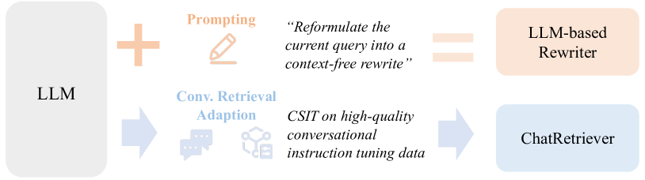
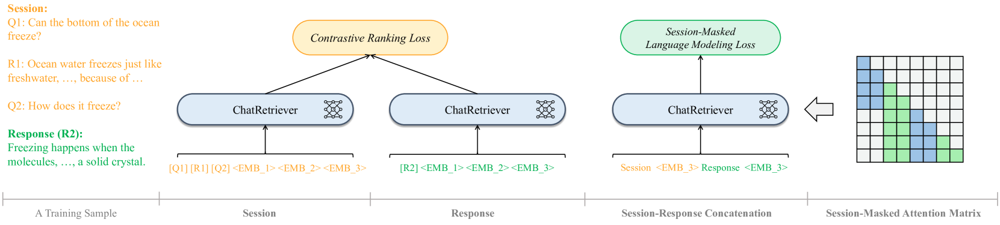
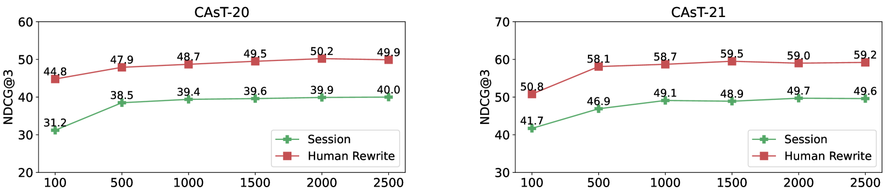
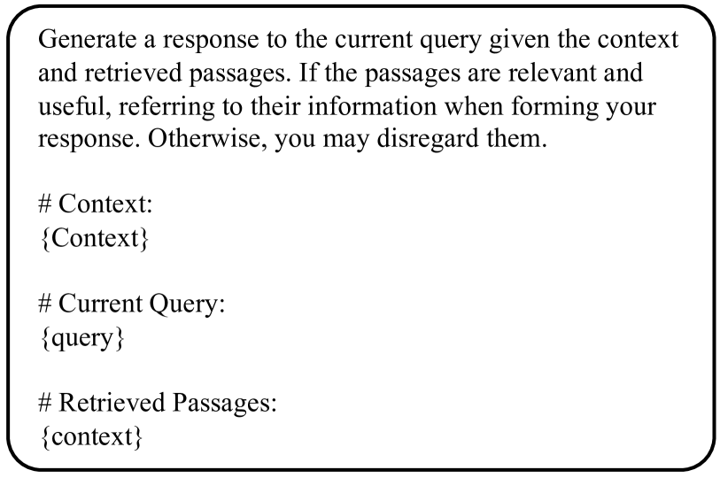
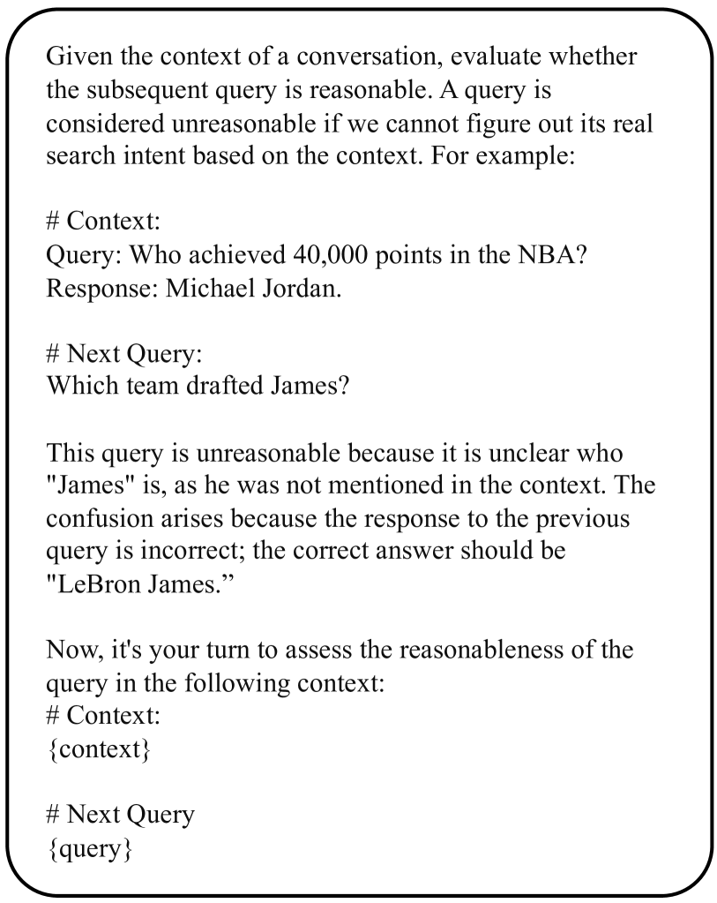
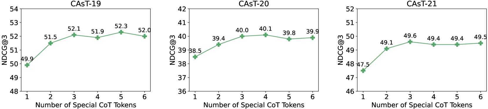
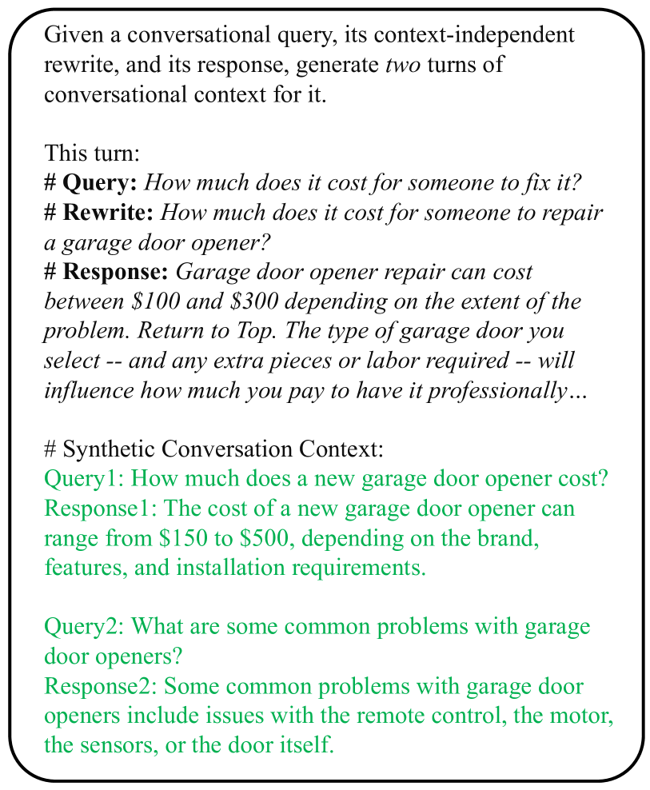

# ChatRetriever：为对话式密集检索而优化的大型语言模型，旨在实现更广泛和更稳健的对话检索能力。

发布时间：2024年04月21日

`LLM应用` `对话系统`

> ChatRetriever: Adapting Large Language Models for Generalized and Robust Conversational Dense Retrieval

# 摘要

> 对话搜索需精准解读多轮对话中的用户意图。本论文提出了 ChatRetriever，它延续了大型语言模型（LLM）的强泛化能力，以稳定地捕捉复杂对话场景，实现高效检索。为此，我们引入了一种简洁高效的双学习策略：一方面通过对比学习优化LLM的检索能力，另一方面通过在优质对话指令数据上进行掩码指令微调，提升对复杂会话的理解。在五个对话搜索基准上的广泛测试显示，ChatRetriever 在性能上显著超越了现有的对话密集检索系统，并达到了与基于LLM的重写方法相匹配的最先进水平。此外，ChatRetriever 在应对多样化对话场景时展现了更强的鲁棒性。我们的研究强调了为复杂输入如对话搜索会话而调整LLM的潜力，并提出了一种推进此研究方向的有效途径。

> Conversational search requires accurate interpretation of user intent from complex multi-turn contexts. This paper presents ChatRetriever, which inherits the strong generalization capability of large language models to robustly represent complex conversational sessions for dense retrieval. To achieve this, we propose a simple and effective dual-learning approach that adapts LLM for retrieval via contrastive learning while enhancing the complex session understanding through masked instruction tuning on high-quality conversational instruction tuning data. Extensive experiments on five conversational search benchmarks demonstrate that ChatRetriever substantially outperforms existing conversational dense retrievers, achieving state-of-the-art performance on par with LLM-based rewriting approaches. Furthermore, ChatRetriever exhibits superior robustness in handling diverse conversational contexts. Our work highlights the potential of adapting LLMs for retrieval with complex inputs like conversational search sessions and proposes an effective approach to advance this research direction.

[Arxiv](https://arxiv.org/abs/2404.13556)