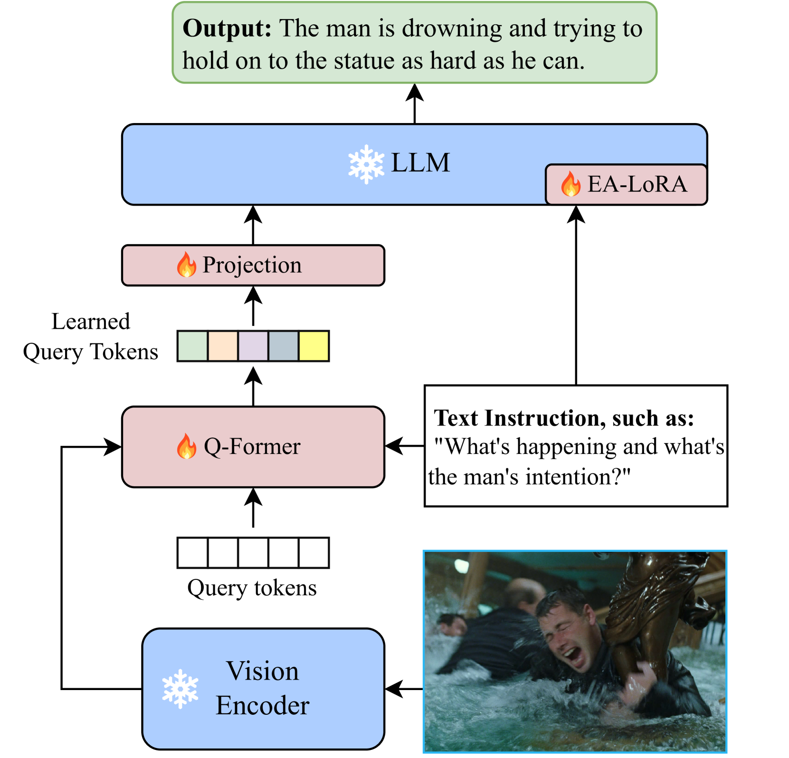
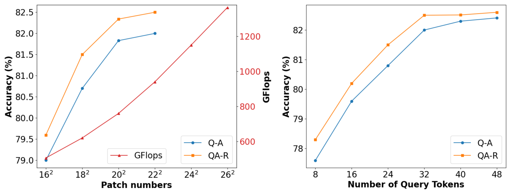

# EventLens：通过事件感知的预训练和跨模态关联，提升了视觉常识推理的能力。

发布时间：2024年04月21日

`LLM应用` `视觉识别` `人工智能`

> EventLens: Leveraging Event-Aware Pretraining and Cross-modal Linking Enhances Visual Commonsense Reasoning

# 摘要

> 视觉常识推理（VCR）任务考验模型以人类常识解答视觉问题，并阐明答案正确的原因。大型语言模型（LLMs）的兴起，使得探究其在VCR中的潜力变得至关重要。但VCR任务的挑战性要求模型具备更丰富的外部知识，这就需要特别设计以激发LLMs的常识推理潜能。目前，多数多模态LLMs处理输入图像时采取整体抽象方法，难以捕捉VCR中图像区域与文本间的特定共指关系，这对精确对齐构成难题。为应对这些挑战，我们提出了EventLens，它通过事件感知预训练和跨模态链接来增强VCR性能。首先，我们设计了一个辅助任务，模仿人类的认知过程，以提升LLM对复杂情境的全面理解。其次，在微调阶段，我们使用参考标签将图像的感兴趣区域特征与文本相连，确保两种模态的语义得以保留。最后，我们采用指导性提示减少预训练与微调间的差异，并利用特定任务适配器，使LLM的内建知识与新常识更好地融合。实验结果显示，我们的方法在辅助任务和细粒度链接策略上取得了显著成效。

> Visual Commonsense Reasoning (VCR) is a cognitive task, challenging models to answer visual questions requiring human commonsense, and to provide rationales explaining why the answers are correct. With emergence of Large Language Models (LLMs), it is natural and imperative to explore their applicability to VCR. However, VCR task demands more external knowledge to tackle its challenging questions, necessitating special designs to activate LLMs' commonsense reasoning abilities. Also, most existing Multimodal LLMs adopted an abstraction of entire input image, which makes it difficult to comprehend VCR's unique co-reference tags between image regions and text, posing challenges for fine-grained alignment. To address these issues, we propose EventLens that leverages Event-Aware Pretraining and Cross-modal Linking and EnhanceS VCR. First, by emulating the cognitive process of human reasoning, an Event-Aware Pretraining auxiliary task is introduced to better activate LLM's global comprehension of intricate scenarios. Second, during fine-tuning, we further utilize reference tags to bridge RoI features with texts, while preserving both modality semantics. Finally, we use instruct-style prompts to narrow the gap between pretraining and fine-tuning, and task-specific adapters to better integrate LLM's inherent knowledge with new commonsense. Experimental results show the effectiveness of our proposed auxiliary task and fine-grained linking strategy.

[Arxiv](https://arxiv.org/abs/2404.13847)