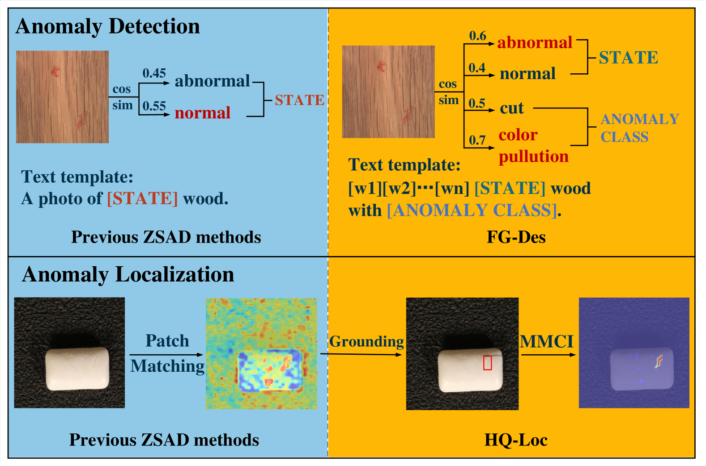
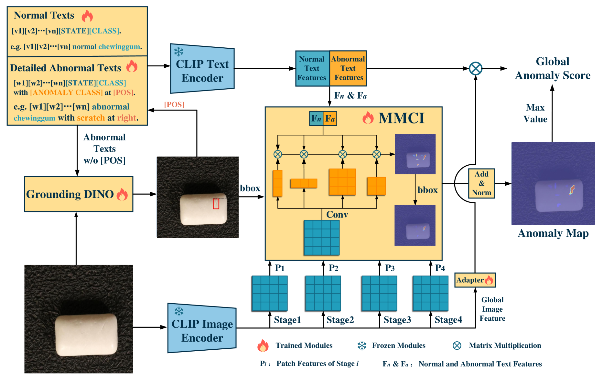
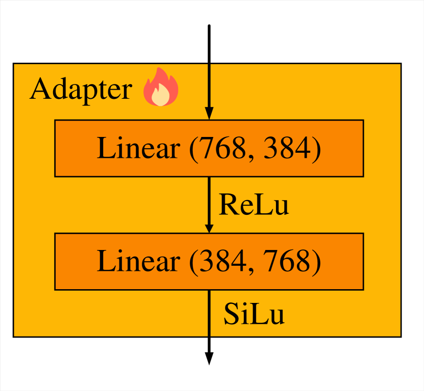
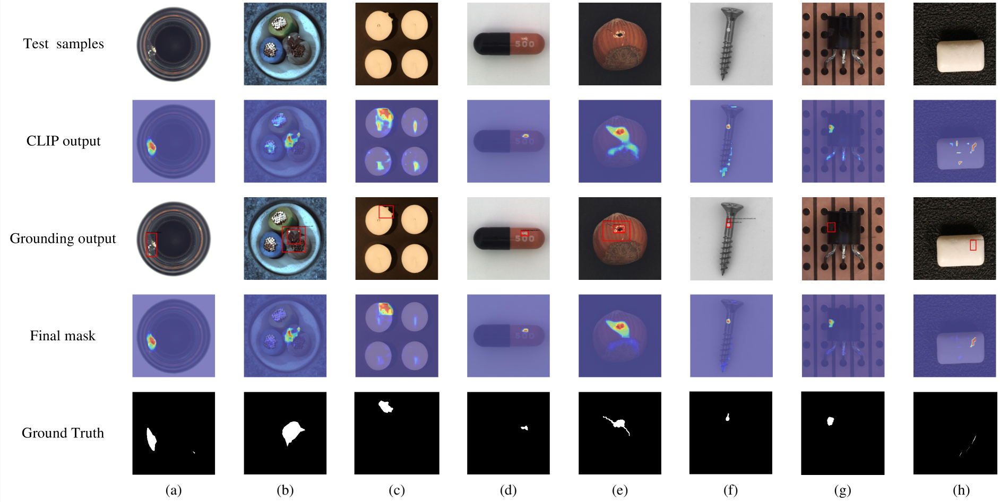
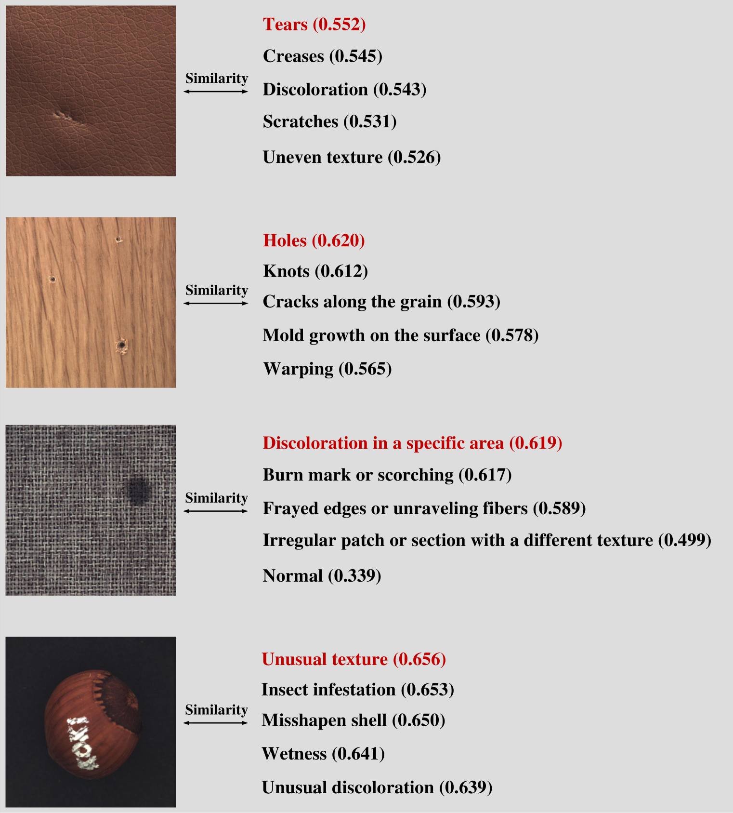
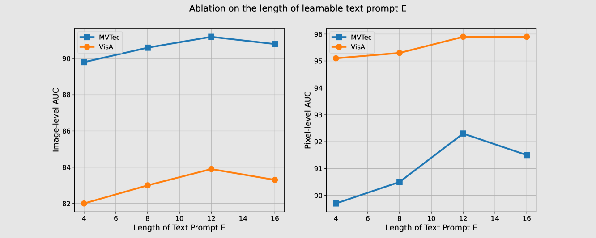
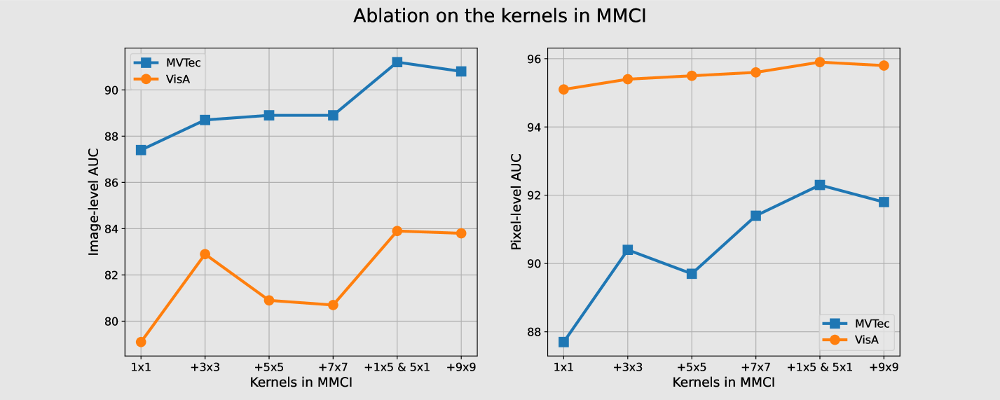
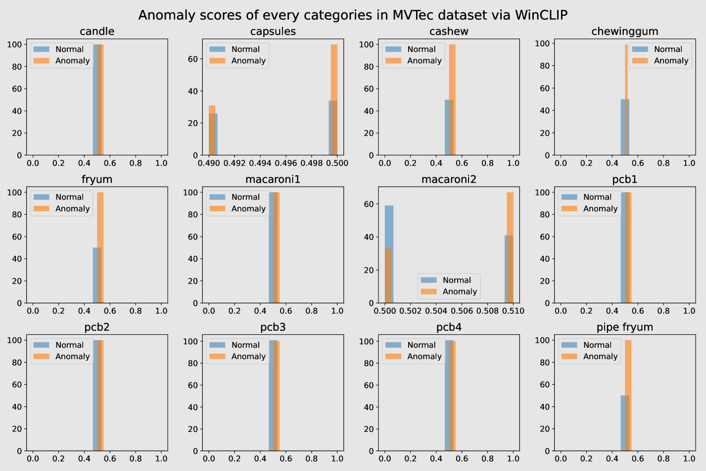
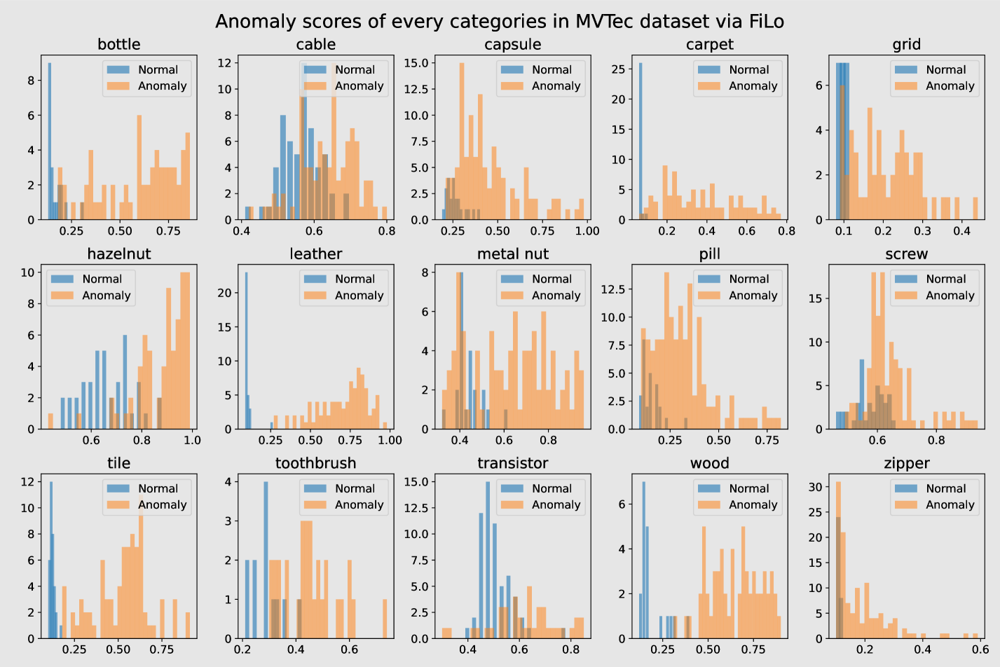
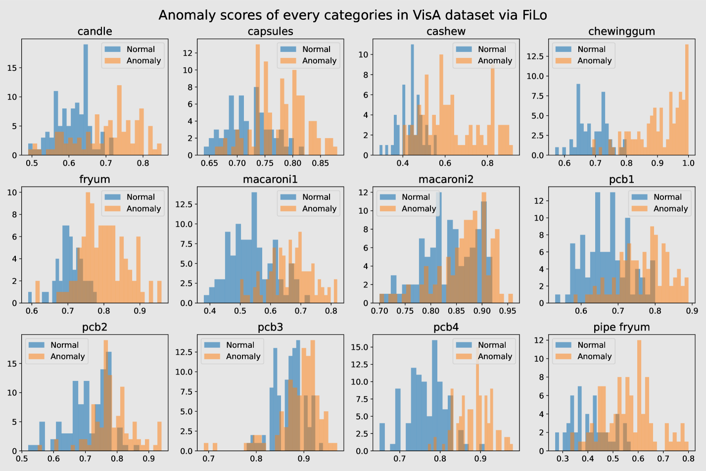

# FiLo：细粒度描述与精准定位相结合，实现零样本异常检测

发布时间：2024年04月21日

`LLM应用` `异常检测` `跨模态交互`

> FiLo: Zero-Shot Anomaly Detection by Fine-Grained Description and High-Quality Localization

# 摘要

> 零样本异常检测（ZSAD）技术能够在无需任何已知正常或异常样本的情况下，直接识别目标类别中的异常。传统方法多依赖于多模态预训练模型的泛化能力，通过比较手工设计的文本特征与图像特征的相似度来识别和定位异常。但这些方法在精确描述不同类别中的多种异常类型时常常力不从心，且在定位不同尺寸和尺度的异常时也存在困难。为此，我们提出了一种创新的ZSAD方法——FiLo，它包含两个核心组件：细粒度描述（FG-Des）和高质量定位（HQ-Loc）。FG-Des利用大型语言模型（LLMs）为每个类别提供细致的异常描述，并通过自适应学习的文本模板提升检测的精确度和可解释性。HQ-Loc则结合了Grounding DINO初步定位、位置增强文本提示和多尺度多形状跨模态交互（MMCI）模块，以更准确地定位各种尺寸和形状的异常。在MVTec和VisA等数据集上的实验结果显示，FiLo在异常检测和定位方面均取得了显著的性能提升，特别是在VisA数据集上，图像级AUC达到了83.9%，像素级AUC更是高达95.9%，刷新了当前的最佳水平。

> Zero-shot anomaly detection (ZSAD) methods entail detecting anomalies directly without access to any known normal or abnormal samples within the target item categories. Existing approaches typically rely on the robust generalization capabilities of multimodal pretrained models, computing similarities between manually crafted textual features representing "normal" or "abnormal" semantics and image features to detect anomalies and localize anomalous patches. However, the generic descriptions of "abnormal" often fail to precisely match diverse types of anomalies across different object categories. Additionally, computing feature similarities for single patches struggles to pinpoint specific locations of anomalies with various sizes and scales. To address these issues, we propose a novel ZSAD method called FiLo, comprising two components: adaptively learned Fine-Grained Description (FG-Des) and position-enhanced High-Quality Localization (HQ-Loc). FG-Des introduces fine-grained anomaly descriptions for each category using Large Language Models (LLMs) and employs adaptively learned textual templates to enhance the accuracy and interpretability of anomaly detection. HQ-Loc, utilizing Grounding DINO for preliminary localization, position-enhanced text prompts, and Multi-scale Multi-shape Cross-modal Interaction (MMCI) module, facilitates more accurate localization of anomalies of different sizes and shapes. Experimental results on datasets like MVTec and VisA demonstrate that FiLo significantly improves the performance of ZSAD in both detection and localization, achieving state-of-the-art performance with an image-level AUC of 83.9% and a pixel-level AUC of 95.9% on the VisA dataset.

[Arxiv](https://arxiv.org/abs/2404.13671)