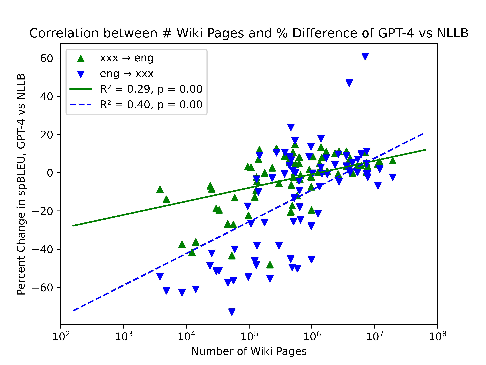
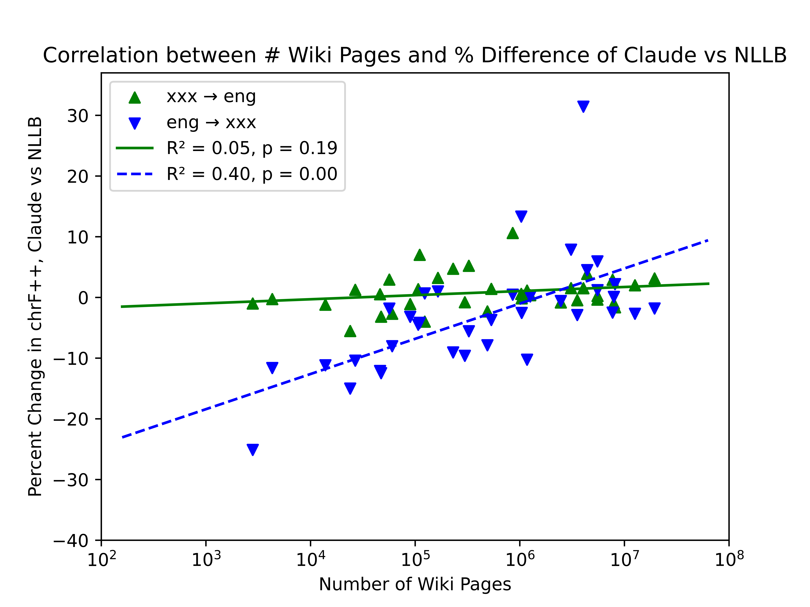
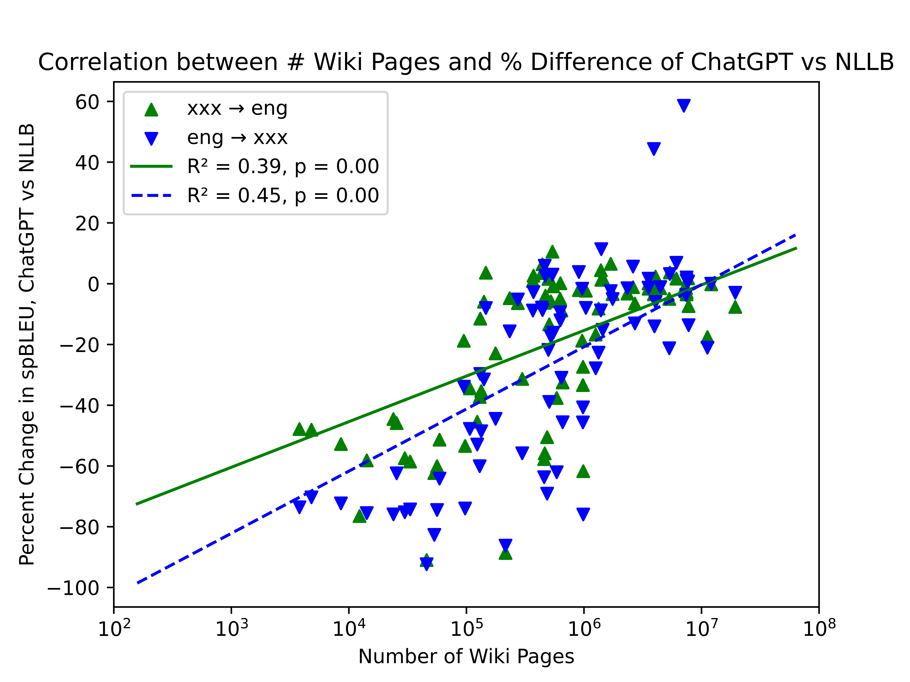
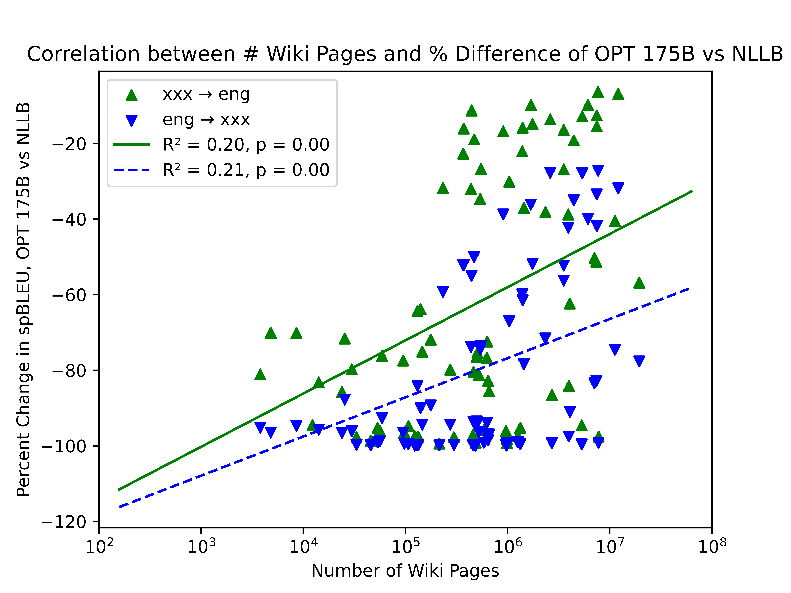
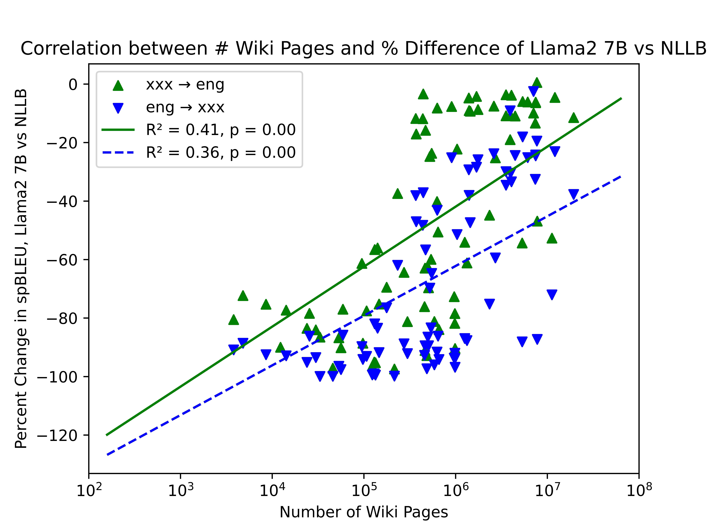
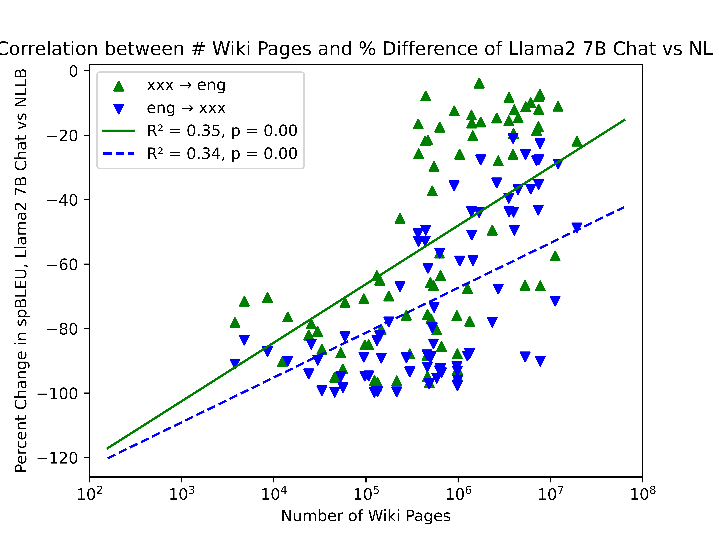
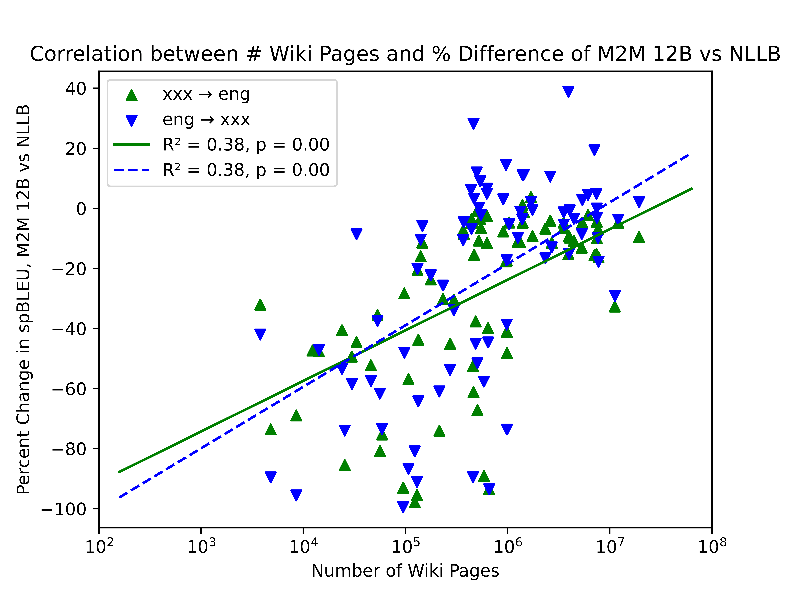
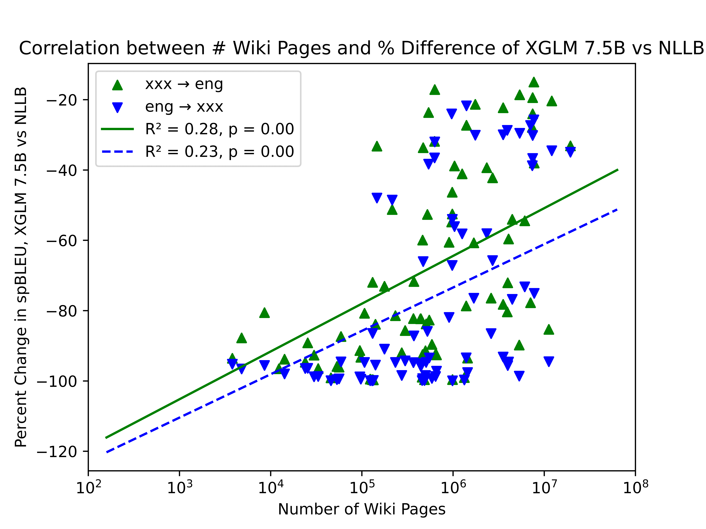
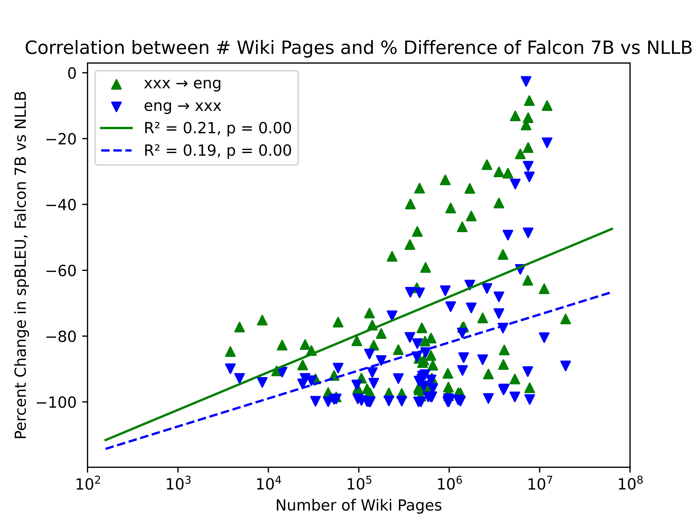

# 探索从大型语言模型（LLM）向神经机器翻译（NMT）的演进之路，利用 Claude 技术提升低资源语言的机器翻译能力。

发布时间：2024年04月21日

`LLM应用` `机器翻译`

> From LLM to NMT: Advancing Low-Resource Machine Translation with Claude

# 摘要

> 我们发现 Anthropic 于 2024 年 3 月推出的大型语言模型 Claude 3 Opus 在机器翻译方面超越了其他同类模型。尽管在 FLORES-200 数据集上发现了 Claude 的数据污染问题，但我们通过制定新的基准测试，验证了 Claude 在资源匮乏的语言对翻译成英语时的卓越表现。Claude 在“资源效率”上表现突出，即翻译模型的质量与语言对的资源水平密切相关。此外，我们还证实了 LLM 翻译技术的进步可以整合到传统的神经机器翻译（NMT）模型中。利用 Claude 生成的合成数据，我们展示了知识蒸馏技术如何推动约鲁巴语到英语翻译的前沿，达到了或超越了 NLLB-54B 和 Google Translate 等强大基准。

> We show that Claude 3 Opus, a large language model (LLM) released by Anthropic in March 2024, exhibits stronger machine translation competence than other LLMs. Though we find evidence of data contamination with Claude on FLORES-200, we curate new benchmarks that corroborate the effectiveness of Claude for low-resource machine translation into English. We find that Claude has remarkable \textit{resource efficiency} -- the degree to which the quality of the translation model depends on a language pair's resource level. Finally, we show that advancements in LLM translation can be compressed into traditional neural machine translation (NMT) models. Using Claude to generate synthetic data, we demonstrate that knowledge distillation advances the state-of-the-art in Yoruba-English translation, meeting or surpassing strong baselines like NLLB-54B and Google Translate.

[Arxiv](https://arxiv.org/abs/2404.13813)