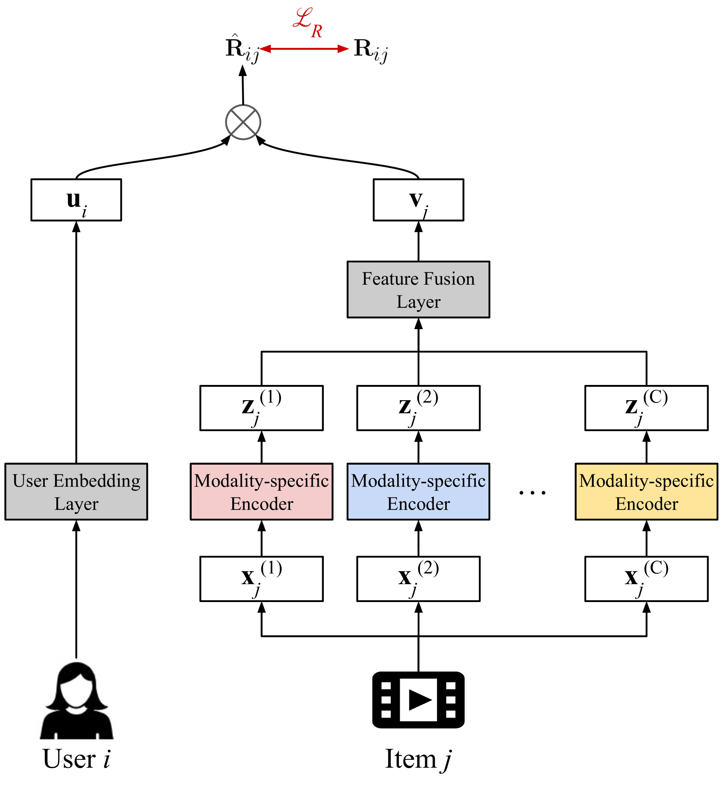
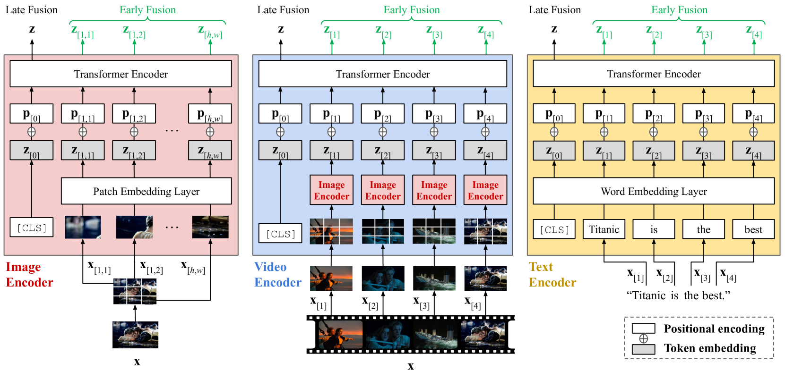
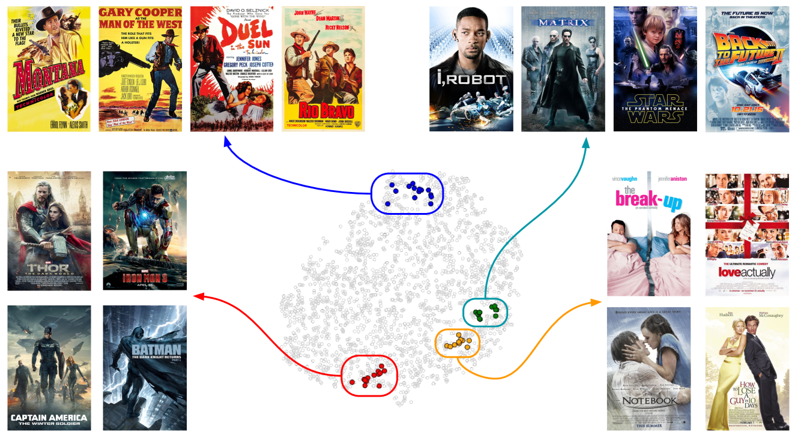
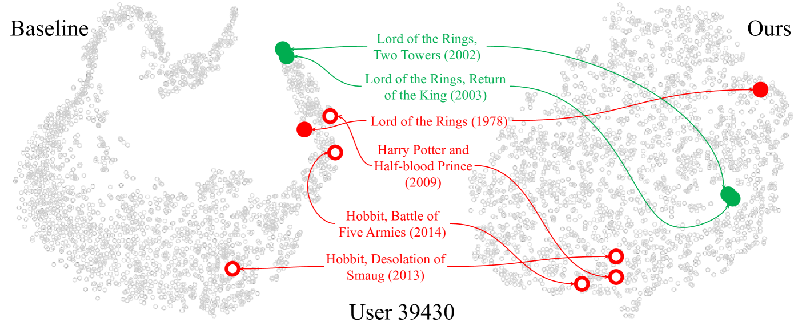
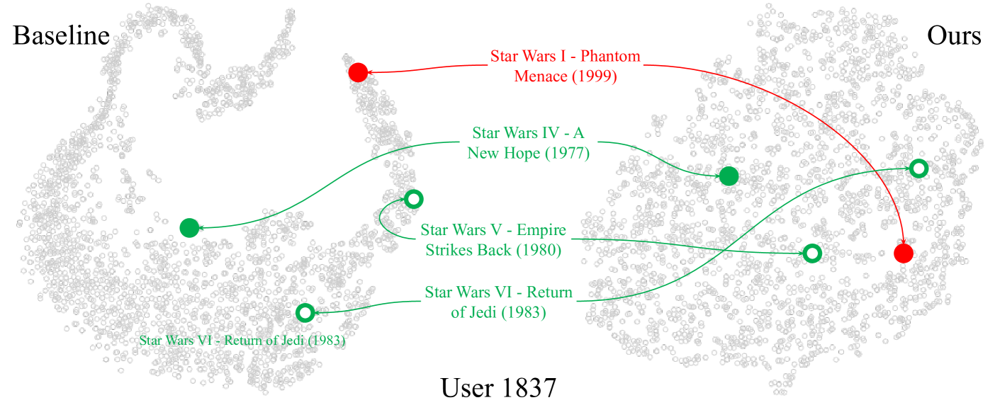

# 为冷启动内容推荐而设计的通用项目表示学习

发布时间：2024年04月21日

`分类：RAG` `推荐系统` `机器学习`

> General Item Representation Learning for Cold-start Content Recommendations

# 摘要

> 冷启动项目推荐一直是推荐系统中的一个难题。传统上，人们倾向于采用基于内容的方法，但这并未充分利用各种原始内容中的丰富信息。本文提出了一个不依赖于特定领域或数据的项目表示学习框架，用于解决冷启动推荐问题。该框架采用基于 Transformer 的架构，自然而然地实现了不同特征之间的多模态对齐。我们设计的模型无需依赖分类标签即可端到端训练，避免了收集标签的高昂成本，同时避免了标签对于推荐系统表示学习可能带来的次优性。通过在电影和新闻推荐的真实世界基准测试中的广泛实验，我们证实了该方法在保留用户细微口味方面优于现有的最先进方法，并且具有广泛的领域适用性和大规模应用潜力。

> Cold-start item recommendation is a long-standing challenge in recommendation systems. A common remedy is to use a content-based approach, but rich information from raw contents in various forms has not been fully utilized. In this paper, we propose a domain/data-agnostic item representation learning framework for cold-start recommendations, naturally equipped with multimodal alignment among various features by adopting a Transformer-based architecture. Our proposed model is end-to-end trainable completely free from classification labels, not just costly to collect but suboptimal for recommendation-purpose representation learning. From extensive experiments on real-world movie and news recommendation benchmarks, we verify that our approach better preserves fine-grained user taste than state-of-the-art baselines, universally applicable to multiple domains at large scale.

[Arxiv](https://arxiv.org/abs/2404.13808)