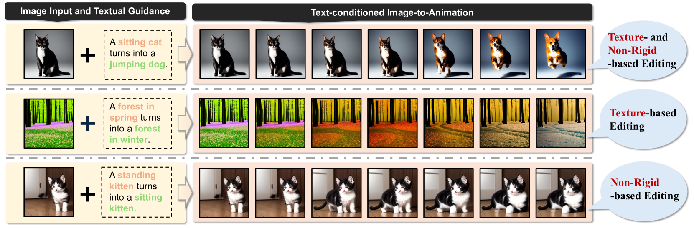
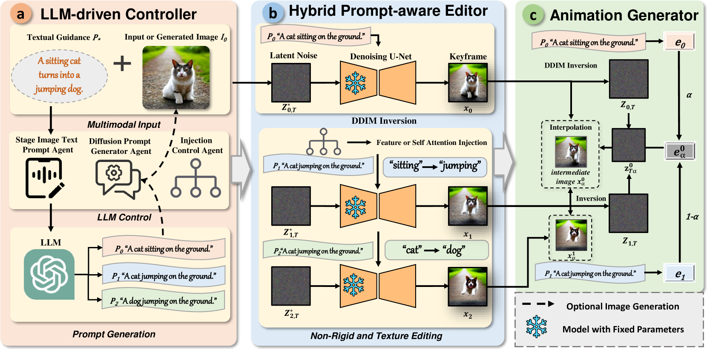
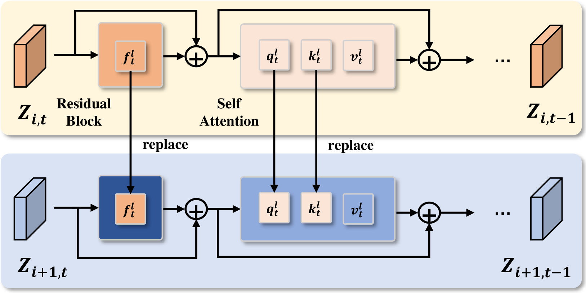
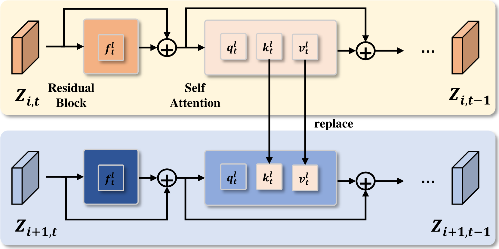
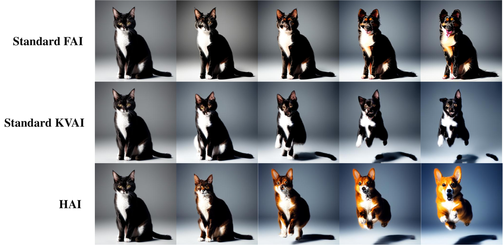

# LASER技术：一种无需调整的大型语言模型驱动的注意力控制系统，旨在实现文本驱动的图像到动画的高效转换。

发布时间：2024年04月21日

`LLM应用` `内容创作` `人工智能`

> LASER: Tuning-Free LLM-Driven Attention Control for Efficient Text-conditioned Image-to-Animation

# 摘要

> 文本到图像模型的突破性进展为高端内容创作打开了新天地，例如文本驱动的图像编辑，这让我们能够根据文本指令对传达复杂视觉概念的多样图像进行编辑。尽管这一领域充满希望，但现有技术多集中于基于纹理或非刚性的视觉操作，这些操作在不经过微调的情况下，很难生成细腻的文本驱动图像变形动画，原因在于它们潜在空间的高度无序性。本文提出了一种无需微调的LLM驱动的注意力控制框架——LASER，它通过LLM规划的渐进式过程、提示感知编辑和稳定动画生成（StablE），实现对图像的精细控制。LASER使用大型语言模型（LLM）将粗略的描述转化为详细的提示，引导预训练的文本到图像模型进行图像生成。我们通过调整模型的空间特征和自注意力机制，不仅保持了动画的连贯性，还实现了直接从文本提示进行无缝变形，无需额外的微调或注释。我们对空间特征和自注意力的精确控制确保了图像的结构一致性。本文介绍的这一新框架将LLM与文本到图像模型相结合，能够从单一文本输入创造出高品质的动画。此外，我们还提出了一个文本条件的图像到动画基准，用以验证LASER的有效性和效率。广泛的实验结果证明，LASER在动画生成方面提供了卓越、稳定且高效的成果，确立了其作为先进数字内容创作的强大工具的地位。

> Revolutionary advancements in text-to-image models have unlocked new dimensions for sophisticated content creation, e.g., text-conditioned image editing, allowing us to edit the diverse images that convey highly complex visual concepts according to the textual guidance. Despite being promising, existing methods focus on texture- or non-rigid-based visual manipulation, which struggles to produce the fine-grained animation of smooth text-conditioned image morphing without fine-tuning, i.e., due to their highly unstructured latent space. In this paper, we introduce a tuning-free LLM-driven attention control framework, encapsulated by the progressive process of LLM planning, prompt-Aware editing, StablE animation geneRation, abbreviated as LASER. LASER employs a large language model (LLM) to refine coarse descriptions into detailed prompts, guiding pre-trained text-to-image models for subsequent image generation. We manipulate the model's spatial features and self-attention mechanisms to maintain animation integrity and enable seamless morphing directly from text prompts, eliminating the need for additional fine-tuning or annotations. Our meticulous control over spatial features and self-attention ensures structural consistency in the images. This paper presents a novel framework integrating LLMs with text-to-image models to create high-quality animations from a single text input. We also propose a Text-conditioned Image-to-Animation Benchmark to validate the effectiveness and efficacy of LASER. Extensive experiments demonstrate that LASER produces impressive, consistent, and efficient results in animation generation, positioning it as a powerful tool for advanced digital content creation.

[Arxiv](https://arxiv.org/abs/2404.13558)