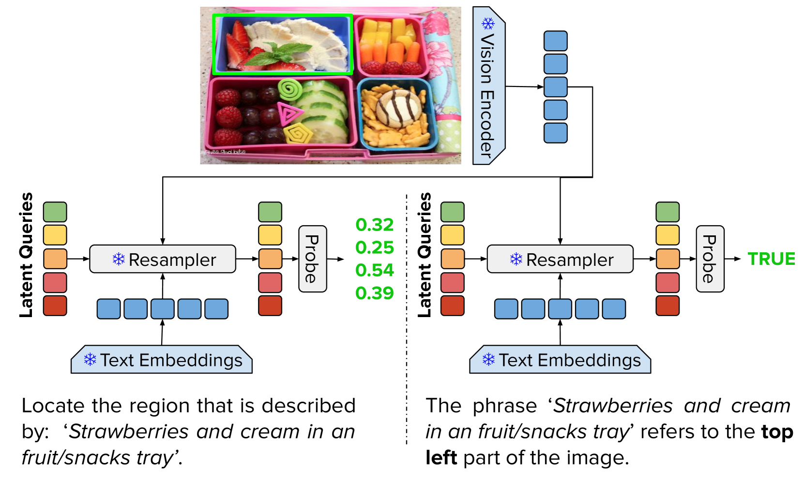
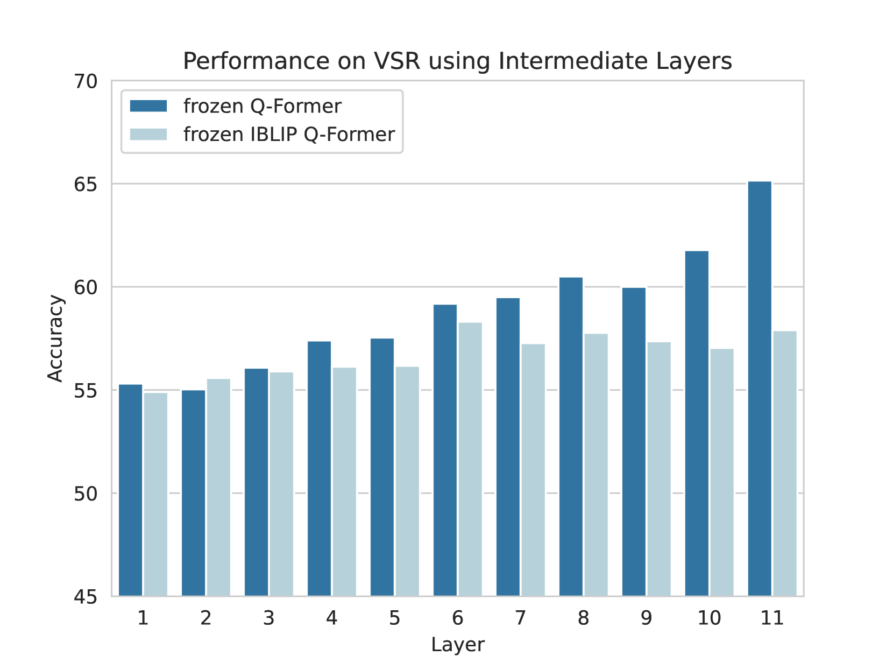
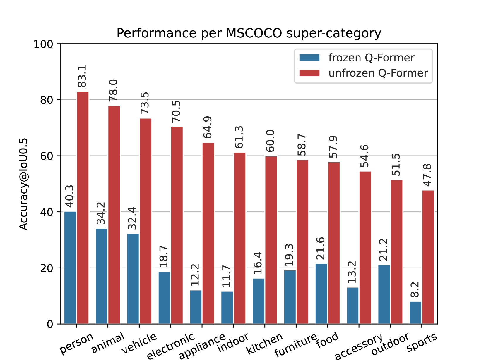
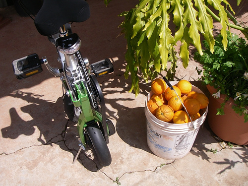
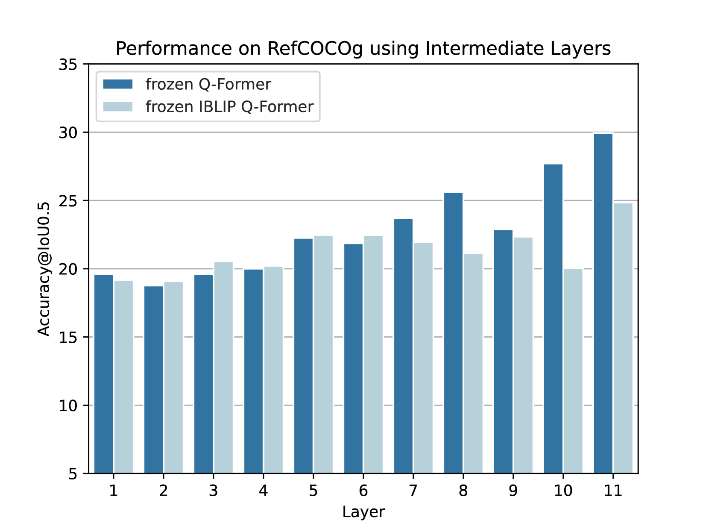
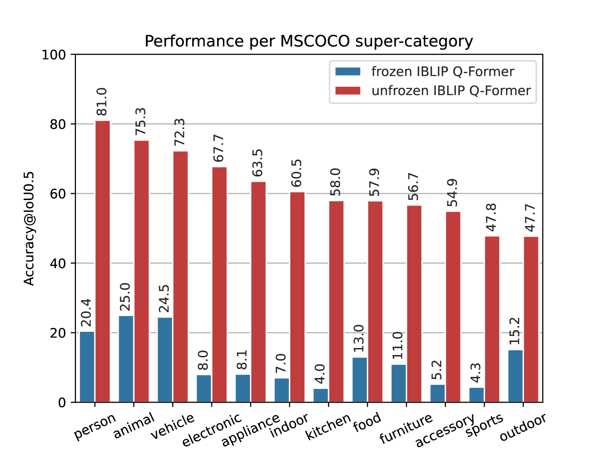

# 探索视觉与语言重采样器中的精细空间认知

发布时间：2024年04月21日

`分类：LLM应用` `计算机视觉`

> Lost in Space: Probing Fine-grained Spatial Understanding in Vision and Language Resamplers

# 摘要

> 将冻结的大型语言模型（LLM）与视觉编码器相结合，一种高效的方法是通过一个重新采样器模块，该模块生成一个“视觉提示”，与文本提示一同输入LLM。此方法在图像描述和视觉问答等粗粒度任务中取得了显著成效，但对于需要空间理解的细粒度任务，尚未深入探讨。本文利用“诊断分类器”来评估重新采样器生成的“视觉提示”中所包含的空间信息量。研究发现，在分类器训练时保持重新采样器冻结，其输出中的空间信息大量缺失。相对地，当重新采样器与分类器同步训练，性能显著提高。这表明重新采样器的压缩能力理论上足以编码必要的空间信息，但为了实现这一功能，预训练阶段需要更多以对象为中心的训练目标。

> An effective method for combining frozen large language models (LLM) and visual encoders involves a resampler module that creates a `visual prompt' which is provided to the LLM, along with the textual prompt. While this approach has enabled impressive performance across many coarse-grained tasks like image captioning and visual question answering, more fine-grained tasks that require spatial understanding have not been thoroughly examined. In this paper, we use \textit{diagnostic classifiers} to measure the extent to which the visual prompt produced by the resampler encodes spatial information. Our results show that this information is largely absent from the resampler output when kept frozen during training of the classifiers. However, when the resampler and classifier are trained jointly, we observe a significant performance boost. This shows that the compression achieved by the resamplers can in principle encode the requisite spatial information, but that more object-aware objectives are needed at the pretraining stage to facilitate this capability

[Arxiv](https://arxiv.org/abs/2404.13594)