# MARVEL：视觉评估与学习驱动的多维抽象与推理。

发布时间：2024年04月21日

`分类：LLM应用

这篇论文主要探讨了多模态大型语言模型（MLLMs）在抽象视觉推理（AVR）任务上的表现。论文设计了一个包含770个谜题的多维AVR测试，涵盖了六大核心知识模式、几何与抽象形状以及五种不同的任务布局。通过对九种主流的MLLMs进行零样本和少样本的全面测试，发现所有模型在AVR问题上的表现几近随机，与人类有显著的性能差异。这篇论文的研究重点在于评估和理解MLLMs在视觉推理任务上的能力，属于LLM应用的范畴。` `视觉推理` `人工智能`

> MARVEL: Multidimensional Abstraction and Reasoning through Visual Evaluation and Learning

# 摘要

> 多模态大型语言模型（MLLMs）在众多视觉推理测试中取得了突破，但其是否真正掌握了抽象视觉推理仍是一个悬而未决的疑问。类比于数独，抽象视觉推理（AVR）任务需要识别控制特定任务布局中形状（如数字）的高级模式（如重复性约束）。不过，目前的AVR测试仅涉及了少数模式（如加法、逻辑与）、形状（如矩形、正方形）和布局（如3x3矩阵）。为了全面考验MLLMs的推理技能，我们设计了MARVEL，这是一个包含770个谜题的多维AVR测试，涵盖了六大核心知识模式、几何与抽象形状以及五种不同的任务布局。MARVEL通过在层级化评估框架中加入感知问题，来探究模型的准确性是否基于感知和推理。我们在MARVEL上对九种主流的MLLMs进行了零样本和少样本的全面测试。结果显示，所有模型在AVR问题上的表现几近随机，与人类有40%的显著性能差异。进一步分析感知问题后发现，MLLMs在理解视觉特征上表现不佳（近乎随机），甚至在计算谜题中的面板数量时也力不从心（准确率不足45%），这些都限制了它们进行抽象推理的能力。我们已经开源了所有相关代码和数据集。

> While multi-modal large language models (MLLMs) have shown significant progress on many popular visual reasoning benchmarks, whether they possess abstract visual reasoning abilities remains an open question. Similar to the Sudoku puzzles, abstract visual reasoning (AVR) problems require finding high-level patterns (e.g., repetition constraints) that control the input shapes (e.g., digits) in a specific task configuration (e.g., matrix). However, existing AVR benchmarks only considered a limited set of patterns (addition, conjunction), input shapes (rectangle, square), and task configurations (3 by 3 matrices). To evaluate MLLMs' reasoning abilities comprehensively, we introduce MARVEL, a multidimensional AVR benchmark with 770 puzzles composed of six core knowledge patterns, geometric and abstract shapes, and five different task configurations. To inspect whether the model accuracy is grounded in perception and reasoning, MARVEL complements the general AVR question with perception questions in a hierarchical evaluation framework. We conduct comprehensive experiments on MARVEL with nine representative MLLMs in zero-shot and few-shot settings. Our experiments reveal that all models show near-random performance on the AVR question, with significant performance gaps (40%) compared to humans across all patterns and task configurations. Further analysis of perception questions reveals that MLLMs struggle to comprehend the visual features (near-random performance) and even count the panels in the puzzle ( <45%), hindering their ability for abstract reasoning. We release our entire code and dataset.

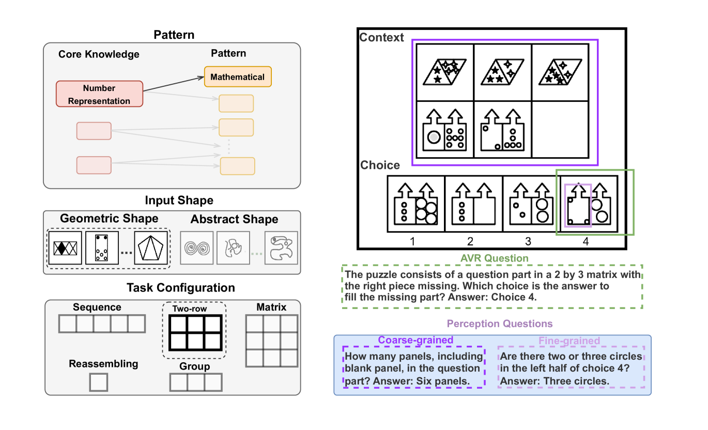

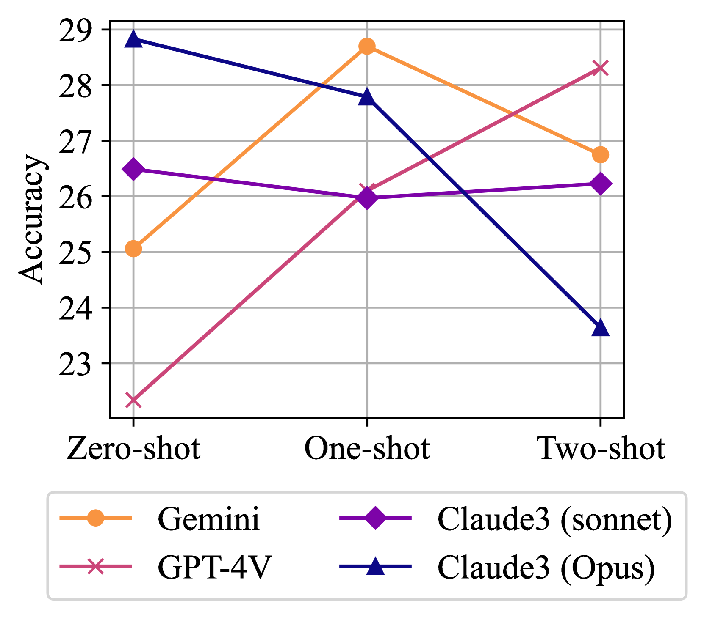

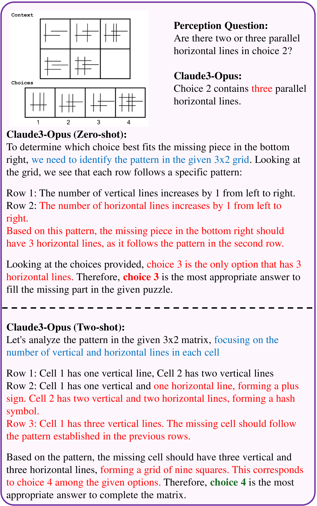

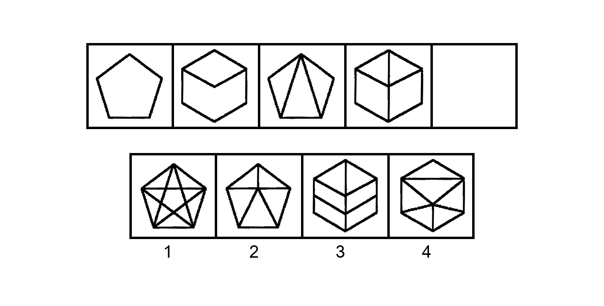

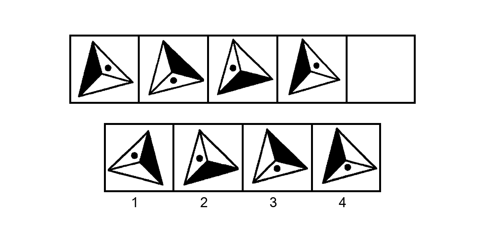

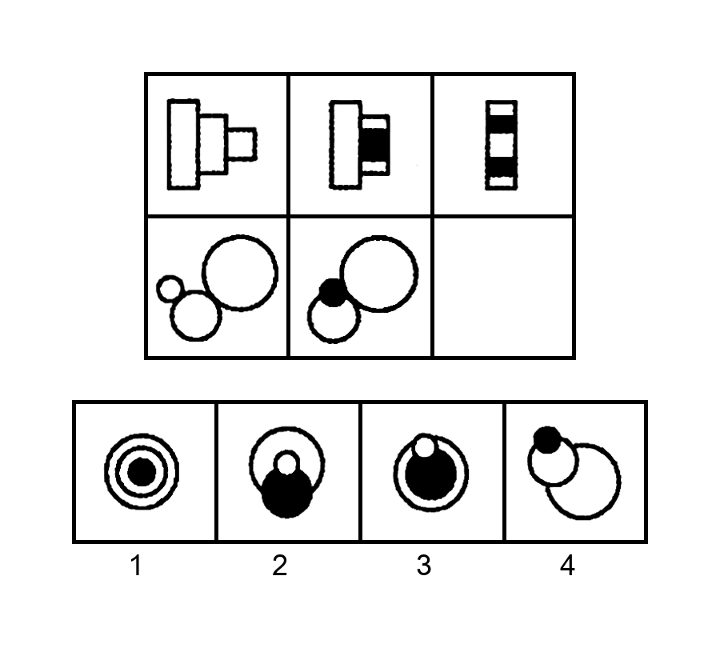

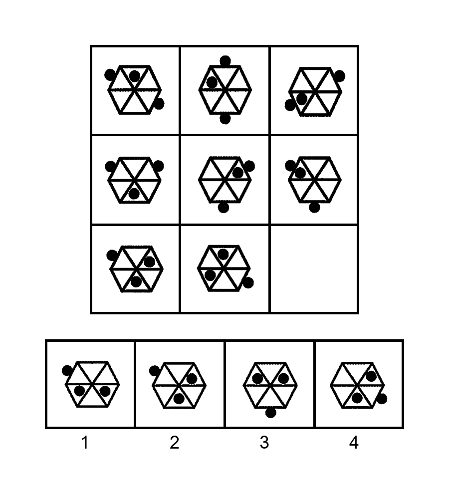

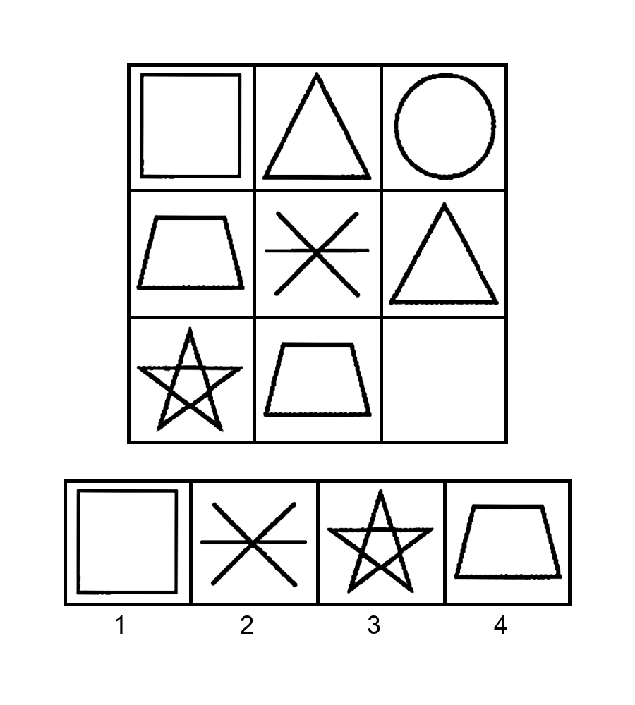

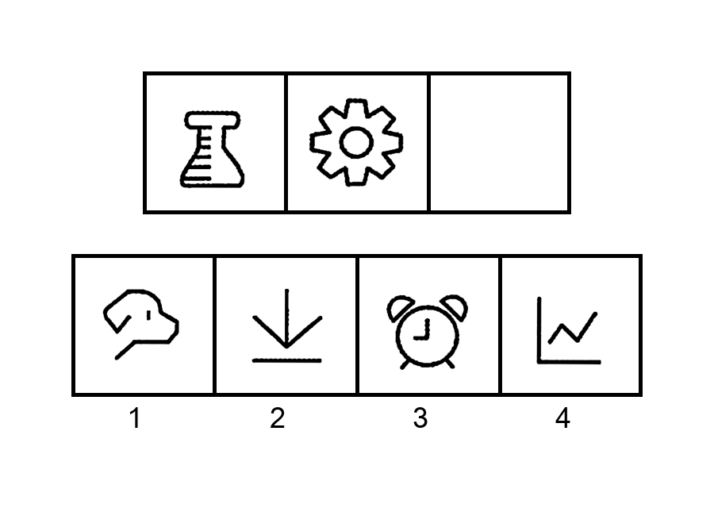

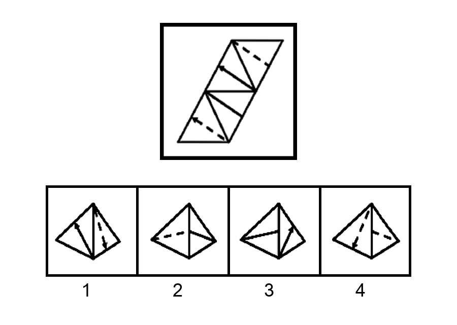

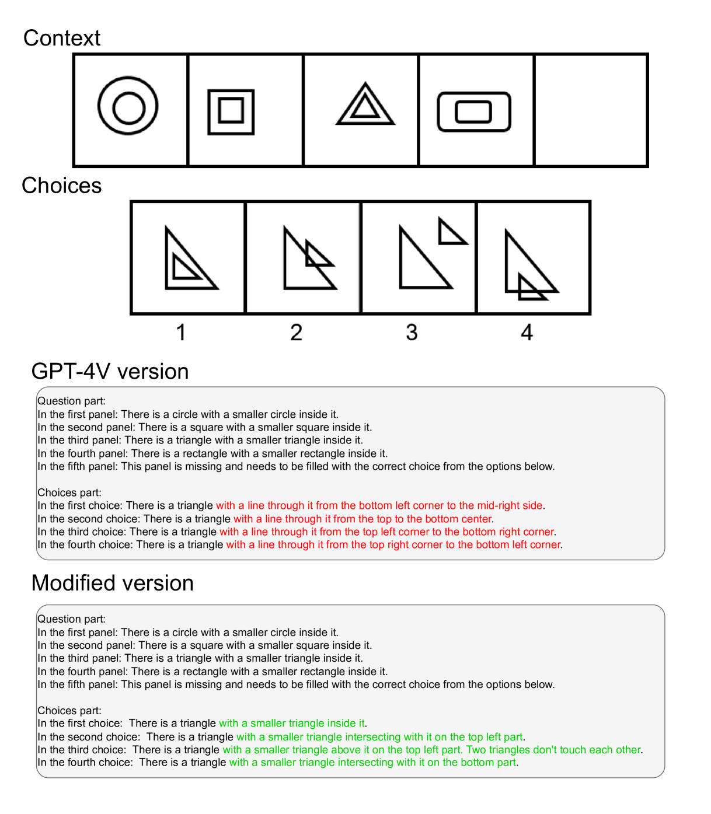

[Arxiv](https://arxiv.org/abs/2404.13591)