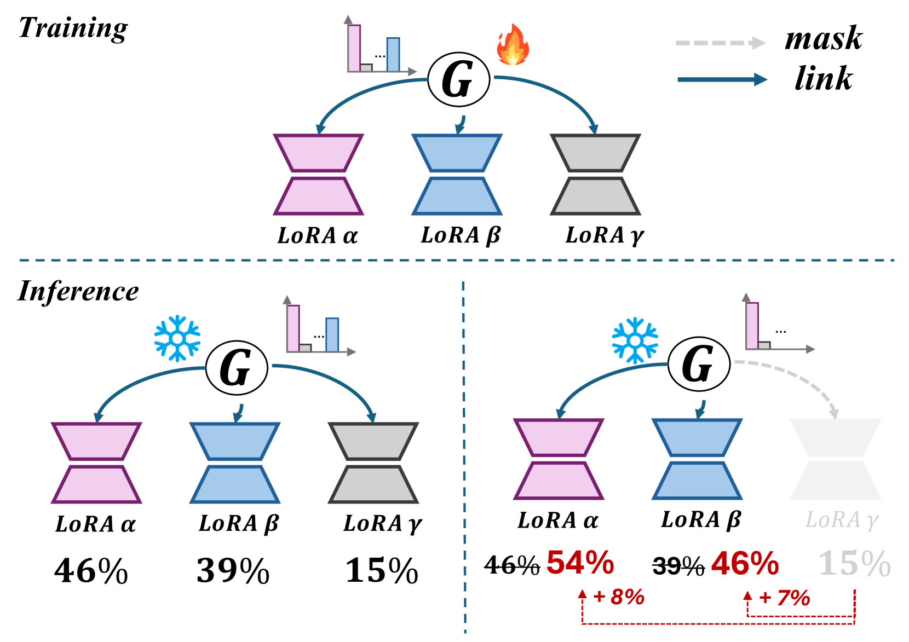
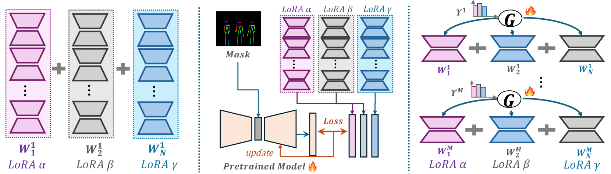
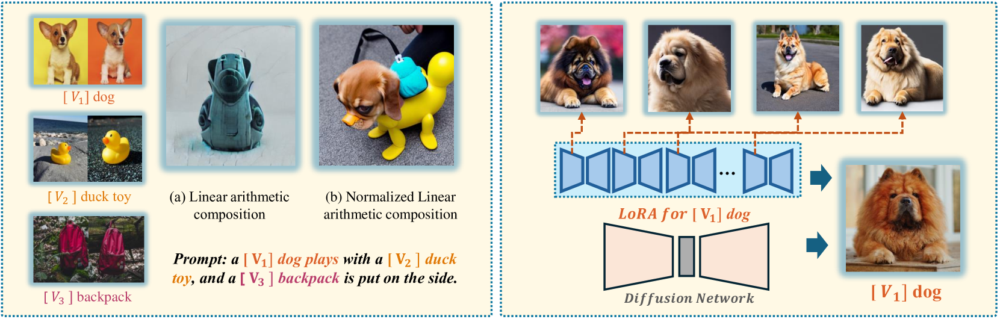
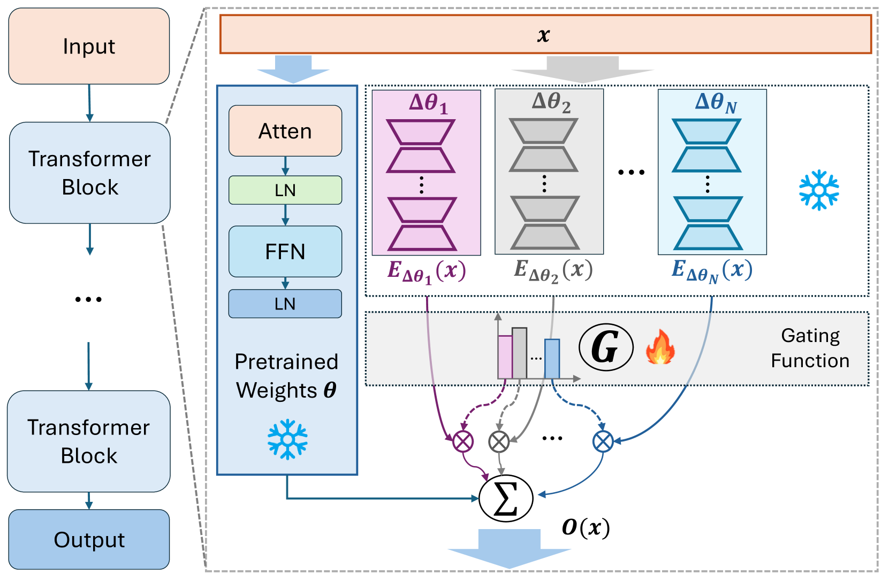
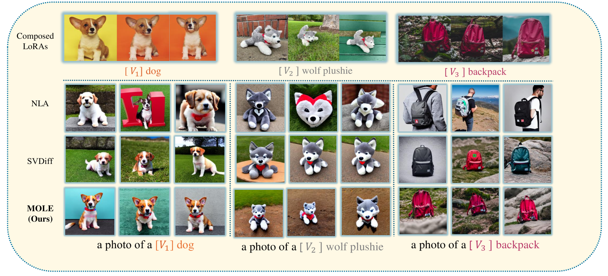

# LoRA 专家的融合

发布时间：2024年04月21日

`LLM应用` `NLP (自然语言处理)` `V&L (视觉与语言)`

> Mixture of LoRA Experts

# 摘要

> LoRA 作为一种微调技术，因其在多样化下游任务中的卓越表现和高效率而广受青睐。研究人员利用 LoRA 的模块化特性，探索将多个 LoRA 融合以提升模型在各类任务中的表现。但现有的 LoRA 融合技术面临挑战：直接的算术合并可能损害模型的原始生成能力或 LoRA 的独特性，而基于参考调整的融合则在灵活性上有所不足。为此，本文提出了一种新的混合 LoRA 专家（MoLE）方法，它通过分层控制和自由分支选择来优化融合过程。MoLE 在 LoRA 融合性能上超越了直接算术合并，同时保持了结合多个 LoRA 的灵活性。在 NLP 和 V&L 领域的广泛实验验证了 MoLE 的高效性。

> LoRA has gained widespread acceptance in the fine-tuning of large pre-trained models to cater to a diverse array of downstream tasks, showcasing notable effectiveness and efficiency, thereby solidifying its position as one of the most prevalent fine-tuning techniques. Due to the modular nature of LoRA's plug-and-play plugins, researchers have delved into the amalgamation of multiple LoRAs to empower models to excel across various downstream tasks. Nonetheless, extant approaches for LoRA fusion grapple with inherent challenges. Direct arithmetic merging may result in the loss of the original pre-trained model's generative capabilities or the distinct identity of LoRAs, thereby yielding suboptimal outcomes. On the other hand, Reference tuning-based fusion exhibits limitations concerning the requisite flexibility for the effective combination of multiple LoRAs. In response to these challenges, this paper introduces the Mixture of LoRA Experts (MoLE) approach, which harnesses hierarchical control and unfettered branch selection. The MoLE approach not only achieves superior LoRA fusion performance in comparison to direct arithmetic merging but also retains the crucial flexibility for combining LoRAs effectively. Extensive experimental evaluations conducted in both the Natural Language Processing (NLP) and Vision & Language (V&L) domains substantiate the efficacy of MoLE.

[Arxiv](https://arxiv.org/abs/2404.13628)