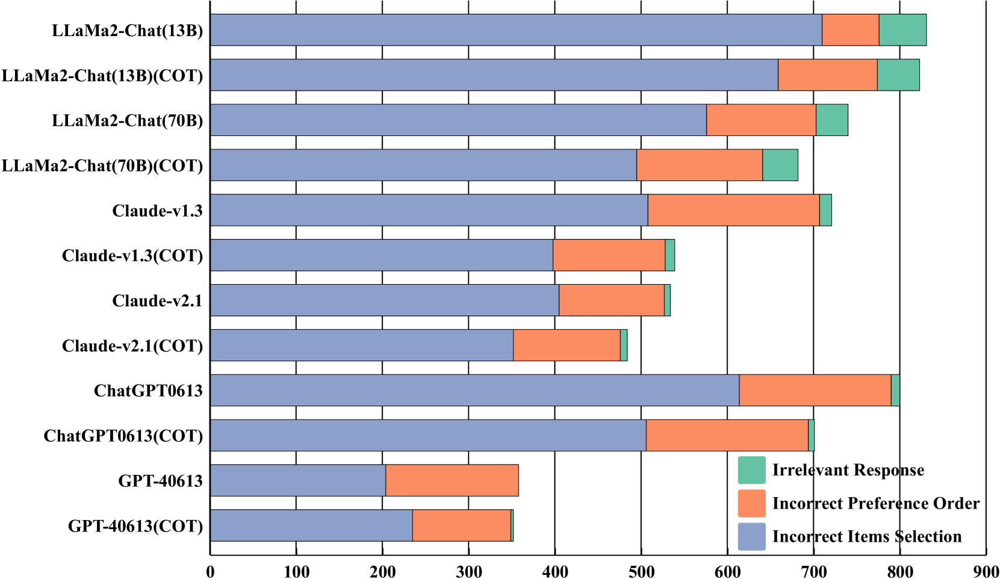
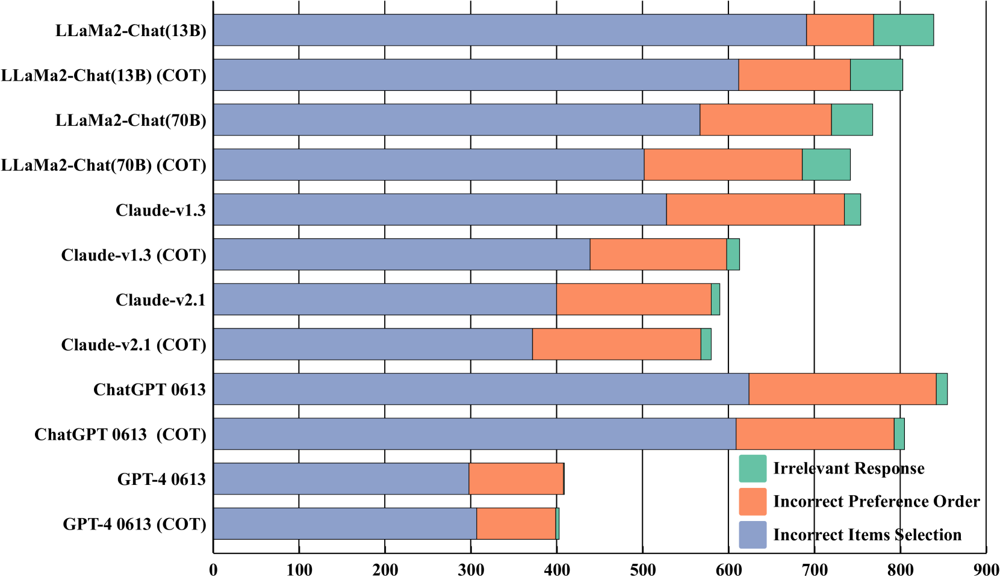
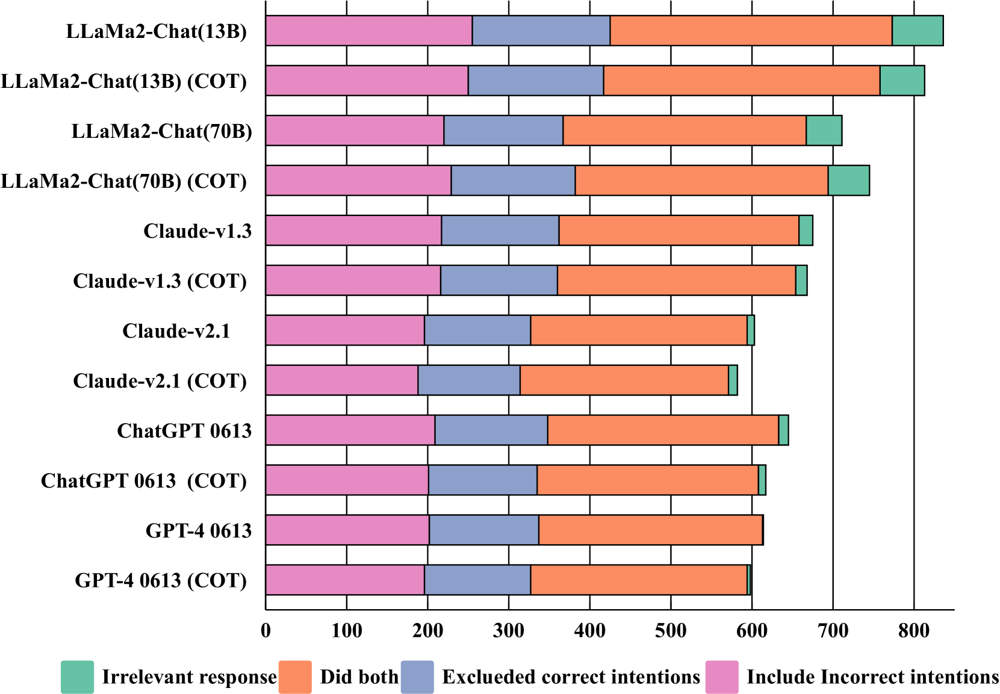
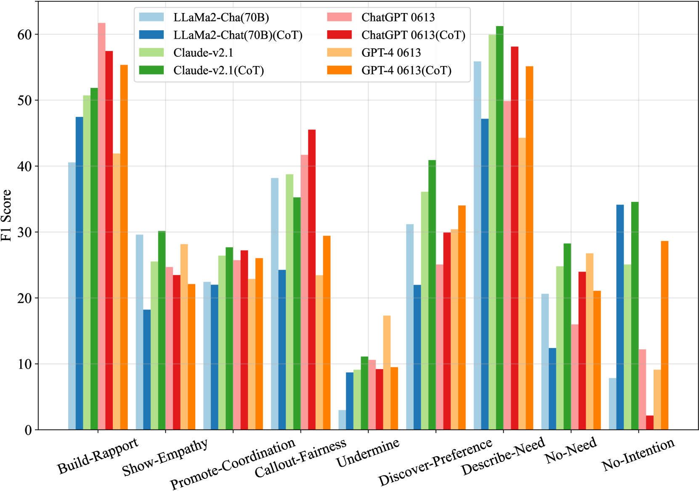
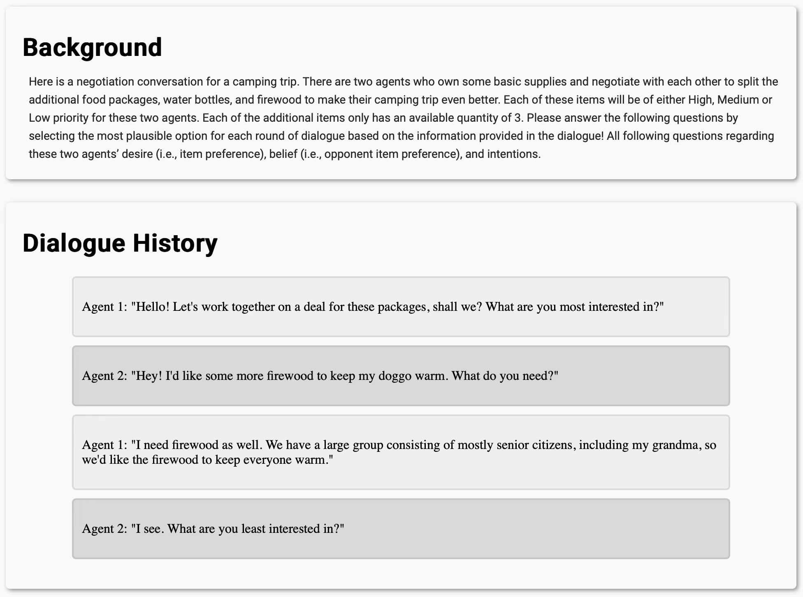
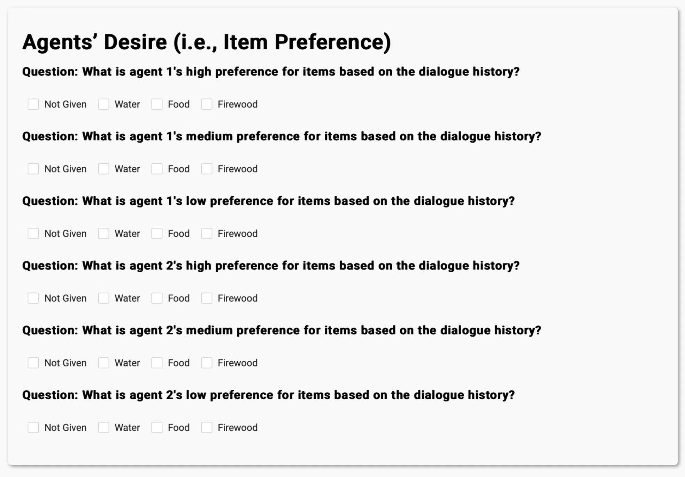
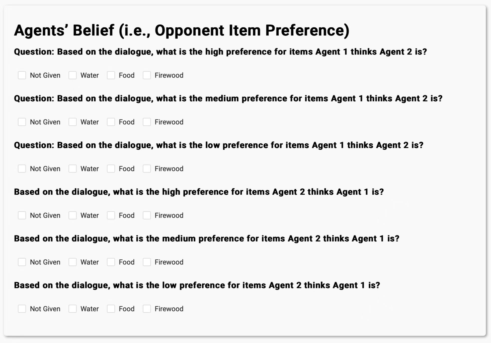
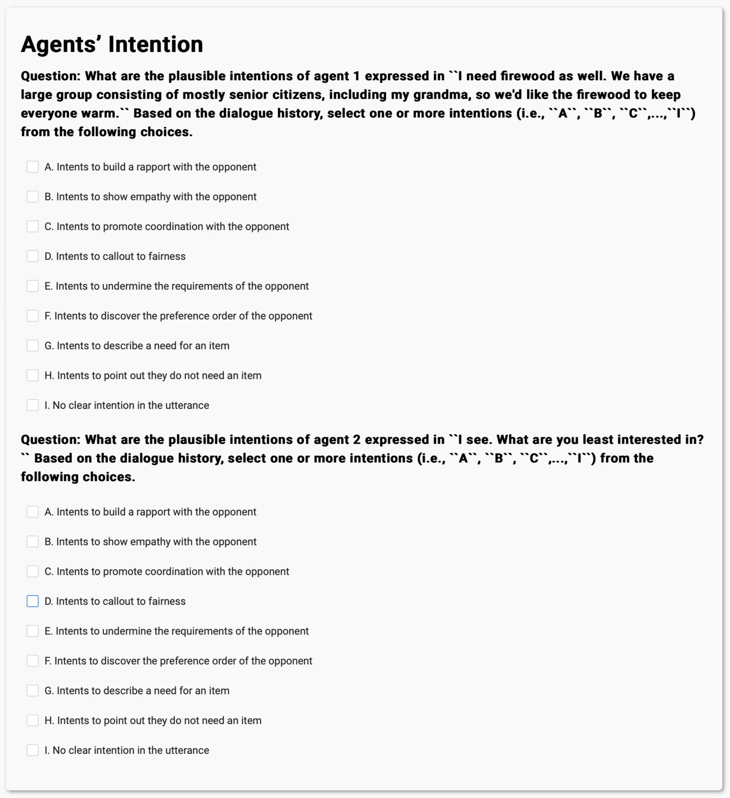

# NegotiationToM：一项旨在对围绕谈判情境的机器心智理论进行极限测试的基准研究

发布时间：2024年04月21日

`分类：LLM理论` `人工智能` `心理学`

> NegotiationToM: A Benchmark for Stress-testing Machine Theory of Mind on Negotiation Surrounding

# 摘要

> 大型语言模型（LLMs）在是否能够发展出心理理论（ToM）能力的问题上，激起了广泛的兴趣和讨论。现有的心理理论评估通常依赖于机器生成的数据或容易受到偶然相关性影响的博弈场景，这些方法并未充分评估机器在真实人际交往中的ToM能力。因此，迫切需要建立新的现实世界情境下的基准测试。我们提出了NegotiationToM，这是一个新的基准测试，专门设计来测试机器在现实世界谈判中对多维心理状态（如欲望、信念和意图）的理解。该基准测试基于信念-欲望-意图（BDI）代理建模理论，并进行了实证实验以评估大型语言模型的性能。我们的研究结果显示，即便是最先进的LLMs在NegotiationToM上也面临挑战，它们的表现显著落后于人类，即便采用了思维链（CoT）方法。

> Large Language Models (LLMs) have sparked substantial interest and debate concerning their potential emergence of Theory of Mind (ToM) ability. Theory of mind evaluations currently focuses on testing models using machine-generated data or game settings prone to shortcuts and spurious correlations, which lacks evaluation of machine ToM ability in real-world human interaction scenarios. This poses a pressing demand to develop new real-world scenario benchmarks. We introduce NegotiationToM, a new benchmark designed to stress-test machine ToM in real-world negotiation surrounding covered multi-dimensional mental states (i.e., desires, beliefs, and intentions). Our benchmark builds upon the Belief-Desire-Intention (BDI) agent modeling theory and conducts the necessary empirical experiments to evaluate large language models. Our findings demonstrate that NegotiationToM is challenging for state-of-the-art LLMs, as they consistently perform significantly worse than humans, even when employing the chain-of-thought (CoT) method.

[Arxiv](https://arxiv.org/abs/2404.13627)