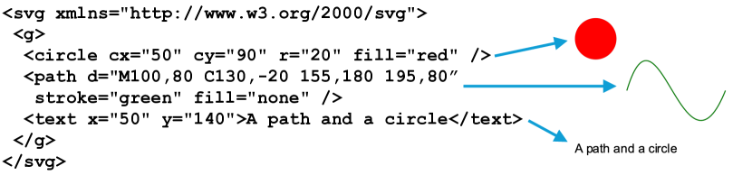
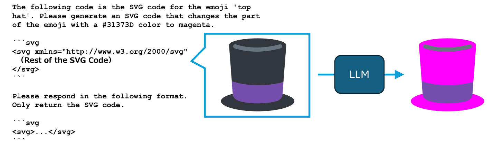

# SVGEditBench：一个专为衡量大型语言模型在SVG编辑领域量化能力的基准数据集。

发布时间：2024年04月21日

`LLM应用` `计算机图形学`

> SVGEditBench: A Benchmark Dataset for Quantitative Assessment of LLM's SVG Editing Capabilities

# 摘要

> 近年来，文本到图像模型取得了显著进展，矢量图形的生成技术也随之提升。SVG 作为矢量图形的流行格式，通过 XML 文本描述场景，使得大型语言模型能够直接对其进行处理。基于此，本研究集中于利用大型语言模型对 SVG 进行编辑，并提出了 SVGEditBench 这一基准测试，用以定量评估模型编辑 SVG 代码的能力。在对 GPT-4 和 GPT-3.5 进行的评估中，GPT-4 在定量和定性分析上均展现出更优的表现。相关数据集已在 https://github.com/mti-lab/SVGEditBench 上公开。

> Text-to-image models have shown progress in recent years. Along with this progress, generating vector graphics from text has also advanced. SVG is a popular format for vector graphics, and SVG represents a scene with XML text. Therefore, Large Language Models can directly process SVG code. Taking this into account, we focused on editing SVG with LLMs. For quantitative evaluation of LLMs' ability to edit SVG, we propose SVGEditBench. SVGEditBench is a benchmark for assessing the LLMs' ability to edit SVG code. We also show the GPT-4 and GPT-3.5 results when evaluated on the proposed benchmark. In the experiments, GPT-4 showed superior performance to GPT-3.5 both quantitatively and qualitatively. The dataset is available at https://github.com/mti-lab/SVGEditBench.

[Arxiv](https://arxiv.org/abs/2404.13710)