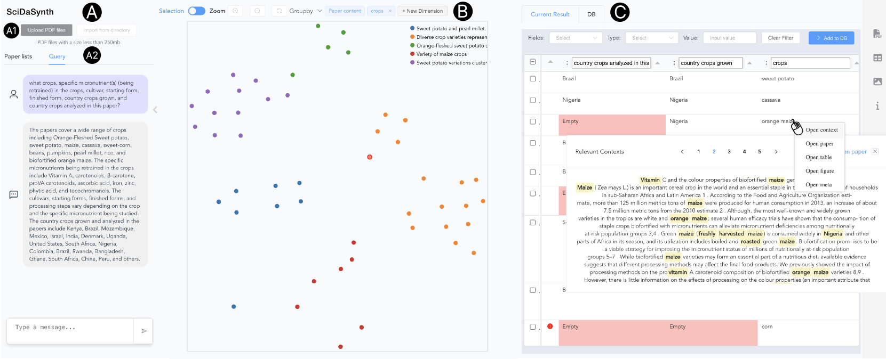
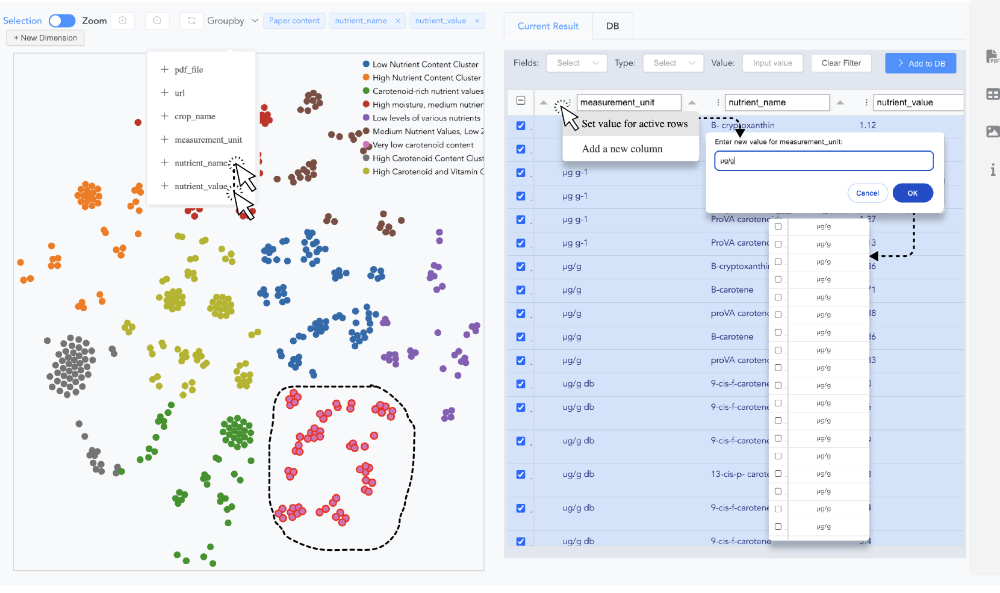
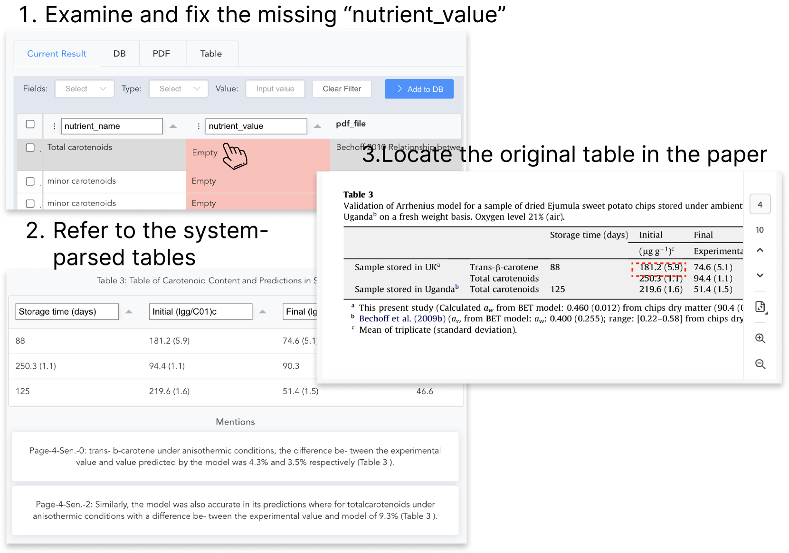
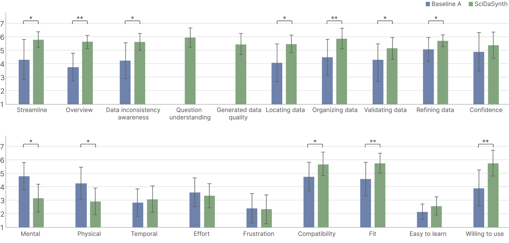
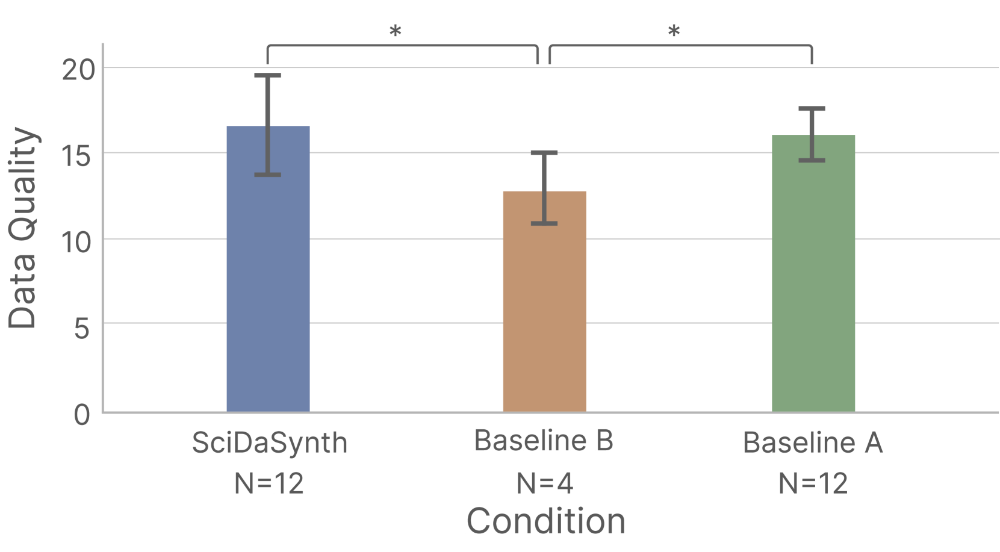
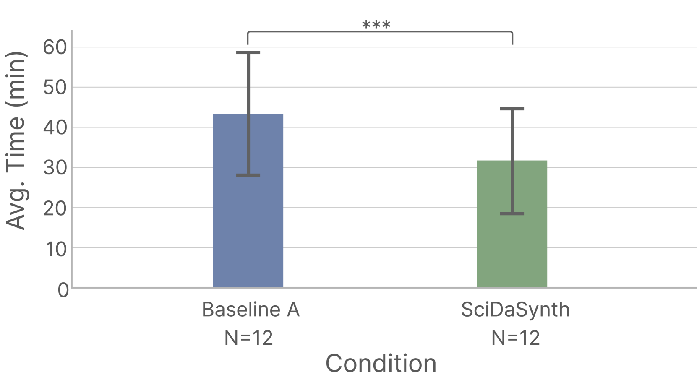

# SciDaSynth：一款利用大型语言模型实现科学文献中结构化知识的互动式提取与合成的工具。

发布时间：2024年04月21日

`LLM应用` `科学文献挖掘` `知识管理`

> SciDaSynth: Interactive Structured Knowledge Extraction and Synthesis from Scientific Literature with Large Language Model

# 摘要

> 深入挖掘和整合科学文献中的结构化知识对于科学发展和传播极为关键。尽管现有系统在辅助文献回顾和理解方面有所贡献，但它们在将文献中的多模态、多样化和不统一信息转换为结构化数据方面仍显不足。我们推出了 SciDaSynth，这是一款由大型语言模型 (LLMs) 支持的创新交互式系统，旨在帮助研究人员高效构建大规模的科学文献知识库。系统能够自动生成数据表，通过问答互动整理和归纳用户关注的文献知识点。此外，它还支持对生成的数据表进行多层次、多维度的深入探索，便于用户进行迭代式的验证、修正和完善。我们开展的针对研究人员的受试内研究证明了 SciDaSynth 在构建高质量科学知识库方面的显著效能和效率。文章还进一步探讨了人工智能交互工具在数据提取和结构化方面的设计考量。

> Extraction and synthesis of structured knowledge from extensive scientific literature are crucial for advancing and disseminating scientific progress. Although many existing systems facilitate literature review and digest, they struggle to process multimodal, varied, and inconsistent information within and across the literature into structured data. We introduce SciDaSynth, a novel interactive system powered by large language models (LLMs) that enables researchers to efficiently build structured knowledge bases from scientific literature at scale. The system automatically creates data tables to organize and summarize users' interested knowledge in literature via question-answering. Furthermore, it provides multi-level and multi-faceted exploration of the generated data tables, facilitating iterative validation, correction, and refinement. Our within-subjects study with researchers demonstrates the effectiveness and efficiency of SciDaSynth in constructing quality scientific knowledge bases. We further discuss the design implications for human-AI interaction tools for data extraction and structuring.

[Arxiv](https://arxiv.org/abs/2404.13765)