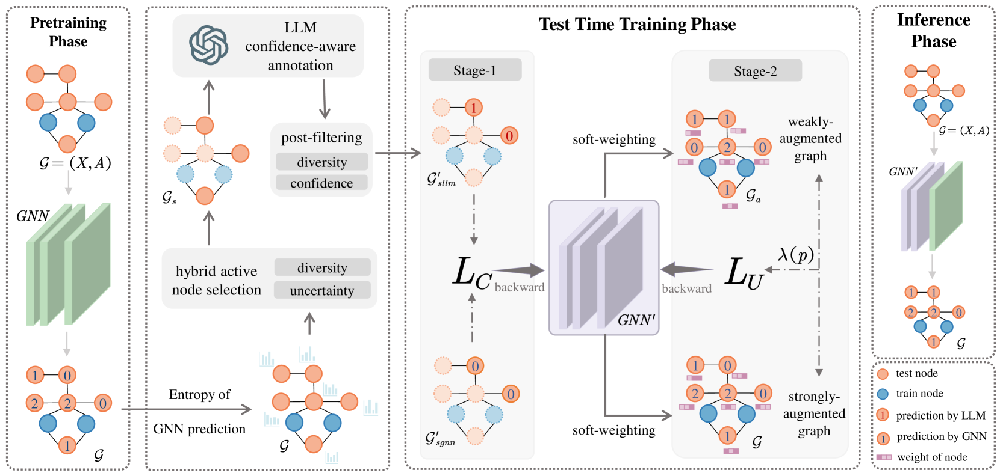
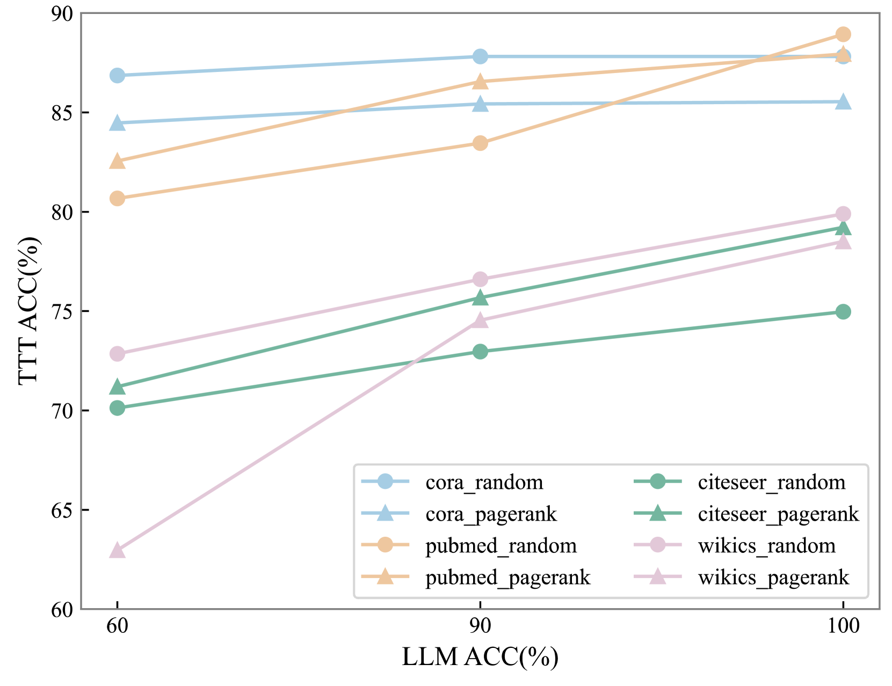
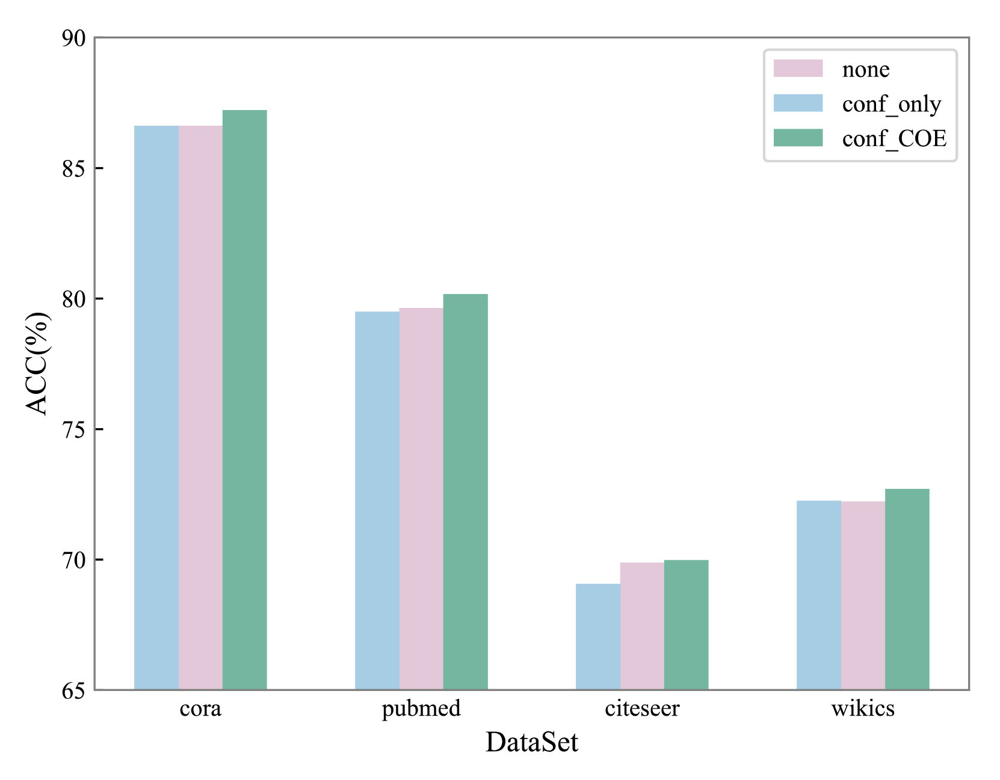

# 在图结构数据上，利用大型语言模型（LLMs）进行测试阶段的训练。

发布时间：2024年04月21日

`LLM应用` `多媒体` `图神经网络`

> Test-Time Training on Graphs with Large Language Models (LLMs)

# 摘要

> 图神经网络在多媒体领域取得了显著成就，但训练与测试数据的分布差异对其效能构成了挑战。为了应对这一问题，测试时训练（TTT）被提出作为一种有效的解决方案。传统TTT方法依赖于复杂的无监督训练策略，以从测试数据中提取信息，以提升主要任务的表现。本研究受到大型语言模型（LLMs）在文本属性图（TAGs）上强大的标注能力启发，提出了一种利用LLMs作为标注器来增强图上测试时训练的新方法。本文设计了一种创新的测试时训练流程——LLMTTT，它在LLMs对精心挑选的节点集进行标注的基础上进行测试时的适应性训练。LLMTTT采用了一种混合的活跃节点选择策略，综合考虑节点多样性、代表性以及预训练模型的预测信号。在LLMs的标注辅助下，我们设计了两阶段的训练策略，以利用有限且带有噪声的标签对测试时模型进行定制。理论分析验证了我们方法的合理性，而广泛的实验结果也证明了LLMTTT在离群分布（OOD）泛化性能上相比现有方法有显著提升。

> Graph Neural Networks have demonstrated great success in various fields of multimedia. However, the distribution shift between the training and test data challenges the effectiveness of GNNs. To mitigate this challenge, Test-Time Training (TTT) has been proposed as a promising approach. Traditional TTT methods require a demanding unsupervised training strategy to capture the information from test to benefit the main task. Inspired by the great annotation ability of Large Language Models (LLMs) on Text-Attributed Graphs (TAGs), we propose to enhance the test-time training on graphs with LLMs as annotators. In this paper, we design a novel Test-Time Training pipeline, LLMTTT, which conducts the test-time adaptation under the annotations by LLMs on a carefully-selected node set. Specifically, LLMTTT introduces a hybrid active node selection strategy that considers not only node diversity and representativeness, but also prediction signals from the pre-trained model. Given annotations from LLMs, a two-stage training strategy is designed to tailor the test-time model with the limited and noisy labels. A theoretical analysis ensures the validity of our method and extensive experiments demonstrate that the proposed LLMTTT can achieve a significant performance improvement compared to existing Out-of-Distribution (OOD) generalization methods.

[Arxiv](https://arxiv.org/abs/2404.13571)