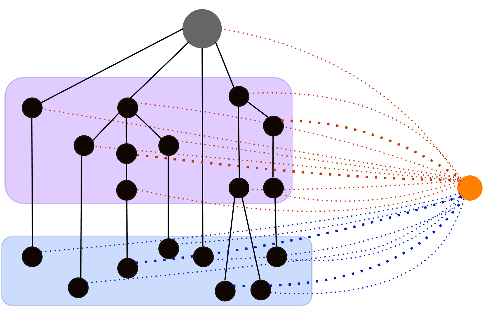
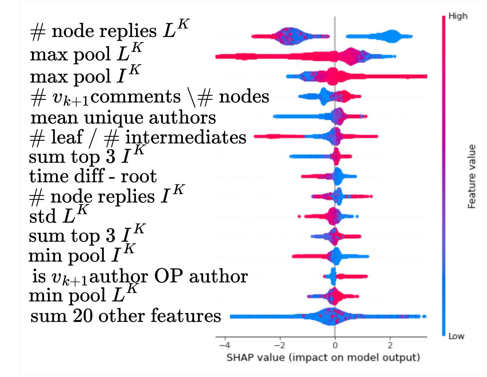
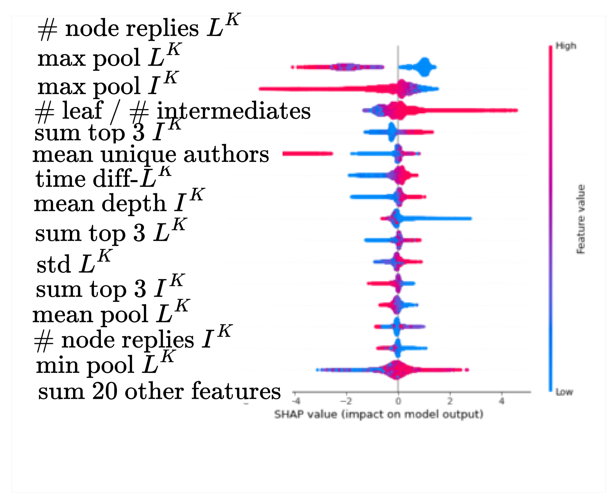
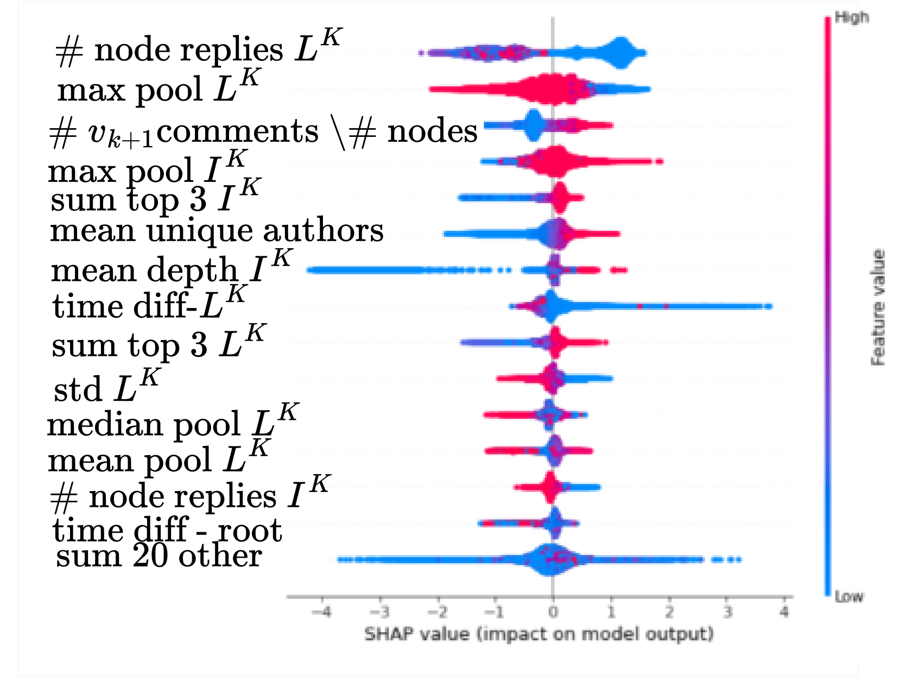

# 未踏之路：在线对话分支预测

发布时间：2024年04月21日

`分类：Agent` `社交媒体分析`

> The Branch Not Taken: Predicting Branching in Online Conversations

# 摘要

> 多人讨论通常呈现出树状而非线性的发展模式。分支的产生可能源于多种因素，包括在线平台的非同步特性，或是参与者有意与对话的某部分断开。预测分支的发生并探究其成因，对于摘要制作、话题解构等后续任务至关重要，也有助于构建能激励用户更深入参与讨论的在线环境。本研究提出了一项新的分支预测任务，并引入了 GLOBS（全局分支评分）——一种深度神经网络模型，用以预测讨论中的分支现象。GLOBS 在 Reddit 的三个大型讨论区进行了测试，不仅在多个竞争性基线模型中表现突出，还展现了更佳的迁移能力。我们证实，结构性、时间性和语言性特征对 GLOBS 的高效运作至关重要，并观察到分支往往与更多的对话参与者相关联，且更可能出现在对话树的较浅层级。为了确保研究的可复制性并推动这一重要领域的进一步探索，我们公开了 GLOBS 模型及所有基线模型的实现。

> Multi-participant discussions tend to unfold in a tree structure rather than a chain structure. Branching may occur for multiple reasons -- from the asynchronous nature of online platforms to a conscious decision by an interlocutor to disengage with part of the conversation. Predicting branching and understanding the reasons for creating new branches is important for many downstream tasks such as summarization and thread disentanglement and may help develop online spaces that encourage users to engage in online discussions in more meaningful ways. In this work, we define the novel task of branch prediction and propose GLOBS (Global Branching Score) -- a deep neural network model for predicting branching. GLOBS is evaluated on three large discussion forums from Reddit, achieving significant improvements over an array of competitive baselines and demonstrating better transferability. We affirm that structural, temporal, and linguistic features contribute to GLOBS success and find that branching is associated with a greater number of conversation participants and tends to occur in earlier levels of the conversation tree. We publicly release GLOBS and our implementation of all baseline models to allow reproducibility and promote further research on this important task.

[Arxiv](https://arxiv.org/abs/2404.13613)