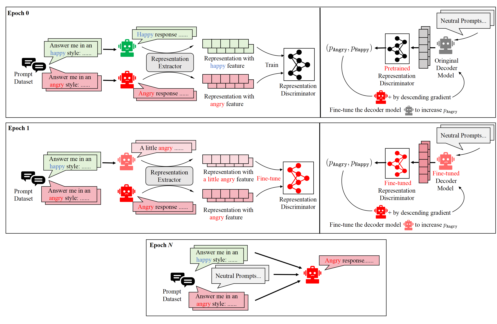
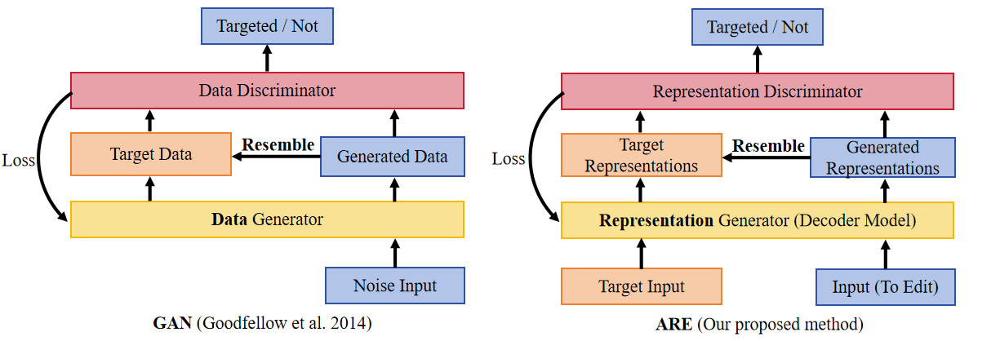
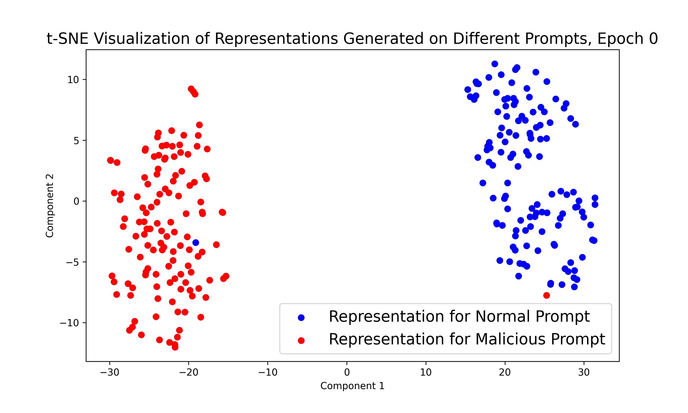
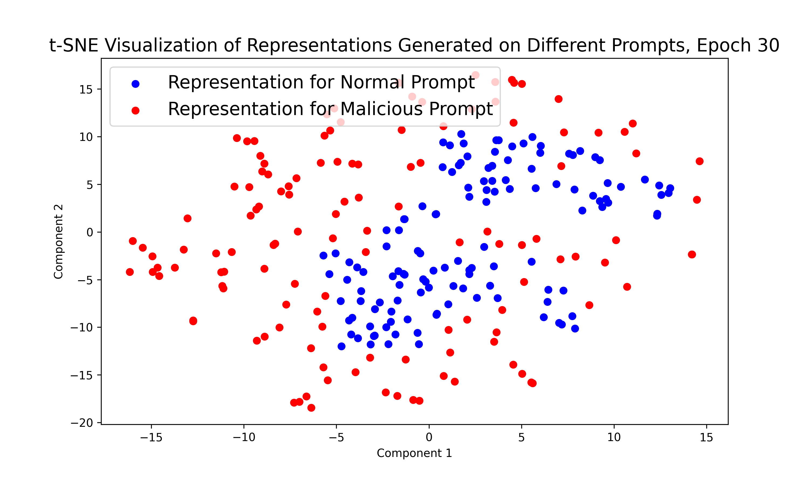

# 探索通过对抗性表示工程实现通用概念模型编辑的新路径。

发布时间：2024年04月21日

`LLM理论` `人工智能` `机器学习`

> Towards General Conceptual Model Editing via Adversarial Representation Engineering

# 摘要

> 最新研究提出了表示工程（RepE），作为深入洞察大型语言模型（LLMs）等大规模模型复杂机制的有前景的途径。尽管如此，如何将这些表示应用于高效且灵活的模型编辑，依然是一个悬而未决的挑战。借鉴生成对抗网络（GAN）的理念，我们提出了一种创新的方法——对抗性表示工程（ARE）。该方法通过表示传感器引导LLMs的编辑过程，利用RepE实现了一个统一且易于理解的框架，用于概念性模型的编辑，同时保持了基础性能不受影响。我们在多项概念编辑任务上的实验验证了ARE的有效性。相关代码和数据已在GitHub上公开，地址为：https://github.com/Zhang-Yihao/Adversarial-Representation-Engineering。

> Recent research has introduced Representation Engineering (RepE) as a promising approach for understanding complex inner workings of large-scale models like Large Language Models (LLMs). However, finding practical and efficient methods to apply these representations for general and flexible model editing remains an open problem. Inspired by the Generative Adversarial Network (GAN) framework, we introduce a novel approach called Adversarial Representation Engineering (ARE). This method leverages RepE by using a representation sensor to guide the editing of LLMs, offering a unified and interpretable framework for conceptual model editing without degrading baseline performance. Our experiments on multiple conceptual editing confirm ARE's effectiveness. Code and data are available at https://github.com/Zhang-Yihao/Adversarial-Representation-Engineering.

[Arxiv](https://arxiv.org/abs/2404.13752)