# 深入探究FFN在促进大型语言模型（LLM）多语言能力发展中的角色

发布时间：2024年04月21日

`LLM理论` `机器学习`

> Understanding the role of FFNs in driving multilingual behaviour in LLMs

# 摘要

> 大型语言模型（LLMs）的多语言特性仍是一个探索不足的领域。本文深入剖析了某系列大型语言模型的多语言功能，包括其架构、激活模式及跨语言处理机制。我们提出了新的评估指标，用以探究模型在不同层次上的多语言表现，并分析了架构决策对多语言处理的影响。研究发现，模型的前馈网络子层展现出多样化的多语言处理模式。同时，我们揭示了某些模型配置中“层数过多”的问题，即在未对其他参数进行相应调整的情况下增加层数可能会损害模型效能。通过对比不同语言及跨语言的情况，我们展示了模型结构、层数深度与多语言处理能力之间的相互影响。

> Multilingualism in Large Language Models (LLMs) is an yet under-explored area. In this paper, we conduct an in-depth analysis of the multilingual capabilities of a family of a Large Language Model, examining its architecture, activation patterns, and processing mechanisms across languages. We introduce novel metrics to probe the model's multilingual behaviour at different layers and shed light on the impact of architectural choices on multilingual processing.
  Our findings reveal different patterns of multilinugal processing in the sublayers of Feed-Forward Networks of the models. Furthermore, we uncover the phenomenon of "over-layerization" in certain model configurations, where increasing layer depth without corresponding adjustments to other parameters may degrade model performance. Through comparisons within and across languages, we demonstrate the interplay between model architecture, layer depth, and multilingual processing capabilities of LLMs trained on multiple languages.

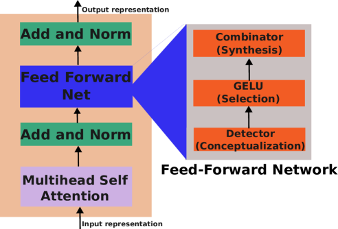

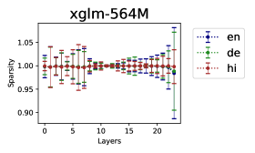

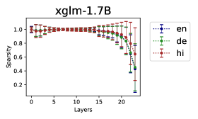

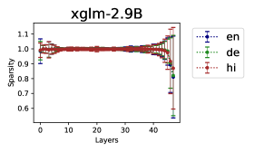

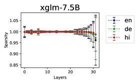

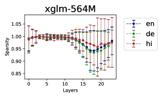

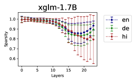

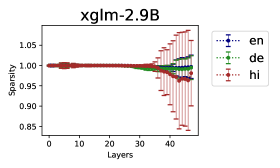

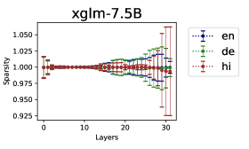

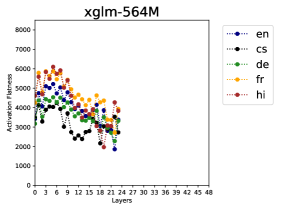

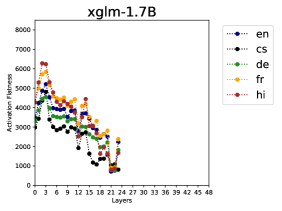

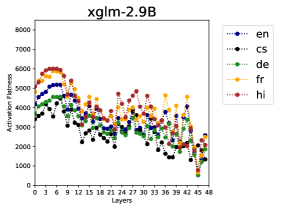

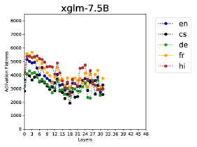

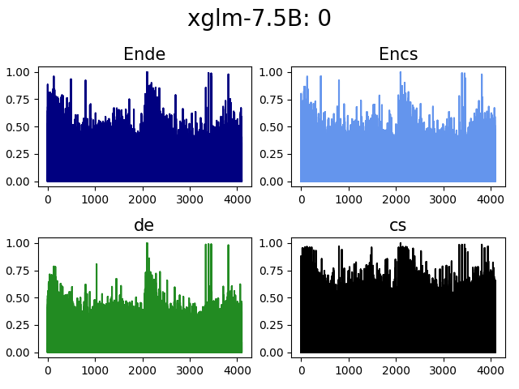

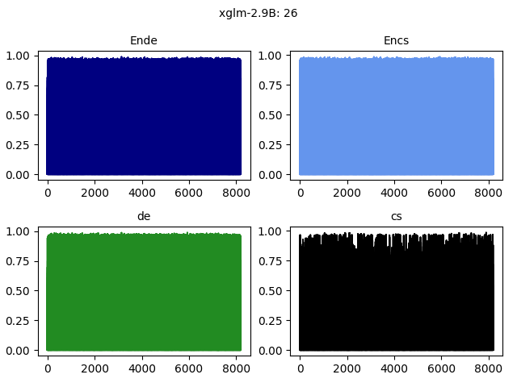

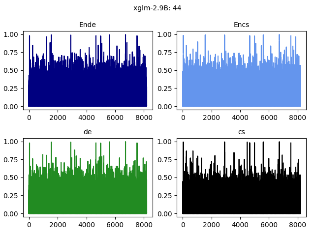

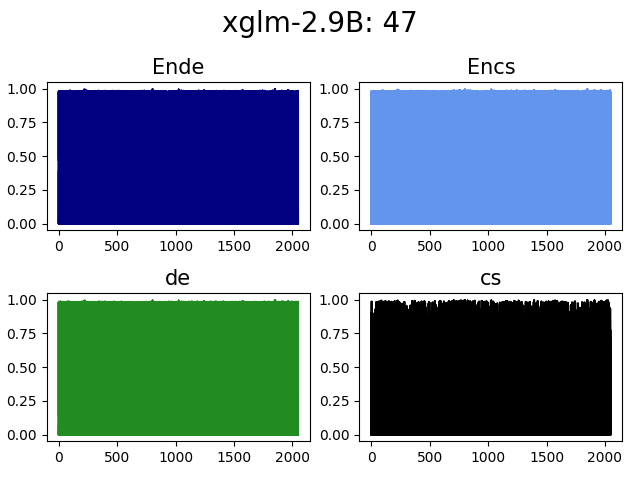

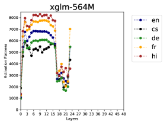

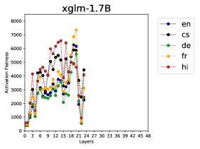

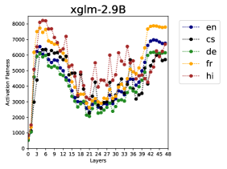

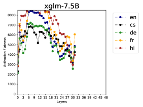

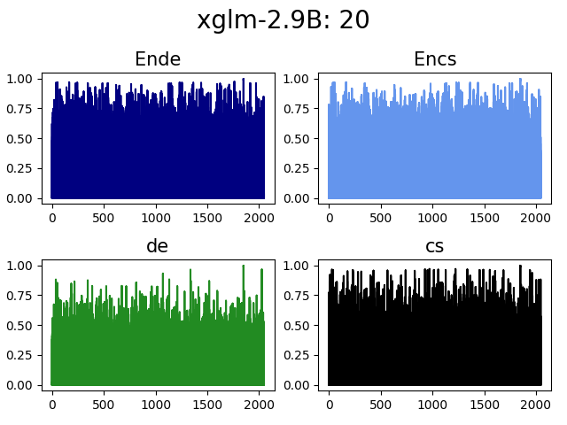

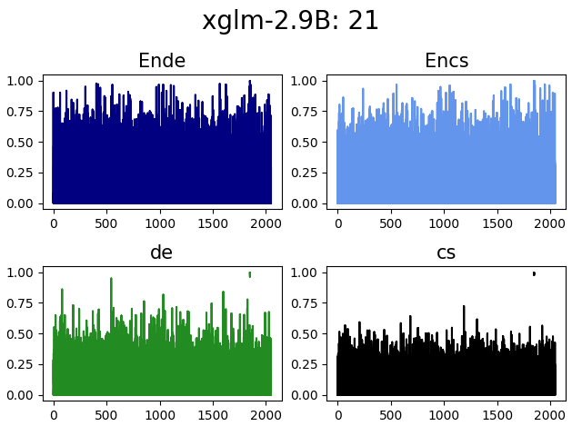

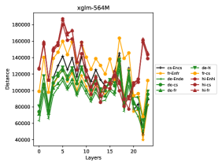

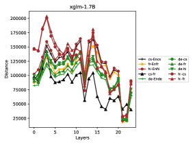

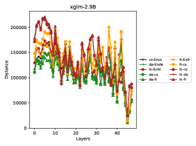

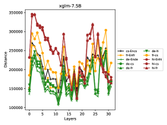

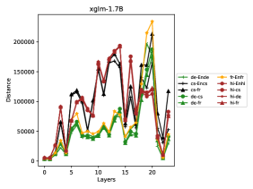

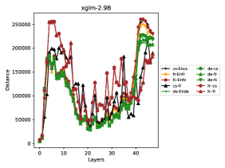

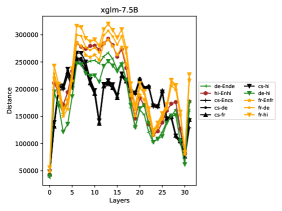

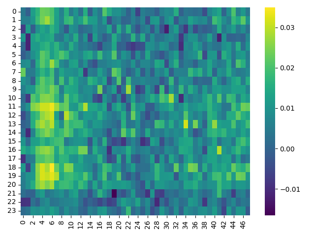

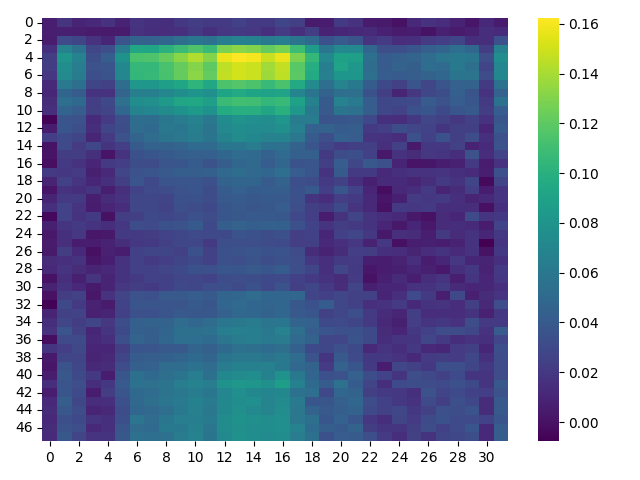

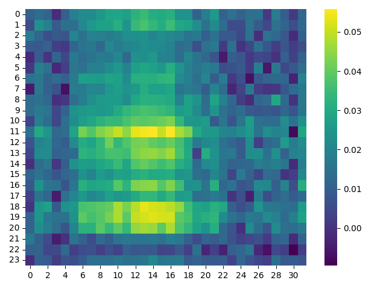

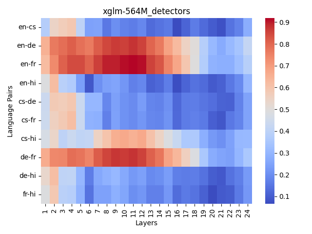

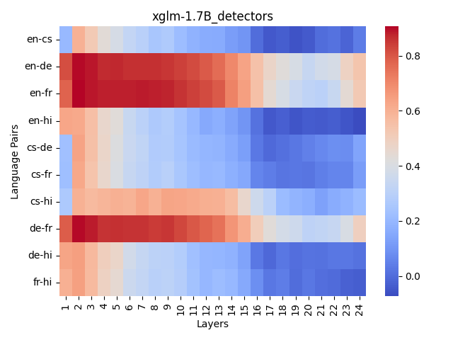

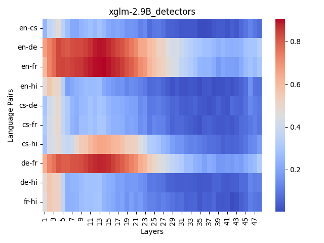

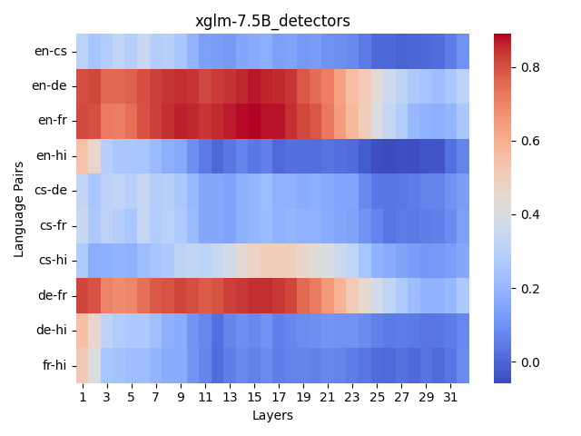

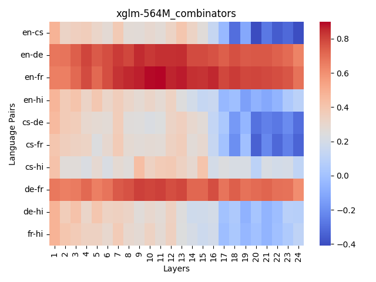

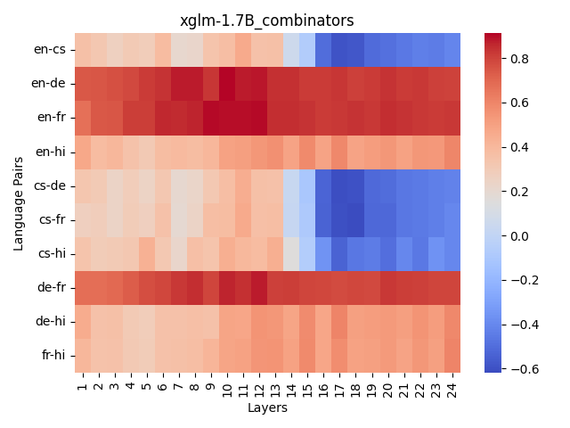

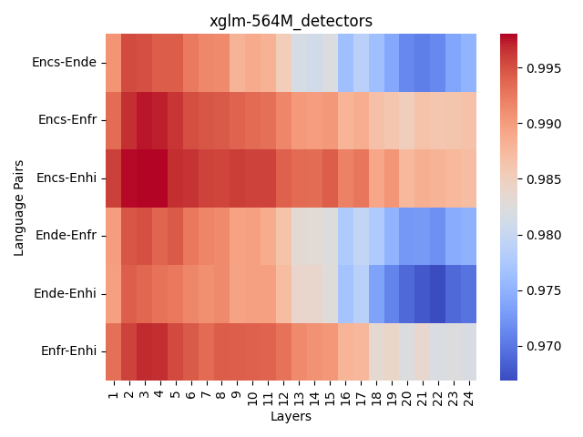

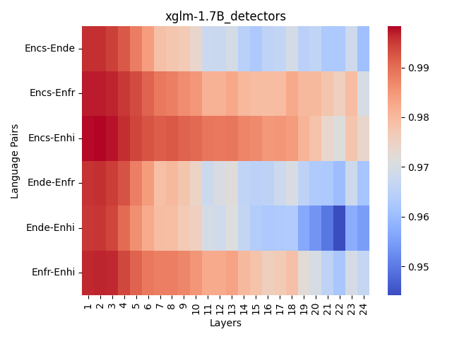

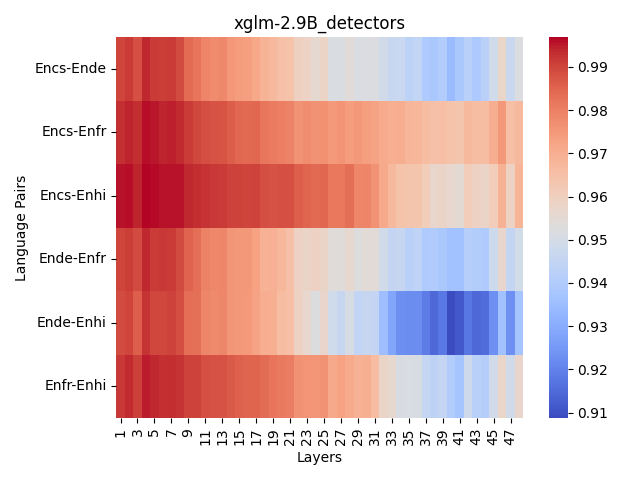

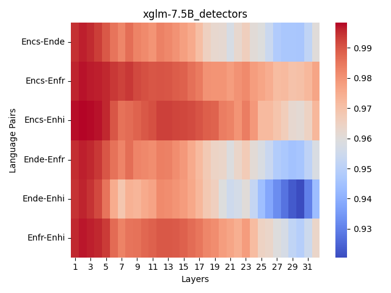

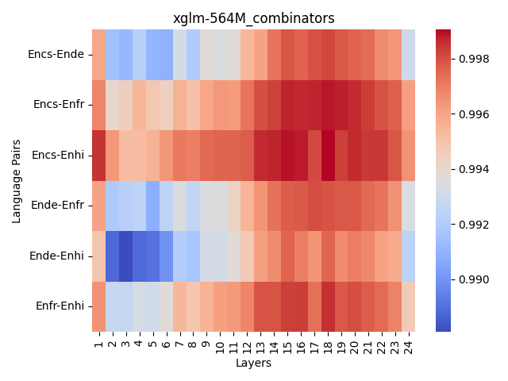

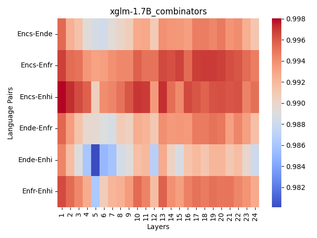

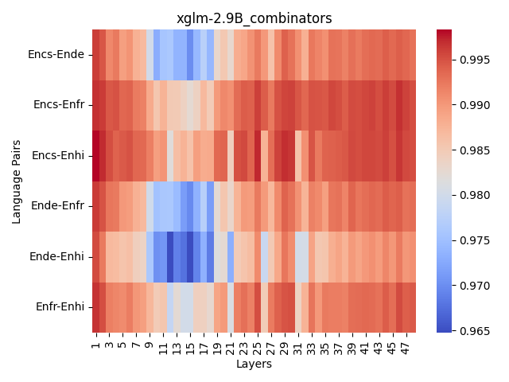

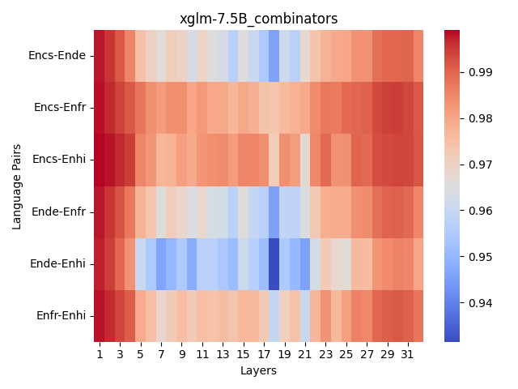

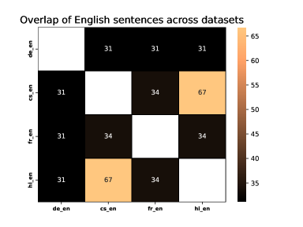

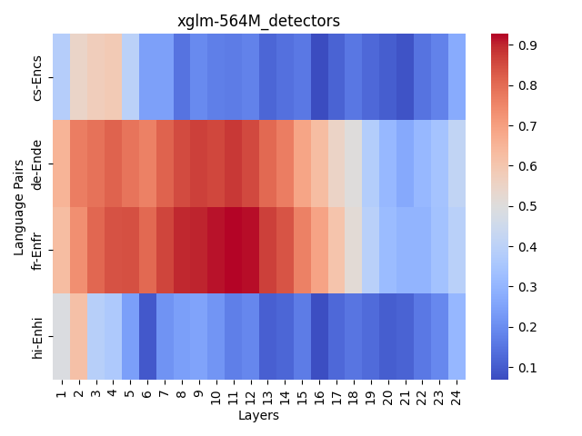

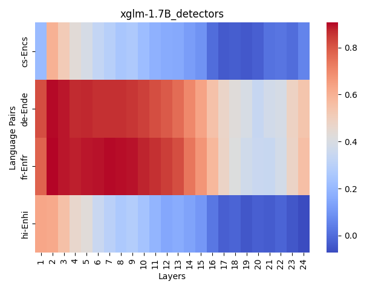

[Arxiv](https://arxiv.org/abs/2404.13855)