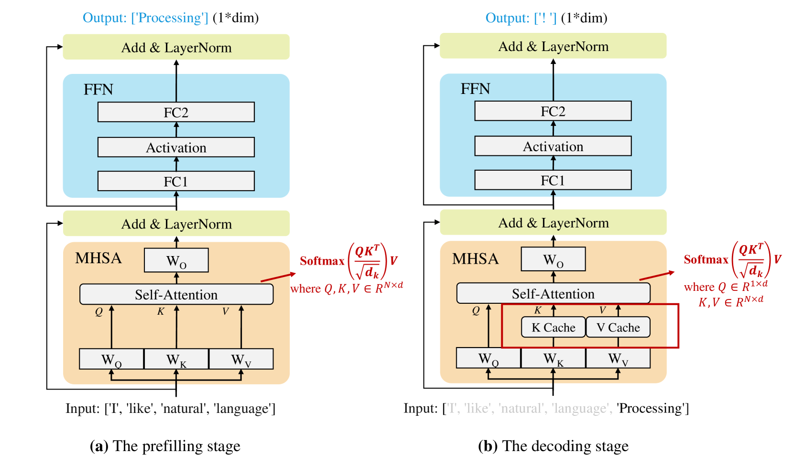
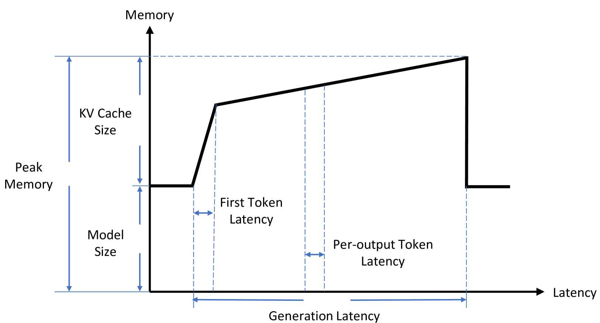
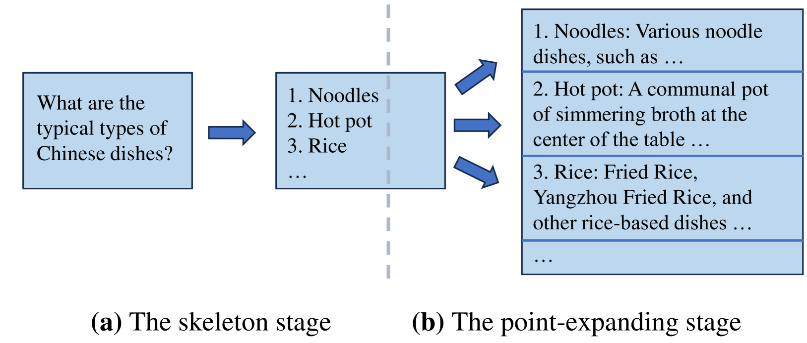
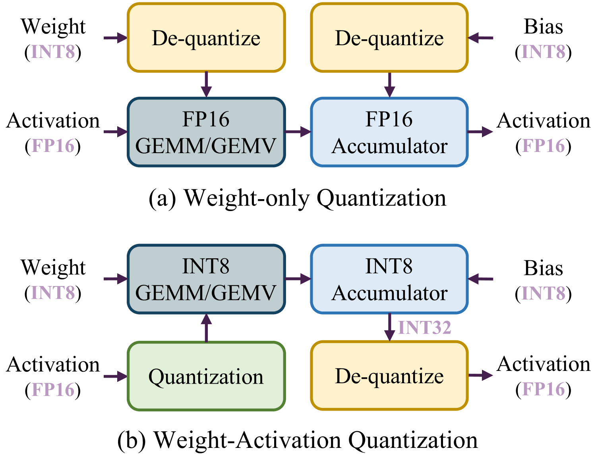
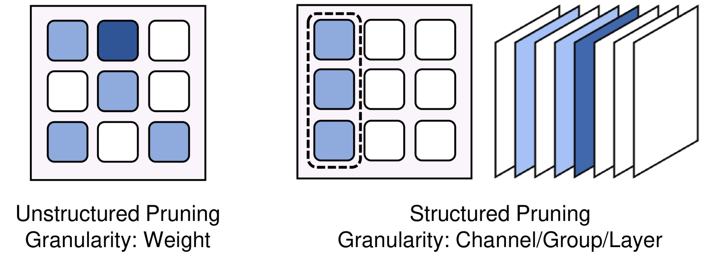
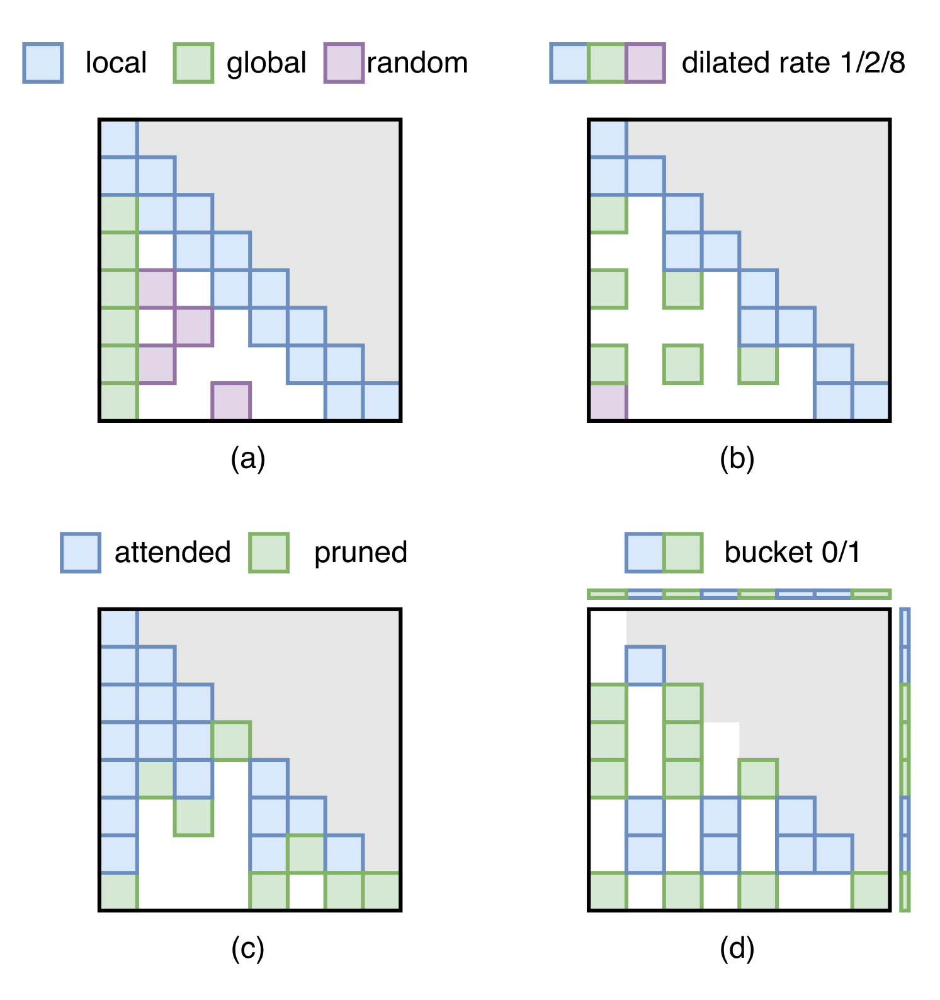
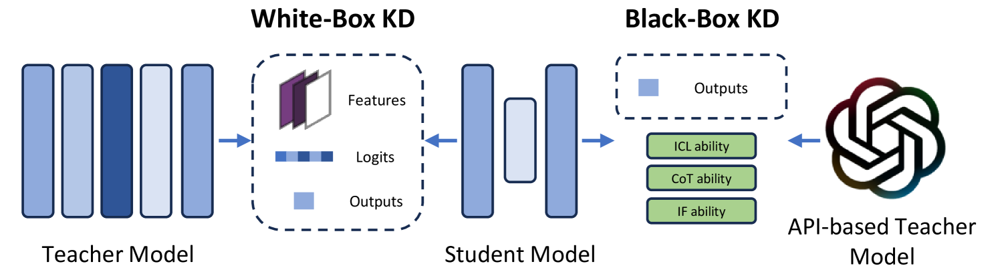
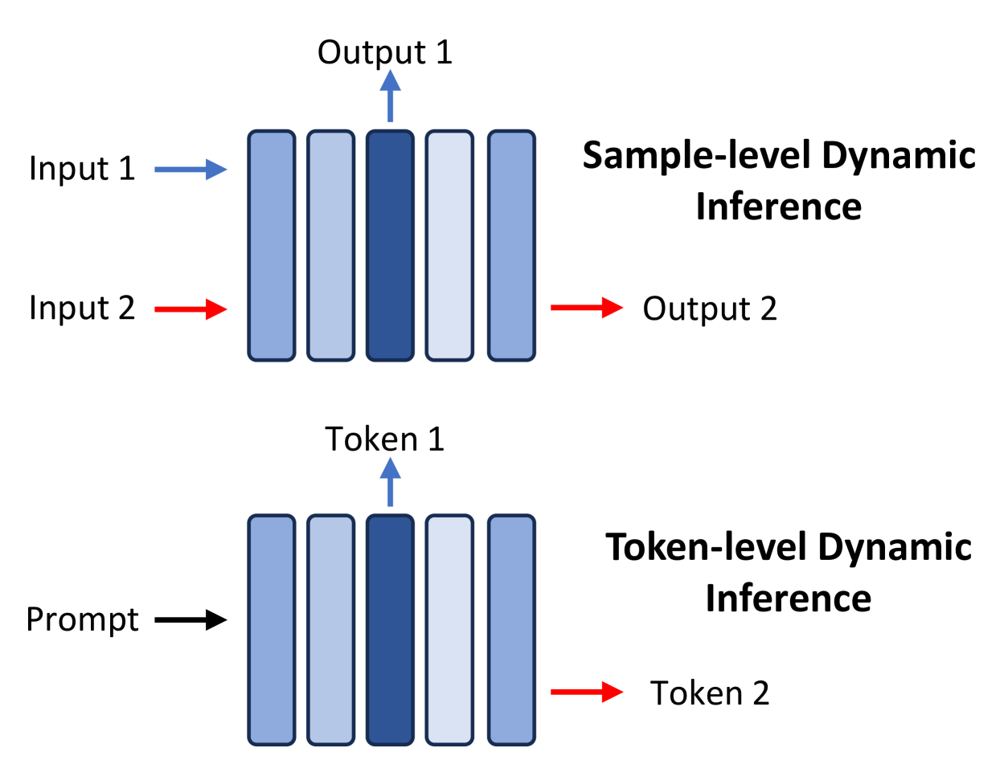
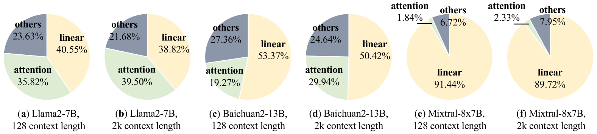
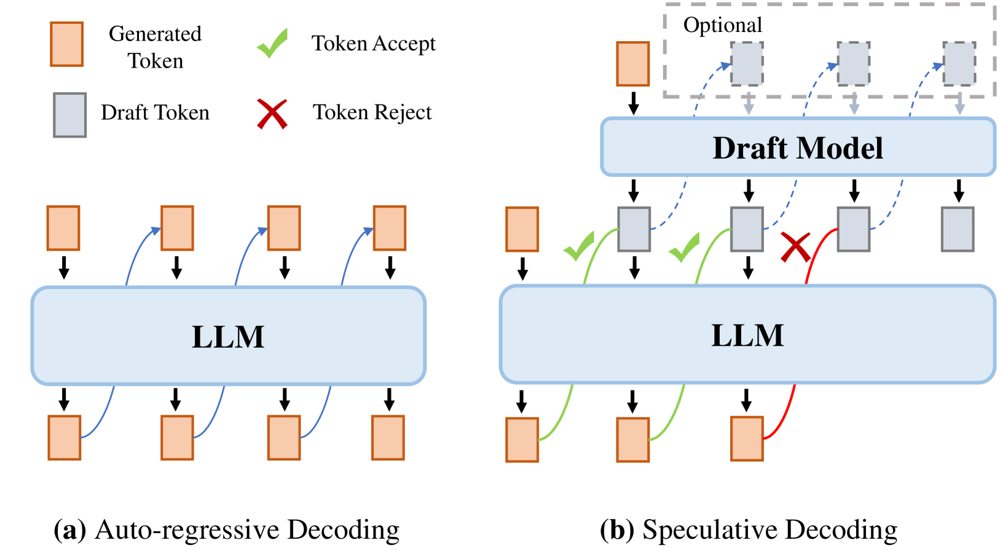

# 本文综述了大型语言模型在高效推理方面的研究进展。

发布时间：2024年04月22日

`LLM理论` `人工智能` `资源优化`

> A Survey on Efficient Inference for Large Language Models

# 摘要

> 大型语言模型（LLMs）因其在众多任务上的卓越表现备受瞩目。但它们在资源受限环境下的部署面临着巨大的计算和内存需求挑战。本领域内的研究者致力于开发提升LLM推理效率的技术。本文全面梳理了关于提高LLM推理效率的现有文献，首先剖析了推理效率低下的主要原因，包括庞大的模型规模、二次复杂度的注意力机制以及自回归的解码方式。接着，我们提出了一个系统的分类法，将相关文献分为数据层面、模型层面和系统层面的优化。文章还对关键子领域中的典型方法进行了比较实验，以提供定量分析。最后，我们总结了相关知识，并对未来的研究方向进行了探讨。

> Large Language Models (LLMs) have attracted extensive attention due to their remarkable performance across various tasks. However, the substantial computational and memory requirements of LLM inference pose challenges for deployment in resource-constrained scenarios. Efforts within the field have been directed towards developing techniques aimed at enhancing the efficiency of LLM inference. This paper presents a comprehensive survey of the existing literature on efficient LLM inference. We start by analyzing the primary causes of the inefficient LLM inference, i.e., the large model size, the quadratic-complexity attention operation, and the auto-regressive decoding approach. Then, we introduce a comprehensive taxonomy that organizes the current literature into data-level, model-level, and system-level optimization. Moreover, the paper includes comparative experiments on representative methods within critical sub-fields to provide quantitative insights. Last but not least, we provide some knowledge summary and discuss future research directions.

[Arxiv](https://arxiv.org/abs/2404.14294)