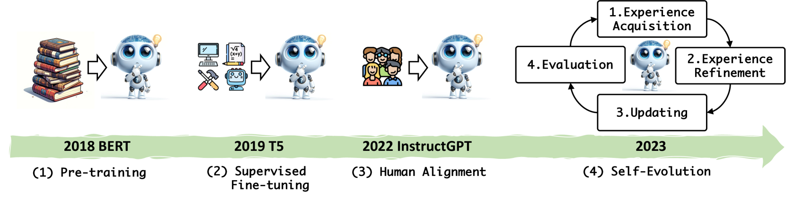
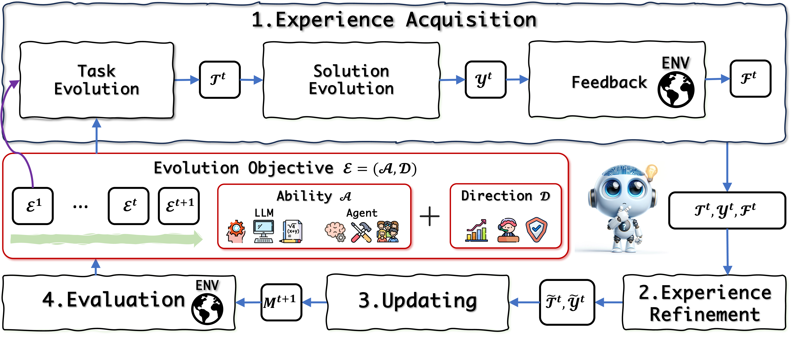
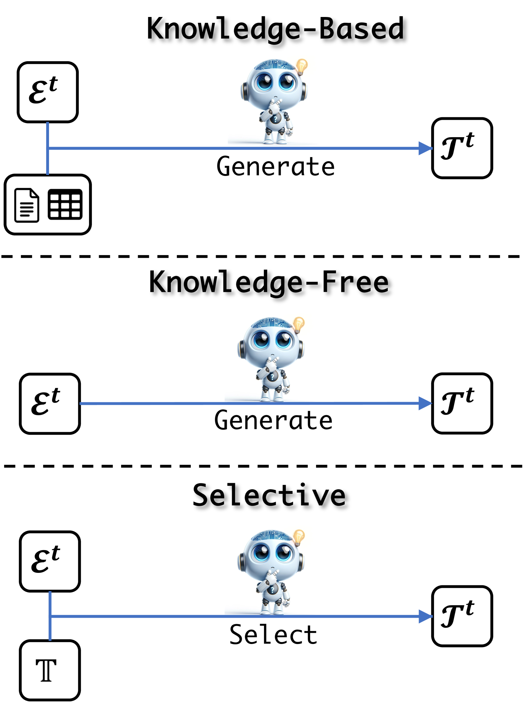
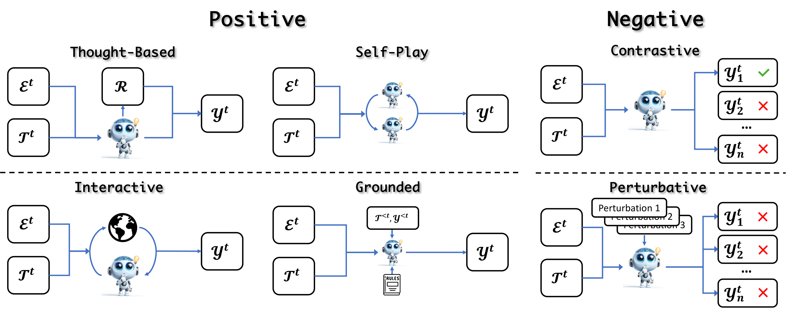
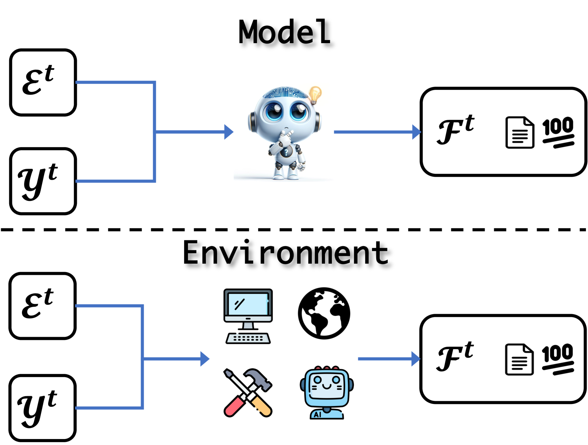
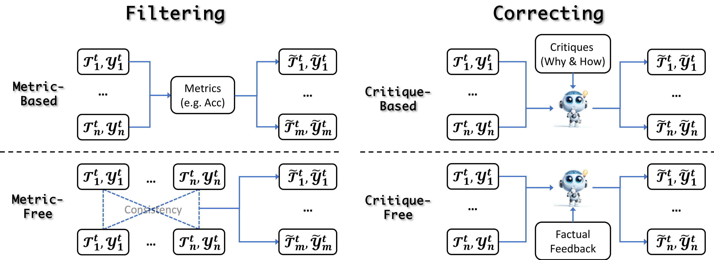
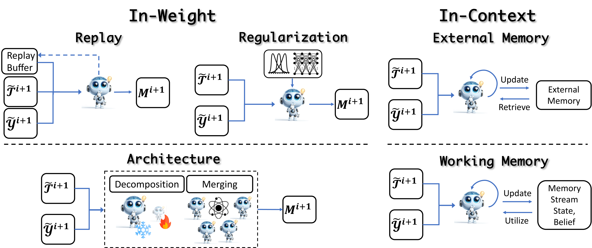

# 大型语言模型的自我进化研究综述

发布时间：2024年04月22日

`分类：LLM理论` `人工智能`

> A Survey on Self-Evolution of Large Language Models

# 摘要

> 大型语言模型（LLMs）在多个领域和智能代理应用上取得了突破性进展。尽管如此，依赖人类或外部模型监督的LLMs不仅成本高昂，而且随着任务的复杂和多变，它们的性能提升也遇到了瓶颈。为突破这一局限，一种新兴的自我进化方法应运而生，它允许LLMs自主地从自身生成的经验中学习、提炼和进化。这种训练新范式，模仿人类的体验学习过程，为LLMs向超智能的跨越式发展提供了可能。在本研究中，我们全面审视了LLMs中的自我进化策略。我们首先构建了一个自我进化的概念性框架，并将其演进过程划分为四个循环迭代的阶段：经验获取、经验优化、更新和评估。接着，我们对LLMs及其代理的进化目标进行了分类，并综述了相关文献，为每个模块提供了系统的分类和深入的洞见。最后，我们指出了当前面临的挑战，并对未来的研究方向提出了建议，旨在为研究人员提供宝贵的见解，以加速自我进化LLMs的研究进程。

> Large language models (LLMs) have significantly advanced in various fields and intelligent agent applications. However, current LLMs that learn from human or external model supervision are costly and may face performance ceilings as task complexity and diversity increase. To address this issue, self-evolution approaches that enable LLM to autonomously acquire, refine, and learn from experiences generated by the model itself are rapidly growing. This new training paradigm inspired by the human experiential learning process offers the potential to scale LLMs towards superintelligence. In this work, we present a comprehensive survey of self-evolution approaches in LLMs. We first propose a conceptual framework for self-evolution and outline the evolving process as iterative cycles composed of four phases: experience acquisition, experience refinement, updating, and evaluation. Second, we categorize the evolution objectives of LLMs and LLM-based agents; then, we summarize the literature and provide taxonomy and insights for each module. Lastly, we pinpoint existing challenges and propose future directions to improve self-evolution frameworks, equipping researchers with critical insights to fast-track the development of self-evolving LLMs.

[Arxiv](https://arxiv.org/abs/2404.14387)