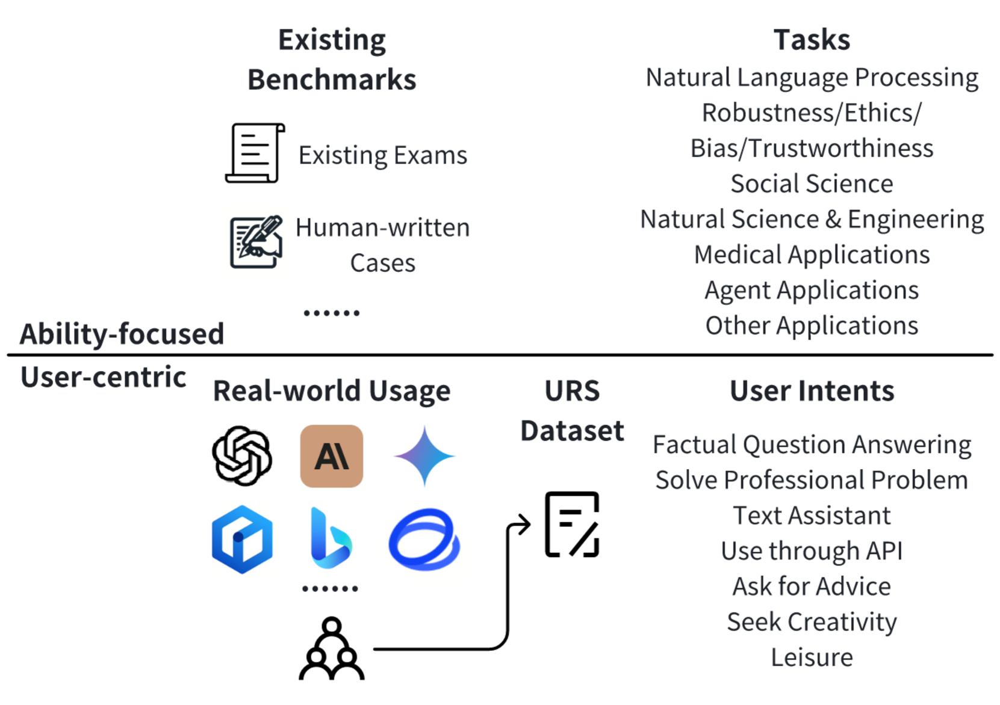
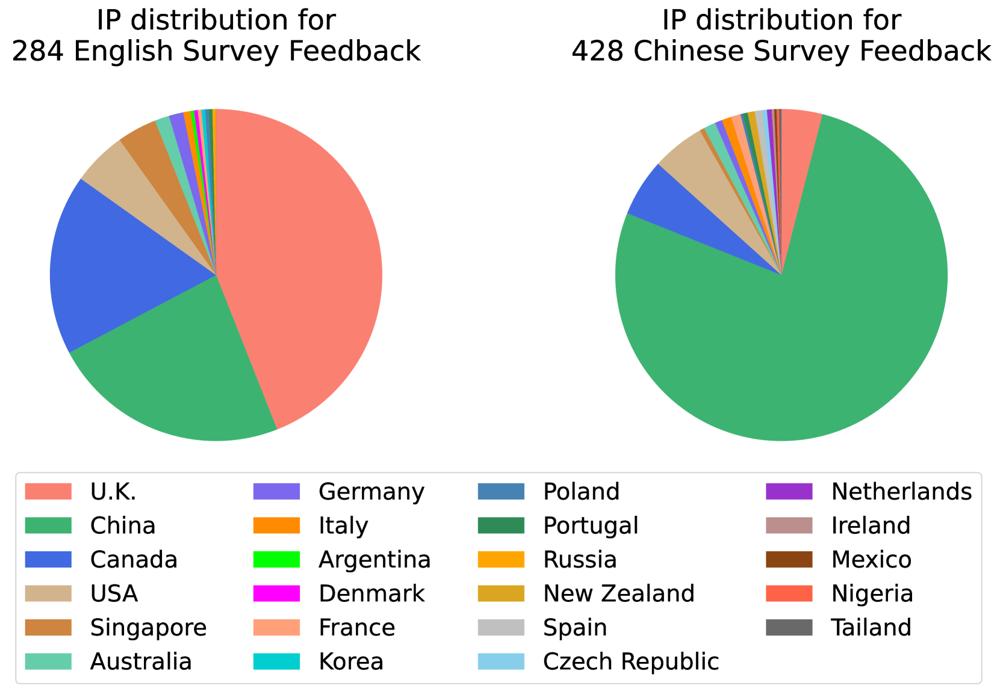
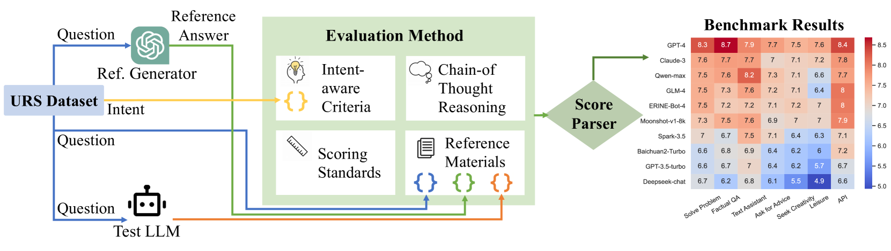
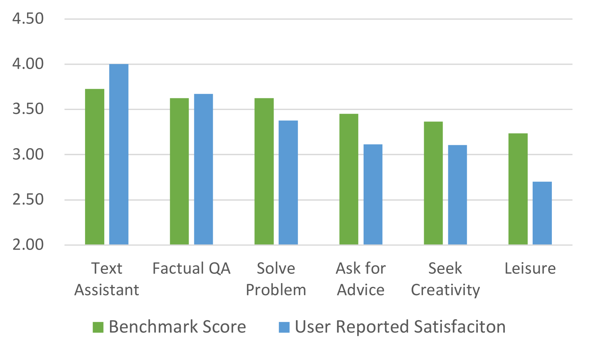
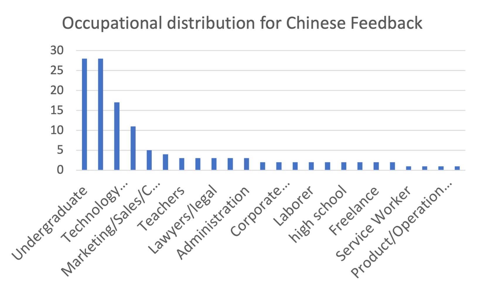
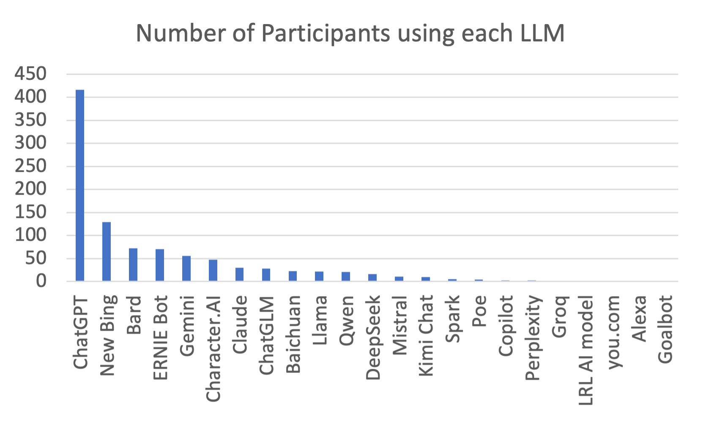
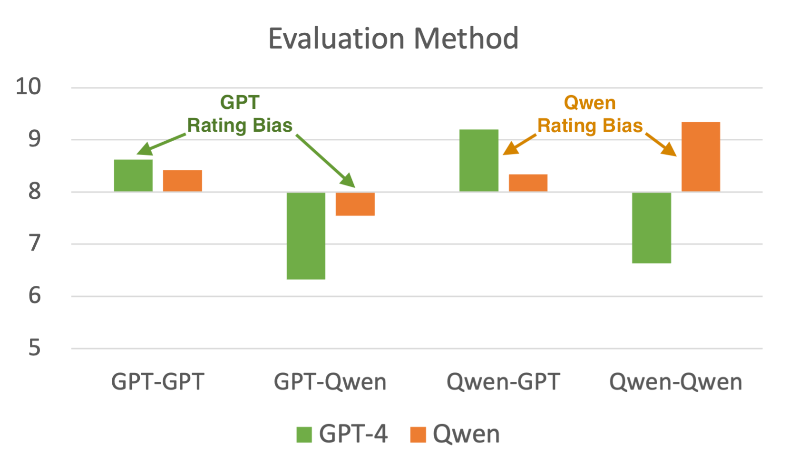
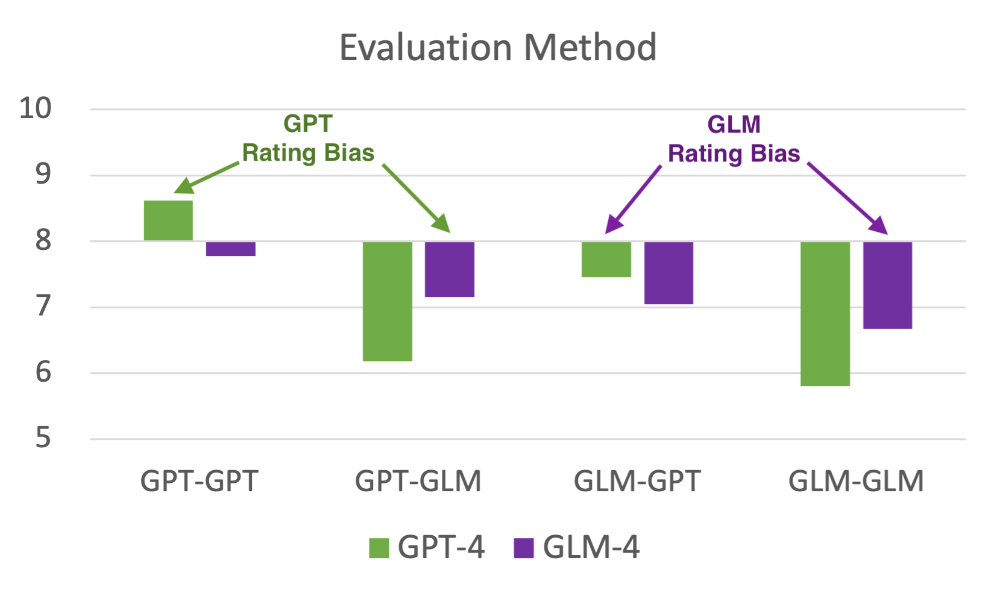

# 用户导向的大型语言模型评估基准

发布时间：2024年04月22日

`LLM应用` `人工智能` `用户研究`

> A User-Centric Benchmark for Evaluating Large Language Models

# 摘要

> 大型语言模型（LLMs）是协助用户完成多样化任务的关键工具。在现实世界场景中评估它们是否能满足用户需求至关重要。尽管众多基准测试已应运而生，它们往往只针对模型的特定预设能力进行测试，却鲜少关注LLMs在真实用户手中的作用。为了弥补这一缺憾，我们提出了一种新的基准测试方法，从用户视角出发，对数据集构建和评估设计进行全面考量。我们通过一项涉及23个国家712名参与者的用户研究，收集了1863个真实用例，涉及15种LLMs。这些由用户自行报告的案例构成了用户报告场景（URS）数据集，该数据集包含7种不同的用户意图分类。接着，我们在这一多元文化的真实数据集上，对10种LLM服务的性能进行了基准测试，以评估它们满足用户需求的效果。此外，我们发现我们的基准测试得分与用户在多样化意图下与LLMs互动的体验高度一致，这两者都突显了对个体情境的忽视。总结来说，我们的研究提倡从用户中心的角度出发，对LLMs进行基准测试，以促进更贴近真实用户需求的评估。相关的基准数据集和代码已在 https://github.com/Alice1998/URS 上公开。

> Large Language Models (LLMs) are essential tools to collaborate with users on different tasks. Evaluating their performance to serve users' needs in real-world scenarios is important. While many benchmarks have been created, they mainly focus on specific predefined model abilities. Few have covered the intended utilization of LLMs by real users. To address this oversight, we propose benchmarking LLMs from a user perspective in both dataset construction and evaluation designs. We first collect 1863 real-world use cases with 15 LLMs from a user study with 712 participants from 23 countries. These self-reported cases form the User Reported Scenarios(URS) dataset with a categorization of 7 user intents. Secondly, on this authentic multi-cultural dataset, we benchmark 10 LLM services on their efficacy in satisfying user needs. Thirdly, we show that our benchmark scores align well with user-reported experience in LLM interactions across diverse intents, both of which emphasize the overlook of subjective scenarios. In conclusion, our study proposes to benchmark LLMs from a user-centric perspective, aiming to facilitate evaluations that better reflect real user needs. The benchmark dataset and code are available at https://github.com/Alice1998/URS.

[Arxiv](https://arxiv.org/abs/2404.13940)