# 增强实体智能：借助 XR-对象，让现实世界与虚拟世界无缝互动。

发布时间：2024年04月22日

`分类：Agent` `空间计算` `增强现实`

> Augmented Object Intelligence: Making the Analog World Interactable with XR-Objects

# 摘要

> 物理实体与数字互动的无缝融合在空间计算领域尚待突破。本篇论文提出了一种创新的XR互动模式——增强对象智能（AOI），它通过赋予现实世界物体以数字互动的能力，旨在打破数字与物理的界限，让每个物体都可能成为通往丰富数字功能的入口。我们结合对象分割与分类技术，以及多模态大型语言模型（MLLMs）的强大功能，实现了这一互动。AOI理念以XR-Objects的形式得以实现，这是一个开源原型系统，它为用户提供了一个与物理环境进行丰富且情境相关互动的平台。该系统不仅让传统对象能够传递信息，还能触发数字操作，如查询详情或执行任务。我们的研究成果包括：（1）明确AOI理念及其超越传统AI助手的优势；（2）详细介绍了XR-Objects系统的开源设计与实现；（3）通过多样化的应用案例和用户研究，展示了系统的广泛适用性。

> Seamless integration of physical objects as interactive digital entities remains a challenge for spatial computing. This paper introduces Augmented Object Intelligence (AOI), a novel XR interaction paradigm designed to blur the lines between digital and physical by equipping real-world objects with the ability to interact as if they were digital, where every object has the potential to serve as a portal to vast digital functionalities. Our approach utilizes object segmentation and classification, combined with the power of Multimodal Large Language Models (MLLMs), to facilitate these interactions. We implement the AOI concept in the form of XR-Objects, an open-source prototype system that provides a platform for users to engage with their physical environment in rich and contextually relevant ways. This system enables analog objects to not only convey information but also to initiate digital actions, such as querying for details or executing tasks. Our contributions are threefold: (1) we define the AOI concept and detail its advantages over traditional AI assistants, (2) detail the XR-Objects system's open-source design and implementation, and (3) show its versatility through a variety of use cases and a user study.

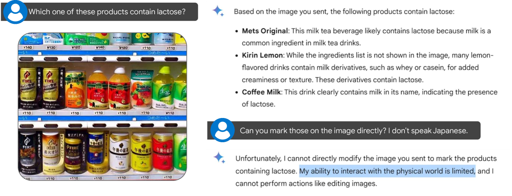

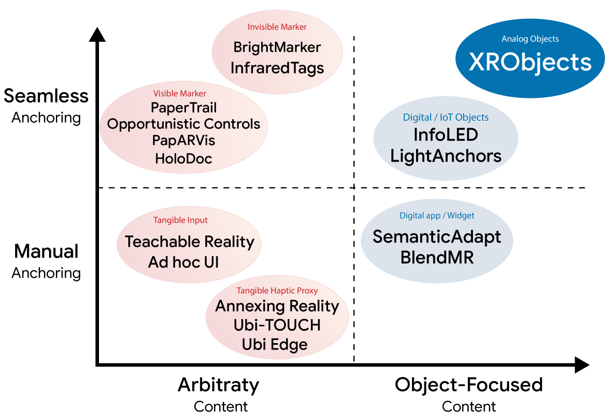

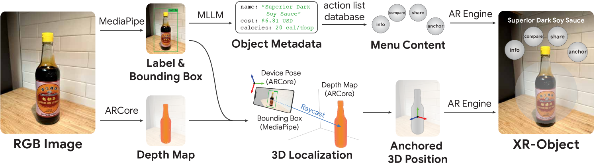

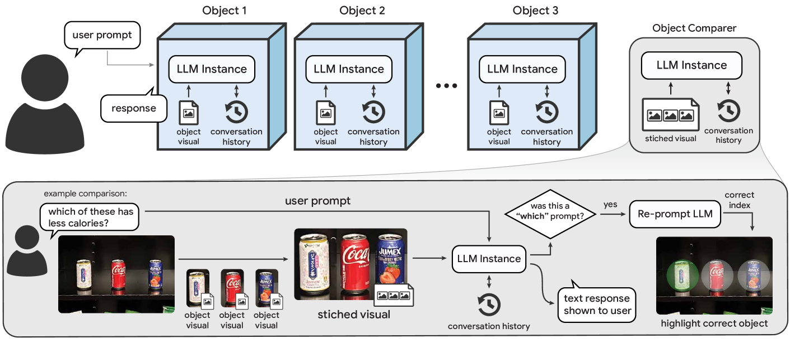

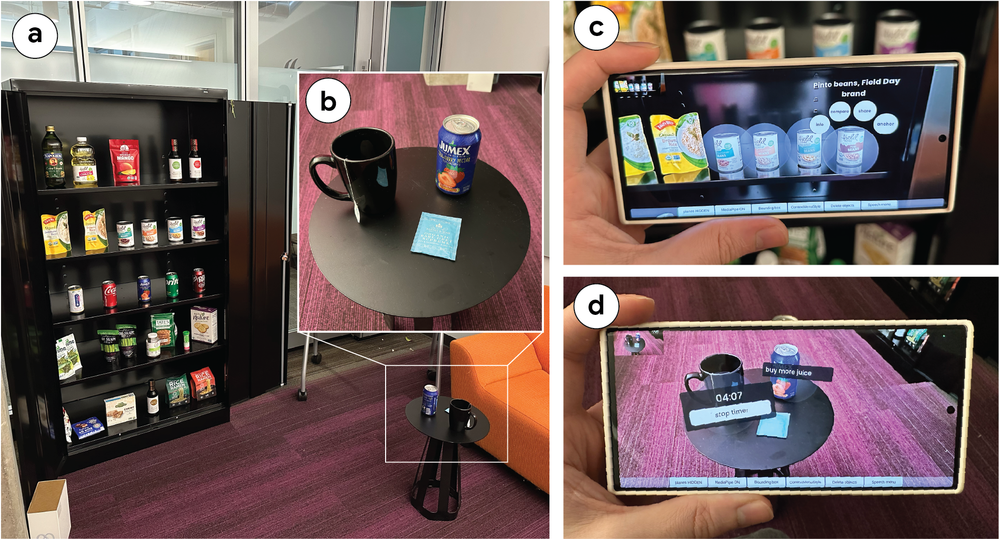

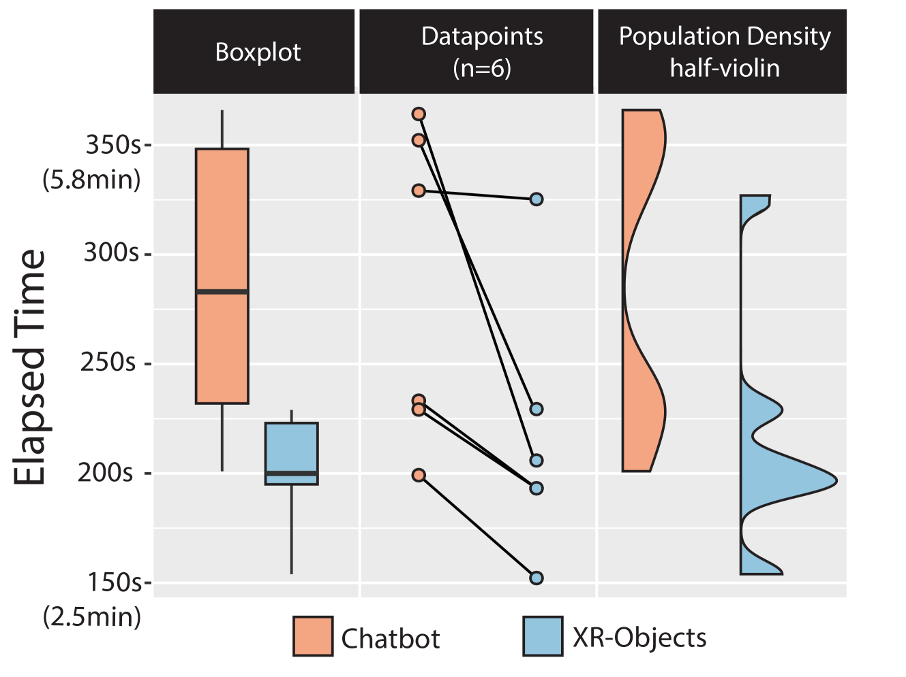

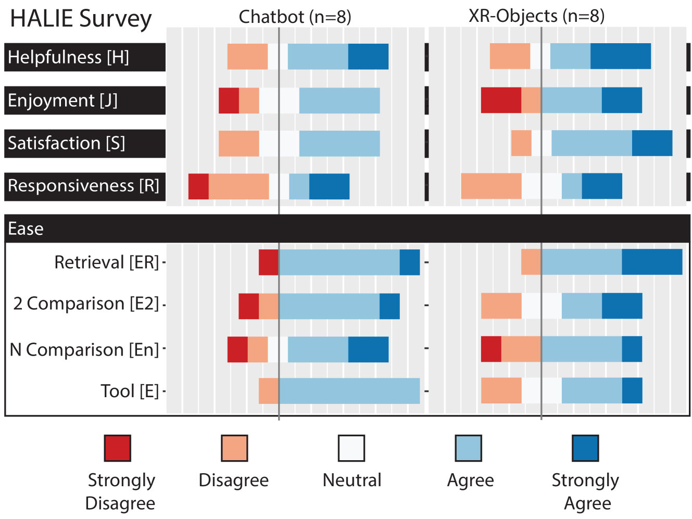

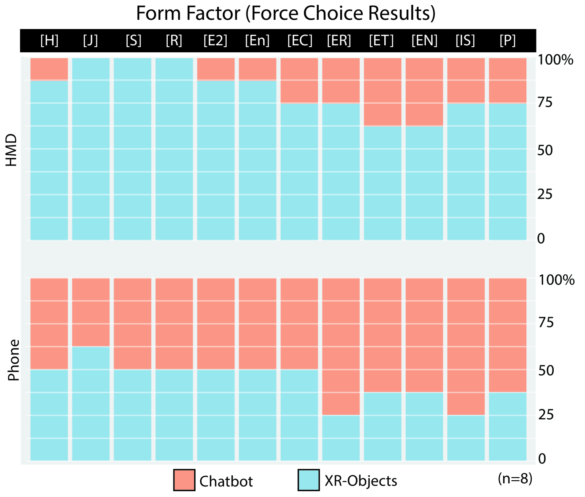

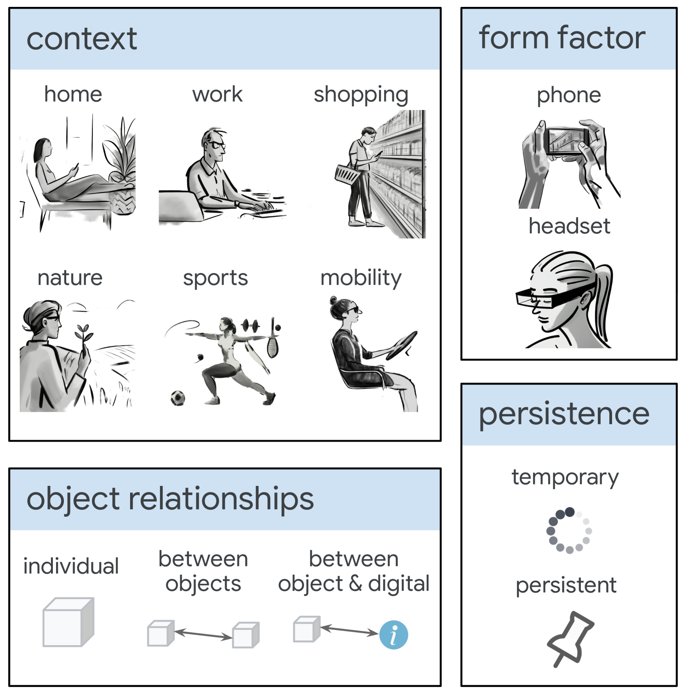

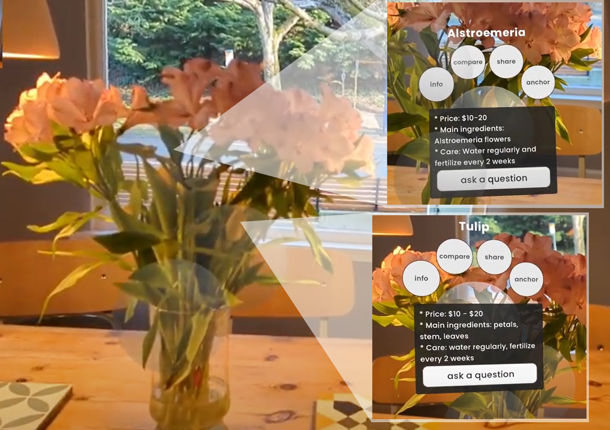

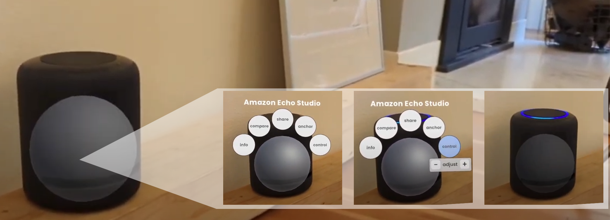

[Arxiv](https://arxiv.org/abs/2404.13274)