# AutoAD III：前传 —— 重返像素世界

发布时间：2024年04月22日

`分类：LLM应用` `电影制作` `人工智能`

> AutoAD III: The Prequel -- Back to the Pixels

# 摘要

> 为电影创作音频描述（AD）是一项考验，它不仅需要对细节丰富的视觉信息有深刻理解，还需对角色及其姓名有所了解。当前，AD生成的视觉语言模型因缺乏合适的训练数据而受限，其评估也因采用的绩效指标并不专门针对AD领域而变得复杂。本文提出了三项创新：首先，我们设计了两种方法来构建与视频数据同步的AD数据集，并据此建立了训练和评估用的数据库，这些数据库将向公众开放；其次，我们构建了一种基于Q-former的架构，它能够处理原始视频并生成AD，同时利用了预训练的视觉编码器和大型语言模型；最后，我们引入了新的评估标准，用以衡量AD的质量，这些标准与人类的评估表现高度一致。综合这些贡献，我们在AD生成技术的研究上取得了突破性进展。

> Generating Audio Description (AD) for movies is a challenging task that requires fine-grained visual understanding and an awareness of the characters and their names. Currently, visual language models for AD generation are limited by a lack of suitable training data, and also their evaluation is hampered by using performance measures not specialized to the AD domain. In this paper, we make three contributions: (i) We propose two approaches for constructing AD datasets with aligned video data, and build training and evaluation datasets using these. These datasets will be publicly released; (ii) We develop a Q-former-based architecture which ingests raw video and generates AD, using frozen pre-trained visual encoders and large language models; and (iii) We provide new evaluation metrics to benchmark AD quality that are well-matched to human performance. Taken together, we improve the state of the art on AD generation.

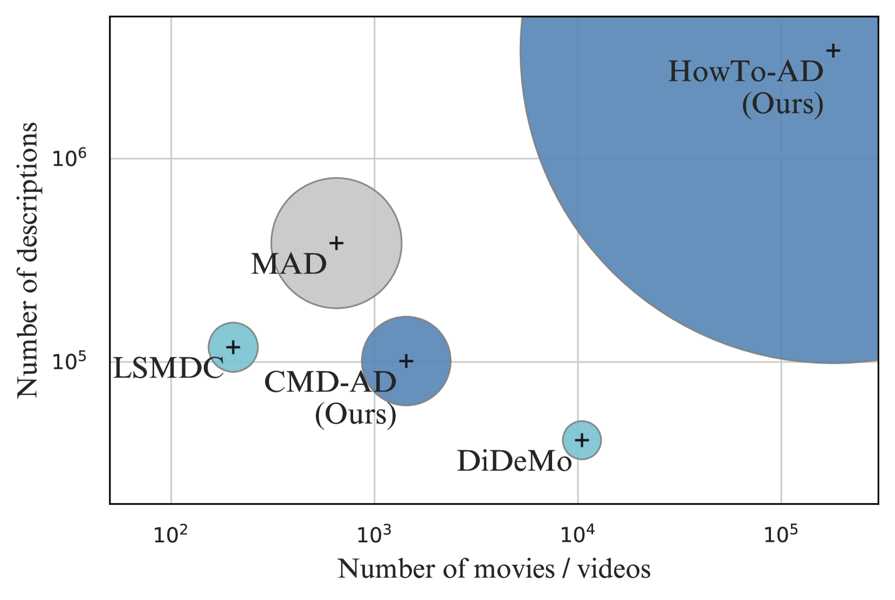

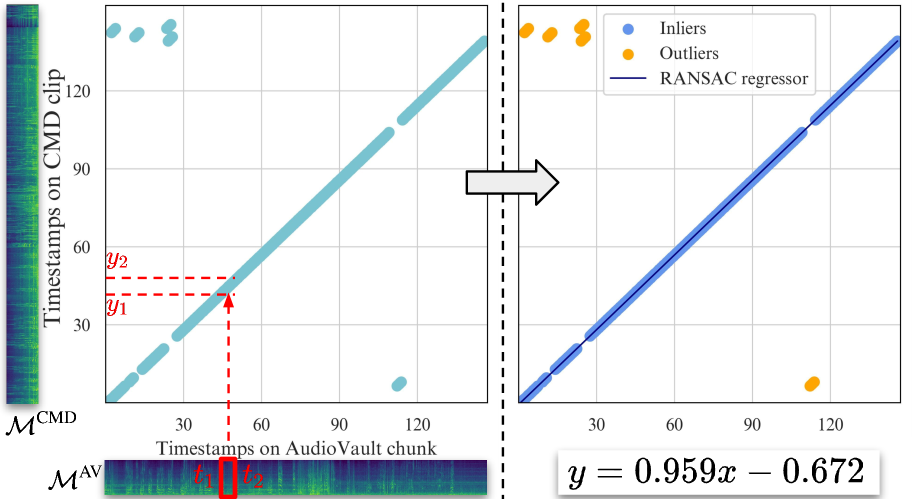

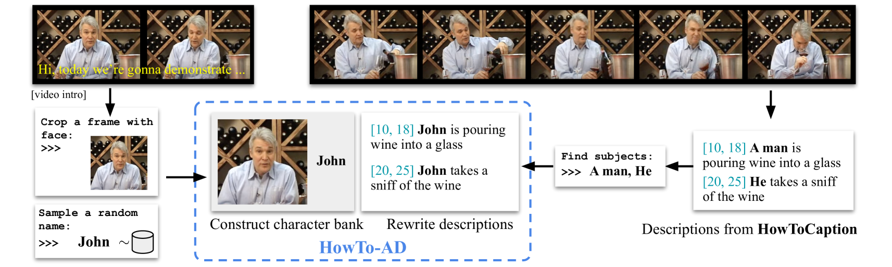

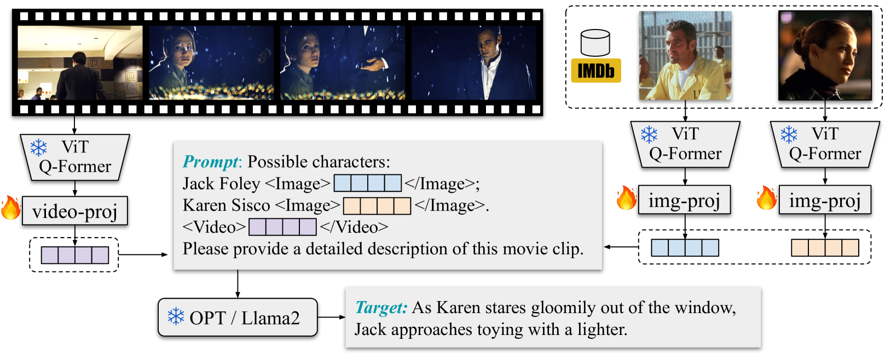

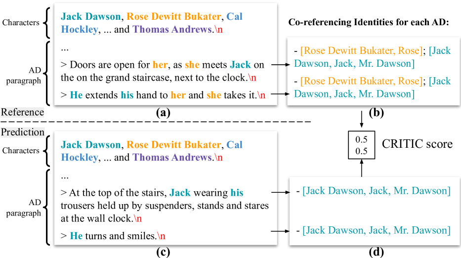

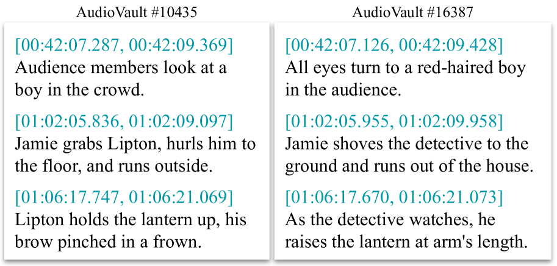

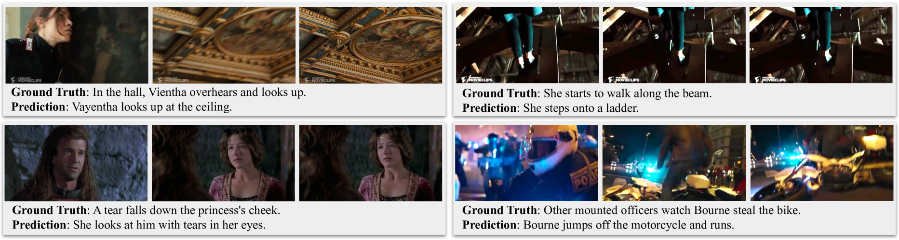

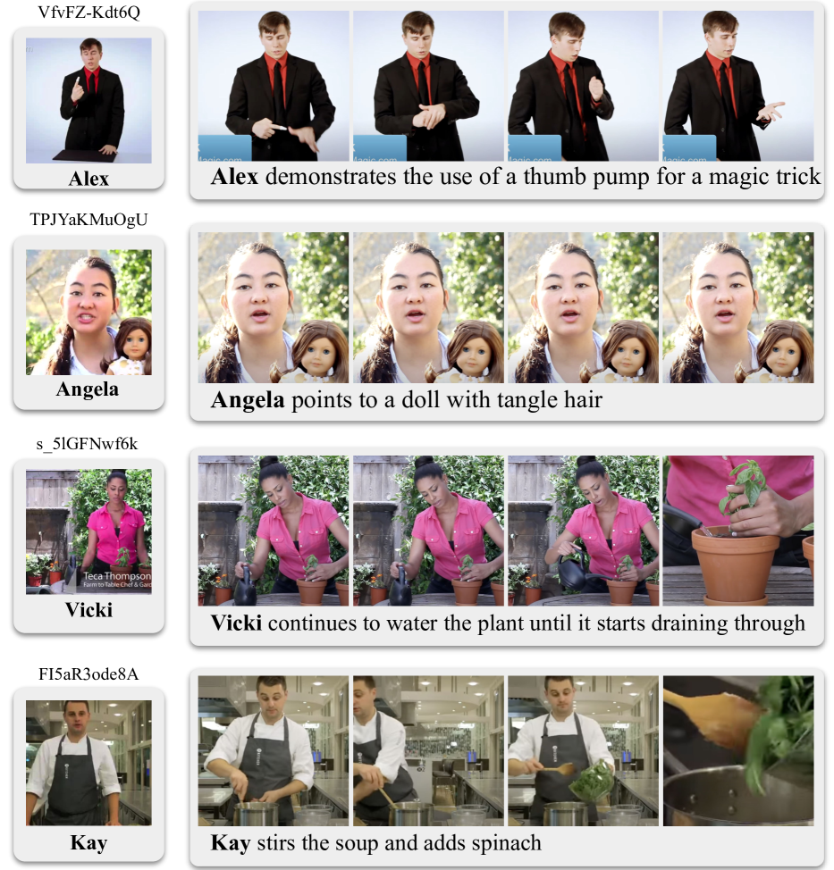

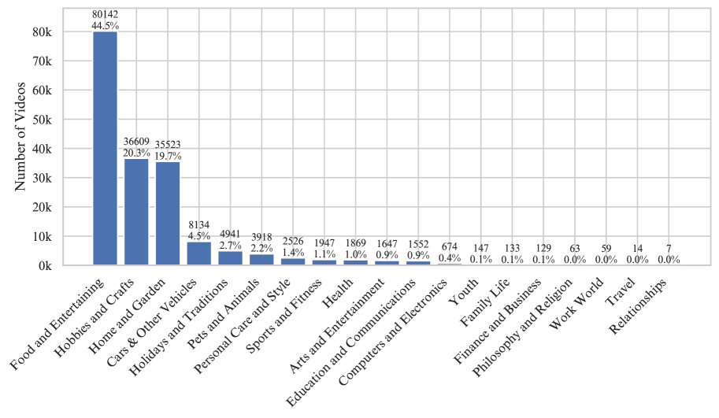

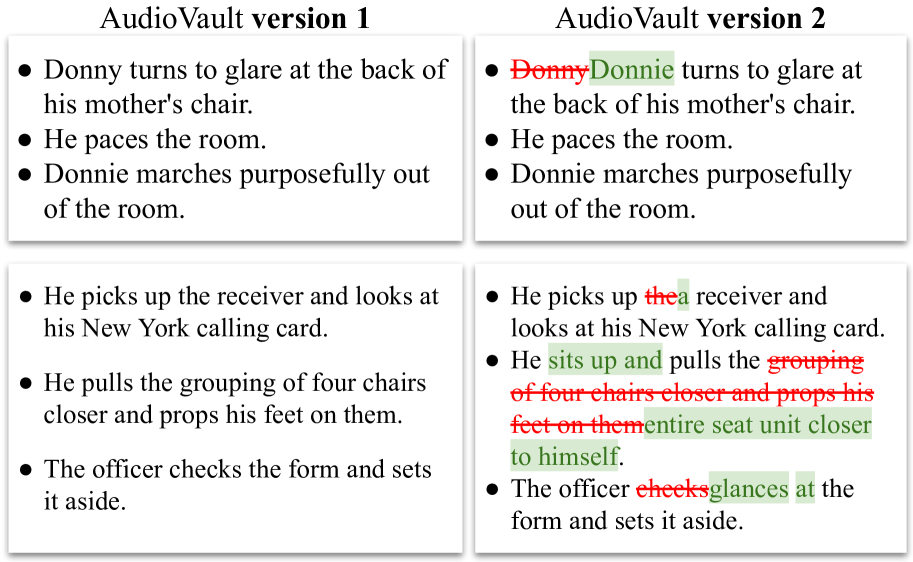

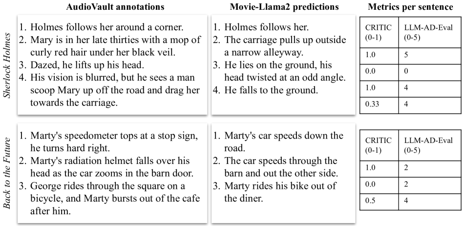

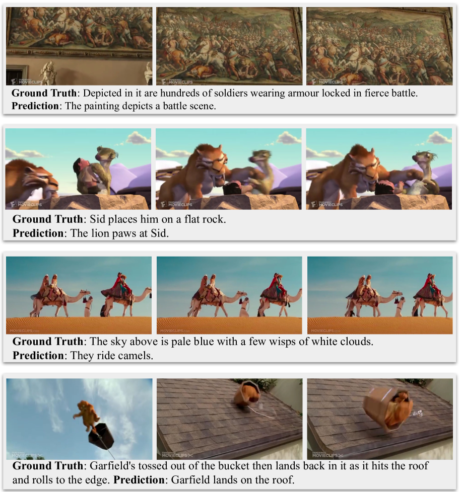

[Arxiv](https://arxiv.org/abs/2404.14412)