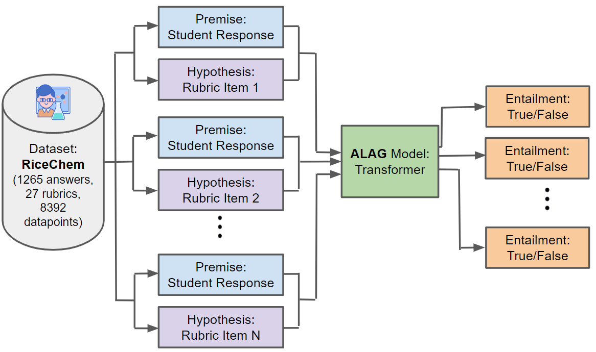
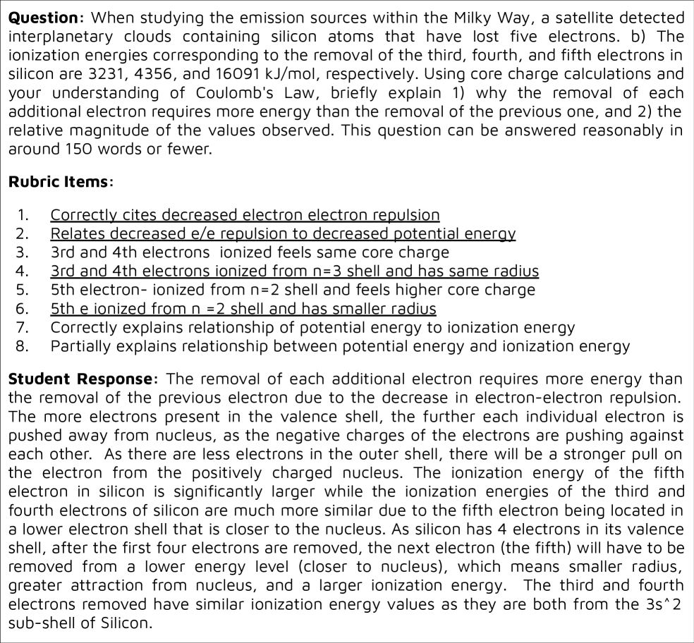
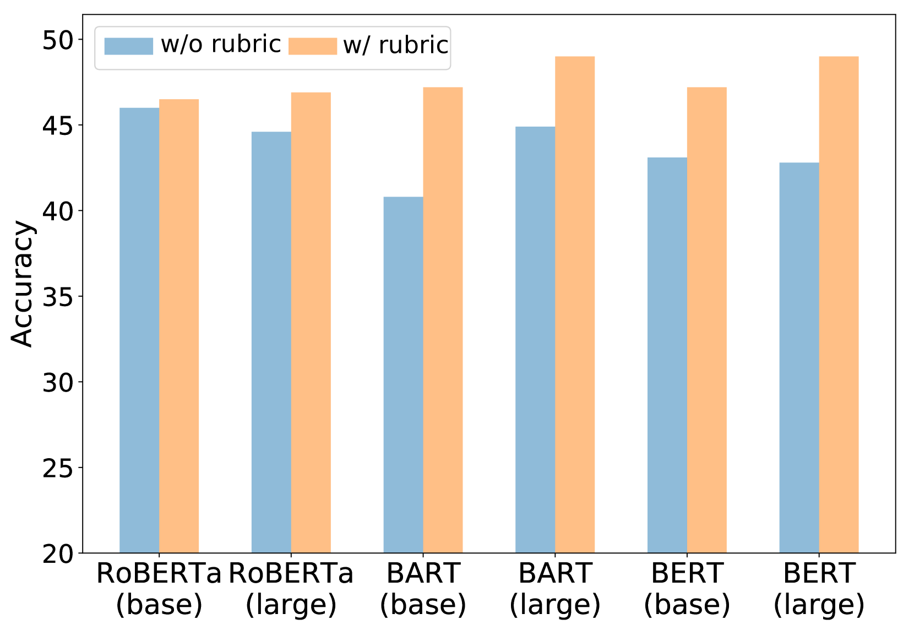
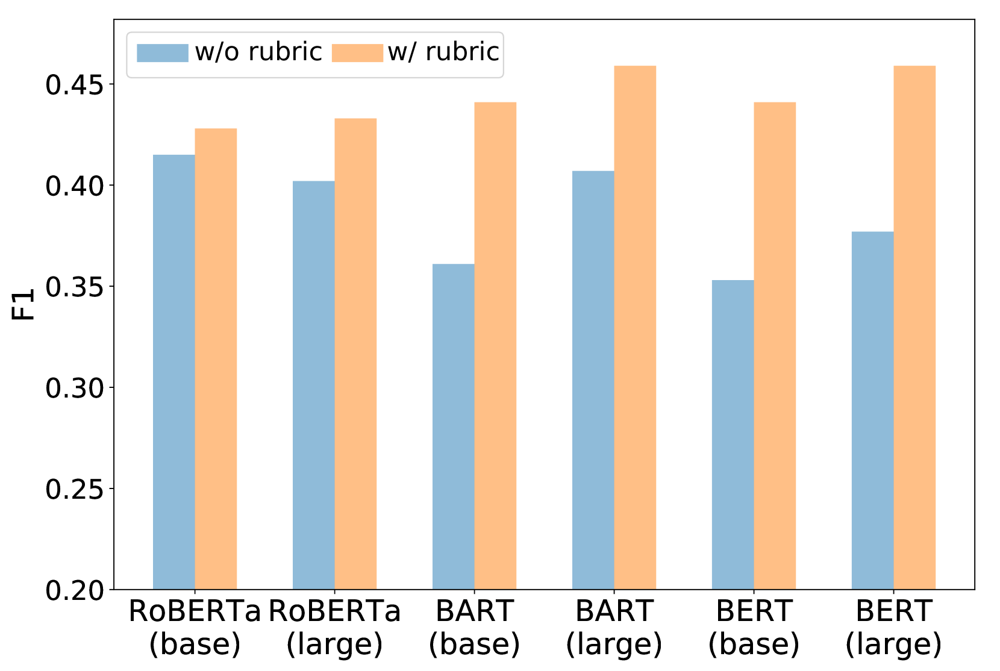
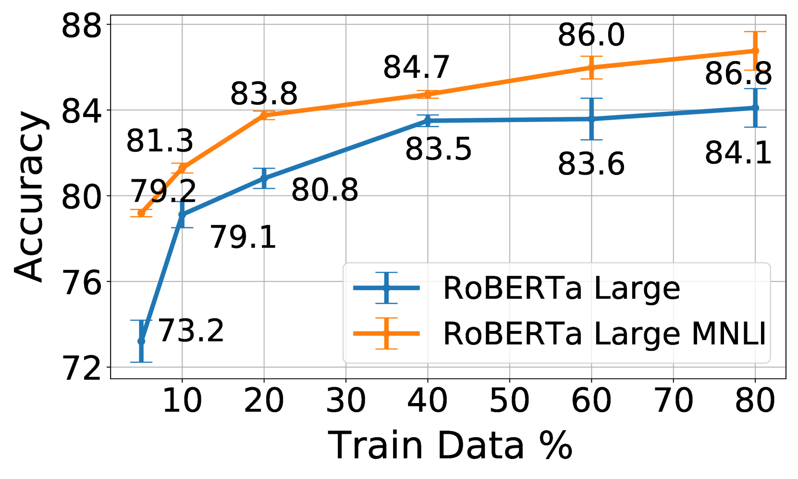
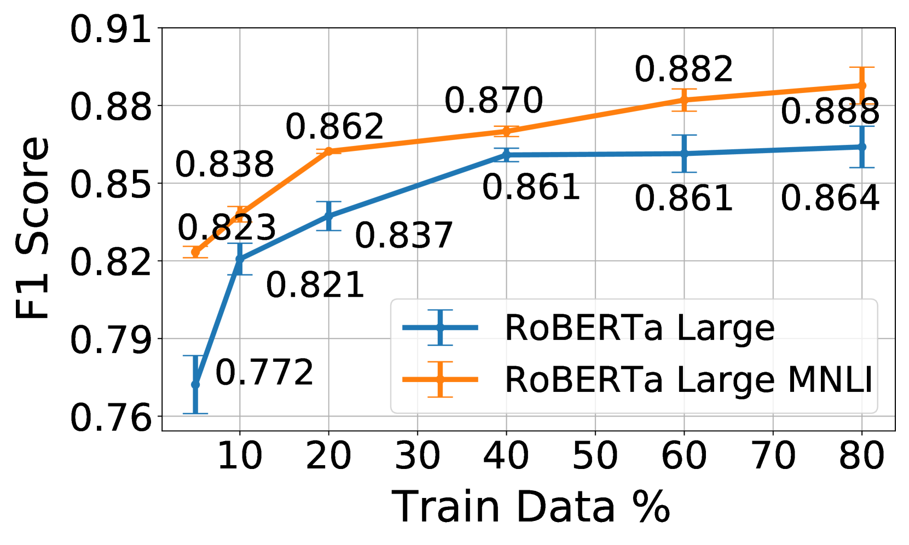

# 利用 RiceChem 数据集实现长答案的自动评分系统。

发布时间：2024年04月22日

`LLM应用`

> Automated Long Answer Grading with RiceChem Dataset

# 摘要

> 我们开拓了教育领域自然语言处理的新研究领域——自动化长答案评分（ALAG）。相较于自动化短答案评分（ASAG）和自动化论文评分（AEG），ALAG面临的挑战更为独特，这源于长答案基于事实的复杂和多维度特性。为此，我们创建了RiceChem数据集，它源自大学化学课程，包含了学生对长答题的真实回答，这些回答的字数远超一般ASAG数据集。我们采用了一种创新的方法来处理ALAG，将其视为评分标准蕴含问题，并通过自然语言推理模型来检验学生回答是否满足评分标准的各项要求。这种方法有效利用了MNLI进行迁移学习，显著提升了模型在RiceChem数据集上的表现。我们证明了基于评分标准的ALAG表述的重要性，它在捕捉学生回答的细节上超越了传统的基于分数的方法。我们还探讨了模型在冷启动情境下的表现，为教育场景中的实际应用提供了深刻见解。此外，我们对当前最先进的开源大型语言模型（LLMs）在RiceChem上的表现进行了评估，并与GPT模型的结果进行了比较，从而突显了ALAG相较于ASAG的更高复杂性。尽管采用了基于评分标准的方法和MNLI的迁移学习，LLMs在RiceChem上的表现仍然不尽人意，这反映了ALAG任务的高难度。本研究不仅为我们如何评分长篇、基于事实的答案提供了新的视角，还引入了一个新的数据集，旨在推动这一重要领域的进一步研究。代码链接：\url{https://github.com/luffycodes/Automated-Long-Answer-Grading}。

> We introduce a new area of study in the field of educational Natural Language Processing: Automated Long Answer Grading (ALAG). Distinguishing itself from Automated Short Answer Grading (ASAG) and Automated Essay Grading (AEG), ALAG presents unique challenges due to the complexity and multifaceted nature of fact-based long answers. To study ALAG, we introduce RiceChem, a dataset derived from a college chemistry course, featuring real student responses to long-answer questions with an average word count notably higher than typical ASAG datasets. We propose a novel approach to ALAG by formulating it as a rubric entailment problem, employing natural language inference models to verify whether each criterion, represented by a rubric item, is addressed in the student's response. This formulation enables the effective use of MNLI for transfer learning, significantly improving the performance of models on the RiceChem dataset. We demonstrate the importance of rubric-based formulation in ALAG, showcasing its superiority over traditional score-based approaches in capturing the nuances of student responses. We also investigate the performance of models in cold start scenarios, providing valuable insights into the practical deployment considerations in educational settings. Lastly, we benchmark state-of-the-art open-sourced Large Language Models (LLMs) on RiceChem and compare their results to GPT models, highlighting the increased complexity of ALAG compared to ASAG. Despite leveraging the benefits of a rubric-based approach and transfer learning from MNLI, the lower performance of LLMs on RiceChem underscores the significant difficulty posed by the ALAG task. With this work, we offer a fresh perspective on grading long, fact-based answers and introduce a new dataset to stimulate further research in this important area. Code: \url{https://github.com/luffycodes/Automated-Long-Answer-Grading}.

[Arxiv](https://arxiv.org/abs/2404.14316)