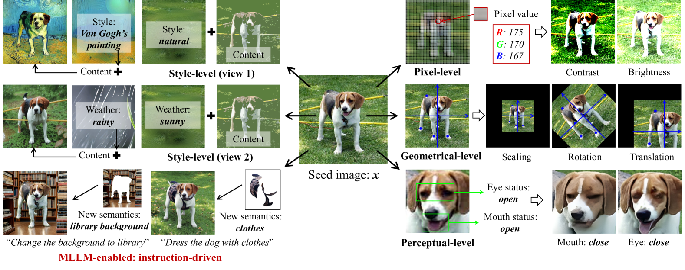
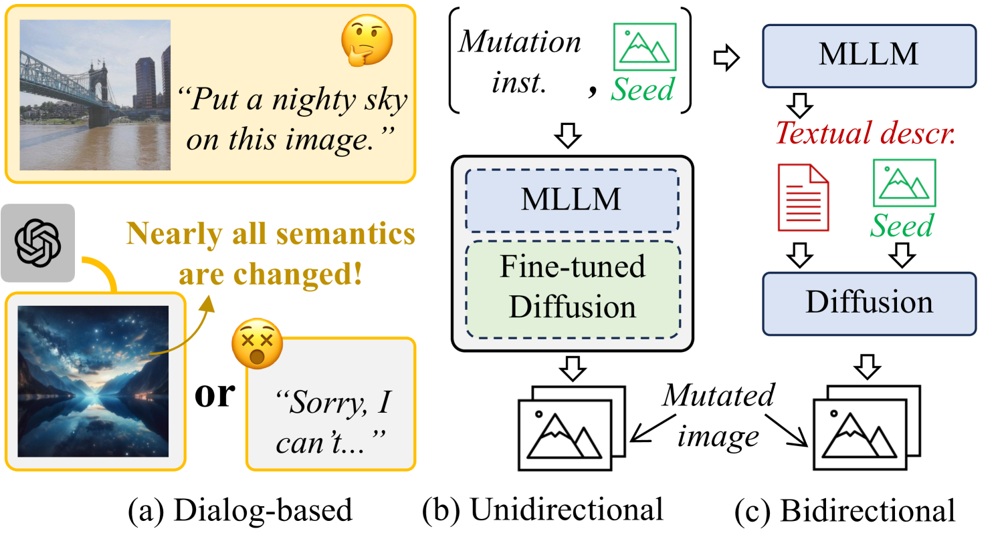

# 本文旨在通过图像变异的视角，对多模态大型语言模型（LLMs）进行基准测试，以评估视觉深度学习系统的性能。

发布时间：2024年04月22日

`LLM应用` `图像识别` `自动驾驶`

> Benchmarking Multi-Modal LLMs for Testing Visual Deep Learning Systems Through the Lens of Image Mutation

# 摘要

> 视觉深度学习（VDL）在图像识别、目标检测和自动驾驶等实际应用中取得了显著成果。软件测试是评估VDL可靠性的主流方法，它需要对图像语义进行多样化和可控的变异。随着多模态大型语言模型（MLLMs）的快速发展，通过指令驱动的方法实现了图像变异的新可能性。用户可以自由描述所需的图像变化，由MLLMs生成相应的变异图像。但在VDL测试中，MLLM生成的测试输入的质量尚未得到充分研究。本研究首次旨在从四个方面评估MLLMs的适用性：1）变异图像的语义有效性；2）变异图像与文本指令的一致性；3）不同变异在保持应保持不变的语义方面的忠实度；4）检测VDL缺陷的有效性。通过广泛的人类研究和定量评估，我们发现了MLLM在扩展图像变异语义覆盖范围方面的潜力。特别是，尽管最先进的MLLMs（如GPT-4V）在编辑图像中现有语义（例如旋转）方面存在不足，但它们能够通过“语义附加”变异（如“给狗穿上衣服”）生成高质量的测试输入，这为图像引入了新的语义，是传统方法所无法实现的。因此，我们认为基于MLLM的变异是传统变异的重要补充，并建议未来的VDL测试任务应结合基于MLLM的方法和传统图像变异，以实现全面和可靠的测试。

> Visual deep learning (VDL) systems have shown significant success in real-world applications like image recognition, object detection, and autonomous driving. To evaluate the reliability of VDL, a mainstream approach is software testing, which requires diverse and controllable mutations over image semantics. The rapid development of multi-modal large language models (MLLMs) has introduced revolutionary image mutation potentials through instruction-driven methods. Users can now freely describe desired mutations and let MLLMs generate the mutated images.
  However, the quality of MLLM-produced test inputs in VDL testing remains largely unexplored. We present the first study, aiming to assess MLLMs' adequacy from 1) the semantic validity of MLLM mutated images, 2) the alignment of MLLM mutated images with their text instructions (prompts), 3) the faithfulness of how different mutations preserve semantics that are ought to remain unchanged, and 4) the effectiveness of detecting VDL faults. With large-scale human studies and quantitative evaluations, we identify MLLM's promising potentials in expanding the covered semantics of image mutations. Notably, while SoTA MLLMs (e.g., GPT-4V) fail to support or perform worse in editing existing semantics in images (as in traditional mutations like rotation), they generate high-quality test inputs using "semantic-additive" mutations (e.g., "dress a dog with clothes"), which bring extra semantics to images; these were infeasible for past approaches. Hence, we view MLLM-based mutations as a vital complement to traditional mutations, and advocate future VDL testing tasks to combine MLLM-based methods and traditional image mutations for comprehensive and reliable testing.

[Arxiv](https://arxiv.org/abs/2404.13945)