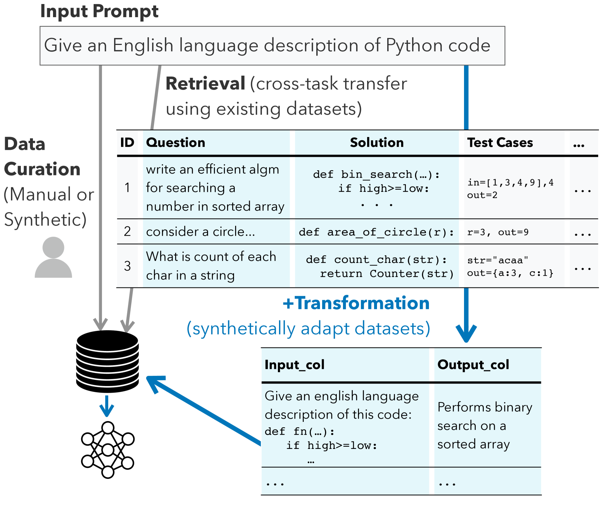
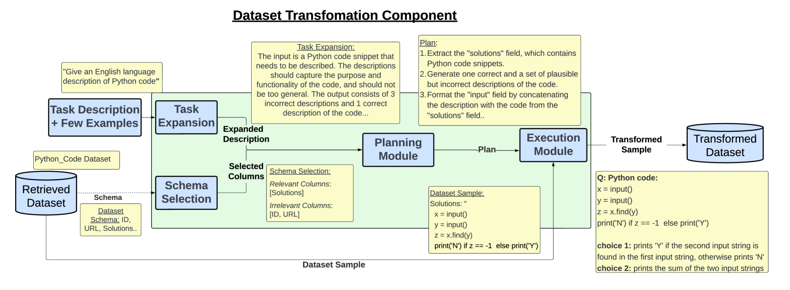
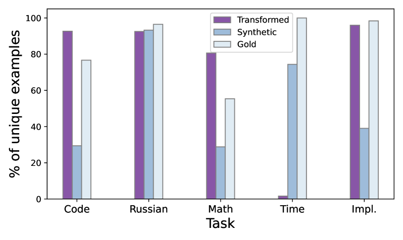
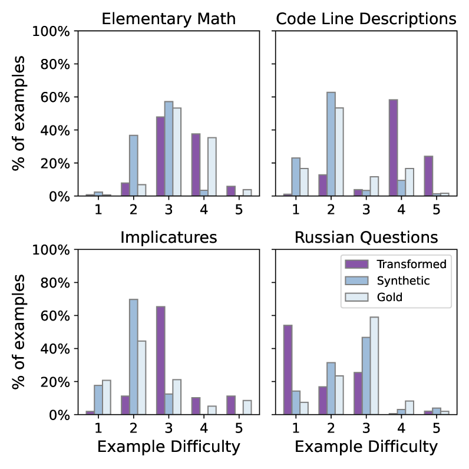
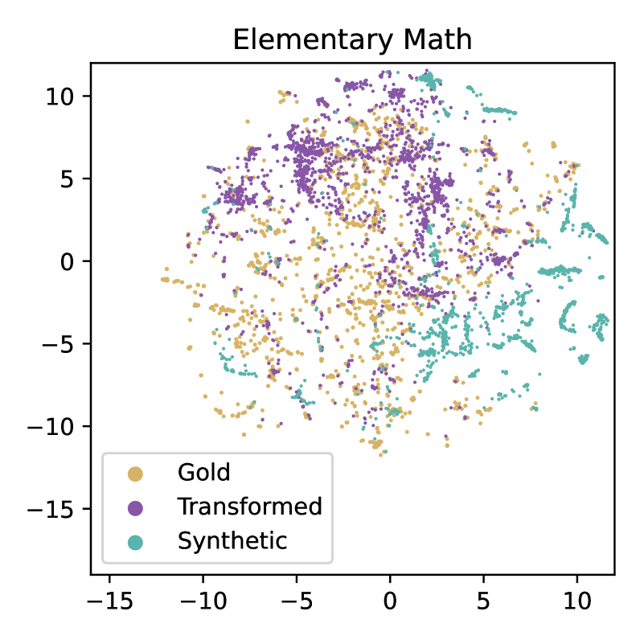

# 通过检索并转换现有数据集，我们能够生成更优质的合成数据。

发布时间：2024年04月22日

`LLM应用` `数据生成`

> Better Synthetic Data by Retrieving and Transforming Existing Datasets

# 摘要

> 尽管大型语言模型取得了新进展，但要构建稳定且可部署的NLP模型，通常还是需要大量优质训练数据。对于许多应用场景，缺乏特定任务的数据，而手动整理这些数据又非常耗时。近期研究尝试利用大型语言模型进行提示驱动的合成数据生成，但所生成的数据集往往复杂度和多样性不足。为了克服这些挑战，我们提出了一种名为\textit{DataTune}的新方法，它能够更有效地利用现有的公开数据集，以提升自动数据集生成的质量。DataTune通过数据集转换技术，使得公开数据集能够被重新利用，并且与目标任务的需求精确对接。在BIG-Bench基准测试的多种语言任务上，我们发现使用DataTune进行的模型微调，在性能上比传统的几次提示基线提升了49%，同时也比现有使用合成或检索训练数据的方法提高了34%。我们还发现，数据集转换显著提升了生成数据在多项任务上的多样性和挑战性。为了便于社区使用，我们将DataTune集成到了一个开源仓库中，地址为：https://github.com/neulab/prompt2model。

> Despite recent advances in large language models, building dependable and deployable NLP models typically requires abundant, high-quality training data. However, task-specific data is not available for many use cases, and manually curating task-specific data is labor-intensive. Recent work has studied prompt-driven synthetic data generation using large language models, but these generated datasets tend to lack complexity and diversity. To address these limitations, we introduce a method, \textit{DataTune}, to make better use of existing, publicly available datasets to improve automatic dataset generation. DataTune performs dataset transformation, enabling the repurposing of publicly available datasets into a format that is directly aligned with the specific requirements of target tasks. On a diverse set of language-based tasks from the BIG-Bench benchmark, we find that finetuning language models via DataTune improves over a few-shot prompting baseline by 49\% and improves over existing methods that use synthetic or retrieved training data by 34\%. We find that dataset transformation significantly increases the diversity and difficulty of generated data on many tasks. We integrate DataTune into an open-source repository to make this method accessible to the community: https://github.com/neulab/prompt2model.

[Arxiv](https://arxiv.org/abs/2404.14361)