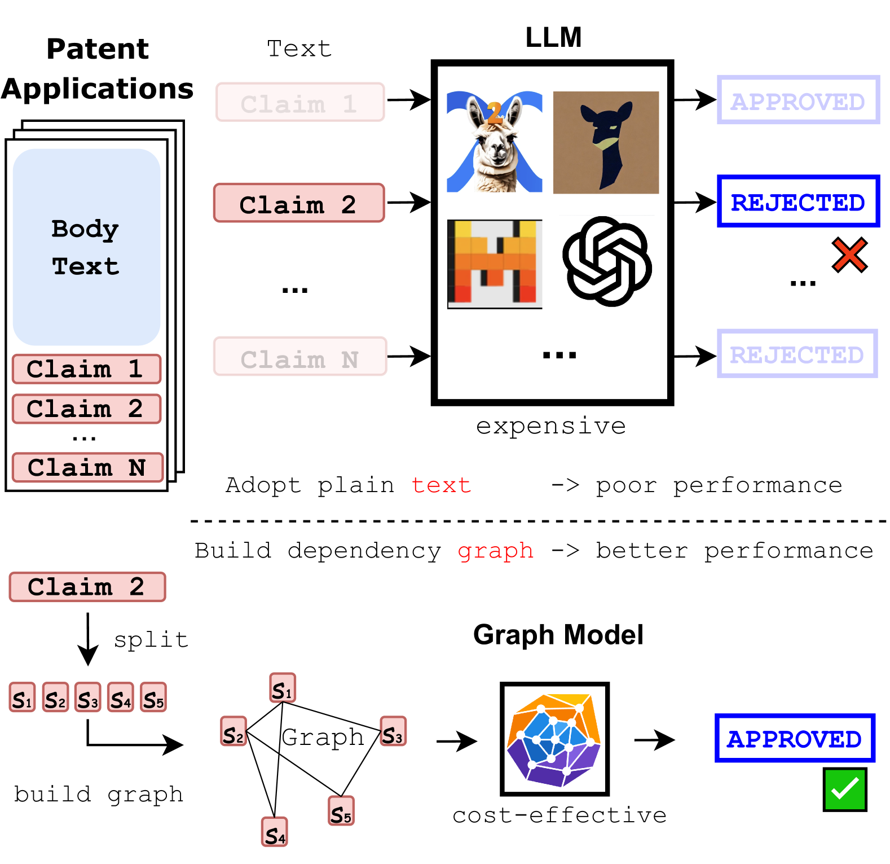
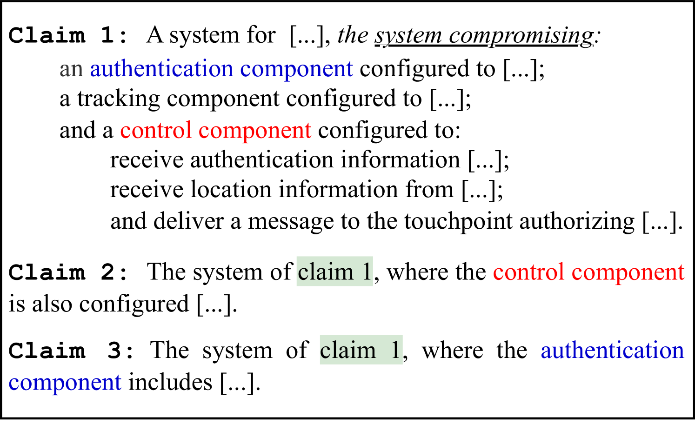
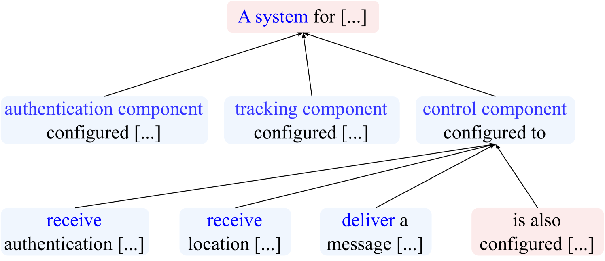
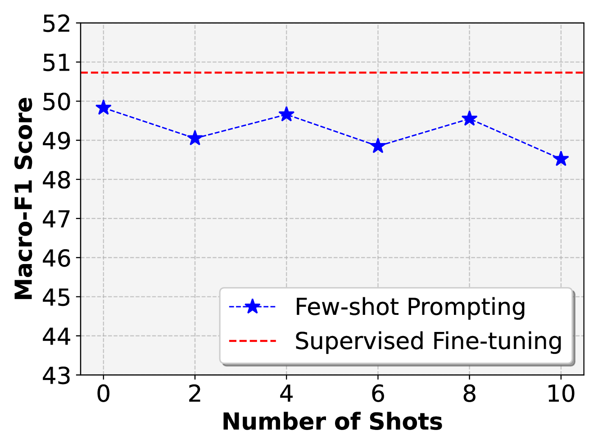
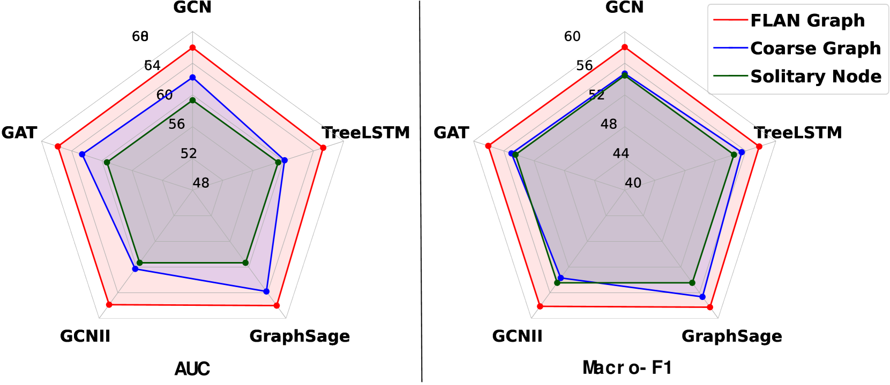
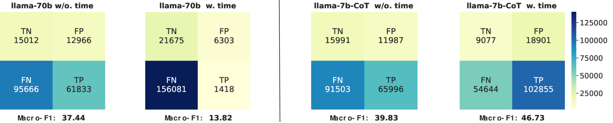
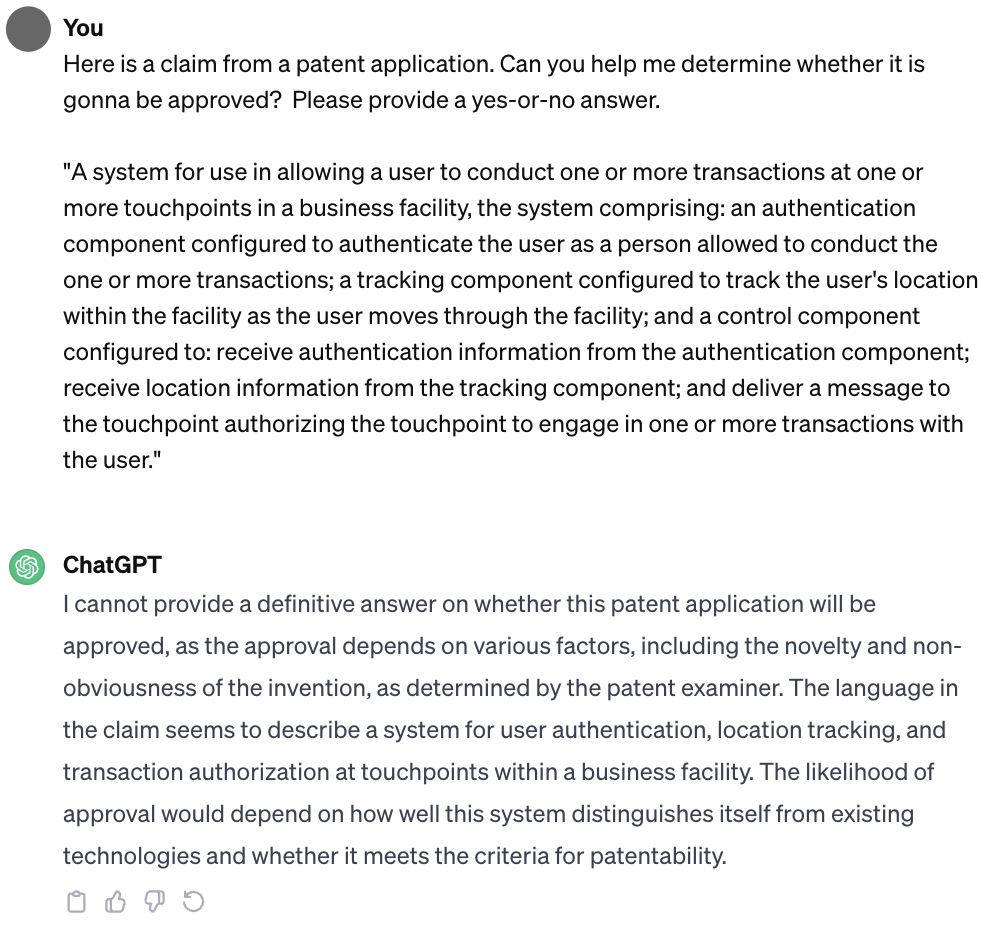
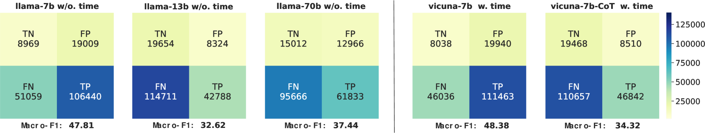
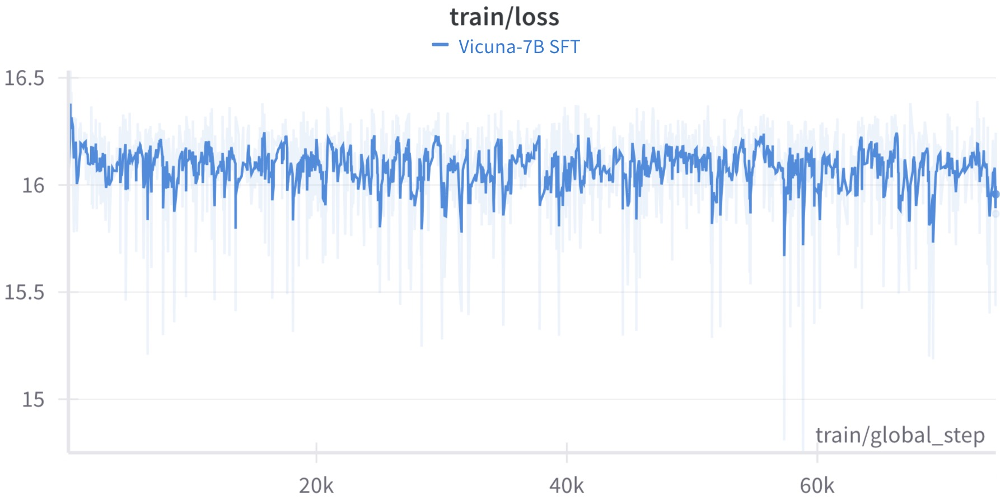

# 超越规模限制：利用特定领域的精细索赔依赖图来预测专利审批结果

发布时间：2024年04月22日

`LLM应用` `专利审批`

> Beyond Scaling: Predicting Patent Approval with Domain-specific Fine-grained Claim Dependency Graph

# 摘要

> 模型扩展因其在多种语言任务中的卓越表现而成为首选，尤其是在大型语言模型（LLMs）取得成功后。但在某些特定情境下，定制化的方法可能更具优势。本文聚焦于专利审批预测任务，发现基于领域特定图形的方法在利用专利数据内在关联性方面，比单纯扩大模型规模更为有效。我们首先通过扩展开源的大型语言模型（LLMs）的主干，提升了基于嵌入的最先进（SOTA）技术，接着尝试了基于提示的方法来激发专有LLMs的潜力，却发现其效果并不理想，最佳结果仅接近随机猜测，凸显了模型简单扩展的局限性。因此，我们经过深入分析专利数据，提出了一种新颖的细粒度声明依赖（FLAN）图形模型，它能够捕捉专利文本各段落间的内在联系。FLAN图形模型不依赖于特定模型，我们采用了高效的图形模型来获取审批预测的表示。广泛的实验和深入的分析证实，整合FLAN图形的方法在各种图形模型中均显著超越了所有LLM基线。我们期望本文的研究能激发对这一挑战性任务的更多关注，并推动对LLMs局限性的进一步探讨。相关源代码和数据集可通过 http://github.com/ShangDataLab/FLAN-Graph 获取。

> Model scaling is becoming the default choice for many language tasks due to the success of large language models (LLMs). However, it can fall short in specific scenarios where simple customized methods excel. In this paper, we delve into the patent approval pre-diction task and unveil that simple domain-specific graph methods outperform enlarging the model, using the intrinsic dependencies within the patent data. Specifically, we first extend the embedding-based state-of-the-art (SOTA) by scaling up its backbone model with various sizes of open-source LLMs, then explore prompt-based methods to harness proprietary LLMs' potential, but find the best results close to random guessing, underlining the ineffectiveness of model scaling-up. Hence, we propose a novel Fine-grained cLAim depeNdency (FLAN) Graph through meticulous patent data analyses, capturing the inherent dependencies across segments of the patent text. As it is model-agnostic, we apply cost-effective graph models to our FLAN Graph to obtain representations for approval prediction. Extensive experiments and detailed analyses prove that incorporating FLAN Graph via various graph models consistently outperforms all LLM baselines significantly. We hope that our observations and analyses in this paper can bring more attention to this challenging task and prompt further research into the limitations of LLMs. Our source code and dataset can be obtained from http://github.com/ShangDataLab/FLAN-Graph.

[Arxiv](https://arxiv.org/abs/2404.14372)