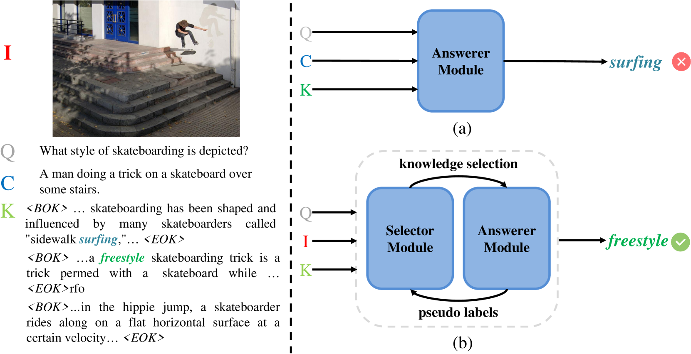
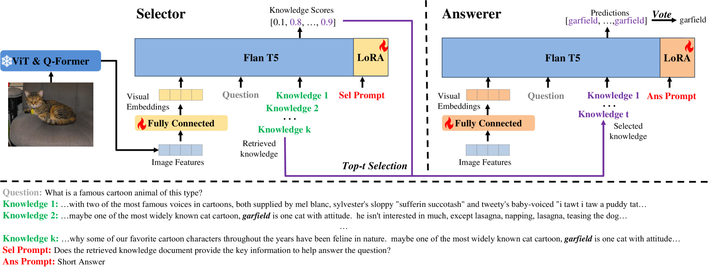
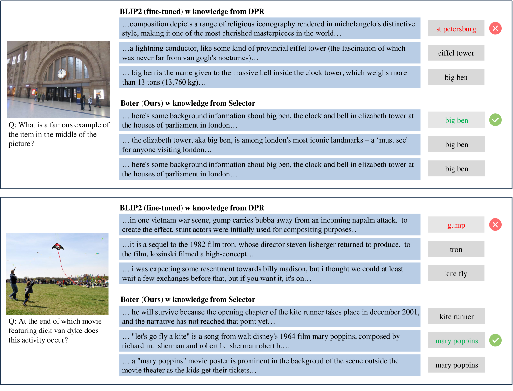

# Boter：一种引导式的知识选择与问答方法，专为基于知识的 VQA（视觉问答）设计。

发布时间：2024年04月22日

`分类：LLM应用

这篇论文讨论了一个知识驱动的视觉问答（VQA）框架，该框架利用多模态大型语言模型（MLLM）来优化知识选择和问答过程。它提出了一个包含选择器和回答器的框架，两者都由MLLM初始化，并在循环中进行微调。这篇论文的重点在于应用大型语言模型来解决特定的视觉问答任务，因此它属于LLM应用类别。` `视觉问答` `知识驱动系统`

> Boter: Bootstrapping Knowledge Selection and Question Answering for Knowledge-based VQA

# 摘要

> 知识驱动的视觉问答（VQA）要求模型整合外部知识以回答视觉内容的问题。传统“检索-生成”范式的方法虽表现出色，但存在不足：一是仅基于查询与知识嵌入的相似性独立检索知识，忽略了知识文档对问题解答的实际帮助；二是将图像信息转换为文本后进行检索和回答，可能导致图像信息的不完全获取。为克服这些限制，我们设计了Boter框架，它通过多模态大型语言模型（MLLM）的多模态感知能力，优化了知识选择和问答过程。框架包含两个模块：选择器和回答器，均由MLLM初始化，并在简洁循环中高效微调。首先，使用选择器从检索到的知识文档中筛选关键信息，再微调回答器预测答案；其次，基于回答器的预测和弱监督标签生成关键知识文档的伪标签，微调选择器以筛选关键知识；如此循环。该框架在开放领域的OK-VQA基准测试中显著提升性能，达到了62.83%的先进准确率。

> Knowledge-based Visual Question Answering (VQA) requires models to incorporate external knowledge to respond to questions about visual content. Previous methods mostly follow the "retrieve and generate" paradigm. Initially, they utilize a pre-trained retriever to fetch relevant knowledge documents, subsequently employing them to generate answers. While these methods have demonstrated commendable performance in the task, they possess limitations: (1) they employ an independent retriever to acquire knowledge solely based on the similarity between the query and knowledge embeddings, without assessing whether the knowledge document is truly conducive to helping answer the question; (2) they convert the image into text and then conduct retrieval and answering in natural language space, which may not ensure comprehensive acquisition of all image information. To address these limitations, we propose Boter, a novel framework designed to bootstrap knowledge selection and question answering by leveraging the robust multimodal perception capabilities of the Multimodal Large Language Model (MLLM). The framework consists of two modules: Selector and Answerer, where both are initialized by the MLLM and parameter-efficiently finetuned in a simple cycle: find key knowledge in the retrieved knowledge documents using the Selector, and then use them to finetune the Answerer to predict answers; obtain the pseudo-labels of key knowledge documents based on the predictions of the Answerer and weak supervision labels, and then finetune the Selector to select key knowledge; repeat. Our framework significantly enhances the performance of the baseline on the challenging open-domain Knowledge-based VQA benchmark, OK-VQA, achieving a state-of-the-art accuracy of 62.83%.

[Arxiv](https://arxiv.org/abs/2404.13947)