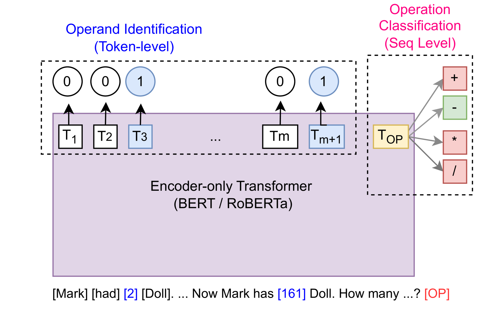
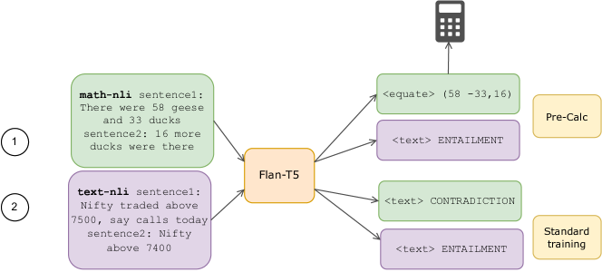
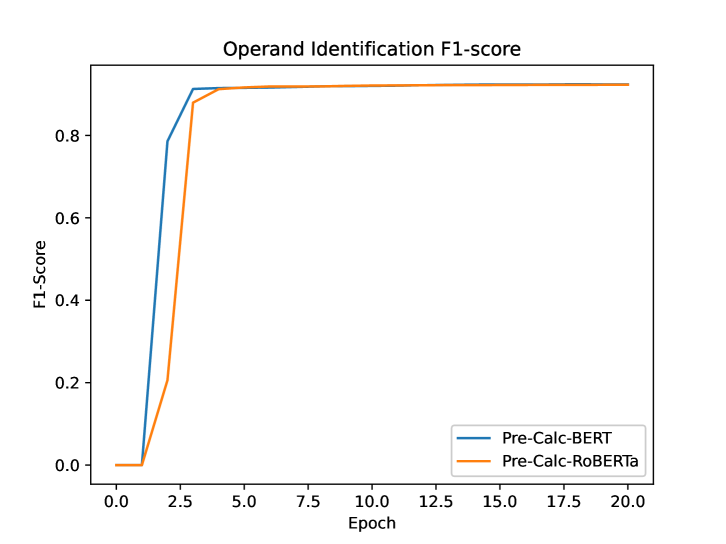
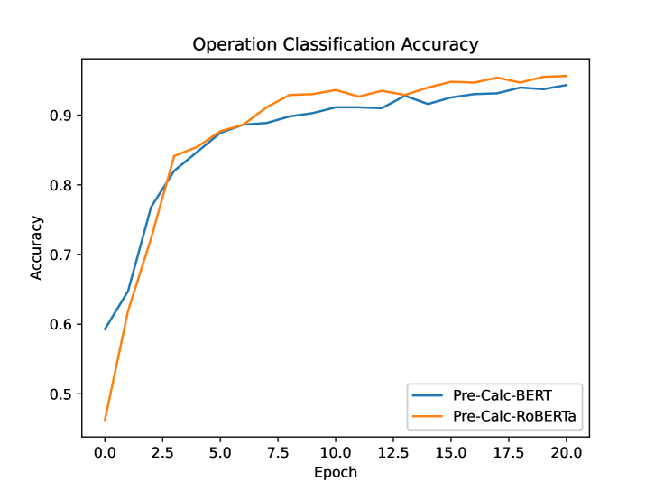

# 在 SemEval-2024 的任务 7 中，Calc-CMU 展示了其卓越性能：通过学习使用计算器，语言模型的数学素养得到了显著提升。

发布时间：2024年04月22日

`LLM应用`

> Calc-CMU at SemEval-2024 Task 7: Pre-Calc -- Learning to Use the Calculator Improves Numeracy in Language Models

# 摘要

> 掌握语言中的数量和数值理解对于教育、金融等诸多领域至关重要，但对语言模型而言，这仍是一个难题。尽管在大型预训练的解码器模型中，工具和计算器的运用已被证实能增强数学推理能力，但对于配备编码器的小型模型，这方面的研究尚属空白。本文提出了 Pre-Calc，一个简洁的预训练目标，旨在教会模型使用计算器，适用于仅有编码器和编码器-解码器结构的模型，并分别作为辨别性和生成性任务来设计。我们在 MAWPS、SVAMP 和 AsDiv-A 数据集上对 BERT、RoBERTa 进行了辨别性计算器使用的预训练，对 Flan-T5 进行了生成性计算器使用的预训练，从而提升了模型在需要数值理解的下游任务中的表现。相关代码和数据已在 https://github.com/calc-cmu/pre-calc 上公开。

> Quantitative and numerical comprehension in language is an important task in many fields like education and finance, but still remains a challenging task for language models. While tool and calculator usage has shown to be helpful to improve mathematical reasoning in large pretrained decoder-only language models, this remains unexplored for smaller language models with encoders. In this paper, we propose Pre-Calc, a simple pre-finetuning objective of learning to use the calculator for both encoder-only and encoder-decoder architectures, formulated as a discriminative and generative task respectively. We pre-train BERT and RoBERTa for discriminative calculator use and Flan-T5 for generative calculator use on the MAWPS, SVAMP, and AsDiv-A datasets, which improves performance on downstream tasks that require numerical understanding. Our code and data are available at https://github.com/calc-cmu/pre-calc.

[Arxiv](https://arxiv.org/abs/2404.14355)