# CoFInAl：利用由粗到细的指导对齐提升动作质量评估的精准度

发布时间：2024年04月22日

`分类：RAG

这篇论文提出了一种新颖的动作质量评估（AQA）方法，该方法受到大型语言模型调优技术的启发，通过从粗到细的指令对齐方法（CoFInAl）来提高AQA的性能。这种方法通过将AQA重新构建为分层分类任务，使其与更广泛的预训练任务相匹配，从而提高了评估的准确性和可解释性。因此，这篇论文可以归类为RAG（Retrieval-Augmented Generation），因为它涉及到使用预训练的大型语言模型来增强特定任务的性能。`

> CoFInAl: Enhancing Action Quality Assessment with Coarse-to-Fine Instruction Alignment

# 摘要

> 动作质量评估（AQA）在体育、医疗等领域的动作量化中扮演着关键角色。传统方法多依赖于大规模动作识别数据库预训练的骨干模型来提升小规模AQA数据集的性能，但这些方法因难以捕捉AQA所需的细微线索而效果不佳，且在小数据集上微调易导致过拟合。为此，我们提出了一种新颖的从粗到细的指令对齐方法（CoFInAl），灵感来源于大型语言模型的调优技术。CoFInAl通过将AQA重新构建为分层分类任务，使其与更广泛的预训练任务相匹配。该方法首先学习粗略评估的等级原型，再利用固定的子等级原型进行细致评估，模拟了实际评判流程，增强了AQA的可解释性。在两个长期AQA数据集上的实验结果显示，CoFInAl在艺术体操和Fis-V上分别实现了5.49%和3.55%的相关性提升，达到了业界领先水平。相关代码已在GitHub上公开，地址为 https://github.com/ZhouKanglei/CoFInAl_AQA。

> Action Quality Assessment (AQA) is pivotal for quantifying actions across domains like sports and medical care. Existing methods often rely on pre-trained backbones from large-scale action recognition datasets to boost performance on smaller AQA datasets. However, this common strategy yields suboptimal results due to the inherent struggle of these backbones to capture the subtle cues essential for AQA. Moreover, fine-tuning on smaller datasets risks overfitting. To address these issues, we propose Coarse-to-Fine Instruction Alignment (CoFInAl). Inspired by recent advances in large language model tuning, CoFInAl aligns AQA with broader pre-trained tasks by reformulating it as a coarse-to-fine classification task. Initially, it learns grade prototypes for coarse assessment and then utilizes fixed sub-grade prototypes for fine-grained assessment. This hierarchical approach mirrors the judging process, enhancing interpretability within the AQA framework. Experimental results on two long-term AQA datasets demonstrate CoFInAl achieves state-of-the-art performance with significant correlation gains of 5.49% and 3.55% on Rhythmic Gymnastics and Fis-V, respectively. Our code is available at https://github.com/ZhouKanglei/CoFInAl_AQA.

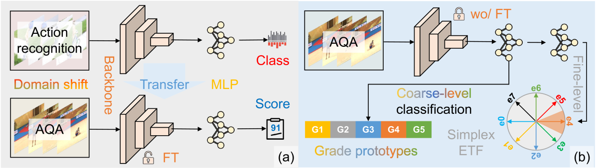

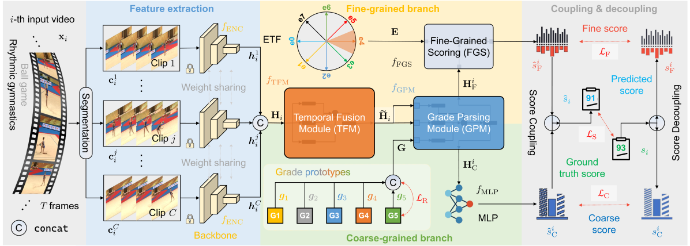

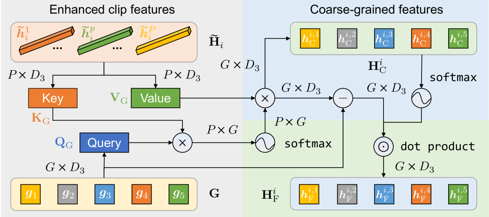

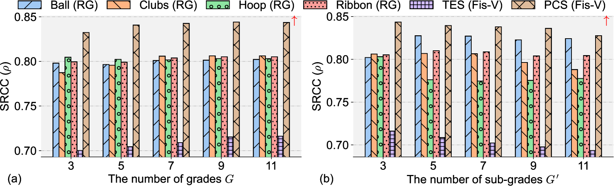

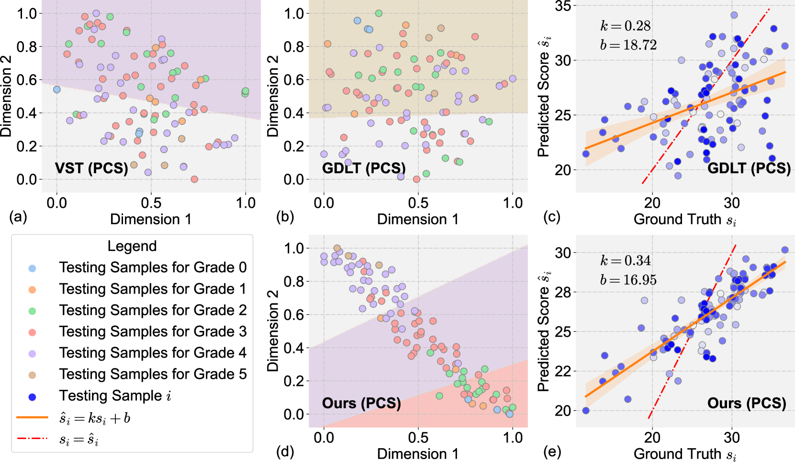

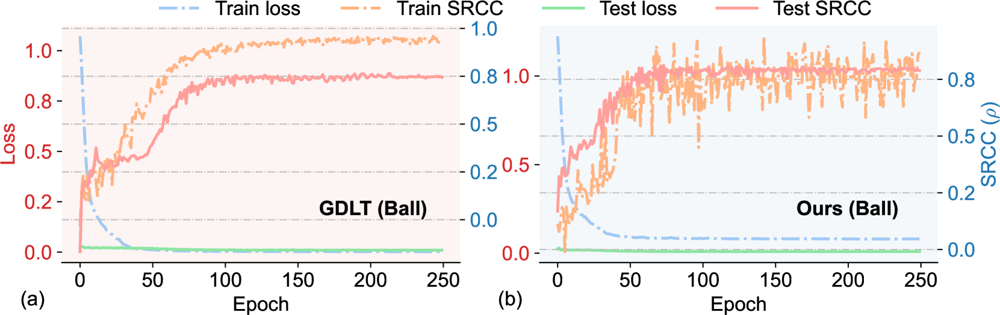

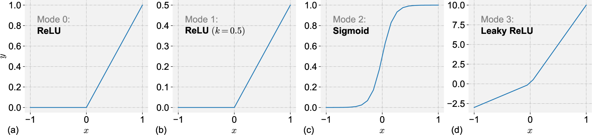

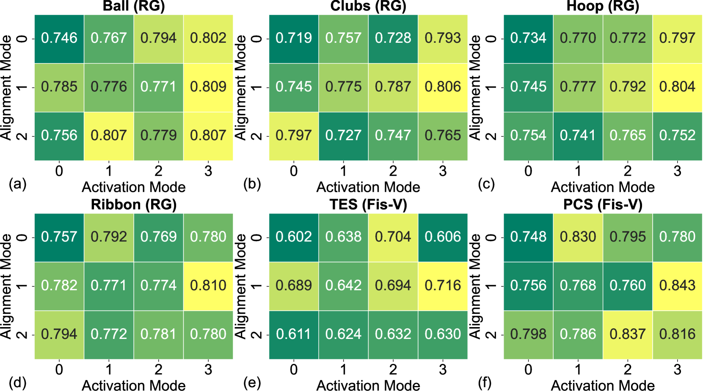

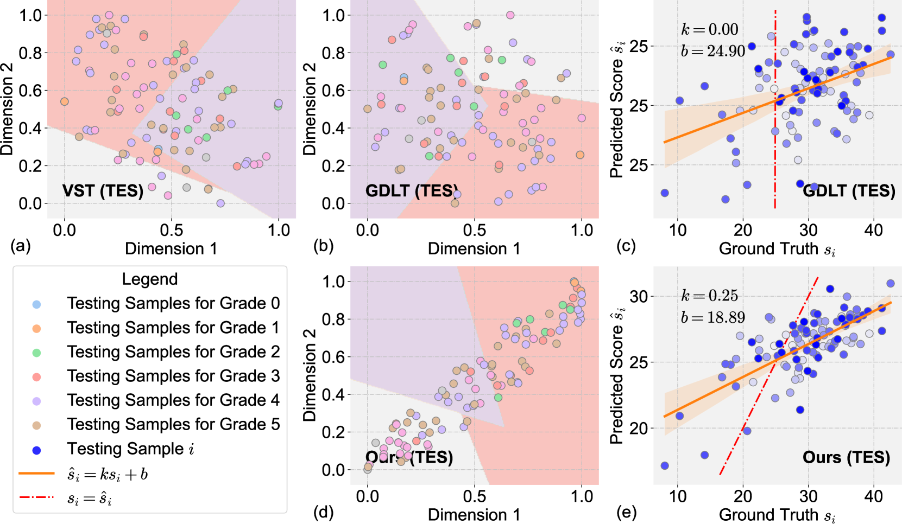

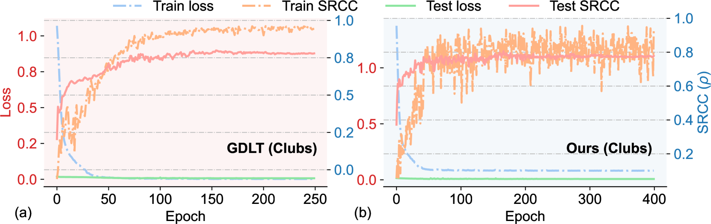

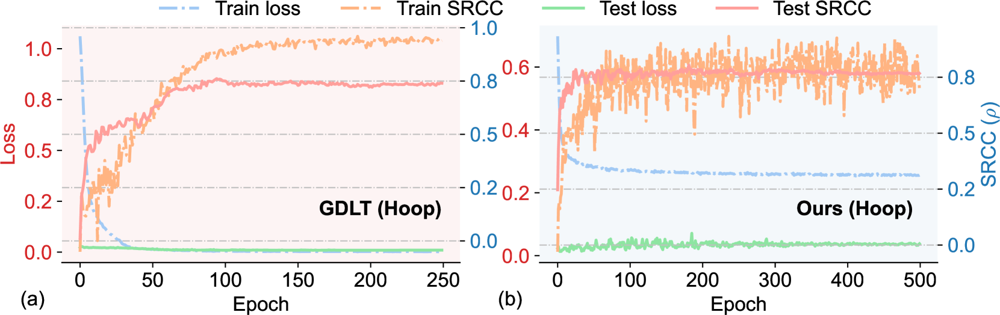

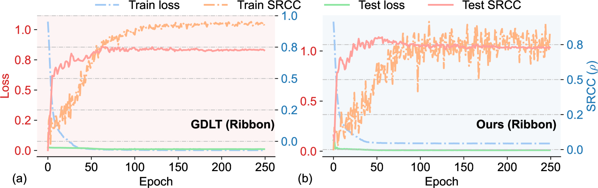

[Arxiv](https://arxiv.org/abs/2404.13999)