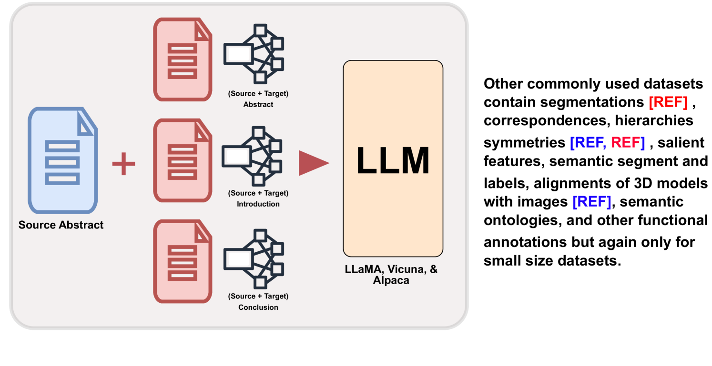
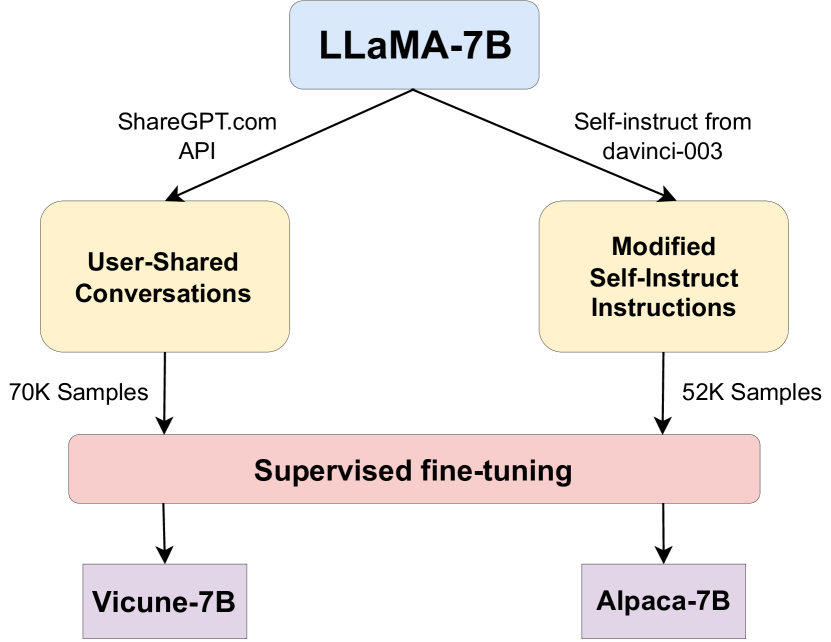
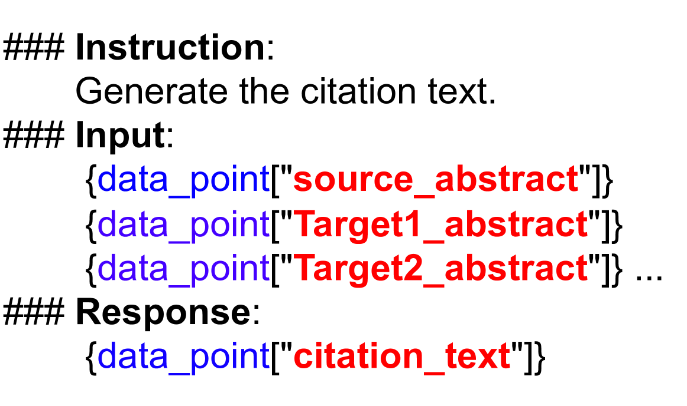
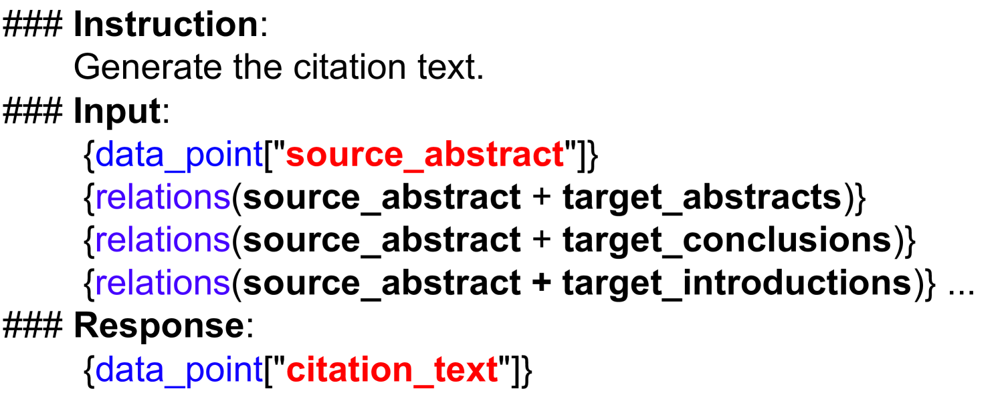
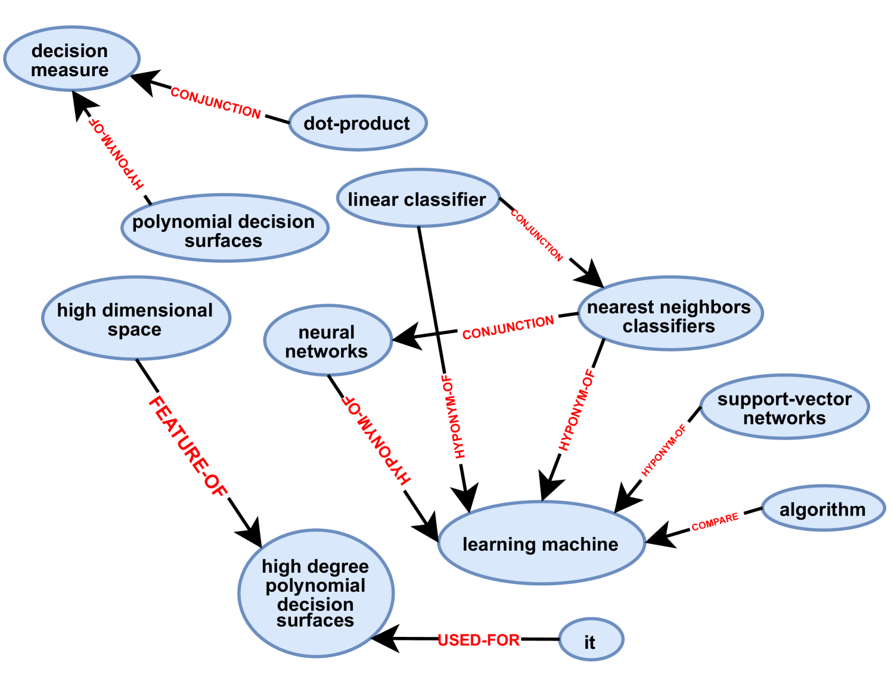
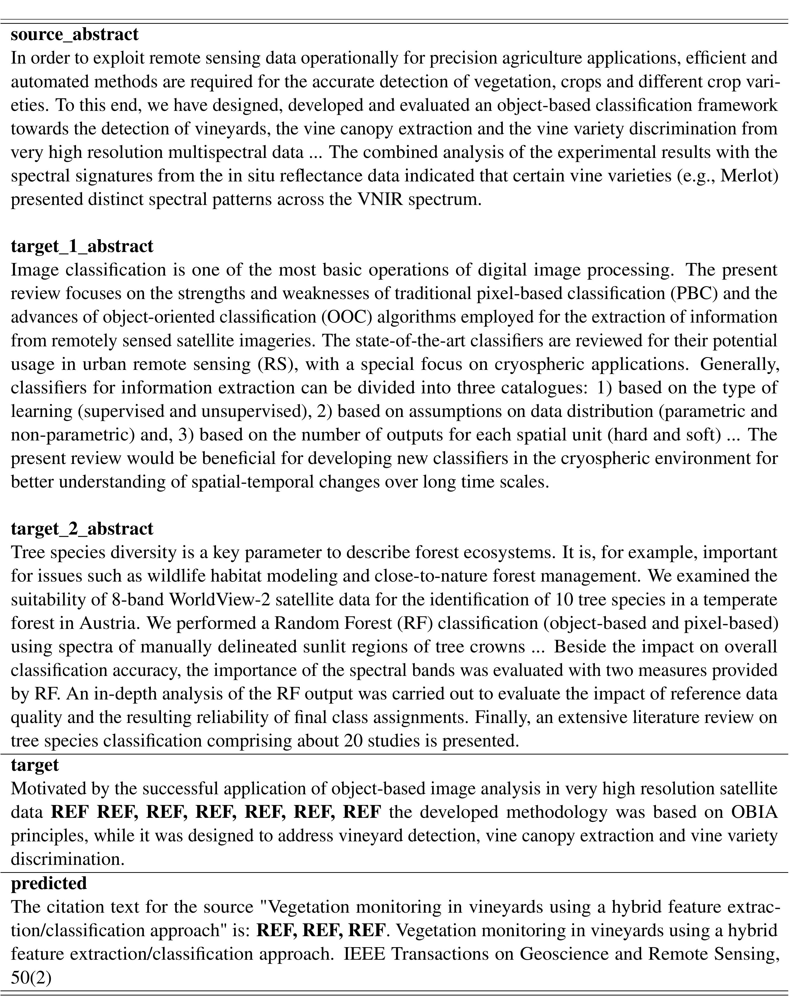

# 本文介绍了一种上下文增强的语言模型，旨在生成多篇论文的引用。

发布时间：2024年04月22日

`LLM应用` `科学文献`

> Context-Enhanced Language Models for Generating Multi-Paper Citations

# 摘要

> 引用文本对于揭示科学文献间的联系至关重要，这需要对引用文献有深刻的理解。创建引用文本既耗时又复杂，研究者需深入文献海洋并精准表达相关内容。为了解决这一问题，引用文本生成（CTG）领域应时而生。尽管现有方法多聚焦于生成单句引用，但实际应用中常需在一段文字中引用多篇文献。为此，我们提出了一种新方法，使用大型语言模型（LLMs）来生成包含多个引用的复合句。该方法以一篇源论文和多篇目标论文为基础，生成包含多句引用的连贯段落。我们还推出了一个精选数据集MCG-S2ORC，收录了计算机科学领域的多篇英语学术论文，每篇均包含多个引用实例。实验中，我们对比了三种大型语言模型LLaMA、Alpaca和Vicuna，以找出最适合此项任务的模型。此外，通过将目标论文的知识图谱融入生成引用文本的提示中，我们进一步提升了性能。本研究凸显了利用LLMs进行引用生成的巨大潜力，为深入挖掘科学文献间的复杂联系开辟了新的研究路径。

> Citation text plays a pivotal role in elucidating the connection between scientific documents, demanding an in-depth comprehension of the cited paper. Constructing citations is often time-consuming, requiring researchers to delve into extensive literature and grapple with articulating relevant content. To address this challenge, the field of citation text generation (CTG) has emerged. However, while earlier methods have primarily centered on creating single-sentence citations, practical scenarios frequently necessitate citing multiple papers within a single paragraph. To bridge this gap, we propose a method that leverages Large Language Models (LLMs) to generate multi-citation sentences. Our approach involves a single source paper and a collection of target papers, culminating in a coherent paragraph containing multi-sentence citation text. Furthermore, we introduce a curated dataset named MCG-S2ORC, composed of English-language academic research papers in Computer Science, showcasing multiple citation instances. In our experiments, we evaluate three LLMs LLaMA, Alpaca, and Vicuna to ascertain the most effective model for this endeavor. Additionally, we exhibit enhanced performance by integrating knowledge graphs from target papers into the prompts for generating citation text. This research underscores the potential of harnessing LLMs for citation generation, opening a compelling avenue for exploring the intricate connections between scientific documents.

[Arxiv](https://arxiv.org/abs/2404.13865)