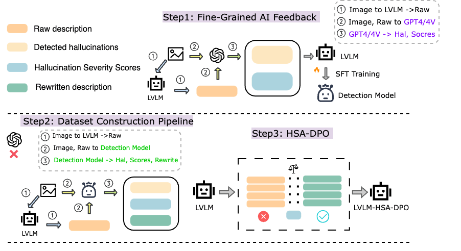
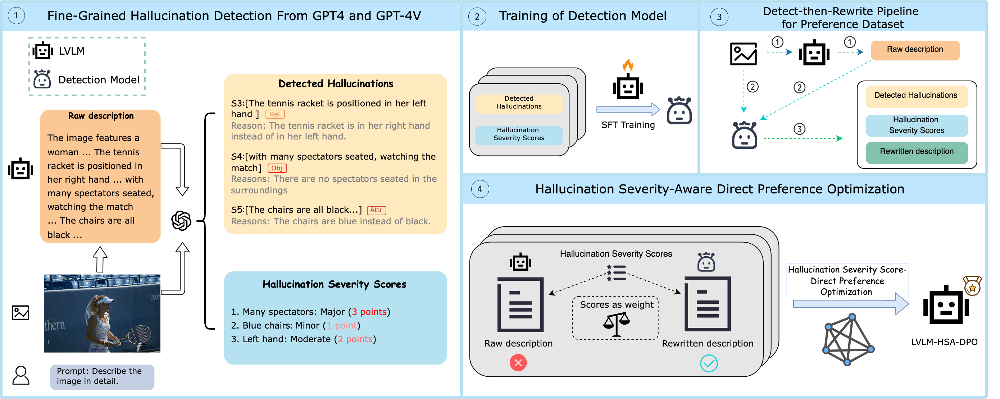
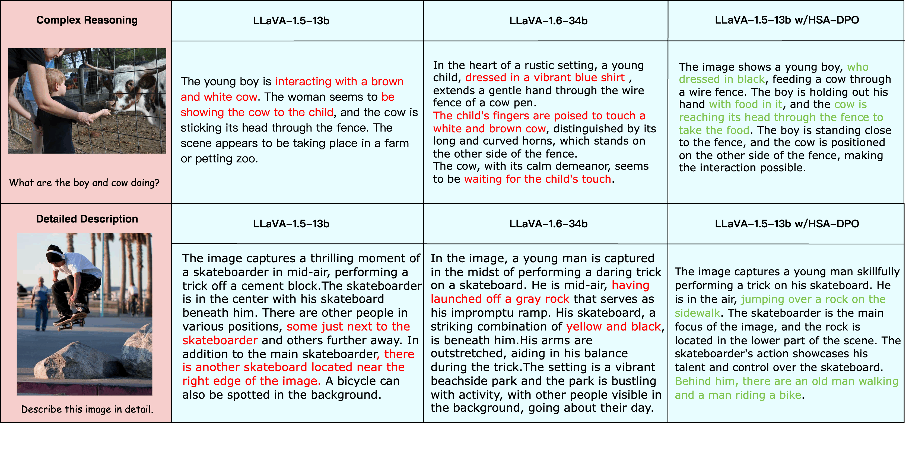
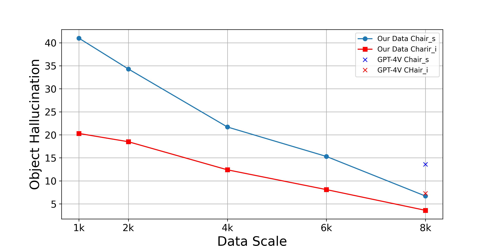
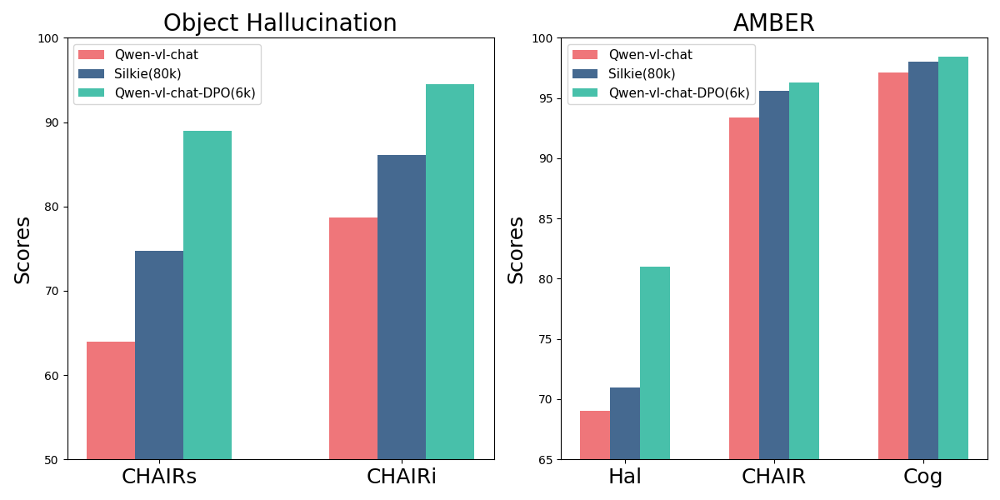
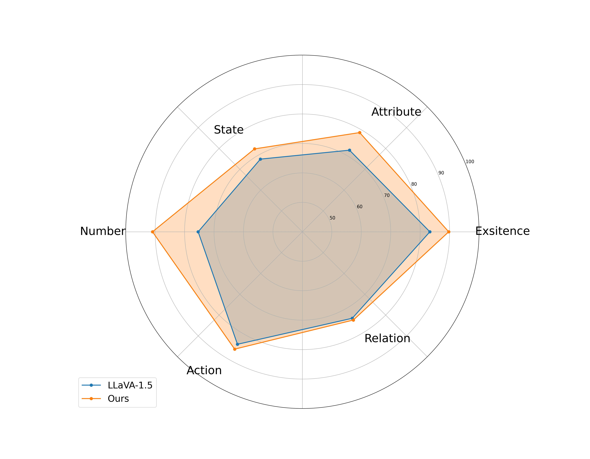

# 通过精细的人工智能反馈机制，我们能够在大型视觉语言模型中识别并减轻幻觉现象，从而提升模型的准确性和可靠性。

发布时间：2024年04月22日

`分类：LLM应用

这篇论文主要研究了大型视觉语言模型（LVLMs）在多模态任务上的应用，特别是针对生成文本与上下文不符的幻觉现象。论文提出了一种基于细粒度AI反馈的幻觉检测与缓解方法，并通过实验验证了其有效性。这属于LLM应用的范畴，因为它涉及到如何改进和优化大型语言模型在实际应用中的表现。` `视觉语言模型` `人工智能`

> Detecting and Mitigating Hallucination in Large Vision Language Models via Fine-Grained AI Feedback

# 摘要

> 大型视觉语言模型（LVLMs）在多模态任务上展现了卓越能力，但生成文本与上下文不符的幻觉现象仍是其软肋，这大大限制了它们的应用范围。目前，大多数研究在宏观层面上识别和缓解幻觉，或依赖昂贵的标注资源，如专有模型或专家的标注。为应对这些挑战，本研究提出了一种基于细粒度AI反馈的幻觉检测与缓解方法。核心思想是利用专有模型生成小型的句子级幻觉注释数据集，并训练出一个能够进行句子级幻觉识别的模型，该模型能够识别主要的幻觉类型，包括对象、属性和关系。接着，我们设计了一个“先检测再重写”的流程，自动化构建用于训练缓解幻觉模型的偏好数据集。此外，我们还提出了评估幻觉严重性的方法，并引入了一种幻觉严重性感知的直接偏好优化（HSA-DPO）策略，通过考虑幻觉的严重性来优化偏好学习，有效减轻LVLMs中的幻觉问题。大量实验验证了我们方法的有效性。

> The rapidly developing Large Vision Language Models (LVLMs) have shown notable capabilities on a range of multi-modal tasks, but still face the hallucination phenomena where the generated texts do not align with the given contexts, significantly restricting the usages of LVLMs. Most previous work detects and mitigates hallucination at the coarse-grained level or requires expensive annotation (e.g., labeling by proprietary models or human experts). To address these issues, we propose detecting and mitigating hallucinations in LVLMs via fine-grained AI feedback. The basic idea is that we generate a small-size sentence-level hallucination annotation dataset by proprietary models, whereby we train a hallucination detection model which can perform sentence-level hallucination detection, covering primary hallucination types (i.e., object, attribute, and relationship). Then, we propose a detect-then-rewrite pipeline to automatically construct preference dataset for training hallucination mitigating model. Furthermore, we propose differentiating the severity of hallucinations, and introducing a Hallucination Severity-Aware Direct Preference Optimization (HSA-DPO) for mitigating hallucination in LVLMs by incorporating the severity of hallucinations into preference learning. Extensive experiments demonstrate the effectiveness of our method.

[Arxiv](https://arxiv.org/abs/2404.14233)