# 揭示论点强度：解析攻击与支持的角色（技术报告）

发布时间：2024年04月22日

`分类：LLM应用` `人工智能` `博弈论`

> Explaining Arguments' Strength: Unveiling the Role of Attacks and Supports (Technical Report)

# 摘要

> 近期，学界日益关注如何在逐步语义框架下定量阐释论证的力度。具体而言，众多研究通过计算论证的归因分数来提供定量阐释。然而，这些研究往往忽略了攻击与支持的重要性，而这两者在阐释论证力度时扮演着关键角色。本文提出了一种创新的关系归因解释（RAEs）理论，借鉴博弈论中的Shapley值，以精细化分析攻击与支持在定量双极论证中的作用，进而揭示论证的力度。我们证实RAEs具备多种理想属性，并设计了一种概率算法来高效近似计算RAEs。最终，我们通过欺诈检测和大型语言模型的案例研究，展示了RAEs的应用价值。

> Quantitatively explaining the strength of arguments under gradual semantics has recently received increasing attention. Specifically, several works in the literature provide quantitative explanations by computing the attribution scores of arguments. These works disregard the importance of attacks and supports, even though they play an essential role when explaining arguments' strength. In this paper, we propose a novel theory of Relation Attribution Explanations (RAEs), adapting Shapley values from game theory to offer fine-grained insights into the role of attacks and supports in quantitative bipolar argumentation towards obtaining the arguments' strength. We show that RAEs satisfy several desirable properties. We also propose a probabilistic algorithm to approximate RAEs efficiently. Finally, we show the application value of RAEs in fraud detection and large language models case studies.

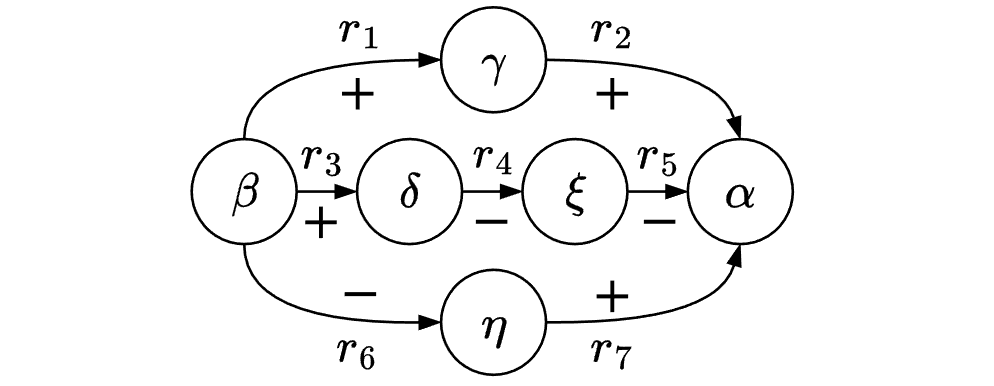

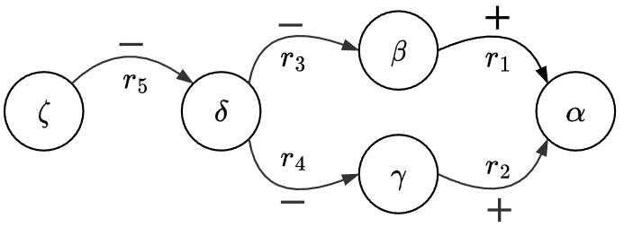

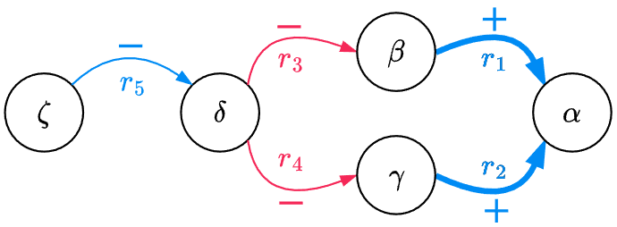

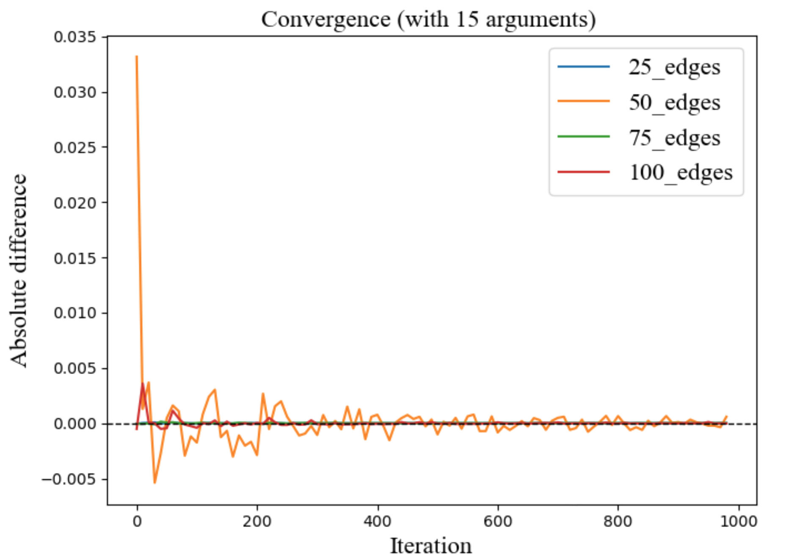

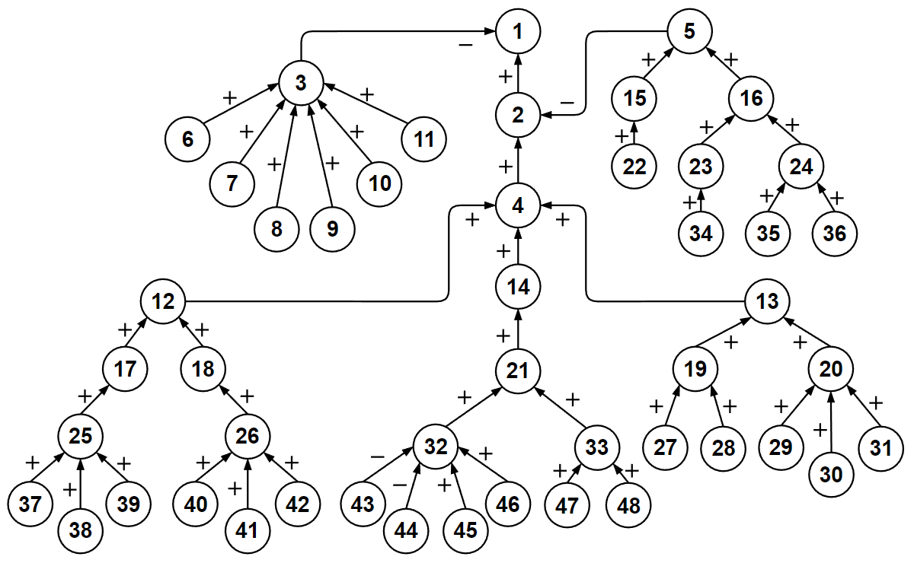

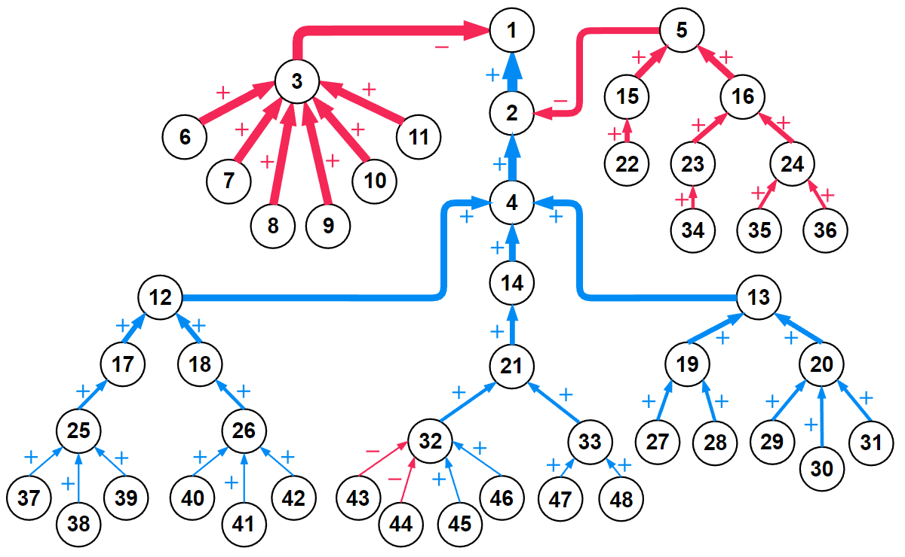

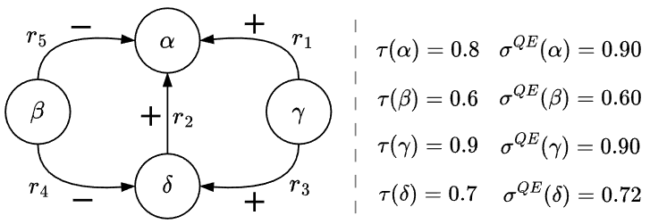

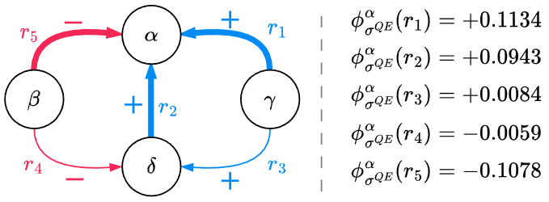

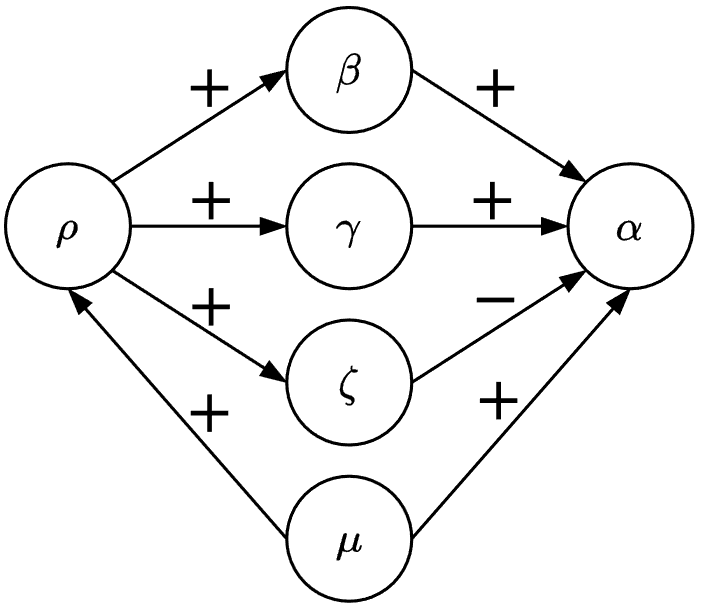

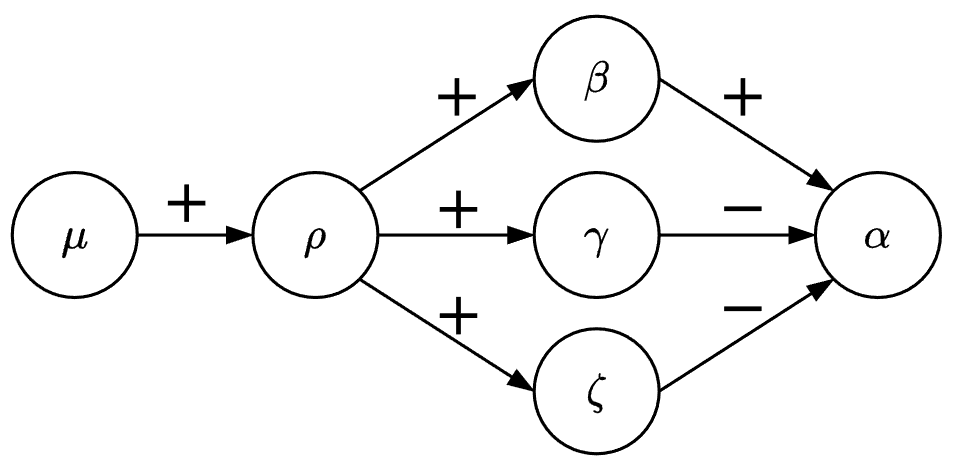

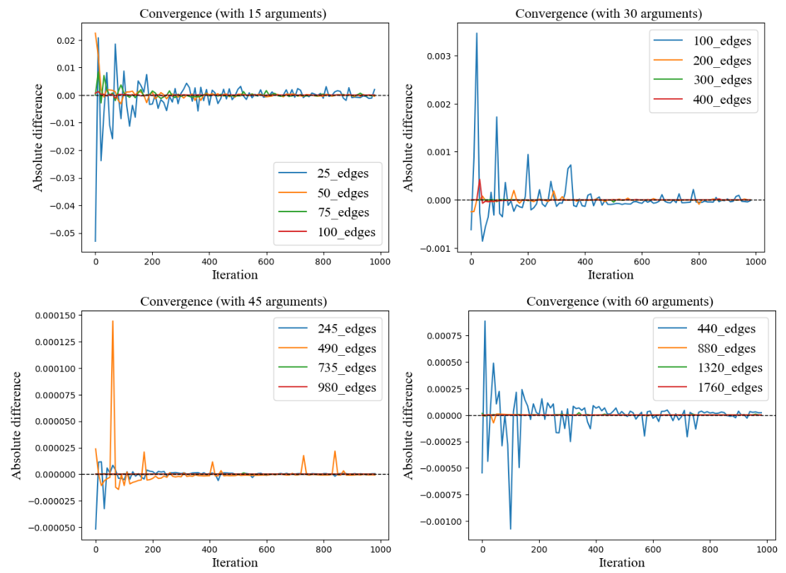

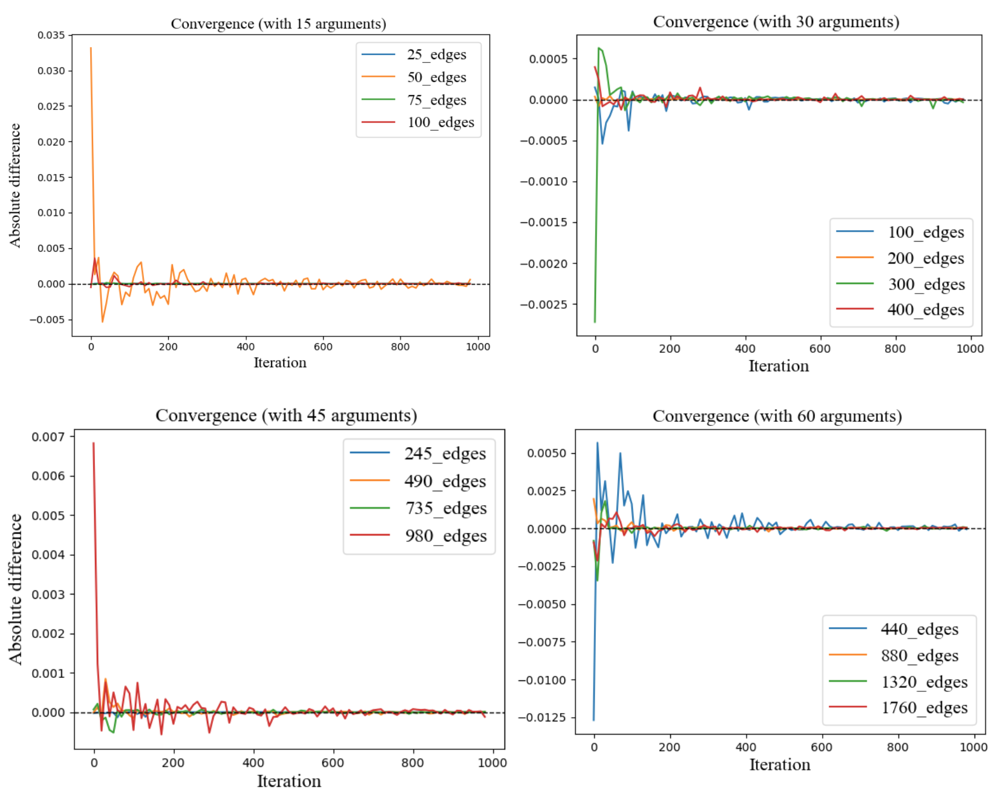

[Arxiv](https://arxiv.org/abs/2404.14304)