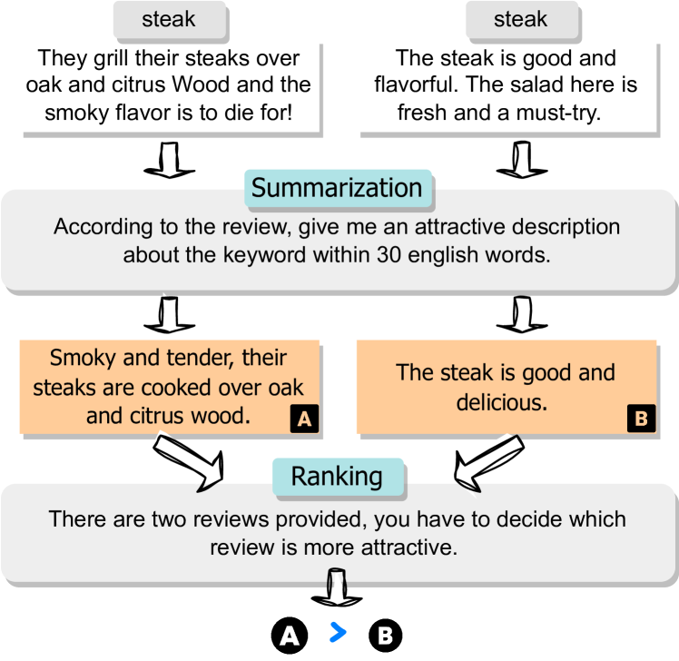
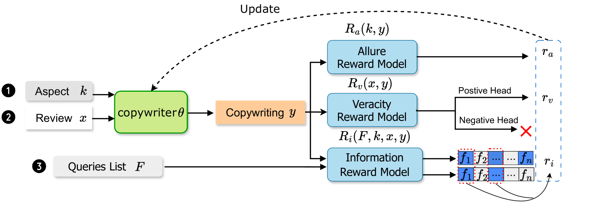

# 提炼客户评论，创作引人入胜且真实的文案

发布时间：2024年04月22日

`LLM应用` `文案生成`

> Generating Attractive and Authentic Copywriting from Customer Reviews

# 摘要

> 产品文案的使命在于通过文字的力量，凸显商品特性，激发潜在顾客的购买欲望。在电商服务百花齐放的今天，灵活调整自动生成的商品描述风格显得尤为关键。传统文案创作往往过分依赖产品自身的特性描述，容易导致内容的枯燥与单一。为打破这一局限，我们提出了一种创新方法：利用客户的真实评价来生成文案，这些评价蕴含了用户对产品的直接体验，为文案创作提供了比产品特性更为丰富的素材。我们构建了一个结合了强化学习的序列到序列模型，旨在打造出既吸引人又真实、信息量足的文案。在吸引力和信息忠实度方面，该模型的表现超越了包括 LLaMA-2-chat-7B 和 GPT-3.5 在内的所有现有基准和零样本大型语言模型。此外，本研究还特别引入了大型语言模型来执行基于特征的摘要收集和论证吸引力评估。实验结果证明了大型语言模型在营销领域语料库构建中的卓越效能。相关代码和数据集已在 https://github.com/YuXiangLin1234/Copywriting-Generation 向公众开放。

> The goal of product copywriting is to capture the interest of potential buyers by emphasizing the features of products through text descriptions. As e-commerce platforms offer a wide range of services, it's becoming essential to dynamically adjust the styles of these auto-generated descriptions. Typical approaches to copywriting generation often rely solely on specified product attributes, which may result in dull and repetitive content. To tackle this issue, we propose to generate copywriting based on customer reviews, as they provide firsthand practical experiences with products, offering a richer source of information than just product attributes. We have developed a sequence-to-sequence framework, enhanced with reinforcement learning, to produce copywriting that is attractive, authentic, and rich in information. Our framework outperforms all existing baseline and zero-shot large language models, including LLaMA-2-chat-7B and GPT-3.5, in terms of both attractiveness and faithfulness. Furthermore, this work features the use of LLMs for aspect-based summaries collection and argument allure assessment. Experiments demonstrate the effectiveness of using LLMs for marketing domain corpus construction. The code and the dataset is publicly available at: https://github.com/YuXiangLin1234/Copywriting-Generation.

[Arxiv](https://arxiv.org/abs/2404.13906)