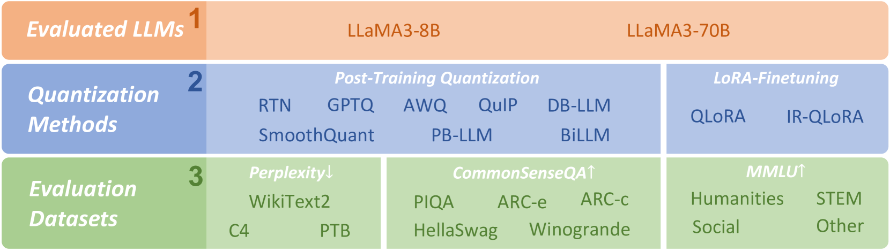

# 低比特量化的 LLaMA3 模型性能如何？实证探究

发布时间：2024年04月22日

`LLM应用` `机器学习` `模型压缩`

> How Good Are Low-bit Quantized LLaMA3 Models? An Empirical Study

# 摘要

> Meta 推出的 LLaMA 系列大型语言模型（LLM）已成为开源领域中的佼佼者。新近亮相的 LLaMA3 模型在超过 15TB 规模的预训练数据上展现出卓越的性能。在资源受限的环境中，低比特权量化技术在 LLM 应用中愈发重要，我们因此深入探究了 LLaMA3 在低比特权量化后的表现。这项研究可能为 LLaMA3 及其他新型 LLM 的低比特权量化带来新的洞见和挑战，尤其是在解决模型压缩过程中的性能损失问题。我们针对 LLaMA3 采用了 10 种不同的后训练量化和 LoRA 微调方法，并在 1-8 位的比特宽度以及多样化的数据集上进行了评估，以全面展现其在低比特权量化下的性能。实验结果显示，LLaMA3 在低比特宽度场景下，尤其是超低比特宽度时，性能损失依然显著，这表明未来研究需要在低比特宽度下进一步优化性能。我们相信，这项研究将对未来模型的发展起到推动作用，促使 LLM 在更低的比特宽度上实现更高的精度，以适应实际应用需求。项目详情和量化后的 LLaMA3 模型可在以下链接查看：https://github.com/Macaronlin/LLaMA3-Quantization 和 https://huggingface.co/LLMQ。

> Meta's LLaMA family has become one of the most powerful open-source Large Language Model (LLM) series. Notably, LLaMA3 models have recently been released and achieve impressive performance across various with super-large scale pre-training on over 15T tokens of data. Given the wide application of low-bit quantization for LLMs in resource-limited scenarios, we explore LLaMA3's capabilities when quantized to low bit-width. This exploration holds the potential to unveil new insights and challenges for low-bit quantization of LLaMA3 and other forthcoming LLMs, especially in addressing performance degradation problems that suffer in LLM compression. Specifically, we evaluate the 10 existing post-training quantization and LoRA-finetuning methods of LLaMA3 on 1-8 bits and diverse datasets to comprehensively reveal LLaMA3's low-bit quantization performance. Our experiment results indicate that LLaMA3 still suffers non-negligent degradation in these scenarios, especially in ultra-low bit-width. This highlights the significant performance gap under low bit-width that needs to be bridged in future developments. We expect that this empirical study will prove valuable in advancing future models, pushing the LLMs to lower bit-width with higher accuracy for being practical. Our project is released on https://github.com/Macaronlin/LLaMA3-Quantization and quantized LLaMA3 models are released in https://huggingface.co/LLMQ.

[Arxiv](https://arxiv.org/abs/2404.14047)