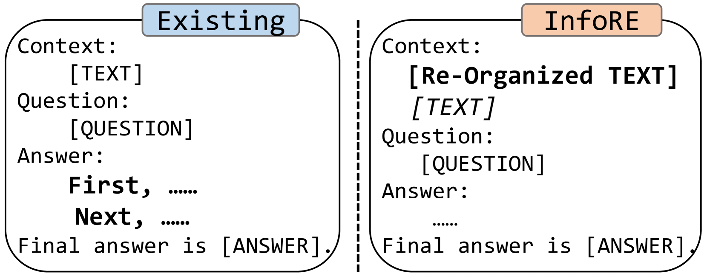
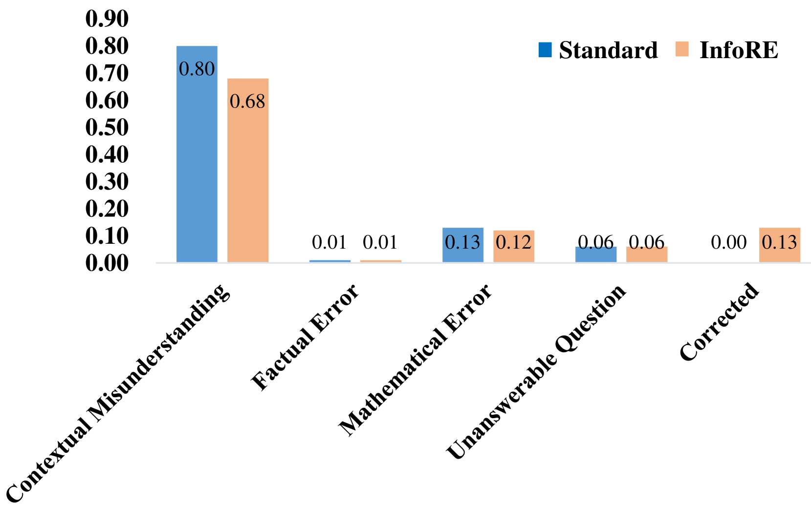

# 通过信息的重新组织，我们能够显著提升大型语言模型的推理性能。

发布时间：2024年04月22日

`LLM应用` `人工智能`

> Information Re-Organization Improves Reasoning in Large Language Models

# 摘要

> 提升大型语言模型（LLMs）的推理技能备受瞩目。当前的研究多集中于优化推理流程，以得出更准确的结论。但在需要情境推理的场景下，现有方法往往忽视了先从上下文中辨识逻辑关系再进行推理的关键步骤。这可能导致对上下文的浅显理解，影响推理结果的质量和可信度。本文提出了一种信息重组（InfoRE）方法，旨在推理前重组信息，以增强LLMs的推理能力。我们首先对上下文内容，如文档或段落，进行重组，提炼出逻辑关系，然后在推理过程中应用这些重组后的信息。这种方法让LLMs能够更深入地理解上下文，清晰捕捉到逻辑联系。为了验证我们方法的有效性，我们在多个需要情境感知的多跳推理任务上，使用Llama2-70B、GPT-3.5和GPT-4进行了实验。在零样本的设置下，我们的方法在所有任务中平均提升了3%的准确率，显示了其在提升LLMs推理表现上的潜力。相关源代码已在 https://github.com/hustcxx/InfoRE 上发布。

> Improving the reasoning capabilities of large language models (LLMs) has attracted considerable interest. Recent approaches primarily focus on improving the reasoning process to yield a more precise final answer. However, in scenarios involving contextually aware reasoning, these methods neglect the importance of first identifying logical relationships from the context before proceeding with the reasoning. This oversight could lead to a superficial understanding and interaction with the context, potentially undermining the quality and reliability of the reasoning outcomes. In this paper, we propose an information re-organization (InfoRE) method before proceeding with the reasoning to enhance the reasoning ability of LLMs. We first perform a re-organization processing of the contextual content, e.g., documents or paragraphs, to obtain logical relationships. Then, we utilize the re-organized information in the reasoning process. This enables LLMs to deeply understand the contextual content by clearly perceiving these logical relationships. To demonstrate the effectiveness of our approach in improving the reasoning ability, we conduct experiments using Llama2-70B, GPT-3.5, and GPT-4 on various contextually aware multi-hop reasoning tasks. Using only a zero-shot setting, our method achieves an average improvement of 3\% across all tasks, highlighting its potential to improve the reasoning performance of LLMs. Our source code is available at https://github.com/hustcxx/InfoRE.

[Arxiv](https://arxiv.org/abs/2404.13985)