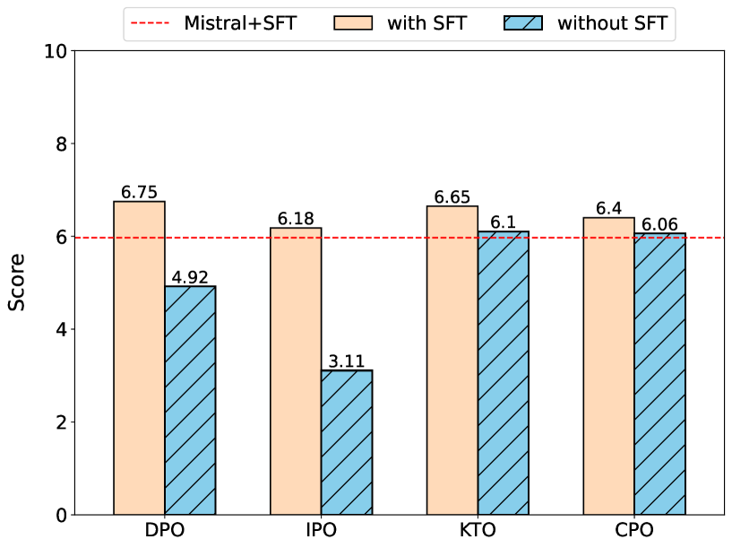
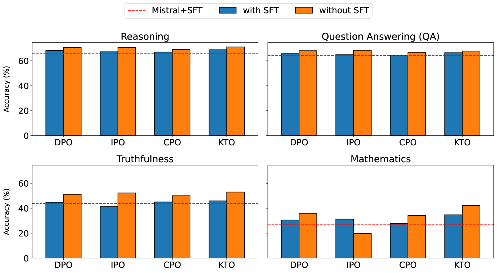
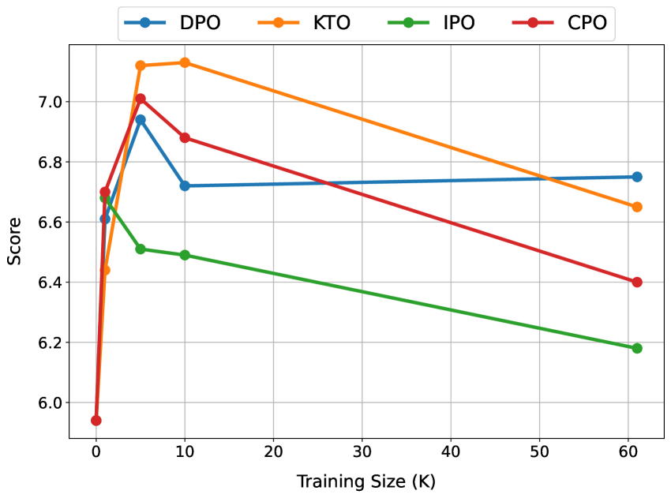
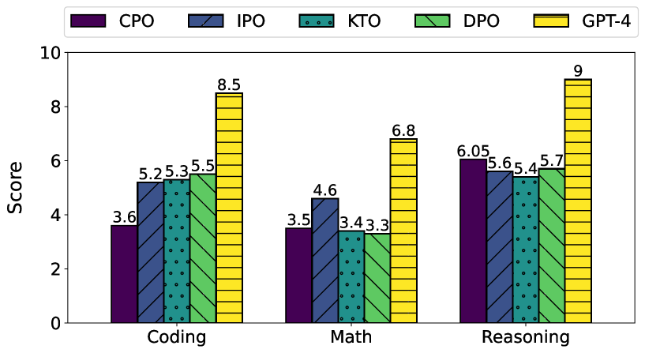
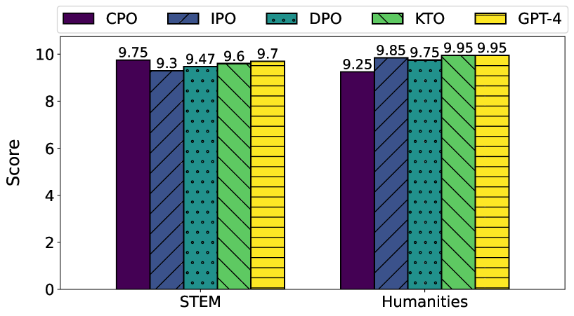

# 深入对齐之洞察：跨多任务评估 DPO 及其衍生模型的表现

发布时间：2024年04月22日

`LLM应用` `人工智能` `机器学习`

> Insights into Alignment: Evaluating DPO and its Variants Across Multiple Tasks

# 摘要

> 大型语言模型（LLMs）在多种任务上展现了非凡的能力。直接偏好优化（DPO）作为一种不依赖强化学习的策略优化方法，正逐渐受到关注。尽管如此，一些障碍限制了DPO的普及。为了克服这些限制，我们引入了DPO的不同版本。但是，对这些版本在多样化任务中的全面评估尚未进行。本研究旨在填补这一空白，通过分析三种不同设置下的对齐方法表现：（1）包含监督式微调（SFT）步骤，（2）省略SFT步骤，以及（3）省略SFT步骤并采用指令调优模型。我们还研究了不同训练数据规模对性能的影响。我们的评估覆盖了对话系统、推理、数学问题解决、问答、真实性和多任务理解等多项任务，包括MT-Bench、Big Bench和Open LLM Leaderboard等13个基准测试。主要发现表明，对齐方法在较小数据集上表现最佳，在推理任务中提升有限，但在数学问题解决上效果显著，而使用指令调优模型对提升真实性有重要影响。我们期望这些发现能够激发更多研究，以开发出更强大的模型来应对对齐问题。

> Large Language Models (LLMs) have demonstrated remarkable performance across a spectrum of tasks. Recently, Direct Preference Optimization (DPO) has emerged as an RL-free approach to optimize the policy model on human preferences. However, several limitations hinder the widespread adoption of this method. To address these shortcomings, various versions of DPO have been introduced. Yet, a comprehensive evaluation of these variants across diverse tasks is still lacking. In this study, we aim to bridge this gap by investigating the performance of alignment methods across three distinct scenarios: (1) keeping the Supervised Fine-Tuning (SFT) part, (2) skipping the SFT part, and (3) skipping the SFT part and utilizing an instruction-tuned model. Furthermore, we explore the impact of different training sizes on their performance. Our evaluation spans a range of tasks including dialogue systems, reasoning, mathematical problem-solving, question answering, truthfulness, and multi-task understanding, encompassing 13 benchmarks such as MT-Bench, Big Bench, and Open LLM Leaderboard. Key observations reveal that alignment methods achieve optimal performance with smaller training data subsets, exhibit limited effectiveness in reasoning tasks yet significantly impact mathematical problem-solving, and employing an instruction-tuned model notably influences truthfulness. We anticipate that our findings will catalyze further research aimed at developing more robust models to address alignment challenges.

[Arxiv](https://arxiv.org/abs/2404.14723)