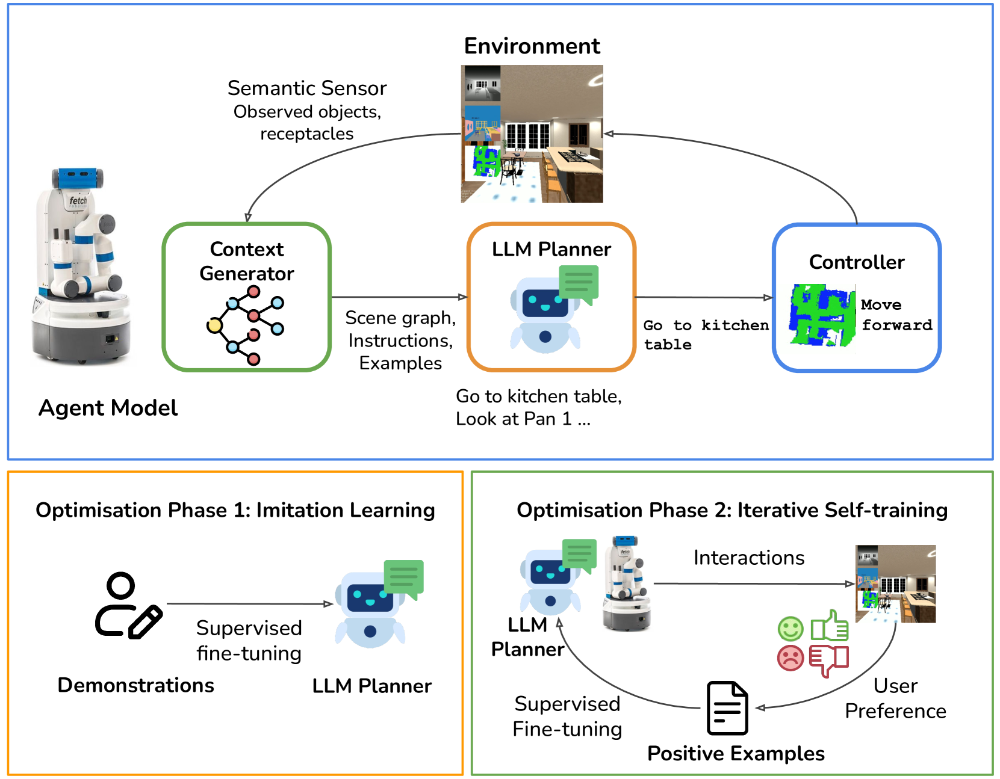
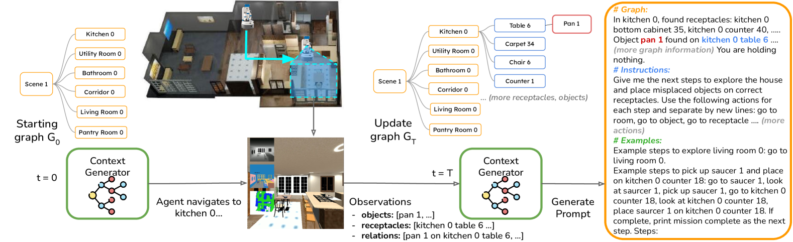
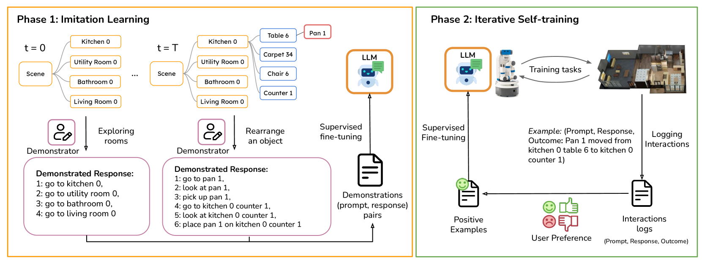
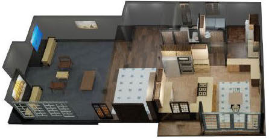
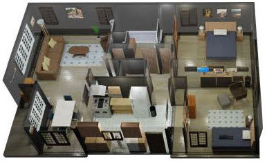
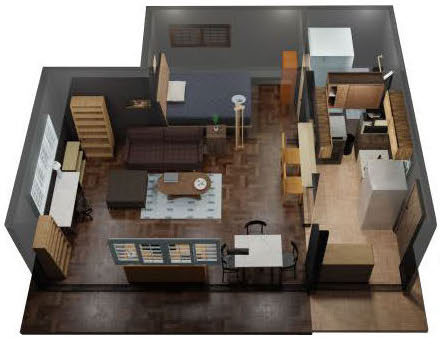
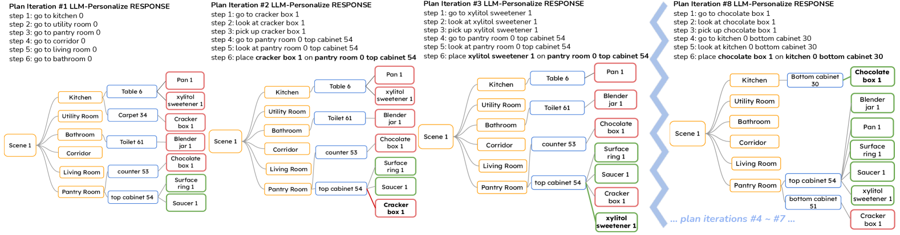
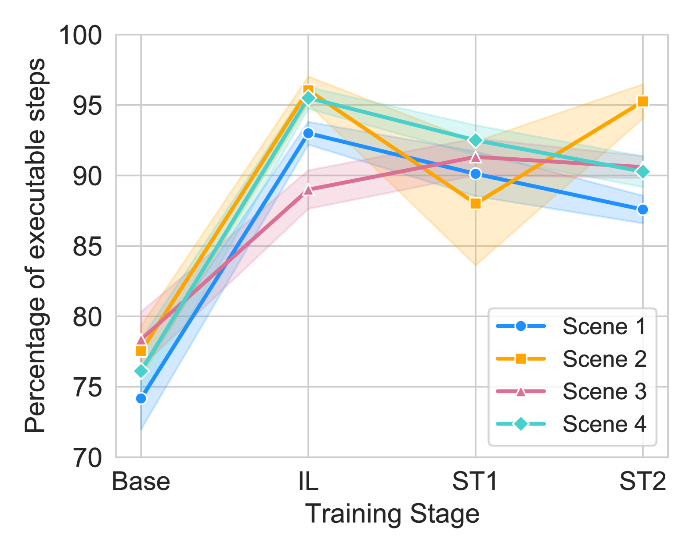
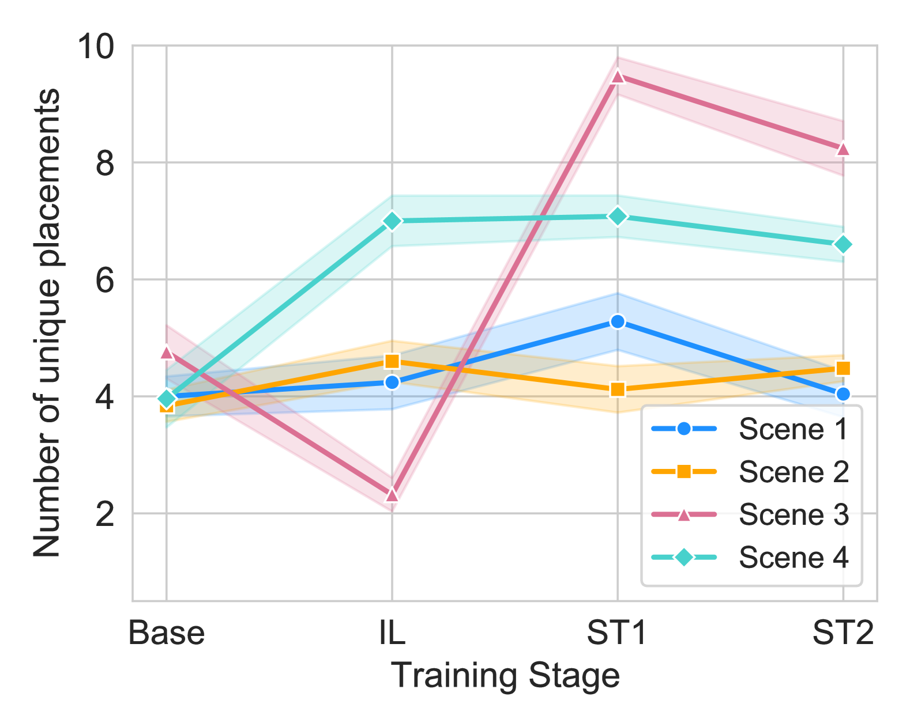

# LLM-Personalize：通过增强式自我训练，使大型语言模型（LLM）的规划器与人类的偏好保持一致，专为家务机器人设计。

发布时间：2024年04月22日

`分类：Agent` `机器人技术` `家庭自动化`

> LLM-Personalize: Aligning LLM Planners with Human Preferences via Reinforced Self-Training for Housekeeping Robots

# 摘要

> 大型语言模型（LLMs）在机器人技术应用，尤其是任务规划方面，因其出色的语言理解与文本生成技能而备受瞩目。但家庭机器人等领域的个性化需求尚未得到充分满足。我们提出了LLM-Personalize，一个创新的框架，它通过优化流程为家庭机器人量身定制LLM规划器。该框架的LLM规划器能够针对多房间、部分可观测的家庭环境进行迭代规划，并通过局部观测构建的场景图来实现。生成的计划是一系列高级动作，由控制器执行。核心机制是优化流程，它融合了模仿学习和迭代自训练，以实现LLM规划器的个性化。模仿学习阶段负责初始对齐，为模型提供有效的迭代自训练基础，进一步探索并适应用户偏好。在Housekeep这一模拟家庭环境重排的3D基准测试中，LLM-Personalize的成功率比现有LLM规划器提升了逾30%，显著增强了与人类偏好的一致性。项目详情：https://donggehan.github.io/projectllmpersonalize/。

> Large language models (LLMs) have shown significant potential for robotics applications, particularly task planning, by harnessing their language comprehension and text generation capabilities. However, in applications such as household robotics, a critical gap remains in the personalization of these models to individual user preferences. We introduce LLM-Personalize, a novel framework with an optimization pipeline designed to personalize LLM planners for household robotics. Our LLM-Personalize framework features an LLM planner that performs iterative planning in multi-room, partially-observable household scenarios, making use of a scene graph constructed with local observations. The generated plan consists of a sequence of high-level actions which are subsequently executed by a controller. Central to our approach is the optimization pipeline, which combines imitation learning and iterative self-training to personalize the LLM planner. In particular, the imitation learning phase performs initial LLM alignment from demonstrations, and bootstraps the model to facilitate effective iterative self-training, which further explores and aligns the model to user preferences. We evaluate LLM-Personalize on Housekeep, a challenging simulated real-world 3D benchmark for household rearrangements, and show that LLM-Personalize achieves more than a 30 percent increase in success rate over existing LLM planners, showcasing significantly improved alignment with human preferences. Project page: https://donggehan.github.io/projectllmpersonalize/.

[Arxiv](https://arxiv.org/abs/2404.14285)