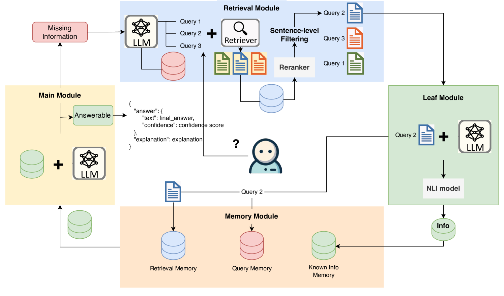

# 大型语言模型（LLMs）自有所需：借助缺失信息导向框架，提升检索增强型生成能力。

发布时间：2024年04月22日

`RAG` `信息检索`

> LLMs Know What They Need: Leveraging a Missing Information Guided Framework to Empower Retrieval-Augmented Generation

# 摘要

> 检索增强生成（RAG）通过向大型语言模型（LLMs）注入最新和贴切的知识，有效缓解了知识过时或产生幻觉的问题。尽管如此，RAG 在解析复杂多跳查询和定位相关文档上仍面临挑战，这要求 LLMs 逐步进行逻辑推理和检索。借鉴人类逐步搜寻所需信息的推理方式，我们自然会产生疑问：LLMs 是否能够察觉到每个逻辑推理步骤中的信息空缺。在本研究中，我们首先通过实验确认了 LLMs 在提取信息和识别缺失信息方面的能力。基于这一发现，我们提出了一种新的范式——缺失信息引导的检索-提取-解决（MIGRES），利用识别出的信息缺失点来生成针对性的查询，从而引导接下来的知识检索过程。此外，我们还设计了一种基于句子级别的重新排序过滤方法，用以排除文档中的无关内容，并结合 LLMs 的信息提取功能，从净化后的文档中抽取有用信息，以此提升 RAG 的整体效能。我们在多个公共数据集上进行的广泛实验显示了 MIGRES 方法的优越性，而深入的分析实验也验证了我们所提模块的有效性。

> Retrieval-Augmented Generation (RAG) demonstrates great value in alleviating outdated knowledge or hallucination by supplying LLMs with updated and relevant knowledge. However, there are still several difficulties for RAG in understanding complex multi-hop query and retrieving relevant documents, which require LLMs to perform reasoning and retrieve step by step. Inspired by human's reasoning process in which they gradually search for the required information, it is natural to ask whether the LLMs could notice the missing information in each reasoning step. In this work, we first experimentally verified the ability of LLMs to extract information as well as to know the missing. Based on the above discovery, we propose a Missing Information Guided Retrieve-Extraction-Solving paradigm (MIGRES), where we leverage the identification of missing information to generate a targeted query that steers the subsequent knowledge retrieval. Besides, we design a sentence-level re-ranking filtering approach to filter the irrelevant content out from document, along with the information extraction capability of LLMs to extract useful information from cleaned-up documents, which in turn to bolster the overall efficacy of RAG. Extensive experiments conducted on multiple public datasets reveal the superiority of the proposed MIGRES method, and analytical experiments demonstrate the effectiveness of our proposed modules.

[Arxiv](https://arxiv.org/abs/2404.14043)