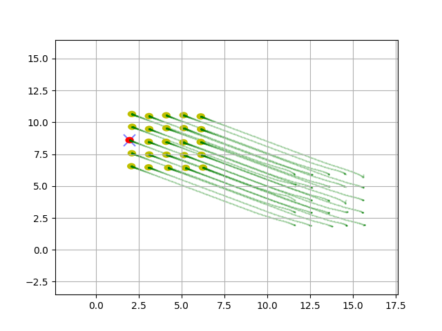
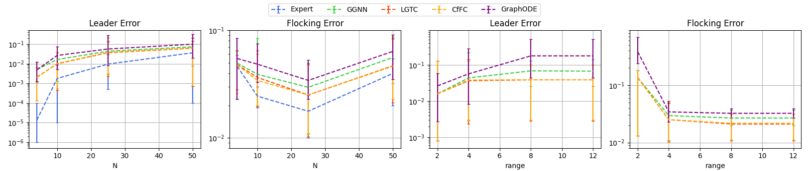

# 液态图时域常数网络在多智能体系统控制中的应用

发布时间：2024年04月22日

`Agent` `智能体系统` `图神经网络`

> Liquid-Graph Time-Constant Network for Multi-Agent Systems Control

# 摘要

> 本文介绍了一种新型连续图神经网络（GNN）模型——液态图时间常数（LGTC）网络，用于多智能体系统的控制，该模型基于最新的液态时间常数（LTC）网络。通过收缩性分析，我们确保了模型的稳定性，并设计了一个封闭形式的模型，它不仅维持了模型的收缩特性，还避免了在每次迭代中求解常微分方程（ODE）的需要。相较于传统的图门控神经网络（GGNNs）等离散模型，LGTC网络的高表达力在减少通信变量的同时，提供了卓越的性能。我们还通过一个分布式多智能体控制的案例研究——群体行为，评估了模型在不同通信范围和非即时通信条件下的可扩展性。

> In this paper, we propose the Liquid-Graph Time-constant (LGTC) network, a continuous graph neural network(GNN) model for control of multi-agent systems based on therecent Liquid Time Constant (LTC) network. We analyse itsstability leveraging contraction analysis and propose a closed-form model that preserves the model contraction rate and doesnot require solving an ODE at each iteration. Compared todiscrete models like Graph Gated Neural Networks (GGNNs),the higher expressivity of the proposed model guaranteesremarkable performance while reducing the large amountof communicated variables normally required by GNNs. Weevaluate our model on a distributed multi-agent control casestudy (flocking) taking into account variable communicationrange and scalability under non-instantaneous communication

[Arxiv](https://arxiv.org/abs/2404.13982)