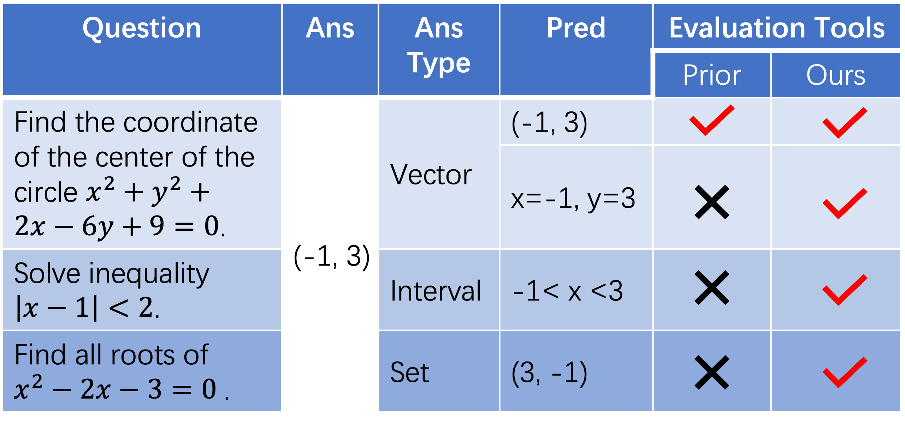

# MARIO 评估：使用您的数学大型语言模型进行自我评估——一套数学数据集评估工具集。

发布时间：2024年04月22日

`LLM应用`

> MARIO Eval: Evaluate Your Math LLM with your Math LLM--A mathematical dataset evaluation toolkit

# 摘要

> 大型语言模型（LLMs）在众多推理任务中得到应用，如解决数学问题。然而，现有的数学数据集通常配备有专为特定用途定制的评估脚本，这些脚本缺乏跨数据集的通用性。这导致评估工具的更新和调整往往缺乏系统性记录，进而造成跨研究比较的困难。为了解决这一问题，我们推出了一款全面的数学评估工具包，它采用Python计算机代数系统（CAS）确保数值精确，并可选集成了以自然语言处理能力著称的LLM。我们通过手动标注两个不同的数据集来验证工具包的有效性。实验结果表明，即使不使用LLM，该工具包也能提供比以往研究更稳定的评估结果。而当集成LLM后，评估效果更是显著提升。相关代码将在 \url{https://github.com/MARIO-Math-Reasoning/math_evaluation} 上开放获取。

> Large language models (LLMs) have been explored in a variety of reasoning tasks including solving of mathematical problems. Each math dataset typically includes its own specially designed evaluation script, which, while suitable for its intended use, lacks generalizability across different datasets. Consequently, updates and adaptations to these evaluation tools tend to occur without being systematically reported, leading to inconsistencies and obstacles to fair comparison across studies. To bridge this gap, we introduce a comprehensive mathematical evaluation toolkit that not only utilizes a python computer algebra system (CAS) for its numerical accuracy, but also integrates an optional LLM, known for its considerable natural language processing capabilities. To validate the effectiveness of our toolkit, we manually annotated two distinct datasets. Our experiments demonstrate that the toolkit yields more robust evaluation results compared to prior works, even without an LLM. Furthermore, when an LLM is incorporated, there is a notable enhancement. The code for our method will be made available at \url{https://github.com/MARIO-Math-Reasoning/math_evaluation}.

[Arxiv](https://arxiv.org/abs/2404.13925)