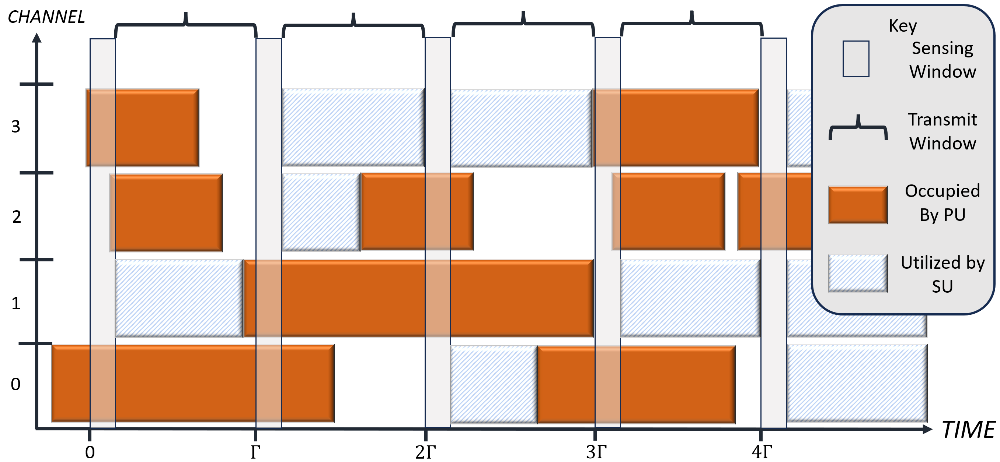
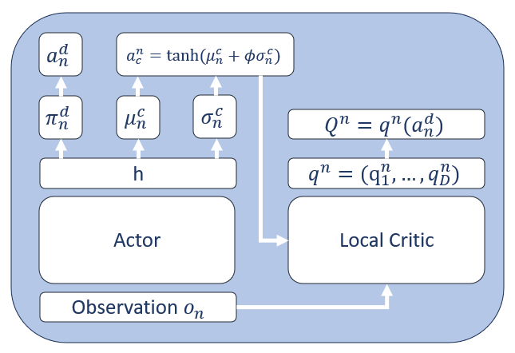
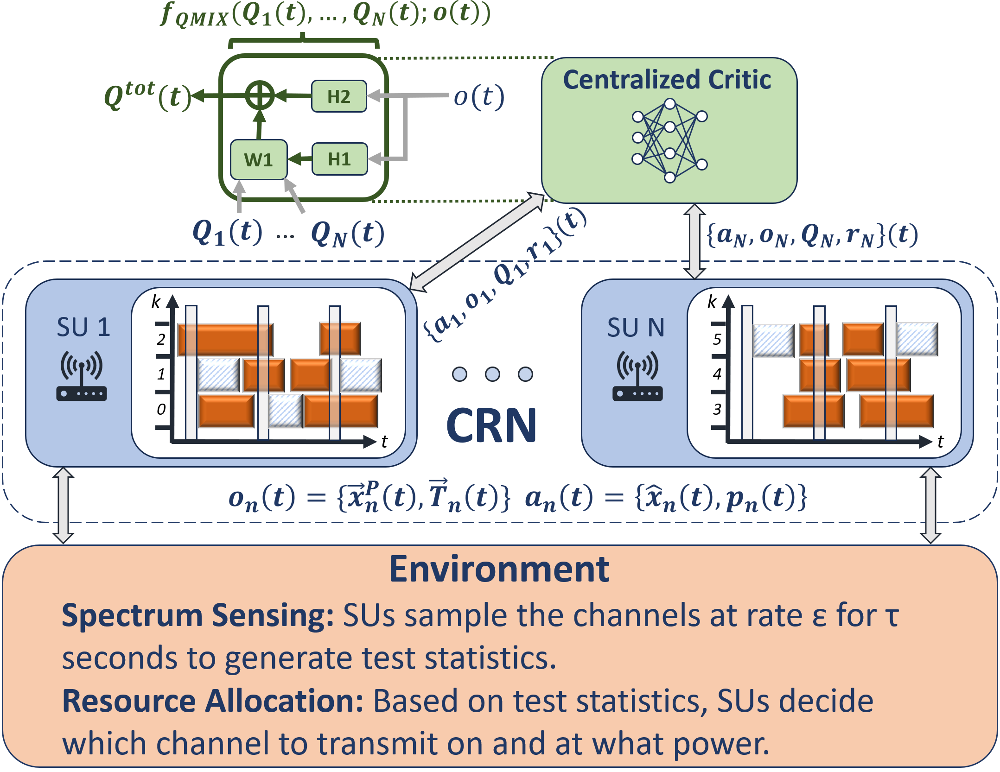
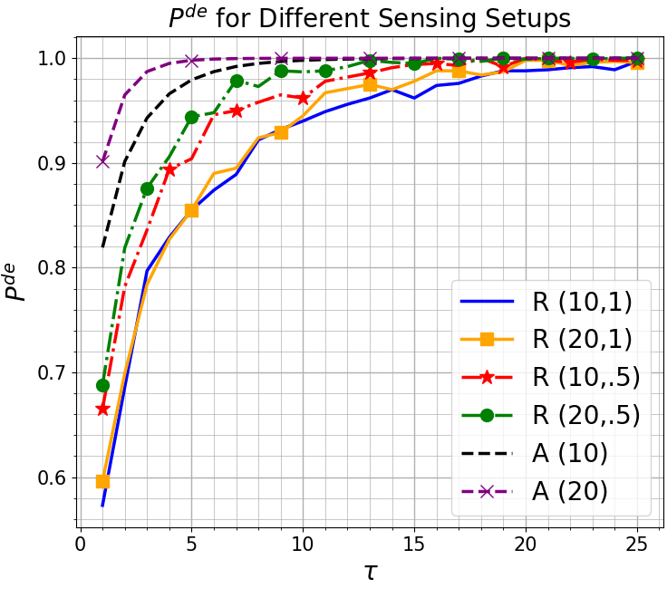
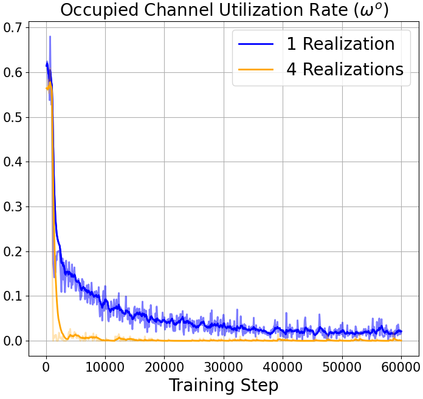
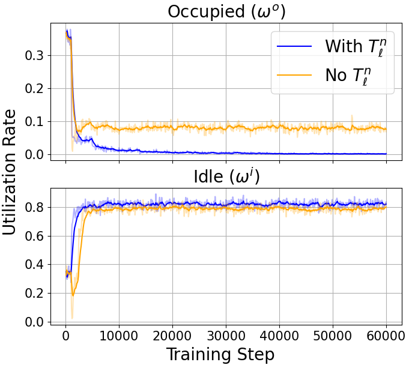
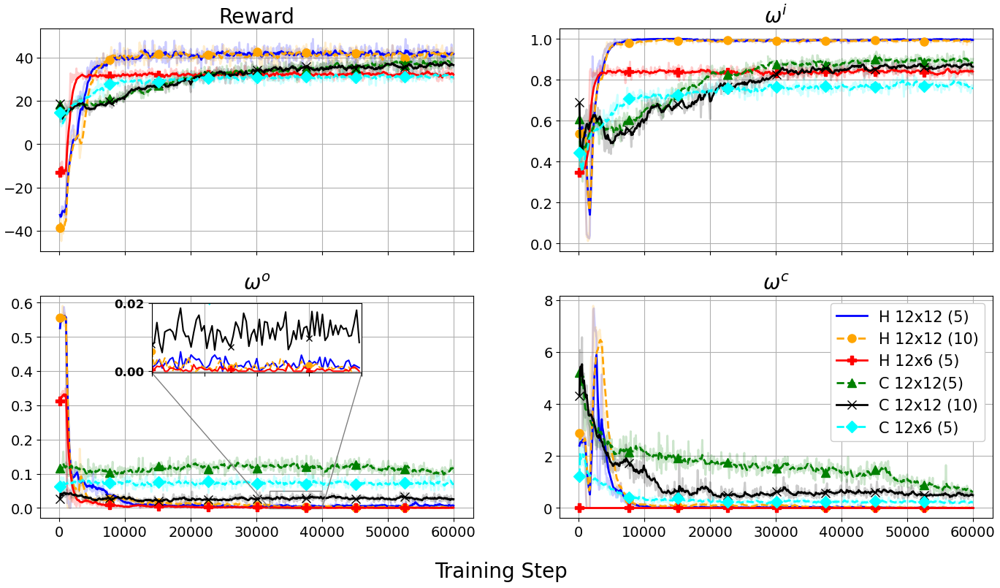
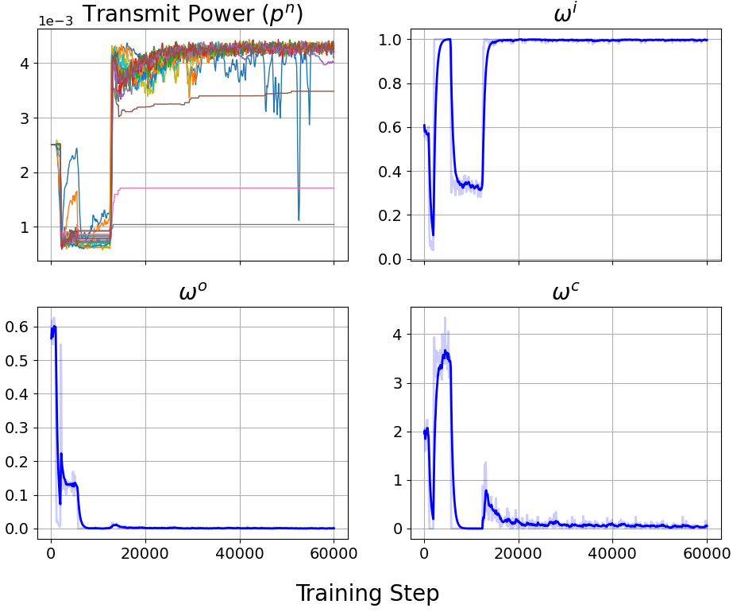

# 在认知无线电网络（CRN）中，采用多智能体混合同步优势策略（SAC）进行联合半静态分频指配（SS-DSA）。

发布时间：2024年04月22日

`Agent` `通信网络`

> Multi-Agent Hybrid SAC for Joint SS-DSA in CRNs

# 摘要

> 机会频谱接入有望提升认知无线电网络的频谱使用效率。在这些网络中，频谱感知与资源分配（SSRA）是提高系统吞吐量、减少次要用户与主网络冲突的关键。尽管如此，动态频谱接入领域的多数研究忽略了感知误差等不完美信息的影响，而联合SSRA能够利用额外信息对此进行改善。本研究将联合SSRA作为优化问题，目标是在信道感知、接入和传输功率限制下最大化CRN的净通信速率。考虑到问题的复杂性，我们采用多智能体强化学习方法，使次要用户网络能够在仅依赖局部测试统计信息的情况下，动态地接入空闲频谱，这一方法基于频谱感知的能量检测框架。在此基础上，我们提出了一种新颖的多智能体混合软演员-评论家（MHSAC）实现方法，并基于QMIX混合策略。实验结果表明，我们的SSRA算法HySSRA不仅有效提升了CRN的频谱资源利用率，还成功控制了对主网络的干扰，性能显著优于现有技术。此外，我们还研究了无线环境变化，如相干时间，对系统效果的影响。

> Opportunistic spectrum access has the potential to increase the efficiency of spectrum utilization in cognitive radio networks (CRNs). In CRNs, both spectrum sensing and resource allocation (SSRA) are critical to maximizing system throughput while minimizing collisions of secondary users with the primary network. However, many works in dynamic spectrum access do not consider the impact of imperfect sensing information such as mis-detected channels, which the additional information available in joint SSRA can help remediate. In this work, we examine joint SSRA as an optimization which seeks to maximize a CRN's net communication rate subject to constraints on channel sensing, channel access, and transmit power. Given the non-trivial nature of the problem, we leverage multi-agent reinforcement learning to enable a network of secondary users to dynamically access unoccupied spectrum via only local test statistics, formulated under the energy detection paradigm of spectrum sensing. In doing so, we develop a novel multi-agent implementation of hybrid soft actor critic, MHSAC, based on the QMIX mixing scheme. Through experiments, we find that our SSRA algorithm, HySSRA, is successful in maximizing the CRN's utilization of spectrum resources while also limiting its interference with the primary network, and outperforms the current state-of-the-art by a wide margin. We also explore the impact of wireless variations such as coherence time on the efficacy of the system.

[Arxiv](https://arxiv.org/abs/2404.14319)