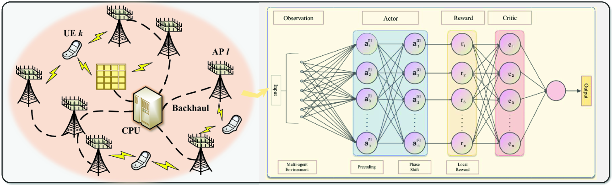
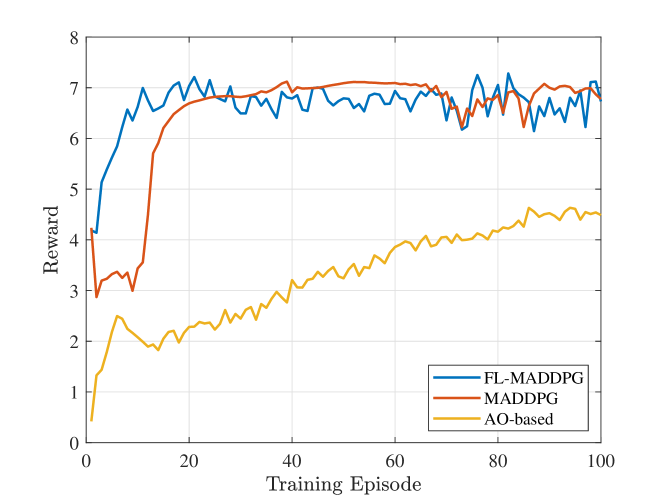
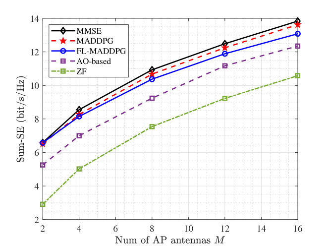
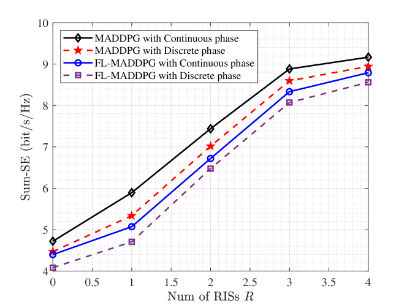
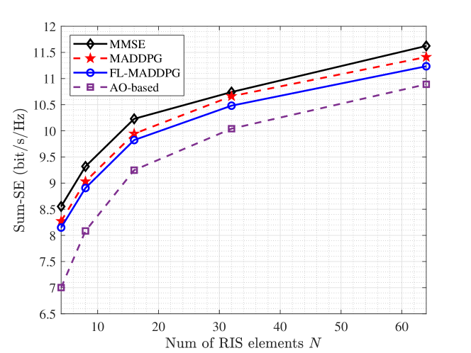

# 本文探讨了一种基于多智能体强化学习的方法，用于联合优化 RIS 辅助的无蜂窝大规模 MIMO 系统中的预编码和相位偏移，以提升系统性能。

发布时间：2024年04月22日

`Agent`

> Multi-agent Reinforcement Learning-based Joint Precoding and Phase Shift Optimization for RIS-aided Cell-Free Massive MIMO Systems

# 摘要

> 无单元（CF）大规模多输入多输出（mMIMO）技术，通过部署多个分布式接入点（APs），展现出提升频谱效率（SE）的巨大潜力。然而，恶劣的传播条件，如高穿透损耗，往往会严重影响通信质量。为了应对这一挑战，本研究将可重构智能表面（RIS）集成到CF mMIMO系统中，作为一种经济高效的解决方案。文章的核心在于对RIS辅助CF mMIMO系统进行联合预编码优化，目标是提升系统的整体SE。这包括对APs的预编码矩阵和RIS的反射系数进行调优。为攻克这一难题，我们提出了一种融合了模糊逻辑（FL）的全分布式多代理强化学习（MARL）算法。与传统的交替优化方法不同，该算法仅需局部信道状态信息，有效降低了对高带宽后端的需求。模拟实验结果证明，该FL-MARL算法在简化计算复杂度的同时，能够达到与常规MARL方法相媲美的性能。

> Cell-free (CF) massive multiple-input multiple-output (mMIMO) is a promising technique for achieving high spectral efficiency (SE) using multiple distributed access points (APs). However, harsh propagation environments often lead to significant communication performance degradation due to high penetration loss. To overcome this issue, we introduce the reconfigurable intelligent surface (RIS) into the CF mMIMO system as a low-cost and power-efficient solution. In this paper, we focus on optimizing the joint precoding design of the RIS-aided CF mMIMO system to maximize the sum SE. This involves optimizing the precoding matrix at the APs and the reflection coefficients at the RIS. To tackle this problem, we propose a fully distributed multi-agent reinforcement learning (MARL) algorithm that incorporates fuzzy logic (FL). Unlike conventional approaches that rely on alternating optimization techniques, our FL-based MARL algorithm only requires local channel state information, which reduces the need for high backhaul capacity. Simulation results demonstrate that our proposed FL-MARL algorithm effectively reduces computational complexity while achieving similar performance as conventional MARL methods.

[Arxiv](https://arxiv.org/abs/2404.14092)