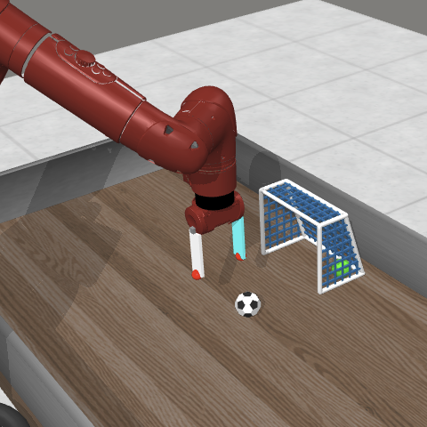
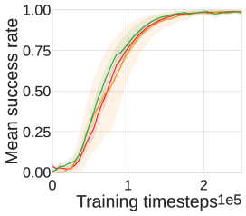
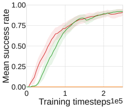
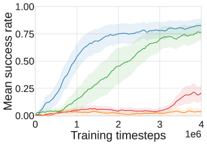
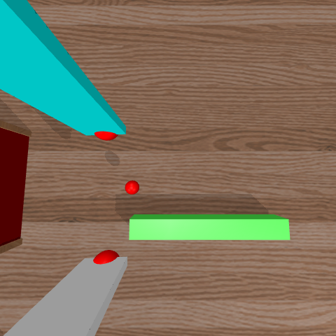
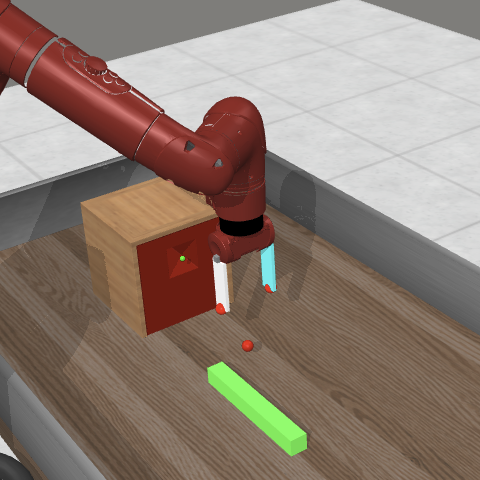

# 在多摄像头环境下，强化学习中的多视角解耦技术。

发布时间：2024年04月22日

`Agent` `计算机视觉`

> Multi-view Disentanglement for Reinforcement Learning with Multiple Cameras

# 摘要

> 图像驱动的强化学习（RL）智能体的表现会随着捕捉图像的相机位置不同而波动。通过同时在多个相机上进行训练，例如采用第一人称视角的相机，可以整合多样的视角信息，从而提升RL的表现。但现实中，硬件的限制可能会影响到多相机配置的可行性。此外，现实环境中的相机损坏也可能导致无法使用训练时的全部相机。为了解决这些硬件上的限制，我们引入了多视角解耦（MVD）技术，它能够利用多个相机学习出一种策略，实现对训练集中任一单一相机的零样本泛化能力。这种方法为RL提供了一个自监督的辅助学习任务，通过多相机学习解耦的表征，共享的表征在所有相机间保持一致，以便实现单相机的泛化，同时还有专属于特定相机的私有表征。实验结果证明，仅使用单一第三人称相机训练的RL智能体在许多控制任务中难以掌握最优策略；相比之下，我们的方法在训练时利用了多个相机的信息，最终能够仅依靠同一单一第三人称相机完成任务。

> The performance of image-based Reinforcement Learning (RL) agents can vary depending on the position of the camera used to capture the images. Training on multiple cameras simultaneously, including a first-person egocentric camera, can leverage information from different camera perspectives to improve the performance of RL. However, hardware constraints may limit the availability of multiple cameras in real-world deployment. Additionally, cameras may become damaged in the real-world preventing access to all cameras that were used during training. To overcome these hardware constraints, we propose Multi-View Disentanglement (MVD), which uses multiple cameras to learn a policy that achieves zero-shot generalisation to any single camera from the training set. Our approach is a self-supervised auxiliary task for RL that learns a disentangled representation from multiple cameras, with a shared representation that is aligned across all cameras to allow generalisation to a single camera, and a private representation that is camera-specific. We show experimentally that an RL agent trained on a single third-person camera is unable to learn an optimal policy in many control tasks; but, our approach, benefiting from multiple cameras during training, is able to solve the task using only the same single third-person camera.

[Arxiv](https://arxiv.org/abs/2404.14064)