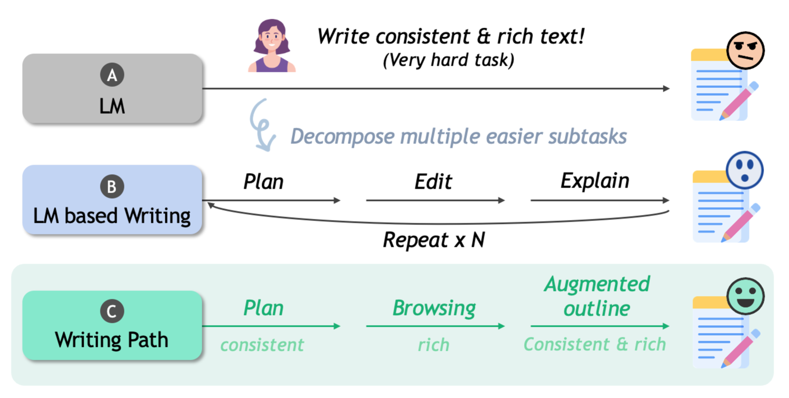
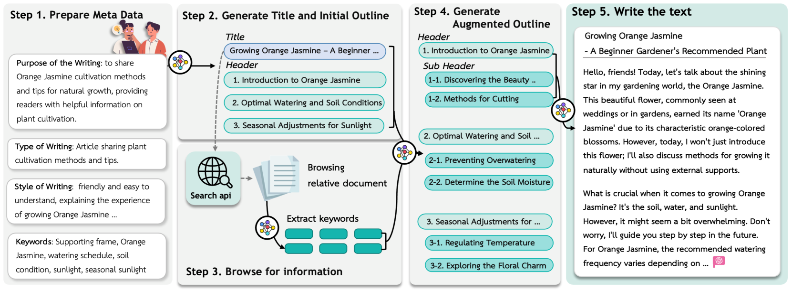
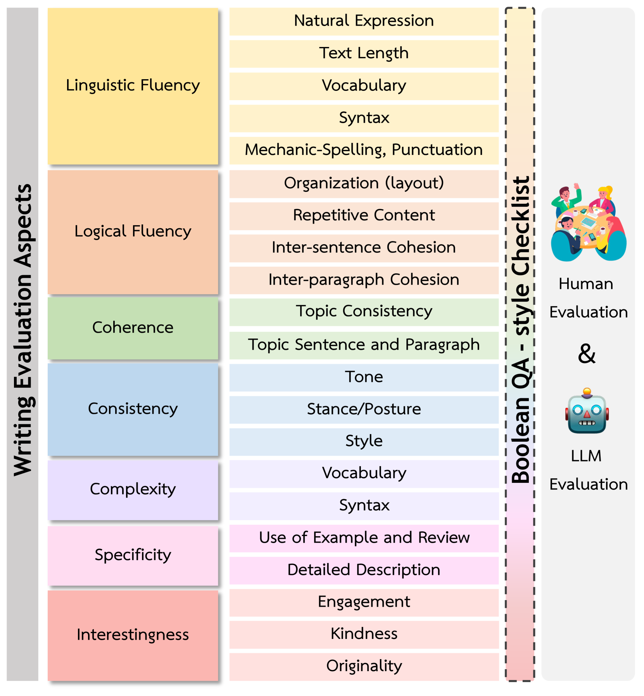
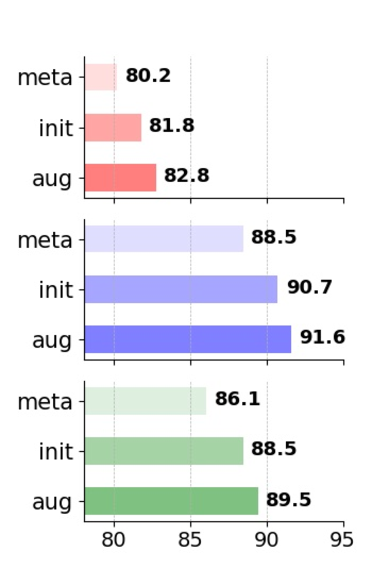
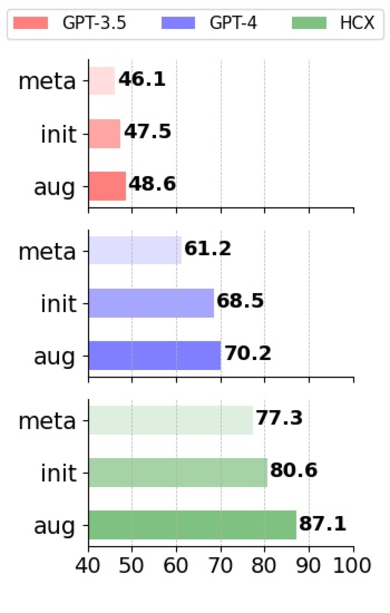
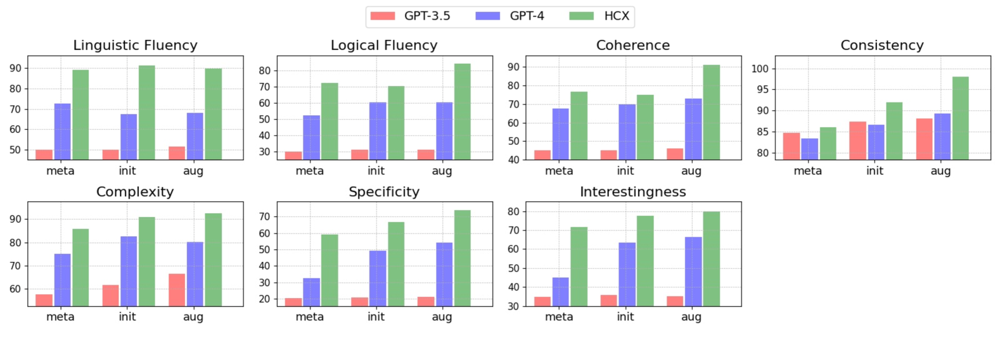
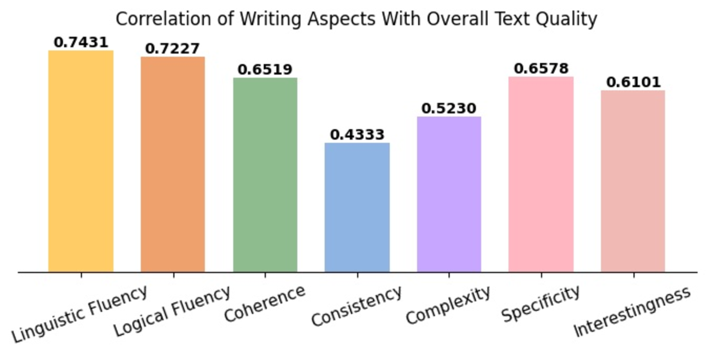
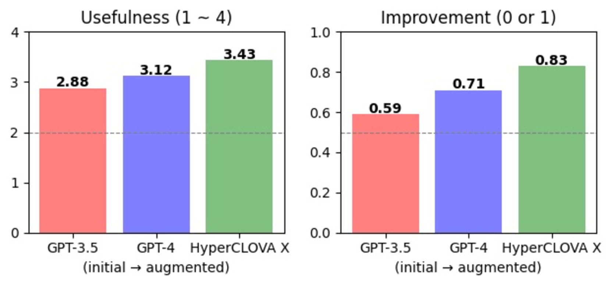
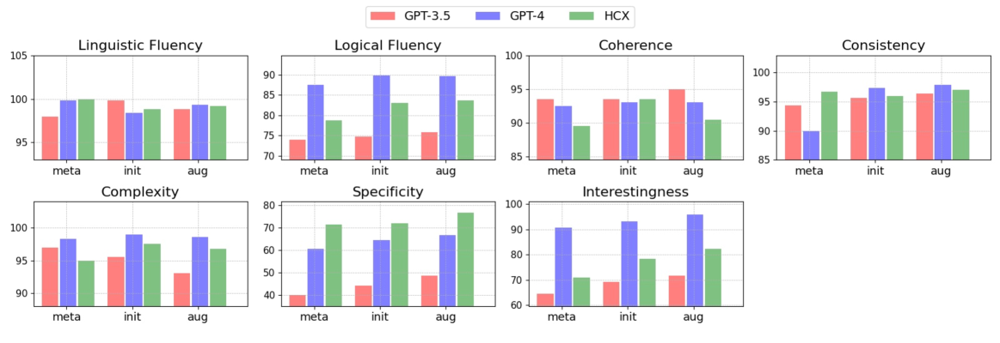

# 探索写作之道：借助大型语言模型实现基于大纲的文本创作。

发布时间：2024年04月22日

`LLM应用` `写作辅助` `人工智能创作`

> Navigating the Path of Writing: Outline-guided Text Generation with Large Language Models

# 摘要

> 大型语言模型（LLMs）极大地推动了写作过程的革新，不仅促进了协作创作，还提升了效率。然而，要生成既高质量又符合用户需求的文本，依然充满挑战。本文提出了一种名为“写作路径”的框架，它通过明确的大纲来引导LLMs创作既定目标、高品质的文本作品。该方法借鉴了结构化写作规划和推理路径的精髓，致力于捕捉并体现用户在整个写作过程中的意图。我们从无结构的博客文章中构建了一个多样化的数据集，用以评估写作表现，并引入了一个全面的评估框架，用以衡量大纲和生成文本的质量。通过与GPT-3.5-turbo、GPT-4和HyperCLOVA X的比较评估，我们发现“写作路径”方法显著提升了文本质量，这一点得到了LLMs和人类评估的一致认可。本研究展示了将写作专门技术整合到LLMs中的巨大潜力，以更好地满足用户的多元写作需求。

> Large Language Models (LLMs) have significantly impacted the writing process, enabling collaborative content creation and enhancing productivity. However, generating high-quality, user-aligned text remains challenging. In this paper, we propose Writing Path, a framework that uses explicit outlines to guide LLMs in generating goal-oriented, high-quality pieces of writing. Our approach draws inspiration from structured writing planning and reasoning paths, focusing on capturing and reflecting user intentions throughout the writing process. We construct a diverse dataset from unstructured blog posts to benchmark writing performance and introduce a comprehensive evaluation framework assessing the quality of outlines and generated texts. Our evaluations with GPT-3.5-turbo, GPT-4, and HyperCLOVA X demonstrate that the Writing Path approach significantly enhances text quality according to both LLMs and human evaluations. This study highlights the potential of integrating writing-specific techniques into LLMs to enhance their ability to meet the diverse writing needs of users.

[Arxiv](https://arxiv.org/abs/2404.13919)