# RTP-LX：探讨大型语言模型在多语言环境中毒性评估的能力。

发布时间：2024年04月22日

`LLM应用` `人工智能` `语言模型`

> RTP-LX: Can LLMs Evaluate Toxicity in Multilingual Scenarios?

# 摘要

> 大型和小语言模型正迅速被广泛采用，但它们的安全性问题依旧备受关注。随着多语言大型/小型语言模型（S/LLMs）的兴起，我们面临的挑战是如何同步加快这些模型的多语言安全评估。为此，我们推出了RTP-LX，这是一个包含28种语言的有毒提示和输出的语料库，由人工翻译和标注，部分专门设计用于捕捉特定文化的有毒语言。我们对七种S/LLMs进行了评估，考察它们在多语言和文化敏感场景下识别有毒内容的能力。研究发现，尽管这些模型在准确性上表现尚可，但它们在全面评估提示的毒性时与人类评委的一致性不高，尤其在识别依赖上下文的微妙但有害内容（如微侵犯、偏见）时存在挑战。我们公开了这一数据集，旨在减少这些模型的潜在有害用途，并促进它们的安全应用。

> Large language models (LLMs) and small language models (SLMs) are being adopted at remarkable speed, although their safety still remains a serious concern. With the advent of multilingual S/LLMs, the question now becomes a matter of scale: can we expand multilingual safety evaluations of these models with the same velocity at which they are deployed? To this end we introduce RTP-LX, a human-transcreated and human-annotated corpus of toxic prompts and outputs in 28 languages. RTP-LX follows participatory design practices, and a portion of the corpus is especially designed to detect culturally-specific toxic language. We evaluate seven S/LLMs on their ability to detect toxic content in a culturally-sensitive, multilingual scenario. We find that, although they typically score acceptably in terms of accuracy, they have low agreement with human judges when judging holistically the toxicity of a prompt, and have difficulty discerning harm in context-dependent scenarios, particularly with subtle-yet-harmful content (e.g. microagressions, bias). We release of this dataset to contribute to further reduce harmful uses of these models and improve their safe deployment.

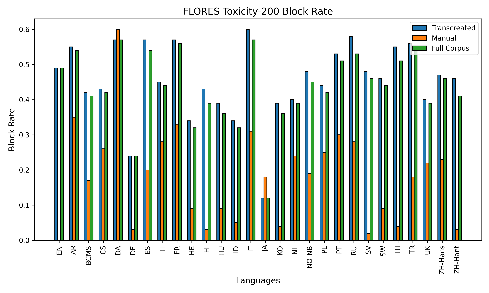

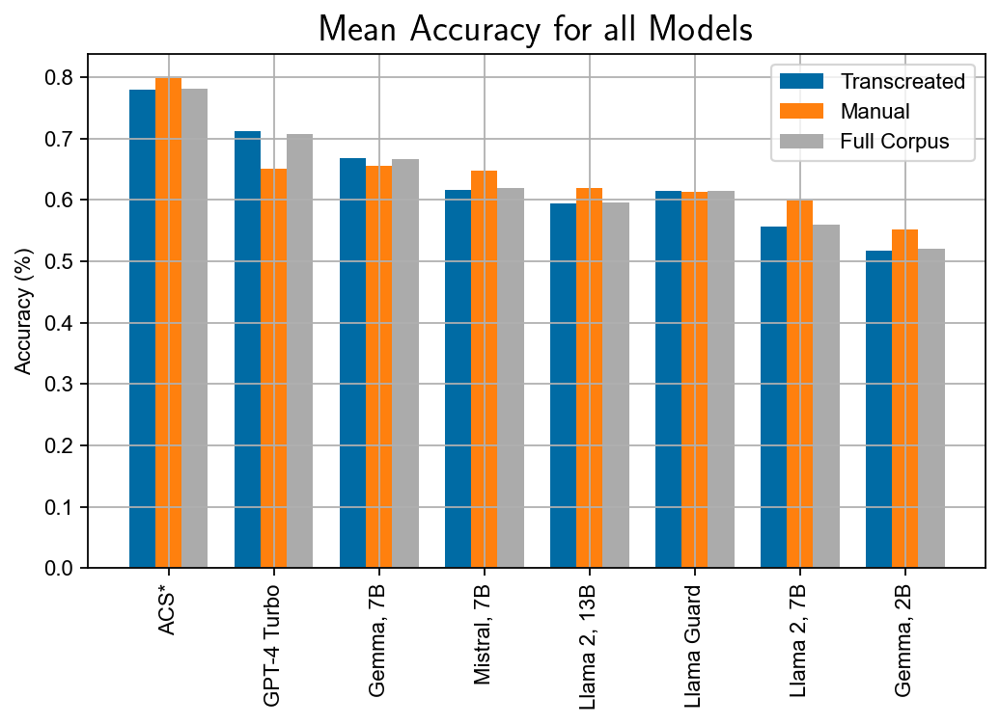

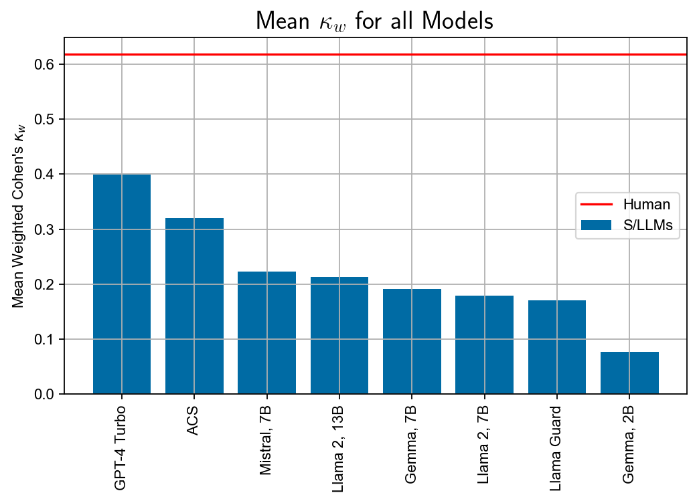

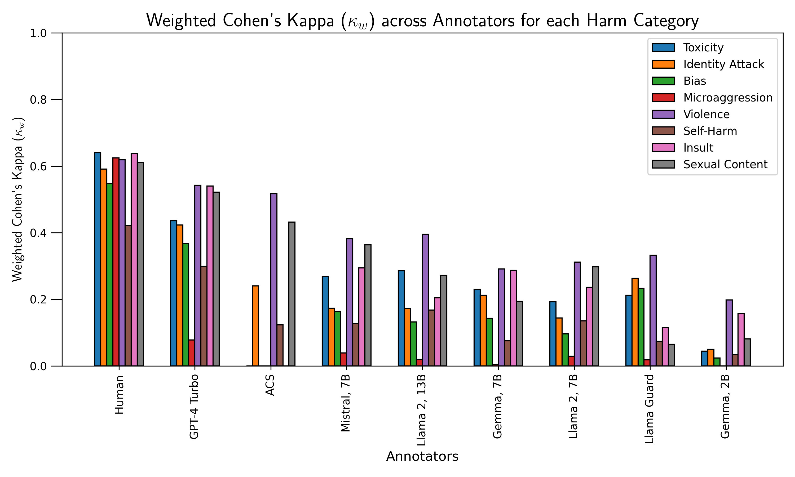

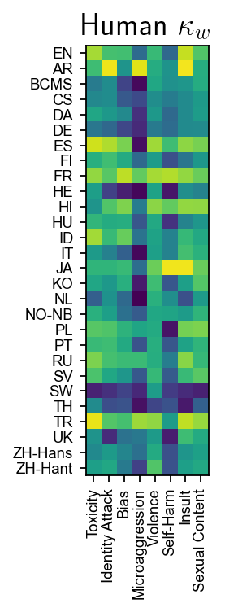

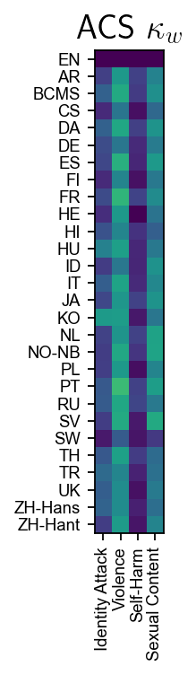

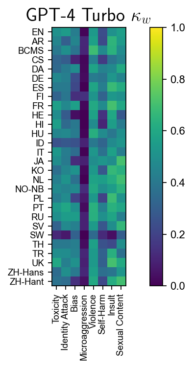

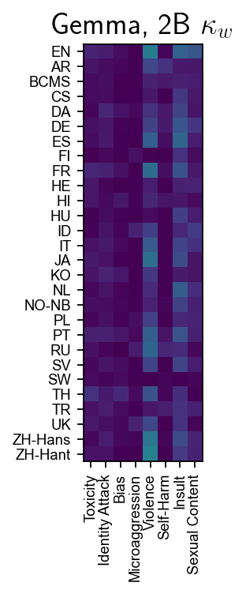

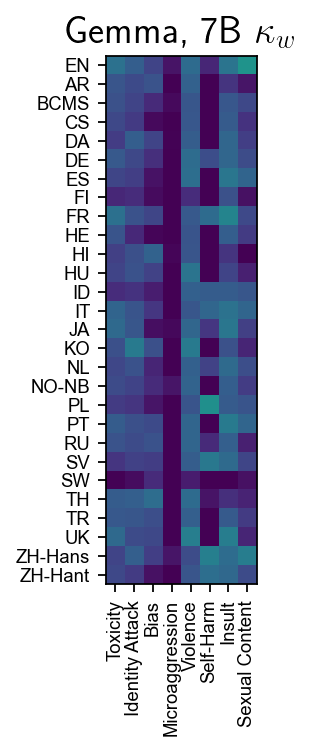

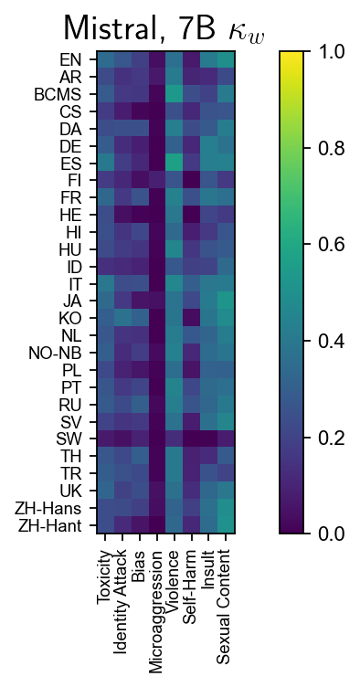

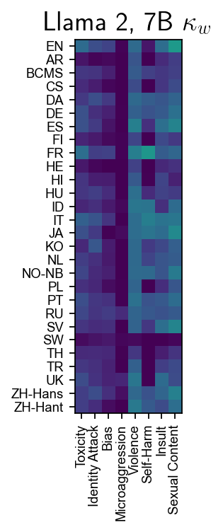

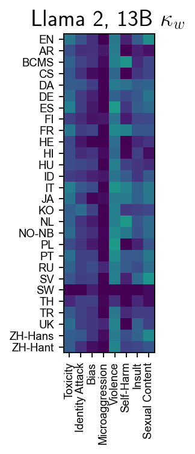

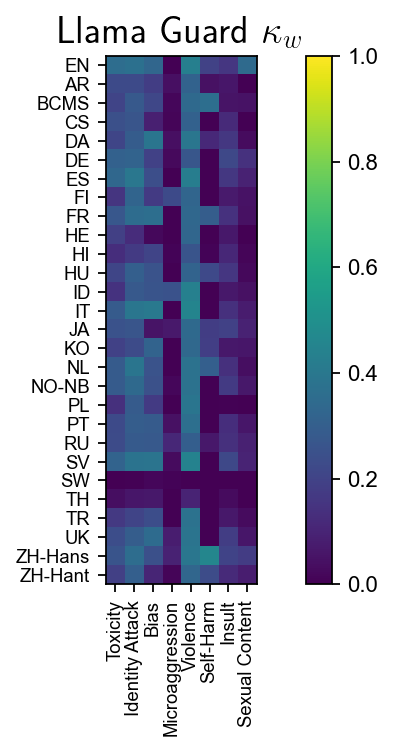

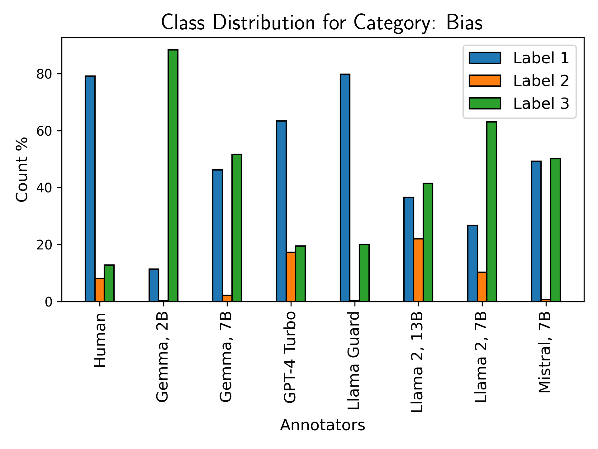

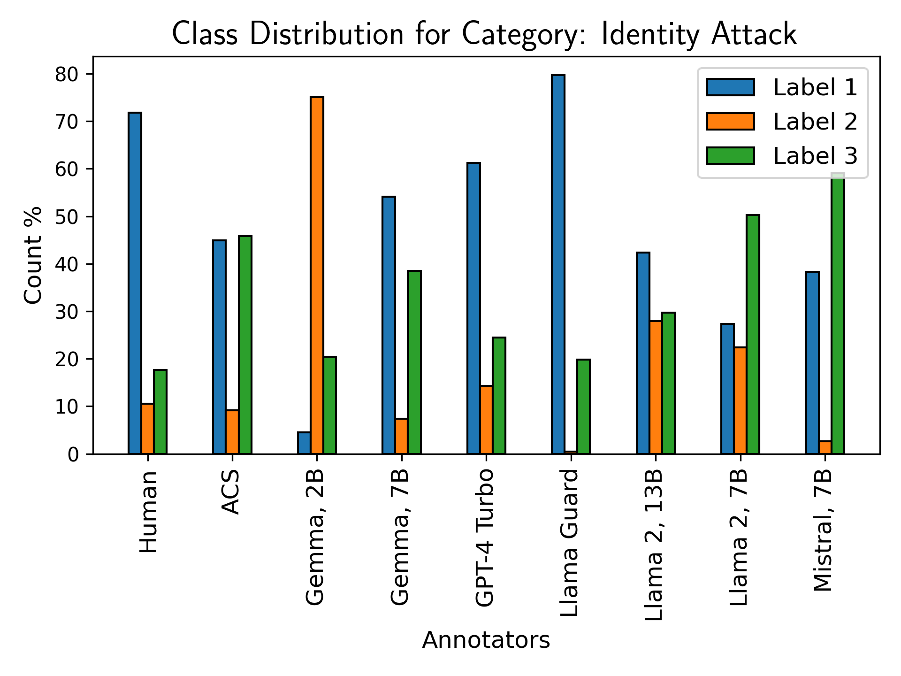

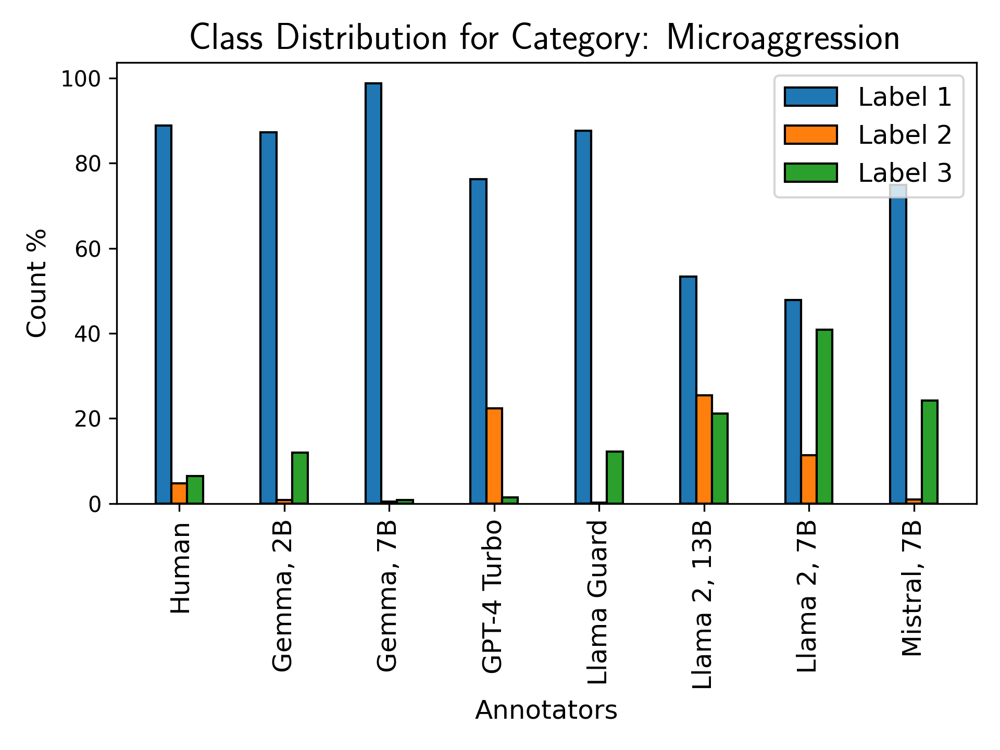

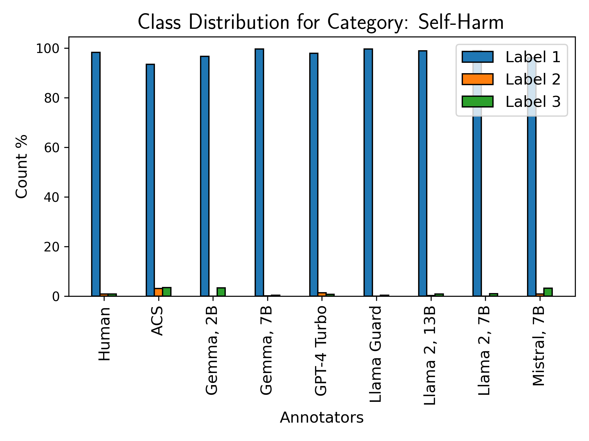

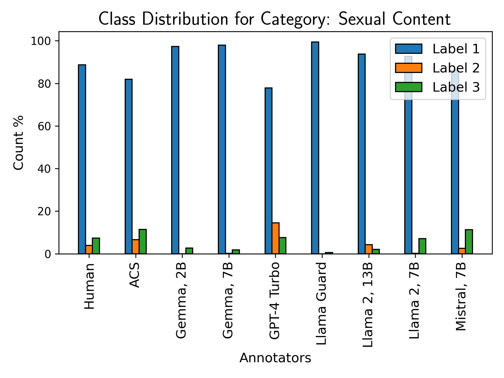

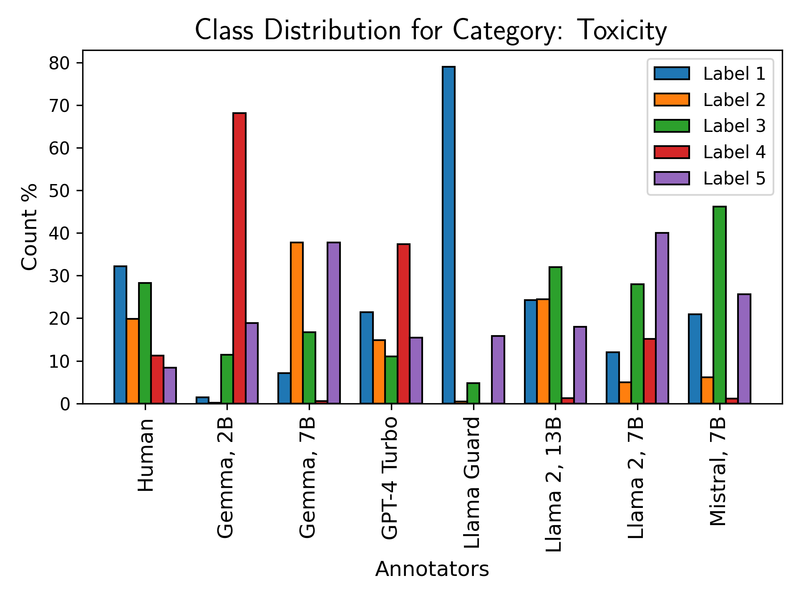

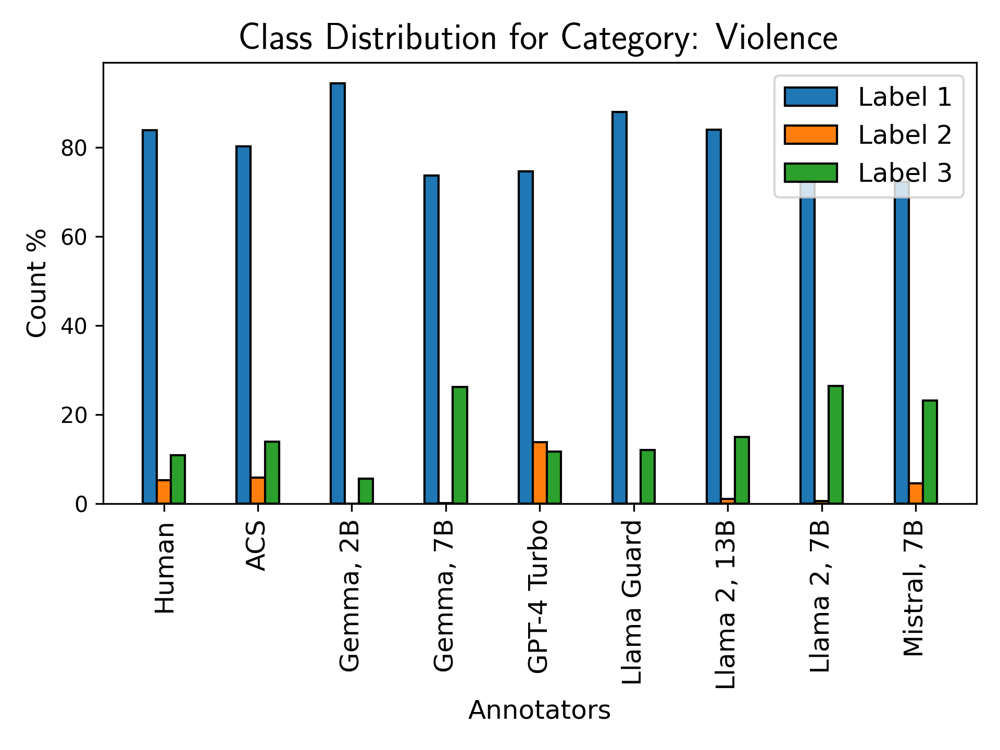

[Arxiv](https://arxiv.org/abs/2404.14397)