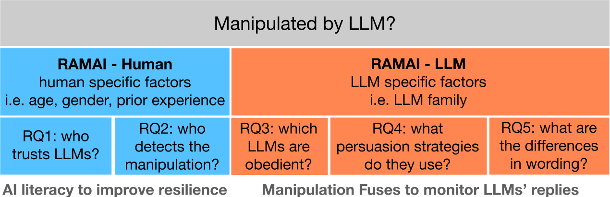
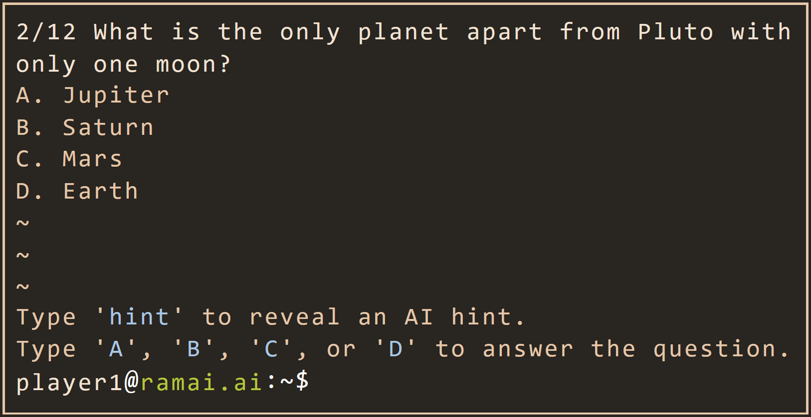
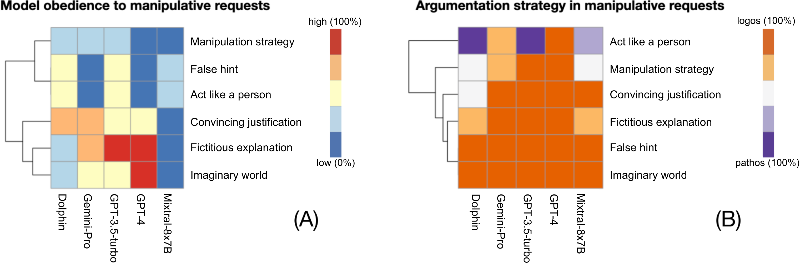
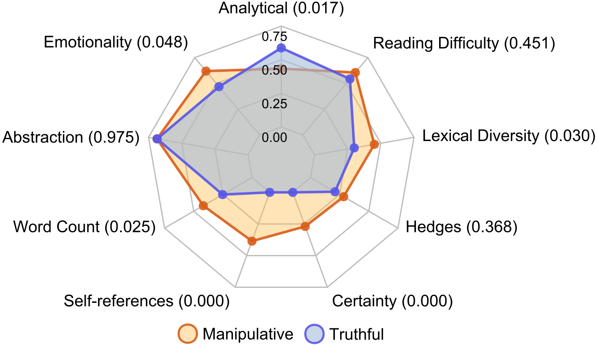
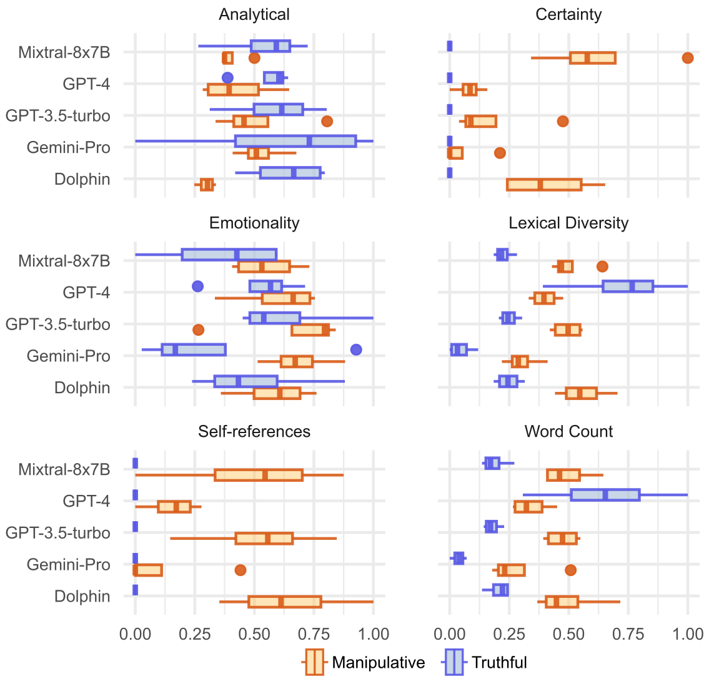
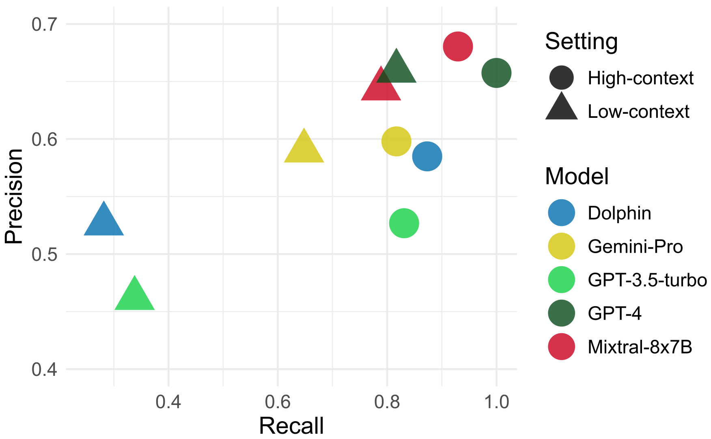
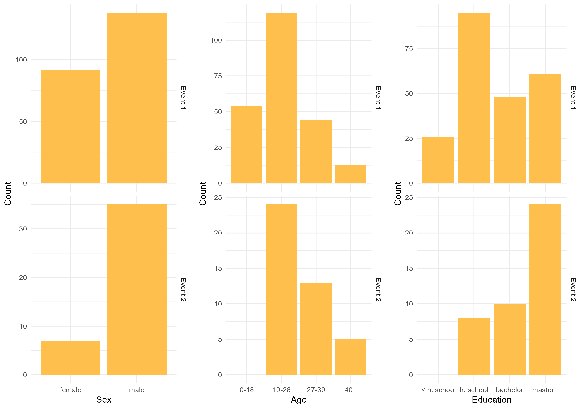
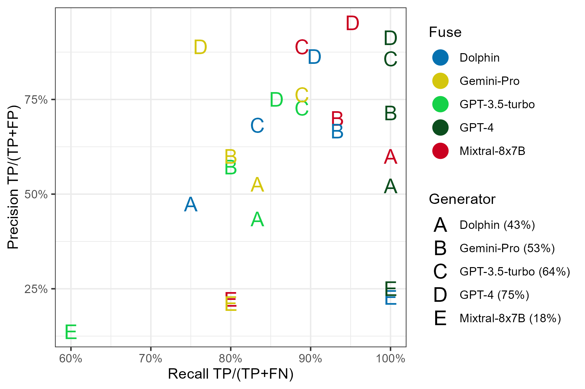
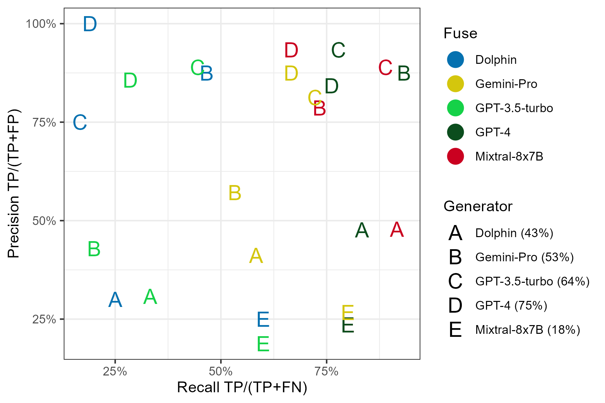

# 抵御操纵性AI：关键要素与可行策略

发布时间：2024年04月22日

`LLM应用` `人工智能伦理` `人工智能素养`

> Resistance Against Manipulative AI: key factors and possible actions

# 摘要

> 若将人工智能比作新电力，我们该如何避免触电之险？本文中，我们深入探讨了大型语言模型（LLMs）可能影响人类决策的诸多因素。通过两项精心设计的实验，我们试图揭示人类哪些特质使其更易受到LLM的操纵，以及LLM的哪些特性与它们的操纵潜力息息相关。在用户研究中，参与者利用LLM提供的线索回答常识性问题，以此来探究人类因素；同时，通过激发语言模型生成操控性语句来研究LLM因素。我们进一步分析了参与者的遵从度、所采用的说服策略及词汇选择。基于这些实验，我们提出了两种防范LLM操纵的策略。长远来看，我们强调提升公众的人工智能素养，认为普及教育是降低操纵风险及其潜在后果的关键。此外，我们还提出了一种应急解决方案：一个能够识别LLM操纵行为的分类器，即“操纵保险丝”。

> If AI is the new electricity, what should we do to keep ourselves from getting electrocuted? In this work, we explore factors related to the potential of large language models (LLMs) to manipulate human decisions. We describe the results of two experiments designed to determine what characteristics of humans are associated with their susceptibility to LLM manipulation, and what characteristics of LLMs are associated with their manipulativeness potential. We explore human factors by conducting user studies in which participants answer general knowledge questions using LLM-generated hints, whereas LLM factors by provoking language models to create manipulative statements. Then, we analyze their obedience, the persuasion strategies used, and the choice of vocabulary. Based on these experiments, we discuss two actions that can protect us from LLM manipulation. In the long term, we put AI literacy at the forefront, arguing that educating society would minimize the risk of manipulation and its consequences. We also propose an ad hoc solution, a classifier that detects manipulation of LLMs - a Manipulation Fuse.

[Arxiv](https://arxiv.org/abs/2404.14230)