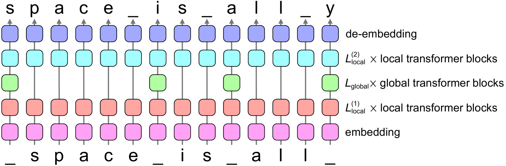
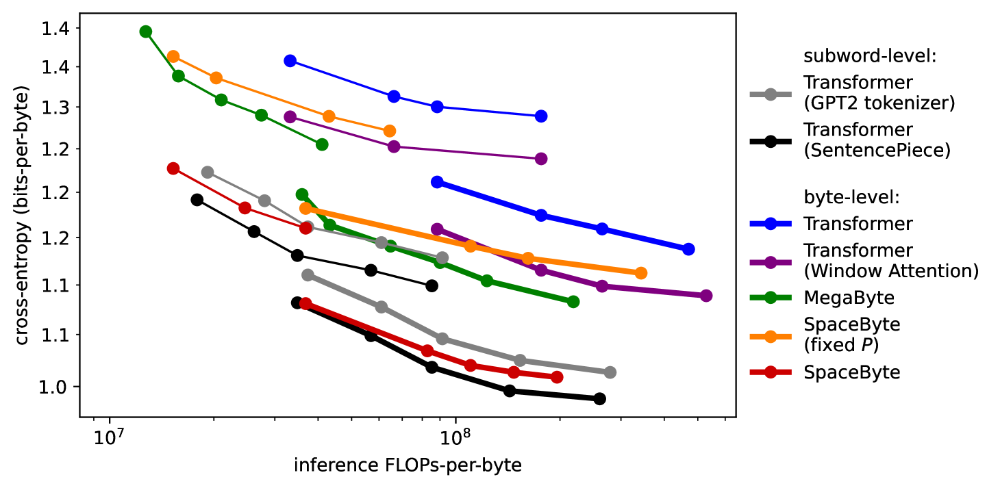
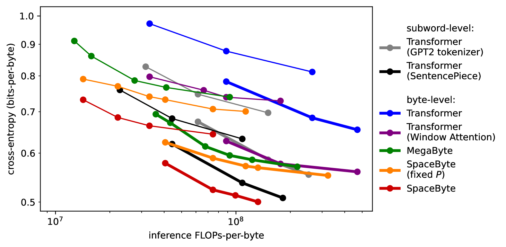
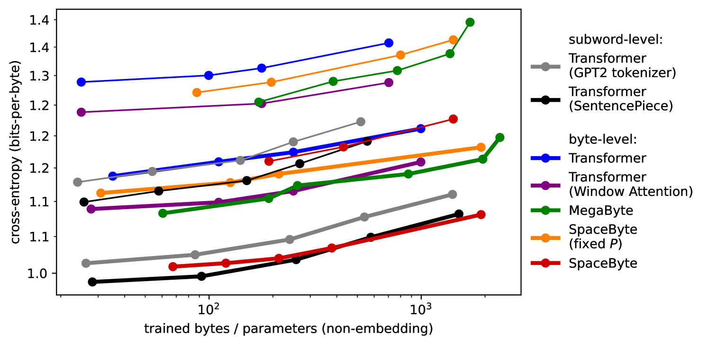
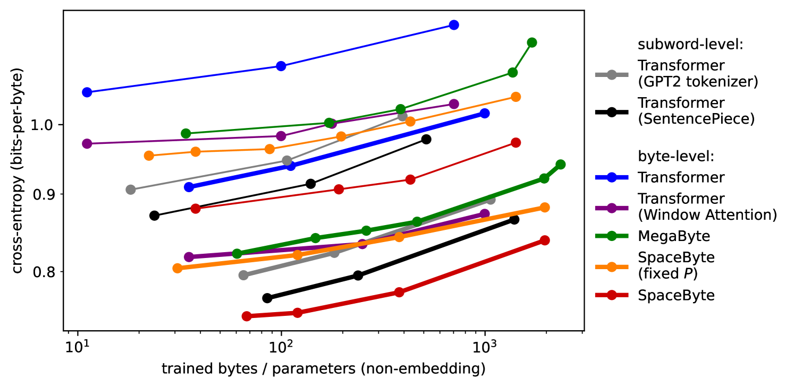
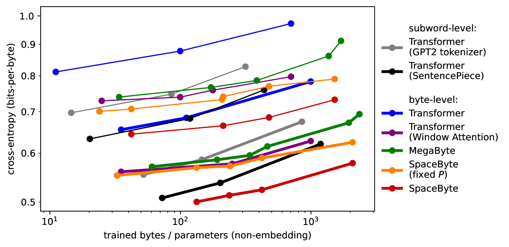

# SpaceByte：探索在大型语言模型中去除标记化的过程

发布时间：2024年04月22日

`LLM理论` `机器学习`

> SpaceByte: Towards Deleting Tokenization from Large Language Modeling

# 摘要

> Tokenization 因其显著提升性能而在大型语言模型中得到广泛应用。但它也带来了诸如性能偏差、对抗性脆弱性增加、字符级建模性能下降和建模复杂性增加等不利因素。为了克服这些问题而不影响性能，我们引入了 SpaceByte，一种创新的字节级解码器架构，它成功弥合了字节级与子词自回归语言模型性能之间的鸿沟。SpaceByte 包含一个字节级 Transformer 模型，并在层间巧妙地嵌入了更大规模的 Transformer 块。我们发现，仅在特定字节（如通常用来标示单词边界的空格字符）之后应用这些扩展块，可以显著提升性能。实验结果表明，在相同的训练和推理计算资源下，SpaceByte 不仅超越了其他字节级架构，其性能还大致与 Tokenized Transformer 架构相当。

> Tokenization is widely used in large language models because it significantly improves performance. However, tokenization imposes several disadvantages, such as performance biases, increased adversarial vulnerability, decreased character-level modeling performance, and increased modeling complexity. To address these disadvantages without sacrificing performance, we propose SpaceByte, a novel byte-level decoder architecture that closes the performance gap between byte-level and subword autoregressive language modeling. SpaceByte consists of a byte-level Transformer model, but with extra larger transformer blocks inserted in the middle of the layers. We find that performance is significantly improved by applying these larger blocks only after certain bytes, such as space characters, which typically denote word boundaries. Our experiments show that for a fixed training and inference compute budget, SpaceByte outperforms other byte-level architectures and roughly matches the performance of tokenized Transformer architectures.

[Arxiv](https://arxiv.org/abs/2404.14408)