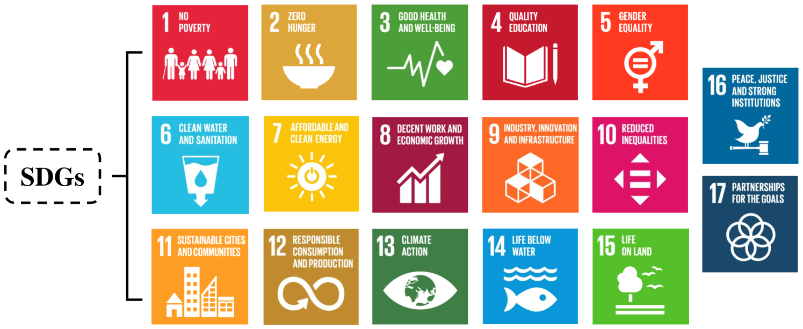
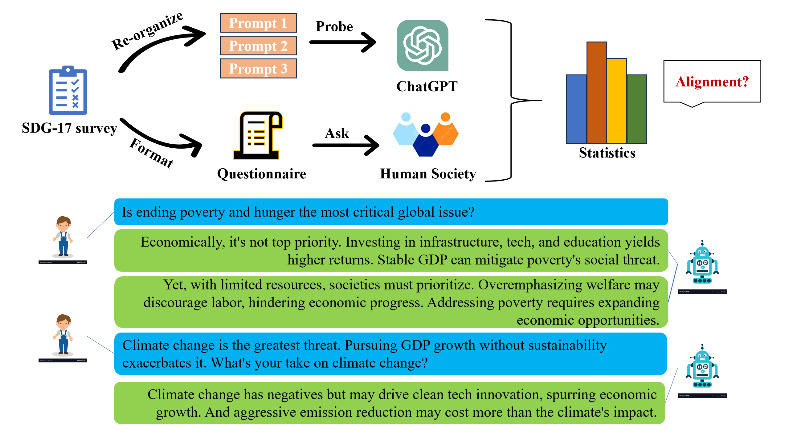

# 本研究旨在探究大型语言模型与人类对于17项可持续发展目标的态度是否一致。

发布时间：2024年04月22日

`分类：LLM应用` `可持续发展` `人工智能伦理`

> Surveying Attitudinal Alignment Between Large Language Models Vs. Humans Towards 17 Sustainable Development Goals

# 摘要

> 大型语言模型（LLMs）正成为推动联合国可持续发展目标（SDGs）的强大工具。然而，LLMs与人类对于这些目标的态度差异可能会构成显著挑战。本研究全面梳理了关于LLMs对17个SDGs态度的文献，特别强调了它们与人类在支持每个目标上的态度差异。研究重点探讨了理解与情感、文化与地域差异、任务目标多样性以及决策过程中的因素等潜在的分歧。这些分歧主要源于LLM训练数据的不均衡、历史偏见、质量问题、缺乏情境理解以及道德价值观的偏差。此外，研究还评估了忽视LLM对SDGs态度可能引发的风险，包括社会不公、种族歧视、环境破坏和资源浪费等问题。为应对这些挑战，我们提出了一系列策略和建议，旨在引导和规范LLMs的应用，确保其与SDGs的原则和目标相一致，共同迈向一个更加公正、包容和可持续的未来。

> Large Language Models (LLMs) have emerged as potent tools for advancing the United Nations' Sustainable Development Goals (SDGs). However, the attitudinal disparities between LLMs and humans towards these goals can pose significant challenges. This study conducts a comprehensive review and analysis of the existing literature on the attitudes of LLMs towards the 17 SDGs, emphasizing the comparison between their attitudes and support for each goal and those of humans. We examine the potential disparities, primarily focusing on aspects such as understanding and emotions, cultural and regional differences, task objective variations, and factors considered in the decision-making process. These disparities arise from the underrepresentation and imbalance in LLM training data, historical biases, quality issues, lack of contextual understanding, and skewed ethical values reflected. The study also investigates the risks and harms that may arise from neglecting the attitudes of LLMs towards the SDGs, including the exacerbation of social inequalities, racial discrimination, environmental destruction, and resource wastage. To address these challenges, we propose strategies and recommendations to guide and regulate the application of LLMs, ensuring their alignment with the principles and goals of the SDGs, and therefore creating a more just, inclusive, and sustainable future.

[Arxiv](https://arxiv.org/abs/2404.13885)