# TrimCaching：一种用于人工智能模型下载的参数共享边缘缓存技术

发布时间：2024年04月22日

`LLM应用` `移动网络` `人工智能`

> TrimCaching: Parameter-sharing Edge Caching for AI Model Downloading

# 摘要

> 下一代移动网络有望实现人工智能模型的快速下载至终端用户。通过在边缘服务器缓存模型，网络能够以低延迟提供模型，形成了所谓的边缘模型缓存概念。本文提出了一种创新的模型布局策略——参数共享模型缓存（TrimCaching）。该策略基于一个关键发现：多种AI模型，包括卷积神经网络和大型语言模型，能够共享大量包含可复用知识的参数块，以此提升存储效率。我们提出了一个参数共享模型布局问题，旨在通过在存储效率与服务延迟之间取得平衡，最大化多边缘无线网络中的缓存命中率。该问题被证明是一个具有次模约束的次模最大化问题，对于这类问题，没有已知的多项式时间近似算法。为应对这一挑战，我们专注于一个实际中常见的重要特例，即少数固定数量的参数块在不同模型间共享。在此情况下，我们开发了一个具有 $\left(1-ε\right)/2$ 近似保证的多项式时间算法。接着，我们针对一般情况的原始问题，通过设计一种贪婪算法来求解。模拟结果显示，与现有的不利用AI模型共享参数的内容缓存相比，TrimCaching框架在提升缓存命中率方面取得了显著进步。

> Next-generation mobile networks are expected to facilitate fast AI model downloading to end users. By caching models on edge servers, mobile networks can deliver models to end users with low latency, resulting in a paradigm called edge model caching. In this paper, we develop a novel model placement scheme, called parameter-sharing model caching (TrimCaching). TrimCaching exploits the key observation that a wide range of AI models, such as convolutional neural networks or large language models, can share a significant proportion of parameter blocks containing reusable knowledge, thereby improving storage efficiency. To this end, we formulate a parameter-sharing model placement problem to maximize the cache hit ratio in multi-edge wireless networks by balancing the fundamental tradeoff between storage efficiency and service latency. We show that the formulated problem is a submodular maximization problem with submodular constraints, for which no polynomial-time approximation algorithm exists. To overcome this challenge, we study an important special case, where a small fixed number of parameter blocks are shared across models, which often holds in practice. In such a case, a polynomial-time algorithm with $\left(1-ε\right)/2$-approximation guarantee is developed. Subsequently, we address the original problem for the general case by developing a greedy algorithm. Simulation results demonstrate that the proposed TrimCaching framework significantly improves the cache hit ratio compared with state-of-the-art content caching without exploiting shared parameters in AI models.

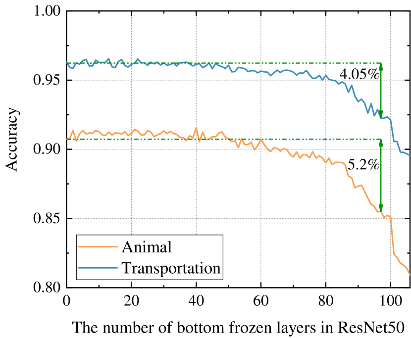

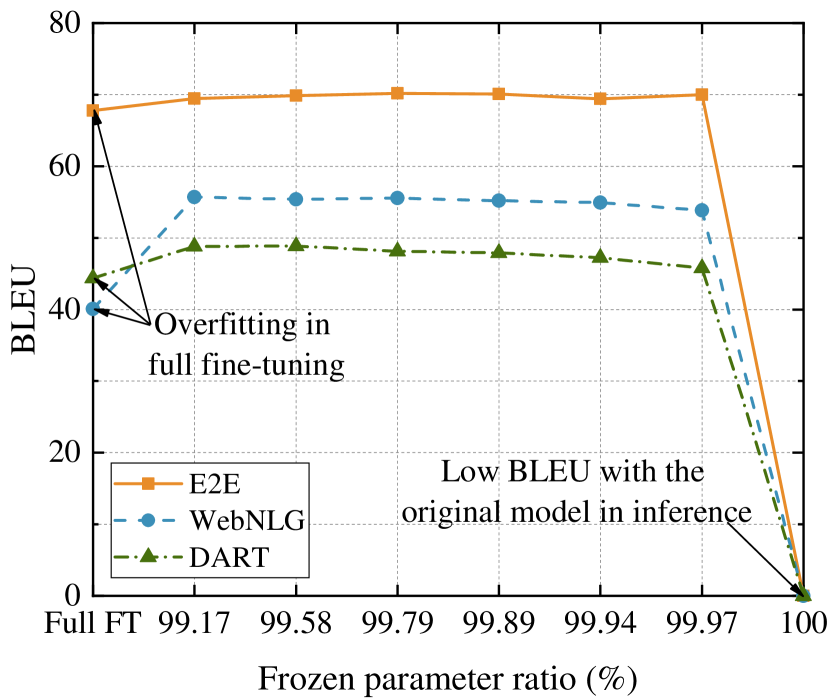

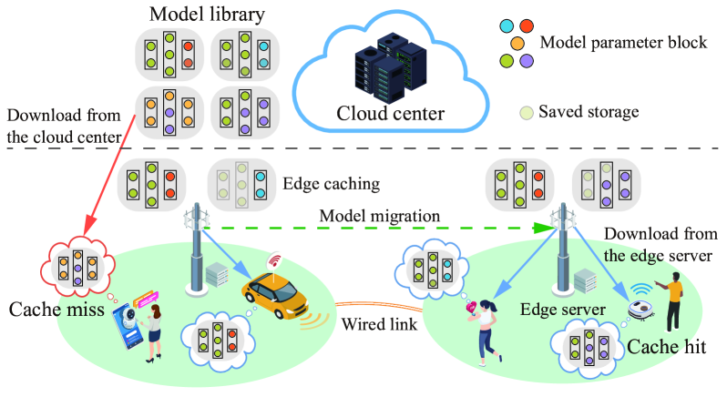

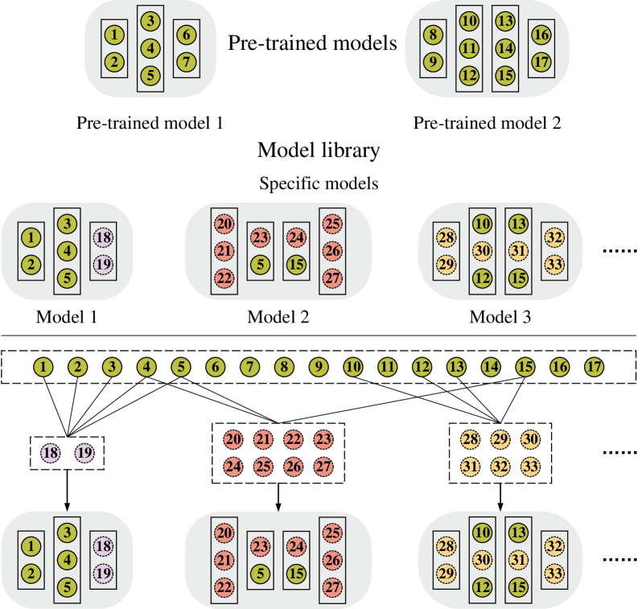

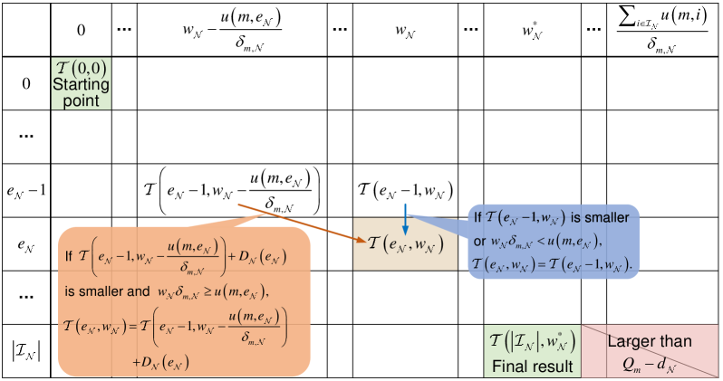

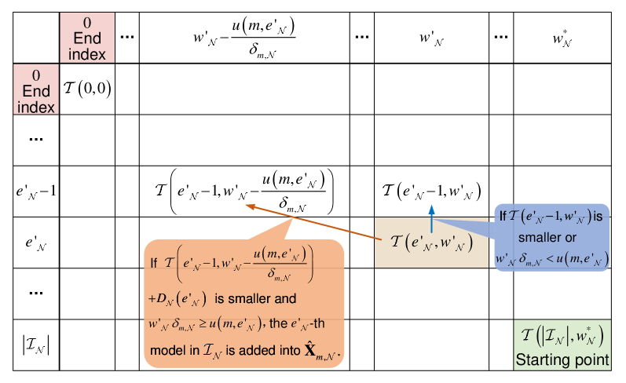

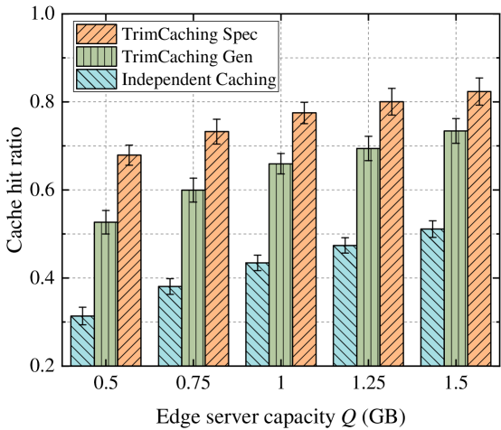

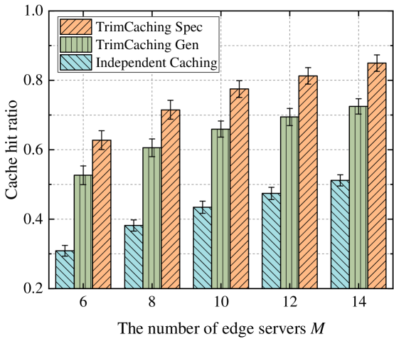

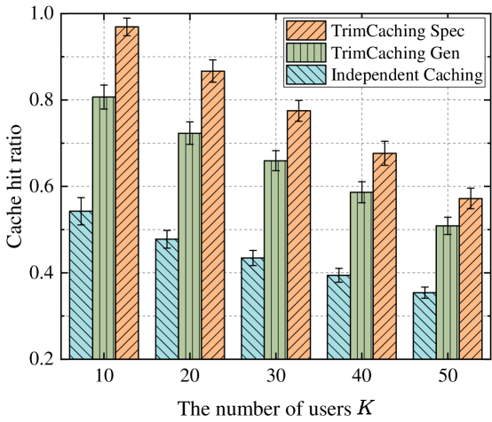

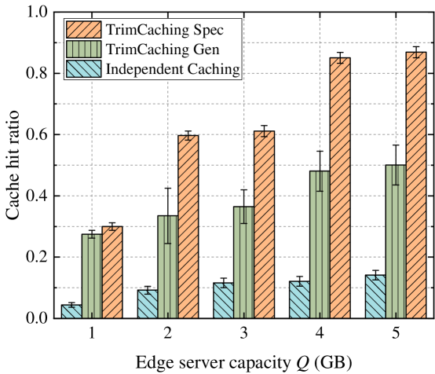

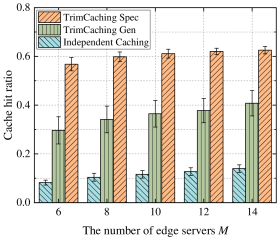

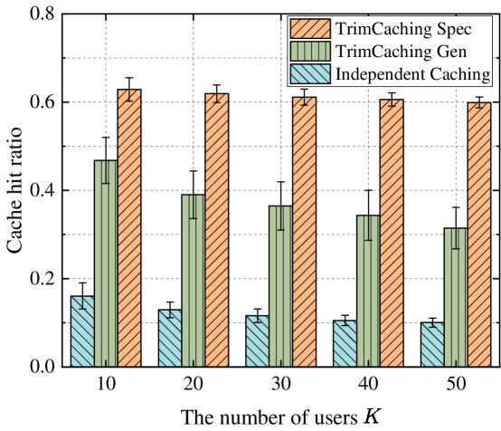

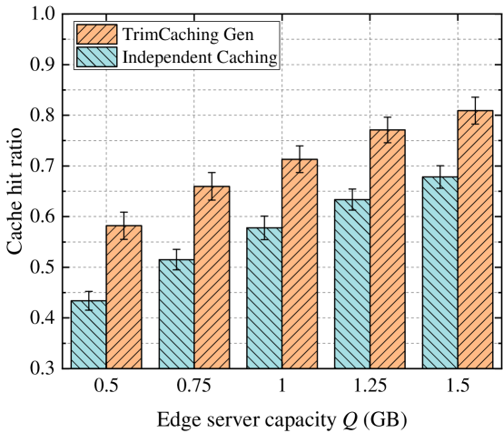

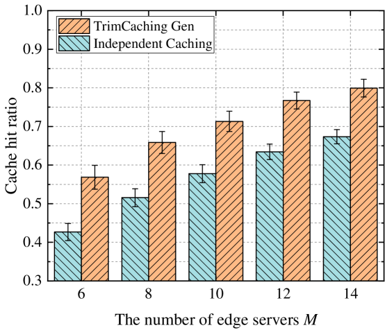

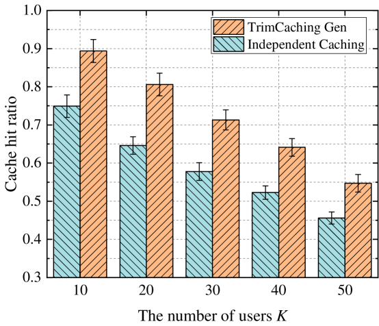

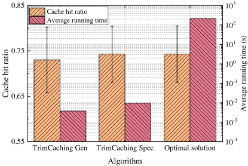

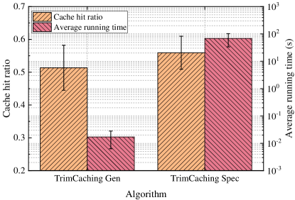

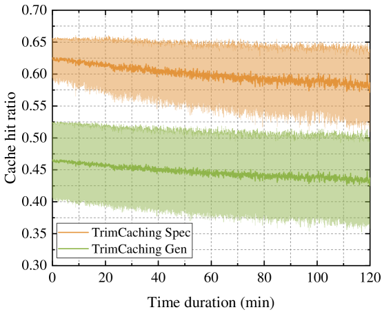

[Arxiv](https://arxiv.org/abs/2404.14204)